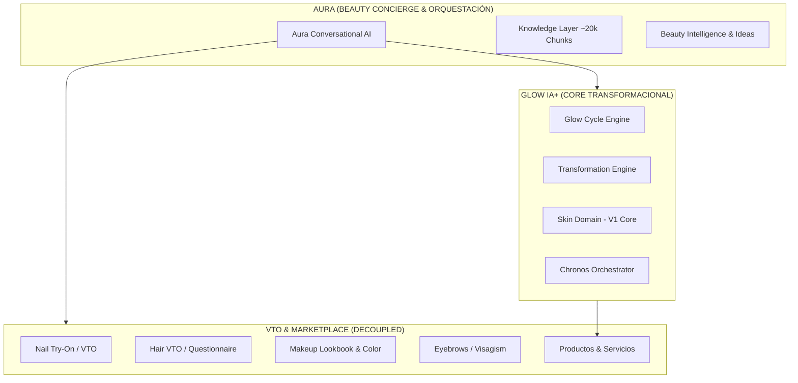
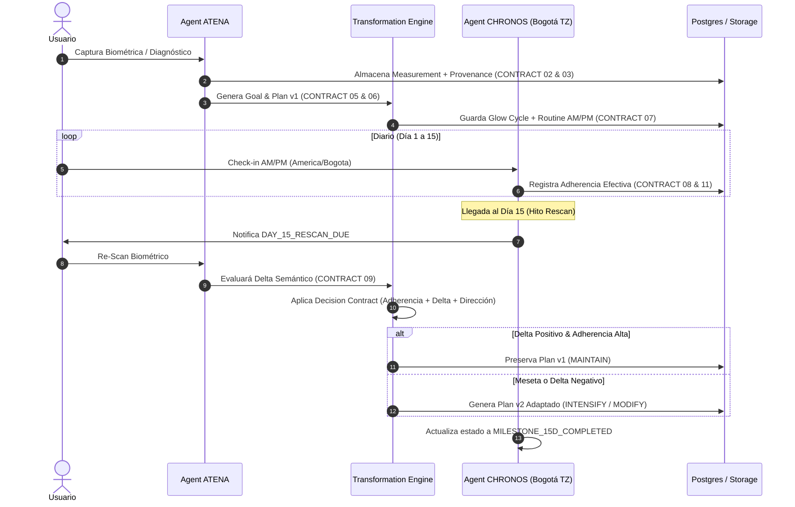

# GLOW IA+ — Arquitectura Objetivo y Especificación de Contratos (v1.0)

> **Estado:** Aprobado para Diseño / Documento de Referencia  
> **Autor:** Dirección de Arquitectura GlowApp  
> **Fecha:** Septiembre 2026  

---

##  EXECUTIVE SUMMARY & VISIÓN DEL PRODUCTO

**Glow IA+** no es un catálogo de funciones de belleza ni un asistente de chat genérico. Es el **Motor Longitudinal de Transformación** de GlowApp.

### Principio Fundamental
> **De:** "Evaluación → Puntuación sube/baja → Regla estática"  
> **A:** "EVIDENCIA → INTERPRETACIÓN DE CONFIANZA → ADHERENCIA REAL → DECISIÓN ADAPTATIVA → CONTINUIDAD"

---

## 🎯 SEPARACIÓN DE DOMINIOS Y PODADO DEL CORE

Para garantizar la calidad de la experiencia transformacional, el ecosistema de GlowApp se reorganiza en 4 capas distintas:



| Capa | Componentes | Estado en Rediseño |
| :--- | :--- | :--- |
| **Glow IA+ Core** | Glow Cycle, Transformation Engine, Skin Domain | 🟢 **CORE** (Profundizar y blindar) |
| **Aura & Knowledge** | Aura Conversacional, RAG (~20k chunks), Atena Interpretation | 🔵 **ORQUESTACIÓN / CONOCIMIENTO** |
| **VTO & Visualización** | Nail VTO, Hair VTO, Makeup Lookbook, Visajismo | 🔵 **MOVED TO MARKETPLACE / AURA** |
| **Legacy / Experimentos** | Diagnóstico de uñas parcial, Hair score por foto | 🔴 **CONGELADO / PODADO** |

---

## 🏛️ LOS 12 CONTRATOS SEMÁNTICOS DE GLOW IA+

Para eliminar la fragilidad de los puntajes crudos y garantizar la consistencia longitudinal, todas las operaciones de Glow IA+ se rigen por 12 contratos estricto:

### 1. Metric Contract (`CONTRACT_01`)
Define el significado y dirección de cada métrica biométrica.
```json
{
  "metric_key": "hydration | pores | wrinkles | spots | elasticity",
  "direction": "INCREASE_IS_BETTER | DECREASE_IS_BETTER",
  "min_value": 0,
  "max_value": 100,
  "comparability_threshold": 5.0
}
```

### 2. Measurement Contract (`CONTRACT_02`)
Estructura una medición biométrica con validez clínica/técnica.
```json
{
  "measurement_id": "meas_uuid",
  "user_id": 123,
  "timestamp": "2026-09-30T00:00:00-05:00",
  "scores": { "hydration": 65, "pores": 40 },
  "quality_score": 0.92,
  "is_fallback": false
}
```

### 3. Provenance Contract (`CONTRACT_03`)
Traza el origen y la confianza de la medición.
```json
{
  "source_provider": "YOUCAM | GEMINI | MANUAL_QUESTIONNAIRE",
  "analysis_id": "analysis_ref_123",
  "confidence_level": "HIGH | MEDIUM | LOW",
  "device_metadata": { "lighting_quality": "GOOD" }
}
```

### 4. Diagnosis Contract (`CONTRACT_04`)
Interpretación semántica por parte del agente Atena.
```json
{
  "diagnosis_id": "diag_123",
  "primary_concern": "dehydration",
  "secondary_concerns": ["enlarged_pores"],
  "atena_summary": "Piel deshidratada con barrera cutánea comprometida en zona T."
}
```

### 5. Goal Contract (`CONTRACT_05`)
Objetivo acordado con el usuario y horizonte temporal.
```json
{
  "goal_id": "goal_789",
  "target_metric": "hydration",
  "baseline_value": 50.0,
  "target_value": 75.0,
  "direction": "INCREASE_IS_BETTER",
  "horizon_days": 30
}
```

### 6. Plan Contract (`CONTRACT_06`)
Estrategia global del ciclo y justificación basada en RAG.
```json
{
  "plan_id": "plan_v1",
  "version": 1,
  "strategy_name": "Intensive Barrier Repair",
  "rationale": "Incremento progresivo de ácido hialurónico y ceramidas",
  "rag_references": ["chunk_8492", "chunk_10293"]
}
```

### 7. Routine Contract (`CONTRACT_07`)
Pasos concretos diarios para mañanas y noches.
```json
{
  "am_steps": [{ "step": 1, "action": "Limpiador hidratante", "product_id": 45 }],
  "pm_steps": [{ "step": 1, "action": "Doble limpieza" }, { "step": 2, "action": "Sérum Ceramidas" }]
}
```

### 8. Adherence Contract (`CONTRACT_08`)
Cumplimiento verificado por Chronos en zona horaria local (`America/Bogota`).
```json
{
  "total_days": 15,
  "completed_am_pm_days": 13,
  "adherence_rate": 0.866,
  "quality": "HIGH_ADHERENCE >= 0.80"
}
```

### 9. Reassessment Contract (`CONTRACT_09`)
Comparación intervalar y acumulada entre mediciones comprobables.
```json
{
  "baseline_delta": 15.0,
  "interval_delta": 5.0,
  "is_statistically_significant": true,
  "direction_satisfied": true
}
```

### 10. Decision Contract (`CONTRACT_10`)
Regla adaptativa multidimensional del Transformation Engine.
```json
{
  "decision": "MAINTAIN | INTENSIFY | MODIFY | GRADUATE",
  "reasoning": "Adherencia alta (86%) y delta positivo (+15). Mantener estrategia.",
  "plan_version_generated": "plan_v1"
}
```

### 11. Chronos Contract (`CONTRACT_11`) [Refactorizado]
Estado del orquestador temporal en tiempo local `America/Bogota`.
```json
{
  "current_day_number": 15,
  "temporal_state": "MILESTONE_15D_COMPLETED | DAY_15_RESCAN_DUE | GRADUATION_READY",
  "is_today_checkin_completed": true,
  "is_am_completed": true,
  "is_pm_completed": true,
  "is_partial_checkin": false
}
```

### 12. Graduation & Continuity Contract (`CONTRACT_12`)
Cierre de ciclo activo y transición hacia la graduación o nuevo objetivo.
```json
{
  "graduation_status": "GRADUATED | GOAL_EXCEEDED | MAINTENANCE_RECOMMENDED",
  "final_delta": 25.0,
  "next_recommended_domain": "Skin Maintenance or Anti-aging"
}
```

---

## 🔄 FLUJO DEL NÚCLEO DE TRANSFORMACIÓN



---

## 📋 REGLAS DE EJECUCIÓN PARA ANTIGRAVITY

1. **Aislamiento en Worktree/Rama:** Ningún cambio de esta arquitectura se sube directo a `main`.
2. **Desarrollo por Nodos:** Cada nodo (Metric Contract, Goal Contract, Transformation Engine Refactor) se implementa con su propia suite de tests en Jest.
3. **Revisión de Evidencia:** Todo cambio de código debe validar los tests antes de ser marcado como completado.
