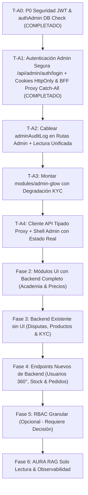

# GLOWADMIN — PLAN DE ARQUITECTURA E IMPLEMENTACIÓN V2 (REVISIÓN DE SEGURIDAD Y REPO REMOTO)

> **Commit de Referencia Remoto:** `62516a301f4a6ce710705908404d4fb153d7ae6a` (`origin/main`)  
> **Ubicación en Worktree:** `c:\glowadmin-work\docs\glowadmin\PLAN_V2.md`  
> **Estado:** Documento de Planificación Definitivo Re-ordenado por Dependencia Técnica  
> **Regla de Oro:** Ningún ticket se implementa sin autorización explícita del Dueño (Diego).

---

## 1. Orden Metodológico de Ejecución por Fases

El plan está strictly ordenado por dependencias de seguridad e infraestructura:

---

## 2. Fase 1 — Cimientos de Seguridad & Infraestructura

### T-A0: Hardening de Secreto JWT en Producción & Validación DB en `authAdmin`

* **Agente:** Backend Security Engineer
* **Severidad:** `CRÍTICA (P0)`
* **Estado:** `COMPLETADO Y PROBADO (RAMA fix/t-a0-jwt-hardening)`
* **Depende de:** Ninguno

#### Diagnóstico:
1. `backend/src/config/jwt.js` retornaba un secreto hardcodeado por defecto cuando `JWT_SECRET` faltaba o medía menos de 16 caracteres, incluso en producción (`NODE_ENV=production`).
2. `backend/src/modules/admin-glow/authAdmin.middleware.js` confiaba ciegamente en el claim `rol` / `role` del JWT sin consultar la base de datos `usuarios`.

#### Fix Aplicado (Test-First):
1. **Modificación de `backend/src/config/jwt.js`:**
   * En `production` o `staging`, exige estrictamente que `process.env.JWT_SECRET` tenga una longitud `>= 32`. Si falta o es corto, lanza un `Error` bloqueante en el arranque y `index.js` invoca `getJwtSecret()` antes de `app.listen()` (fail-fast sin secreto por defecto).
   * En `development` o `test`, si falta `JWT_SECRET`, genera un secreto efímero aleatorio en memoria usando `crypto.randomBytes(32)` memoizado (secreto hardcodeado totalmente eliminado del repo).
2. **Modificación RLS-Safe de `backend/src/modules/admin-glow/authAdmin.middleware.js`:**
   * Tras verificar la firma del JWT con `jwt.verify(token, getJwtSecret())`, consulta la base de datos utilizando la función RLS-safe `SELECT rol, tenant_id FROM app_usuario_identidad($1::integer)` (con fallback seguro a `SELECT rol FROM usuarios WHERE id = $1`).
   * Valida que el rol en la BD sea estrictamente `'ADMIN'`.
   * **Fail-Closed en Redis:** Si Redis se desconecta o falla, devuelve HTTP 503 (`Servicio de autenticación no disponible`).
   * **Tope de Sesión (12h):** Valida la presencia de `session_start_at` y rechaza con 401 si la sesión supera 12 horas.

#### ⚠️ Precondiciones Críticas de Despliegue (Production Checklist):
> [!CAUTION]
> 1. **Verificación de Variable en Railway:** Antes de desplegar el código en Railway, el Dueño debe verificar que la variable de entorno `JWT_SECRET` exista y tenga una longitud `>= 32` caracteres. De lo contrario, el contenedor de backend **fallará en el arranque** (Fail-Fast bloqueante).
> 2. **Integridad de Datos Biométricos:** **NUNCA rotar o cambiar `JWT_SECRET`** sin confirmar previamente que el script `scripts/reencryptBiometricData.js` haya finalizado correctamente, debido a que la clave legacy de cifrado de biométricos (`CLAVE_LEGADA`) deriva directamente del valor de `JWT_SECRET`.

---

### T-A1: Autenticación Admin Segura `/api/admin/auth/login`, Cookies HttpOnly, BFF Proxy Catch-All & CSRF

* **Agente:** Security & Frontend Architect
* **Severidad:** `CRÍTICA (P0)`
* **Estado:** `IMPLEMENTADO Y PROBADO (RAMA feat/t-a1-admin-session)`
* **Depende de:** T-A0

#### Especificación Técnica de T-A1:
1. **Endpoint Separado en Backend:**
   * `POST /api/admin/auth/login` en `backend/src/routes/adminAuthRoutes.js` (solo permite ingreso a usuarios con `rol === 'ADMIN'` verificado en BD con `app_usuario_identidad`). Protegido por `authLimiter`.
   * `POST /api/admin/auth/refresh` con protección de reutilización en Redis blacklist y tope absoluto de sesión de 12h.
   * `POST /api/admin/auth/logout` revoca tokens en Redis blacklist.
   * `GET /api/admin/auth/session` retorna información del administrador autenticado.
   * **NUNCA modificar `authController.js`** (líneas 282, 367, 892), ya que la app móvil Flutter depende estrictamente de este contrato.
2. **Next.js BFF Proxy Catch-All (`admin-dashboard/src/app/api/[...path]/route.ts`):**
   * El proxy intercepta las llamadas a `/api/*`, lee las cookies HttpOnly (`glow_access_token`, `glow_refresh_token`) e inyecta la cabecera `Authorization: Bearer <token>` hacia la API backend.
   * **Lista Blanca de Prefijos Permitidos (Allowlist):**
     - `admin/`
     - `metrics/`
     - `services/`
     - `portfolio/`
     - `users/`
     - `precios/`
     - `vto/`
     - `business/`
     - `academia/`
   * **Guard contra Path Traversal:** Rechaza con 403 peticiones que contengan `..`, `%2e`, `%2E` o segmentos maliciosos.
   * **Sanitización de Encabezados del Cliente:** Elimina `Host`, `Cookie` y `Authorization` enviadas por el cliente antes de reenviar a backend.
   * **Preservación de Cuerpo Multipart/Binario:** Usa `req.arrayBuffer()` para garantizar la integridad de subida de imágenes y archivos CSV.
   * **Auto-Refresh Transparente:** Ante un HTTP 401 del backend, renueva el access token usando `POST /api/admin/auth/refresh` de forma transparente y reintenta la petición. Si el refresh falla, limpia cookies HttpOnly y devuelve HTTP 401.
3. **Protección Anti-CSRF:**
   * Verificación de `Origin` / `Referer` en operaciones de mutación (`POST`, `PUT`, `PATCH`, `DELETE`).
   * Encabezado custom obligatorio `X-Requested-With` en mutaciones (excepto login).
4. **Análisis de Trade-Off, Acoplamiento y Costos: Verificación de Firma `jose` en Edge vs Backend Session Check:**
   - **Verificación Simétrica con `jose` (`middleware.ts`):** Rápida y de ultra baja latencia (<1ms). Exige que el servicio `admin-dashboard` reciba las variables `BACKEND_URL` y `JWT_SECRET` (exactamente el mismo secreto simétrico del backend).
     * *Acoplamiento / Riesgo:* Acopla las rotaciones de claves entre backend y frontend (si se rota `JWT_SECRET` en el backend sin actualizar el dashboard simultáneamente, el borde rechaza sesiones válidas).
   - **Alternativa Asimétrica (RS256 / ES256 - Recomendada para desacoplamiento completo):**
     * *Mecanismo:* El backend firma los tokens usando la clave privada (`JWT_PRIVATE_KEY`), mientras que `admin-dashboard` únicamente posee la clave pública (`JWT_PUBLIC_KEY`) para verificar la firma con `jose`.
     * *Costo/Complejidad:* Requiere aprovisionar y gestionar par de llaves criptográficas (RSA 2048-bit o ECDSA P-256) en Railway. Firma ligeramente más costosa en CPU en el backend (~0.5ms adicionales), pero desacopla totalmente la seguridad (el frontend jamás posee la clave para firmar o falsificar tokens). El Dueño decide cuál esquema activar.
   - **Verificación Real-Time en Backend (`/api/admin/auth/session` y BFF Proxy):** Consulta Redis y PostgreSQL para validar revocación y estado del usuario en la BD.
     * *Costo:* Añade 1 consulta a la BD por petición de API.
   - **Arquitectura Recomendada Híbrida (Implementada):** Protección Dual. `middleware.ts` usa `jose` para validar firma y expiración en el borde antes de renderizar vistas HTML, mientras que el proxy BFF y el backend validan revocación en Redis blacklist y estado en BD para toda petición de datos.
5. **Eliminación Total de `localStorage`:**
   * Se elimina `localStorage` (`glow_token`, `glow_user`, `adminToken`) en el panel.

---

### T-A2: Cablear `adminAuditLog` en Rutas Admin & Lectura Unificada
* **Agente:** Backend Security Engineer | **Severidad:** `P1` | **Depende de:** T-A0
* **Fix:** Cablear `adminAuditLog(action, resource)` en todas las rutas mutativas (`POST`, `PUT`, `PATCH`, `DELETE`) de `adminPreciosRoutes.js`, `academyAdminRoutes.js` y `productRoutes.js`. Exponer endpoint de lectura unificada en `GET /api/admin/audit-logs`.

### T-A3: Montaje de `modules/admin-glow/` y Degradación Controlada KYC
* **Agente:** Backend Core Engineer | **Severidad:** `P1` | **Depende de:** T-A0 (COMPLETADO), T-A1 (COMPLETADO), T-A2
* **Fix:** Montar las rutas en `app.use('/api/admin/glow', require('./src/modules/admin-glow/admin.routes'))`. Implementar degradación a `DEGRADED_MANUAL_REVIEW` en `CertifiedKYCProvider.js` si falta `KYC_API_KEY`.

### T-A4: Cliente API Tipado Proxy y Shell Admin con Estado Real de Vistas
* **Agente:** Frontend Architect | **Severidad:** `P2` | **Depende de:** T-A1
* **Fix:** Actualizar `api-client.ts` para redirigir peticiones por el BFF proxy de Next.js (`/api/admin/...`) enviando el header anti-CSRF. Actualizar Sidebar con estado real de vistas.

---

## 3. Fases 2 a 6 — Módulos UI, Endpoints Nuevos & Observabilidad
*(Ver especificaciones detalladas en secciones 3 a 7 del plan)*
