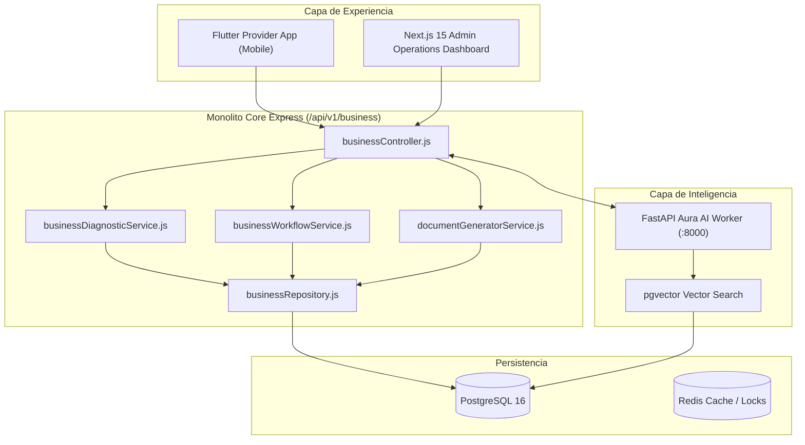

# GLOWAPP BUSINESS ENGINE — ARCHITECTURAL SPECIFICATION

## 1. Executive Overview & Architecture Principles
The **GlowApp Business Engine** is a fully integrated, non-destructive enterprise module within the GlowApp Modular Monolith. It guides beauty establishments (salons, barbershops, spas, aesthetic centers) across their entire lifecycle (*Idea -> Constitution -> Opening -> Operation -> Continuous Compliance -> Audit -> Growth*).

### Absolute Principles
1. **Rule of Zero Destruction:** 100% preservation of Goal 00-12 contracts, schemas, API routes, and RBAC permissions.
2. **Infrastructure Reuse:** Shares PostgreSQL (`pgvector`), Express Core Monolith, Redis, FastAPI Aura AI Worker, and FCM notifications.
3. **Dual Entry Doors:**
   - **Door 1 (New Business):** Guided step-by-step setup (*Diagnosis -> Requirements -> Tasks -> Document Drafts -> Opening*).
   - **Door 2 (Existing Business):** Audit mode (*Diagnosis -> Compliance Score -> Findings -> Improvement Plan -> Continuous Compliance*).

---

## 2. Component Topology & Data Flow

---

## 3. Database Schema Specification

### 3.1 `business_profiles`
- `id` (PK): UUID / Unique String
- `provider_id` (FK): References `providers.id`
- `vertical_id` (FK): References `business_verticals.id`
- `name`: Business Name
- `onboarding_mode`: `NEW_BUSINESS` | `EXISTING_BUSINESS`
- `lifecycle_stage`: `IDEA` | `CONSTITUTION` | `FORMALIZATION` | `OPENING` | `OPERATION` | `AUDIT` | `GROWTH`
- `compliance_score`: Numeric (0.00 - 100.00)

### 3.2 `business_tasks`
- `id` (PK): Unique String
- `business_profile_id` (FK): References `business_profiles.id`
- `requirement_id` (FK): References `business_requirements.id`
- `stage`: `ENTENDER` | `EXPLICAR` | `RECOMENDAR` | `EJECUTAR` | `VERIFICAR`
- `status`: `PENDING` | `IN_PROGRESS` | `SUBMITTED` | `VERIFIED` | `EXPIRED`

### 3.3 `business_evidences`
- `id` (PK): Unique String
- `task_id` (FK): References `business_tasks.id`
- `validation_state`: `USER_DECLARED` | `EVIDENCE_SUBMITTED` | `EVIDENCE_VALIDATED` | `REQUIREMENT_VERIFIED`

---

## 4. API Endpoint Inventory

| Method | Path | Auth | RBAC Role | Description |
|---|---|---|---|---|
| GET | `/api/v1/business/verticals` | Public | None | Retrieve beauty verticals catalog |
| POST | `/api/v1/business/diagnostic` | Required | PROVIDER, ADMIN | Run initial setup/audit diagnostic |
| GET | `/api/v1/business/summary` | Required | PROVIDER, ADMIN | Get compliance score and profile summary |
| GET | `/api/v1/business/tasks` | Required | PROVIDER, ADMIN | List active guided tasks |
| POST | `/api/v1/business/tasks/:id/advance` | Required | PROVIDER, ADMIN | Advance workflow stage (ENTENDER->VERIFICAR) |
| POST | `/api/v1/business/tasks/:id/evidence` | Required | PROVIDER, ADMIN | Upload evidence for verification |
| GET | `/api/v1/business/templates` | Required | PROVIDER, ADMIN | List available document templates |
| POST | `/api/v1/business/documents/generate` | Required | PROVIDER, ADMIN | Render document draft with legal disclaimer |
