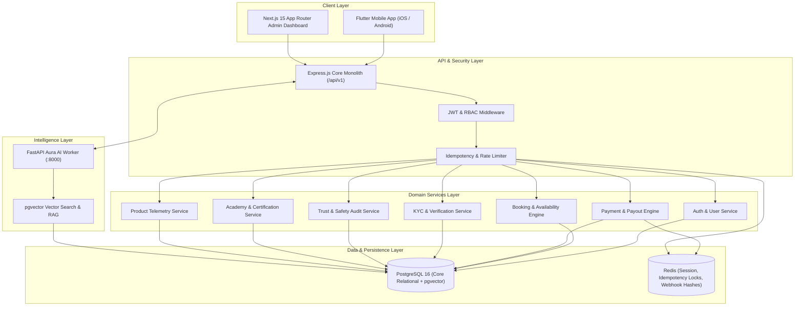

# GLOWAPP PHASE 2 — FINAL SYSTEM ARCHITECTURE

## 1. Architectural Highlights
- **Pattern:** Modular Monolith with isolated domain modules.
- **Data Isolation:** Single PostgreSQL database with strict schema segregation and RLS capabilities.
- **AI RAG Integration:** FastAPI dedicated worker communicating over HTTP with pgvector embeddings for rapid domain knowledge lookup without blocking core web server loop.
