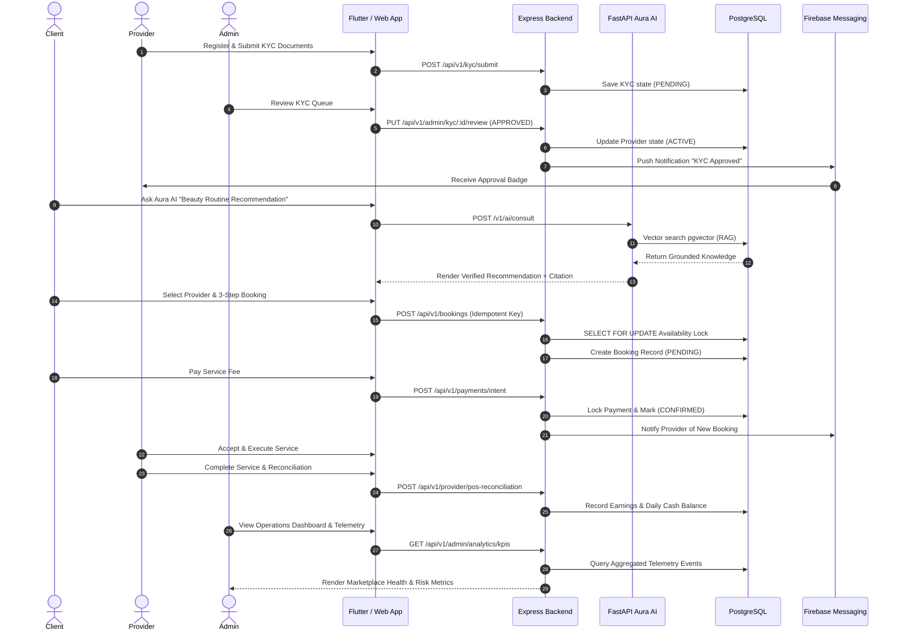

# GLOWAPP PHASE 2 — FINAL USER JOURNEY MAP

```mermaid
sequenceDiagram
    autonumber
    actor Client
    actor Provider
    actor Admin
    participant App as Flutter / Web App
    participant Core as Express Backend
    participant AI as FastAPI Aura AI
    participant DB as PostgreSQL
    participant FCM as Firebase Messaging

    %% 1. Onboarding & KYC
    Provider->>App: Register & Submit KYC Documents
    App->>Core: POST /api/v1/kyc/submit
    Core->>DB: Save KYC state (PENDING)
    Admin->>App: Review KYC Queue
    App->>Core: PUT /api/v1/admin/kyc/:id/review (APPROVED)
    Core->>DB: Update Provider state (ACTIVE)
    Core->>FCM: Push Notification "KYC Approved"
    FCM->>Provider: Receive Approval Badge

    %% 2. Discovery & Aura AI Consultation
    Client->>App: Ask Aura AI "Beauty Routine Recommendation"
    App->>AI: POST /v1/ai/consult
    AI->>DB: Vector search pgvector (RAG)
    DB-->>AI: Return Grounded Knowledge
    AI-->>App: Render Verified Recommendation + Citation
    
    %% 3. Booking & Payment Execution
    Client->>App: Select Provider & 3-Step Booking
    App->>Core: POST /api/v1/bookings (Idempotent Key)
    Core->>DB: SELECT FOR UPDATE Availability Lock
    Core->>DB: Create Booking Record (PENDING)
    Client->>App: Pay Service Fee
    App->>Core: POST /api/v1/payments/intent
    Core->>DB: Lock Payment & Mark (CONFIRMED)
    Core->>FCM: Notify Provider of New Booking

    %% 4. Execution & Daily POS Cash
    Provider->>App: Accept & Execute Service
    Provider->>App: Complete Service & Reconciliation
    App->>Core: POST /api/v1/provider/pos-reconciliation
    Core->>DB: Record Earnings & Daily Cash Balance

    %% 5. Admin Governance & Audit
    Admin->>App: View Operations Dashboard & Telemetry
    App->>Core: GET /api/v1/admin/analytics/kpis
    Core->>DB: Query Aggregated Telemetry Events
    Core-->>Admin: Render Marketplace Health & Risk Metrics
```
