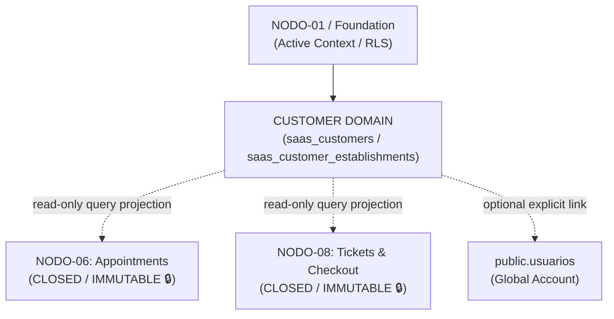

# CUSTOMER / CLIENT DIRECTORY CONTRACT v1.0
## GLOWAPP SaaS: CUSTOMER & COMMERCIAL RELATIONSHIP DOMAIN

**ESTADO:** `CONTRACT v1.0 — RATIFIED 🔒`  
**DOMINIO:** SaaS Customer Directory & Commercial Relationship  
**AUTORIDAD DIRECTIVA:** Director del Proyecto GlowApp SaaS  
**FECHA DE EMISIÓN:** 2026-09-12  
**BASE INMUTABLE:** NODO-01 $\to$ NODO-08 (`CLOSED / IMMUTABLE 🔒`)  

---

> [!IMPORTANT]
> Este documento representa la **ESPECIFICACIÓN CONTRACTUAL v1.0 RATIFICADA 🔒**.  
> **AUTORIDAD:** Director del Proyecto GlowApp SaaS (GO-08.13).  
> **ALCANCE:** Autoriza la elaboración de la Arquitectura Física. **NO autoriza** implementación física, migraciones SQL, endpoints ni frontend.

---

## 1. PURPOSE (PROPÓSITO)

`CUSTOMER / CLIENT DIRECTORY` es la **autoridad canónica de datos de clientes y relaciones comerciales** para los salones y establecimientos en GlowApp SaaS. Su propósito es dotar a cada negocio de una base de clientes persistente, privada y estructurada, que agilice la agenda (`NODO-06`) y el checkout (`NODO-08`), asegurando la propiedad de los datos por parte del establecimiento sin imponer que los clientes posean una cuenta de usuario global en la plataforma.

### Distinciones Ontológicas Fundamentales:
- **`CUSTOMER ≠ PERSONA`:** La persona es el ser humano en el mundo físico; el Customer es su representación comercial en el negocio.
- **`CUSTOMER ≠ USER / ACCOUNT (public.usuarios)`:** `usuarios` representa la cuenta global con credenciales y contraseña en GlowApp. `CUSTOMER` es el registro local del salón. **Un Customer existe con total plenitud operativa sin un User**.
- **`CUSTOMER ≠ MEMBERSHIP`:** `memberships` modela el acceso y rol del personal (`OWNER`, `MANAGER`, `PROFESSIONAL`, `RECEPTIONIST`). `CUSTOMER` modela al cliente que consume servicios.
- **`CUSTOMER ≠ GUEST`:** `GUEST` es un snapshot de texto plano transaccional congelado en una cita o ticket específico. `CUSTOMER` es una entidad permanente con historial y notas en el directorio.

---

## 2. SCOPE (ALCANCE CONTRACTUAL)

```
┌─────────────────────────────────────────────────────────────────────────┐
│                               SAAS TENANT                               │
└────────────────────────────────────┬────────────────────────────────────┘
                                     │
                                     ▼
┌─────────────────────────────────────────────────────────────────────────┐
│                              SAAS CUSTOMER                              │
│                      (Identidad Canónica en Tenant)                     │
│                                                                         │
│ - first_name, last_name, phone, email, birth_date                       │
│ - user_id (NULLABLE - Optional & Reversible Link a public.usuarios)     │
│ - status (ACTIVE, INACTIVE, ARCHIVED)                                   │
└────────────────────────────────────┬────────────────────────────────────┘
                                     │
                 ┌───────────────────┴───────────────────┐
                 │                                       │
                 ▼                                       ▼
┌─────────────────────────────────┐     ┌─────────────────────────────────┐
│  SAAS_CUSTOMER_ESTABLISHMENTS   │     │  SAAS_CUSTOMER_ESTABLISHMENTS   │
│       (Sede Operativa A)        │     │       (Sede Operativa B)        │
│                                 │     │                                 │
│ - local_notes (privadas sede)   │     │ - local_notes (privadas sede)   │
│ - first_visited_at              │     │ - first_visited_at              │
│ - last_visited_at               │     │ - last_visited_at               │
│ - is_active                     │     │ - is_active                     │
└─────────────────────────────────┘     └─────────────────────────────────┘
```

### 2.1 Responsabilidades Incluidas:
1. **Identidad Canónica a Nivel Tenant (`saas_customers`):** Registro de nombre, apellidos, teléfono principal, email y fecha de nacimiento.
2. **Relación Operacional por Sede (`saas_customer_establishments`):** Registro de notas locales de atención, estado de actividad local y marcas temporales de primera y última visita en cada sede física.
3. **Búsqueda Predictiva y Autocomplete:** Búsqueda rápida por nombre y teléfono en recepción para agendamiento y cobro.
4. **Autonomía Local (`user_id IS NULL`):** Funcionamiento pleno para clientes que no tienen cuenta en GlowApp.
5. **Vinculación Explícita con Cuenta Global (`user_id`):** Enlace voluntario, explícito y reversible con `public.usuarios.id`.
6. **Historial Operacional Derivado:** Proyección de sólo lectura sobre citas (`NODO-06`) y tickets (`NODO-08`) sin duplicar transacciones.
7. **Control de Acceso RBAC bajo Active Context:** Autoridad contextual exclusiva vía `x-active-membership-id: <UUID>`.

### 2.2 Exclusiones Taxativas:
1. **Cero Datos Clínicos / Médicos:** Prohibido almacenar diagnósticos, alergias médicas, recetas o historias clínicas. El alcance es estrictamente comercial y de preferencias de servicio en salón.
2. **Cero Matching Automático Silencioso:** Coincidencias de teléfono/email no vinculan automáticamente cuentas globales.
3. **Cero Autoridad Transaccional:** El dominio no reserva horarios ni procesa cobros ni liquida comisiones.
4. **Cero Modificación de Nodos Cerrados:** `saas_appointments` (071), `saas_service_tickets` (072), `saas_ticket_items` y `saas_ticket_payments` permanecen inalterados.

---

## 3. DOMAIN BOUNDARIES & CLOSED NODE INTEGRATION



### 3.1 Integración con NODO-06 (Appointments):
- `NODO-06` permanece `CLOSED / IMMUTABLE` 🔒.
- La consulta de historial de citas se ejecuta mediante consultas de proyección y agregación de lectura sobre `saas_appointments`.
- Cualquier inclusión futura de una clave foránea física `customer_id` en citas se documenta formalmente como **`FUTURE DEPENDENCY`** sin alterar la migración 071.

### 3.2 Integración con NODO-08 (Tickets & Checkout):
- `NODO-08` permanece `CLOSED / IMMUTABLE` 🔒.
- La consulta de historial de consumos y pagos se ejecuta en modo de sólo lectura sobre `saas_service_tickets` y `saas_ticket_payments`.
- El Customer Domain no modifica balances ni estados financieros.

### 3.3 Frontera con B2C / Marketplace:
- El Customer Domain es un activo privado del Tenant/Establecimiento dentro del SaaS.
- No existe sincronización automática bidireccional con el marketplace B2C. Cualquier sincronización futura queda clasificada como **`FUTURE INTEGRATION`**.

---

## 4. MULTI-TENANCY & SECURITY ISOLATION

1. **Aislamiento Multi-Tenant Absoluto:**  
   Garantizado mediante `TENANT + ESTABLISHMENT ISOLATION THROUGH EXISTING ACTIVE CONTEXT/RLS`.  
   Toda consulta y mutación valida que `tenant_id` coincida con el contexto autenticado. Queda terminantemente prohibido el acceso o visibilidad cross-tenant.
2. **Visibilidad Operacional por Sede:**  
   - Los operadores con Active Context en la `Sede A` pueden consultar la identidad canónica de los clientes del Tenant y sus notas locales en la `Sede A`.
   - Las notas registradas en `saas_customer_establishments` para la `Sede B` permanecen privadas para los operadores de la `Sede B`, a menos que el usuario posea rol `OWNER` o `MANAGER` con acceso multisede.
3. **Autoridad Contextual:**  
   La única cabecera aceptada para determinar la sesión es `x-active-membership-id: <UUID>`. Prohibido el uso de headers sintéticos (`x-tenant-id`, `x-establishment-id`).

---

## 5. REGLAS DE NEGOCIO Y DECISIONES RATIFICADAS

### 5.1 Autonomía Local y Account Linking (DEC-CUST-02, DEC-CUST-03):
- La columna `saas_customers.user_id` es `NULLABLE`.
- La vinculación de un cliente local con una cuenta global de `public.usuarios` es un proceso **explícito y reversible**, reservado para roles `OWNER` y `MANAGER` o mediante confirmación expresa de identidad.
- La coincidencia de teléfono o email es clasificada como *Contact Data Match*, no como *Identity Match*.

### 5.2 Control de Duplicados en Mostrador (DEC-CUST-05):
- No se impone una restricción de base de datos `UNIQUE(tenant_id, phone)` rígida para evitar bloquear a grupos familiares que comparten un mismo número telefónico.
- El sistema opera mediante el flujo:  
  $$	ext{Búsqueda Predictiva Previa} \longrightarrow 	ext{Advertencia de Posible Duplicado (Non-Blocking)} \longrightarrow 	ext{Decisión Humana del Operador}$$
- Cero fusiones automáticas de clientes.

### 5.3 Ciclo de Vida del Cliente (DEC-CUST-08):
- **`ACTIVE`:** Cliente habilitado para búsqueda, agendamiento y cobro.
- **`INACTIVE`:** Cliente temporalmente inactivo o sin visitas recientes.
- **`ARCHIVED`:** Cliente dado de baja o marcado como registro duplicado histórico; oculto de los resultados de autocomplete pero preservado para integridad referencial.

---

## 6. DDL ESPECIFICACIÓN CANDIDATA (PROPUESTA FÍSICA)

```sql
-- TABLA CANDIDATA 1: Identidad de Cliente en el Tenant
CREATE TABLE IF NOT EXISTS saas_customers (
    id UUID PRIMARY KEY DEFAULT gen_random_uuid(),
    tenant_id INTEGER NOT NULL,
    
    -- Vínculo Opcional y Reversible con Cuenta Global
    user_id INTEGER,
    
    -- Identificación Canónica
    first_name VARCHAR(100) NOT NULL,
    last_name VARCHAR(100) NOT NULL DEFAULT '',
    phone VARCHAR(30) NOT NULL,
    email VARCHAR(255),
    birth_date DATE,
    
    -- Ciclo de Vida
    status VARCHAR(30) NOT NULL DEFAULT 'ACTIVE',
    
    -- Trazabilidad
    created_by_membership_id UUID NOT NULL,
    created_at TIMESTAMPTZ NOT NULL DEFAULT CURRENT_TIMESTAMP,
    updated_at TIMESTAMPTZ NOT NULL DEFAULT CURRENT_TIMESTAMP,
    
    -- Claves Foráneas
    CONSTRAINT fk_customers_tenant 
        FOREIGN KEY (tenant_id) 
        REFERENCES tenants(id) 
        ON DELETE CASCADE,
    CONSTRAINT fk_customers_user 
        FOREIGN KEY (user_id, tenant_id) 
        REFERENCES usuarios(id, tenant_id) 
        ON DELETE SET NULL,
    CONSTRAINT fk_customers_creator 
        FOREIGN KEY (created_by_membership_id) 
        REFERENCES memberships(id) 
        ON DELETE RESTRICT,
        
    -- Restricción de Estado
    CONSTRAINT chk_customer_status CHECK (
        status IN ('ACTIVE', 'INACTIVE', 'ARCHIVED')
    )
);

-- TABLA CANDIDATA 2: Relación Operacional por Sede
CREATE TABLE IF NOT EXISTS saas_customer_establishments (
    id UUID PRIMARY KEY DEFAULT gen_random_uuid(),
    tenant_id INTEGER NOT NULL,
    customer_id UUID NOT NULL,
    establishment_id UUID NOT NULL,
    
    -- Datos Operacionales Locales
    local_notes TEXT,
    is_active BOOLEAN NOT NULL DEFAULT TRUE,
    
    -- Métricas Temporales de Visita
    first_visited_at TIMESTAMPTZ NOT NULL DEFAULT CURRENT_TIMESTAMP,
    last_visited_at TIMESTAMPTZ NOT NULL DEFAULT CURRENT_TIMESTAMP,
    created_at TIMESTAMPTZ NOT NULL DEFAULT CURRENT_TIMESTAMP,
    updated_at TIMESTAMPTZ NOT NULL DEFAULT CURRENT_TIMESTAMP,
    
    -- Claves Foráneas Compuestas
    CONSTRAINT fk_cust_est_tenant 
        FOREIGN KEY (tenant_id) 
        REFERENCES tenants(id) 
        ON DELETE CASCADE,
    CONSTRAINT fk_cust_est_customer 
        FOREIGN KEY (customer_id) 
        REFERENCES saas_customers(id) 
        ON DELETE CASCADE,
    CONSTRAINT fk_cust_est_establishment 
        FOREIGN KEY (establishment_id, tenant_id) 
        REFERENCES establishments(id, tenant_id) 
        ON DELETE RESTRICT,
        
    -- Unicidad de Relación por Sede
    CONSTRAINT uq_customer_establishment UNIQUE (establishment_id, customer_id)
);

-- Índices de Rendimiento
CREATE INDEX IF NOT EXISTS idx_customers_tenant_phone ON saas_customers(tenant_id, phone);
CREATE INDEX IF NOT EXISTS idx_customers_tenant_name ON saas_customers(tenant_id, first_name, last_name);
CREATE INDEX IF NOT EXISTS idx_cust_est_lookup ON saas_customer_establishments(establishment_id, customer_id);
```

---

## 7. API REST ESPECIFICACIÓN CANDIDATA

Todos los endpoints exigen `x-active-membership-id: <UUID>`.

1. **`GET /api/saas/customers`**  
   - Búsqueda predictiva (typeahead) y listado con paginación (`?search=...&limit=20&offset=0`).
2. **`POST /api/saas/customers`**  
   - Registro de nuevo cliente en el directorio del Tenant vinculándolo a la sede activa.  
   - Payload: `{ "first_name": "...", "last_name": "...", "phone": "...", "email": "...", "local_notes": "..." }`
3. **`GET /api/saas/customers/:id`**  
   - Consulta de ficha consolidada del cliente y notas locales de la sede activa.
4. **`PATCH /api/saas/customers/:id`**  
   - Actualización de datos de contacto y notas operativas.
5. **`GET /api/saas/customers/:id/history`**  
   - Proyección de lectura agregada de citas pasadas (`NODO-06`) y tickets de cobro (`NODO-08`).
6. **`POST /api/saas/customers/:id/link-user`**  
   - Vinculación explícita con `public.usuarios.id` (requiere `OWNER` o `MANAGER`).
7. **`POST /api/saas/customers/:id/unlink-user`**  
   - Desvinculación de cuenta global (requiere `OWNER` o `MANAGER`).

---

## 8. MATRIZ DE CONTROL DE ACCESO (RBAC)

| Operación | OWNER | MANAGER | RECEPTIONIST | PROFESSIONAL |
| :--- | :---: | :---: | :---: | :---: |
| **Búsqueda Predictiva (Typeahead)** | ✅ | ✅ | ✅ | ✅ (Solo lectura) |
| **Consultar Ficha y Notas de Sede** | ✅ | ✅ | ✅ | ✅ |
| **Crear Nuevo Cliente en Directorio** | ✅ | ✅ | ✅ | ❌ |
| **Editar Datos de Contacto y Notas** | ✅ | ✅ | ✅ | ❌ |
| **Consultar Historial de Citas** | ✅ | ✅ | ✅ | ✅ (Solo sus atenciones) |
| **Consultar Historial de Tickets** | ✅ | ✅ | ✅ | ❌ |
| **Vincular / Desvincular `user_id`** | ✅ | ✅ | ❌ (Req. Manager) | ❌ |
| **Archivar / Desactivar Cliente** | ✅ | ✅ | ❌ | ❌ |

---

## 9. DECLARACIÓN FORMAL DE ESTADO

- **DOCUMENTO:** `CUSTOMER / CLIENT DIRECTORY CONTRACT v1.0`
- **ESTADO:** **`RATIFIED`** 🔒
- **PRÓXIMO PASO:** Elaboración y diseño de la Arquitectura Física DDL del Dominio Customer.
