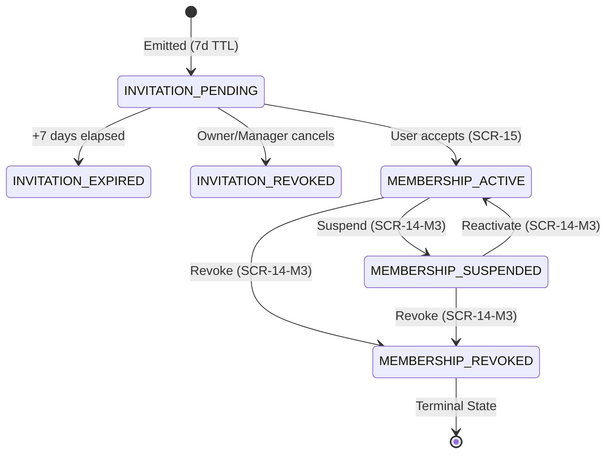

# GO-08.41 — CONTRACT SPECIFICATION
## STAFF PROVISIONING FRONTEND v1.0

**Document ID:** `GO-08.41-STAFF-PROVISIONING-FRONTEND-CONTRACT-v1.0`  
**Domain:** Staff Provisioning / Memberships / Roles / Invitations (Flutter Frontend)  
**Authority:** Director del Proyecto GlowApp SaaS  
**Reference Contracts & Decisions:**  
- `GO-08.33` — Asynchronous Incorporation Model Decision (`OPTION B`)  
- `GO-08.34` — Role Hierarchy & Anti-Orphan Authority Matrix  
- `GO-08.35` — Deactivation Policy & Historical Integrity (`RETAIN + BLOCK EXECUTION + HUMAN RESOLUTION`)  
- `GO-08.36` — Staff Provisioning Backend Contract v1.0  
- `GO-08.37` — Backend Implementation (10 endpoints, 40 tests)  
- `GO-08.38` — Independent Audit PASS (178/178 regression tests)  
- `GO-08.39` — Formal Closure (Backend v1.0 Immutable)  
- `GO-08.40` — Staff Provisioning Frontend Discovery  
**Status:** `CONTRACT READY — IMPLEMENTATION NOT AUTHORIZED` 🔒  
**Implementation:** `NOT AUTHORIZED` 🚫  
**Date:** September 13, 2026  

---

## 1. Contract Authority & Governance Basis

This contract constitutes the sole binding architectural and functional specification for the implementation of the frontend interface for **Staff Provisioning v1.0** within GlowApp SaaS.

1. **Immutability of Backend:** The backend implemented in `GO-08.37` and closed under `GO-08.39` is strictly immutable. No frontend requirement may alter existing backend routes, controllers, services, database schemas, or migrations.
2. **Authority Hierarchy:**
   - Architectural Decisions (`GO-08.33`, `GO-08.34`, `GO-08.35`) override all other interpretations.
   - Backend Contract (`GO-08.36`) and Implementation (`GO-08.37`) define the exact network boundary and data contracts.
   - This Frontend Contract (`GO-08.41`) governs all UI/UX components, client-side state transitions, and user interactions.

---

## 2. Frontend Architectural Scope & Non-Goals

### 2.1 In-Scope Capabilities
1. **Staff Directory (`SCR-14`):** Exploration and filtering of active, suspended, and revoked memberships.
2. **Pending Invitations Management:** Listing, issuing (`SCR-14-M1`), resending, and revoking asynchronous staff invitations.
3. **Membership Lifecycle Governance:** Mutating roles (`SCR-14-M2`), mutating status (`SCR-14-M3`), and mutating relation types (`SCR-14-M4`).
4. **Public Invitation Claim (`SCR-15`):** Responsive public screen for token inspection and acceptance (existing user login or new user registration).
5. **Context Guarding:** Enforcing Active Context prerequisites on all administrative staff views.

### 2.2 Preserved Non-Goals (Strictly Excluded)
- Payroll, wage, or hourly rate calculations.
- Commission tier management or split distributions.
- Inventory or retail product stock administration.
- DIAN electronic billing or fiscal integrations.
- Multi-establishment ownership transfer at the tenant level.

---

## 3. Screen Inventory & Surfaces Specification

| Surface ID | Component Class | File Location | Route / Access Path | Accessibility |
|---|---|---|---|---|
| **`SCR-14`** | `StaffDirectoryScreen` | `frontend/lib/screens/saas/staff_directory_screen.dart` | `SaasNavigationOrchestrator.navigateToStaffDirectory` | Authenticated (Members with Active Context) |
| **`SCR-14-M1`** | `StaffInviteModal` | `frontend/lib/screens/saas/widgets/staff_invite_modal.dart` | Modal triggered from `SCR-14` header action | Authenticated (`OWNER`, `MANAGER`) |
| **`SCR-14-M2`** | `StaffRoleDialog` | `frontend/lib/screens/saas/widgets/staff_role_dialog.dart` | Modal triggered from Member card action | Authenticated (`OWNER`, `MANAGER`) |
| **`SCR-14-M3`** | `StaffStatusDialog` | `frontend/lib/screens/saas/widgets/staff_status_dialog.dart` | Modal triggered from Member card action | Authenticated (`OWNER`, `MANAGER`) |
| **`SCR-14-M4`** | `StaffRelationTypeDialog` | `frontend/lib/screens/saas/widgets/staff_relation_type_dialog.dart` | Modal triggered from Member card action | Authenticated (`OWNER` exclusively) |
| **`SCR-15`** | `InvitationAcceptanceScreen` | `frontend/lib/screens/saas/invitation_acceptance_screen.dart` | Web URL `/saas/invitations/accept?token=<token>` | Public (Unauthenticated / Authenticated) |

---

## 4. SCR-14: Staff Directory Screen Specification

### 4.1 Structure and Layout
- **Header:** Title *"Equipo de Trabajo"*, active establishment badge, and action button `+ Invitar Colaborador` (conditionally rendered via RBAC).
- **Navigation Tabs:**
  - Tab 1: **Personal** (displays active and inactive members).
  - Tab 2: **Invitaciones Pendientes** (displays unaccepted invitations with countdown/expiry status).
- **Filter & Search Bar:**
  - Debounced search field filtering by full name, email, or role.
  - Role filter dropdown: `Todos`, `OWNER`, `MANAGER`, `PROFESSIONAL`, `RECEPTIONIST`.
  - Status filter dropdown: `Todos`, `ACTIVE`, `SUSPENDED`, `REVOKED`.
- **Content Area:** Responsive grid/list rendering `StaffMemberCard` or `InvitationCard` components.

### 4.2 State Machine
- `UNINITIALIZED`: Initial build state.
- `CONTEXT_MISSING`: Active Context missing (`hasActiveContext == false`). Renders `_buildActiveContextMissingView()` with button to open `AvailableContextSelectorScreen`.
- `LOADING`: Shimmer loading skeleton or circular progress indicator.
- `LOADED`: Main content rendering data with pull-to-refresh support.
- `EMPTY`: Zero records found. Renders specialized empty illustration with `Invitar Colaborador` CTA.
- `ERROR`: Network or server failure. Renders structured error card with retry action.

---

## 5. SCR-14-M1: Staff Invitation Modal Specification

### 5.1 Fields & Input Validations
- **Email:** Mandatory. Validated via standard RFC 5322 regex. Trimmed and converted to lowercase.
- **Rol Contextual:** Dropdown selection.
  - Options for `OWNER`: `OWNER`, `MANAGER`, `PROFESSIONAL`, `RECEPTIONIST`.
  - Options for `MANAGER`: `PROFESSIONAL`, `RECEPTIONIST` (Options `OWNER` and `MANAGER` are strictly removed from UI).
- **Tipo de Relación:** Dropdown selection (`STAFF_EMPLOYEE`, `INDEPENDENT_PROVIDER`, `OWNER_PARTNER`).
  - Available and editable for `OWNER`.
  - Locked to default `STAFF_EMPLOYEE` for `MANAGER`.

### 5.2 Interaction & Feedback
- Submitting triggers `POST /api/saas/staff/invitations`.
- On success: Closes modal, displays green snackbar: *"Invitación emitida exitosamente. Válida por 7 días."*, and switches `SCR-14` to Tab 2 (*Invitaciones Pendientes*).
- On error: Displays banner with specific error mapping (e.g., `409 INVITATION_ALREADY_PENDING`, `409 USER_ALREADY_MEMBER`).

---

## 6. SCR-14-M2: Role Modification Dialog Specification

### 6.1 Purpose & Rules
- Mutates the contextual role of a member within the current establishment.
- Consumes `PATCH /api/saas/staff/:id/role`.

### 6.2 UX & Guard Invariants
- **Self-Mutation Guard:** If `member.user_id == current_user.id`, the action button is disabled with tooltip: *"No puedes modificar tu propio rol"*.
- **Manager Boundary:**
  - If actor is `MANAGER`, target member must currently be `PROFESSIONAL` or `RECEPTIONIST`.
  - Allowed options are restricted to `PROFESSIONAL` and `RECEPTIONIST`.
- **Anti-Orphan Banner:** If modifying the last `OWNER`, backend returns `422 CANNOT_ORPHAN_ESTABLISHMENT`; the UI displays an explicit warning modal explaining that another active Owner must be appointed first.

---

## 7. SCR-14-M3: Status Modification Dialog Specification

### 7.1 Lifecycle Actions
Consumes `PATCH /api/saas/staff/:id/status`.

1. **Suspension (`ACTIVE` $\rightarrow$ `SUSPENDED`):**
   - **Dialog Title:** *"Suspender Acceso de Colaborador"*
   - **Warning Content:** *"El colaborador perderá el acceso a la sede y no proyectará disponibilidad para nuevas citas. Las citas agendadas y el historial de tickets se mantendrán intactos."*
   - **CTA:** `Suspender Colaborador` (Orange/Amber).
2. **Reactivation (`SUSPENDED` $\rightarrow$ `ACTIVE`):**
   - **Dialog Title:** *"Reactivar Colaborador"*
   - **CTA:** `Reactivar Colaborador` (Green).
3. **Revocation (`ACTIVE`/`SUSPENDED` $\rightarrow$ `REVOKED`):**
   - **Dialog Title:** *"Revocar Membresía Definitivamente"*
   - **Critical Warning:** *"Esta acción es IRREVERSIBLE. La membresía será cancelada de forma permanente. Para confirmar, escribe 'CONFIRMAR' a continuación."*
   - **Confirmation Field:** Requires exact string `"CONFIRMAR"` to enable the destruction CTA (Red).

---

## 8. SCR-14-M4: Relation Type Modification Dialog Specification

### 8.1 Authority & Behavior
- Exclusively available to actor with role `OWNER`. Hidden for `MANAGER`, `PROFESSIONAL`, and `RECEPTIONIST`.
- Consumes `PATCH /api/saas/staff/:id/relation-type`.
- Options: `STAFF_EMPLOYEE`, `INDEPENDENT_PROVIDER`, `OWNER_PARTNER`.
- Explanatory subtitle clarifying commercial/contractual nature of the relationship.

---

## 9. SCR-15: Invitation Acceptance Screen Specification

### 9.1 Discovery & Token Inspection
- Accessible publicly via route `/saas/invitations/accept?token=<token>`.
- On initialization, executes `GET /api/saas/public/invitations/:token`.
- **Inspection UI Card:**
  - Establishment Name & Brand Logo placeholder.
  - Role assigned (`Rol: Estilista / Profesional`, etc.).
  - Invited Email address.
  - Expiration timestamp with formatted countdown (*"Expira en 5 días"*).

### 9.2 Acceptance Workflows
1. **Existing User (Already Logged In):**
   - Renders confirmation panel: *"Has iniciado sesión como [current_email]. ¿Deseas unirte a [Establishment Name] como [Role]?"*
   - CTA: `Aceptar y Entrar a la Sede`.
   - Submits `POST /api/saas/public/invitations/:token/accept`.
2. **Existing User (Not Logged In):**
   - Renders login prompt with pre-filled email.
   - Once authenticated, executes acceptance.
3. **New User (No Account):**
   - Renders streamlined registration form:
     - Email (Read-only, locked to invitation recipient).
     - Nombre Completo (Mandatory).
     - Contraseña (Min 8 characters).
     - Confirmar Contraseña.
   - Submits acceptance payload containing `full_name` and `password`.
   - On response: Saves returned auth token, sets active context to the newly created membership, and redirects directly to `HubSalonScreen` (`SCR-05`).

---

## 10. Frontend RBAC Presentation Matrix

| Capability / Action | `OWNER` | `MANAGER` | `PROFESSIONAL` | `RECEPTIONIST` |
|---|:---:|:---:|:---:|:---:|
| **View Staff Directory (`SCR-14`)** | Allowed | Allowed | Allowed | Allowed |
| **View Pending Invitations Tab** | Allowed | Allowed | Hidden | Hidden |
| **Trigger Invite Modal (`SCR-14-M1`)** | Visible | Visible | Hidden | Hidden |
| **Invite Role `OWNER` / `MANAGER`** | Available | Hidden | N/A | N/A |
| **Invite Role `PROFESSIONAL` / `RECEPTIONIST`** | Available | Available | N/A | N/A |
| **Resend / Revoke Invitation** | Allowed | Allowed | Hidden | Hidden |
| **Mutate Operational Staff Role** | Allowed | Allowed | Hidden | Hidden |
| **Mutate Manager / Owner Role** | Allowed | Hidden | Hidden | Hidden |
| **Suspend / Reactivate Operational Staff** | Allowed | Allowed | Hidden | Hidden |
| **Suspend / Reactivate Manager / Owner** | Allowed | Hidden | Hidden | Hidden |
| **Revoke Membership (`REVOKED`)** | Allowed | Hidden | Hidden | Hidden |
| **Mutate Relation Type (`SCR-14-M4`)** | Allowed | Hidden | Hidden | Hidden |
| **Modify Own Role / Status** | Disabled | Disabled | Disabled | Disabled |

---

## 11. State Machine & Lifecycle UX



---

## 12. Invitation Lifecycle UX Flows

### 12.1 Emission Flow
1. User with authority (`OWNER`/`MANAGER`) clicks `+ Invitar Colaborador`.
2. Completes `StaffInviteModal` (`email`, `role`, `relation_type`).
3. Client issues `POST /api/saas/staff/invitations`.
4. UI presents temporary copyable invitation link and updates pending table.

### 12.2 Resend Flow
1. User clicks `Reenviar Invitación` on a pending invitation card.
2. Client issues `POST /api/saas/staff/invitations/:id/resend`.
3. Token is refreshed, expiration resets to +7 days, snackbar confirms renewal.

### 12.3 Revoke Flow
1. User clicks `Cancelar Invitación`.
2. Confirmation dialog validates intent.
3. Client issues `DELETE /api/saas/staff/invitations/:id`.
4. Invitation status transitions to `REVOKED` and is removed from active pending list.

---

## 13. Identity Boundaries & Conceptual Separation

The frontend strictly enforces the architectural boundary:
$$\text{PERSON} \neq \text{USER} \neq \text{ACCOUNT} \neq \text{MEMBERSHIP} \neq \text{CUSTOMER}$$

1. **Staff $\neq$ Customer:** Under no circumstance does `SCR-14` or any staff modal interact with customer records (`saas_customers`). Customer directory (`SCR-13`) and Staff directory (`SCR-14`) remain completely disjoint.
2. **Credential Privacy:** Salon administrators never set, see, or modify user passwords. Passwords are created exclusively by the invited individual during acceptance on `SCR-15`.
3. **Multi-Tenant Profile Isolation:** A single authenticated user may have multiple memberships across different establishments without data collision.

---

## 14. Active Context Injection & Context Guard UX

1. **Header Injection:** All client requests through `SaasStaffService` delegate HTTP dispatching to `ApiService`, which automatically injects:
   - `Authorization: Bearer <jwt>`
   - `x-active-membership-id: <uuid>` (resolved from `ActiveContextHolder().activeMembershipId`).
2. **Zero Client-Side Tenant Parameters:** No `establishment_id` or `tenant_id` query/body parameters are crafted by the frontend.
3. **Context Guard View:** If `ActiveContextHolder().hasActiveContext == false`, `SCR-14` immediately renders `ActiveContextMissingView` directing the user to `SCR-04` (`AvailableContextSelectorScreen`).

---

## 15. API Endpoints & Payload Mapping

| HTTP Verb | Path | Request DTO / Body | Response Status | Response Body |
|---|---|---|:---:|---|
| `POST` | `/api/saas/staff/invitations` | `{ email, role, relation_type }` | 201 | `{ ok: true, data: { invitation, raw_token, invitation_url } }` |
| `GET` | `/api/saas/staff/invitations` | Query: `?status=PENDING` | 200 | `{ ok: true, data: [ StaffInvitation ] }` |
| `DELETE` | `/api/saas/staff/invitations/:id` | None | 200 | `{ ok: true, data: { invitation } }` |
| `POST` | `/api/saas/staff/invitations/:id/resend` | None | 200 | `{ ok: true, data: { invitation, raw_token, invitation_url } }` |
| `GET` | `/api/saas/staff` | Query: `?role=&status=&search=` | 200 | `{ ok: true, data: [ StaffMember ] }` |
| `PATCH` | `/api/saas/staff/:id/role` | `{ role }` | 200 | `{ ok: true, data: { membership } }` |
| `PATCH` | `/api/saas/staff/:id/status` | `{ status }` | 200 | `{ ok: true, data: { membership } }` |
| `PATCH` | `/api/saas/staff/:id/relation-type` | `{ relation_type }` | 200 | `{ ok: true, data: { membership } }` |
| `GET` | `/api/saas/public/invitations/:token` | None (Public) | 200 | `{ ok: true, data: { establishment_name, invited_email, role, expires_at, user_exists } }` |
| `POST` | `/api/saas/public/invitations/:token/accept` | Optional: `{ full_name, password }` | 200 | `{ ok: true, data: { token, membership, user } }` |

---

## 16. Backend Error Code to User-Facing Message Mapping

| Backend Error Code | HTTP Status | Frontend User-Facing Localized Message |
|---|:---:|---|
| `UNAUTHORIZED_ROLE` | 403 | *"No tienes permisos suficientes para realizar esta acción sobre este colaborador."* |
| `SELF_ROLE_MUTATION_PROHIBITED` | 403 | *"Por motivos de seguridad y gobernanza, no puedes modificar tu propio rol."* |
| `SELF_STATUS_MUTATION_PROHIBITED` | 403 | *"No puedes suspender ni revocar tu propia membresía."* |
| `CANNOT_ORPHAN_ESTABLISHMENT` | 422 | *"Acción bloqueada: El establecimiento debe mantener al menos un (1) Propietario (Owner) activo."* |
| `INVALID_STATE_TRANSITION` | 422 | *"Transición de estado inválida. Las membresías revocadas no pueden ser reactivadas."* |
| `INVITATION_ALREADY_PENDING` | 409 | *"Ya existe una invitación pendiente para este correo electrónico en esta sede."* |
| `USER_ALREADY_MEMBER` | 409 | *"Este usuario ya es un miembro activo o registrado de este establecimiento."* |
| `INVITATION_EXPIRED` | 410 | *"Esta invitación ha expirado (+7 días transcurridos). Solicita un reenvío al administrador."* |
| `INVITATION_REVOKED` | 410 | *"Esta invitación fue cancelada o revocada por la administración del salón."* |
| `INVITATION_ALREADY_PROCESSED` | 409 | *"Esta invitación ya fue aceptada previamente."* |
| `INVITATION_NOT_FOUND` | 404 | *"El enlace de invitación no es válido o no existe."* |
| `IDENTITY_MISMATCH` | 403 | *"La cuenta actualmente autenticada no coincide con el correo destinatario de la invitación."* |
| `TENANT_MISMATCH` | 403 | *"La cuenta pertenece a una organización distinta a la sede emisora."* |

---

## 17. Historical Retention & Operational Warnings UX (Appointments & Tickets)

In accordance with `GO-08.35` (`RETAIN + BLOCK EXECUTION + HUMAN RESOLUTION`):
1. **No Destructive Cascades:** Suspending or revoking a membership never alters or deletes appointments in `NODO-06` or tickets in `NODO-08`.
2. **Visual Warning Badges in Operational Views:**
   - In `AgendaOperativaScreen` (`SCR-10`), appointments assigned to suspended or revoked staff display an amber caution tag: `[COLABORADOR INACTIVO — REASIGNACIÓN REQUERIDA]`.
   - In `CheckoutScreen` (`SCR-12`), historical tickets retain the performer's name and membership ID for auditing.

---

## 18. Navigation & Orchestration Contract

### 18.1 Route Integrations
- **Entry from Hub Salon (`SCR-05`):** `btn_modulo_personal` triggers `SaasNavigationOrchestrator.navigateToStaffDirectory(context)`.
- **Public Invitation Handling:** Deep-link / Web URL `/saas/invitations/accept?token=<token>` routes directly to `InvitationAcceptanceScreen` (`SCR-15`).
- **Post-Acceptance Forwarding:** Upon successful acceptance in `SCR-15`, the application automatically loads the newly minted context into `ActiveContextHolder` and navigates to `HubSalonScreen` (`SCR-05`).

---

## 19. Responsive Layout Specification

### 19.1 Mobile (< 600dp)
- `SCR-14`: Compact vertical list of `StaffMemberCard` elements with action bottom sheet for role/status changes.
- Dual tab header pinned under app bar.
- Floating Action Button for `+ Invitar Colaborador`.
- `SCR-15`: Centered card with full-screen padding (16dp).

### 19.2 Tablet & Desktop (>= 600dp)
- `SCR-14`: Structured `DataTable` with sorting on Nombre, Rol, Relación, Estado, and Fecha de Ingreso.
- Modals rendered as centered `Dialog` widgets with `maxWidth: 520dp` and subtle elevation.
- `SCR-15`: Centered authentication box with `maxWidth: 480dp`.

---

## 20. Component Reuse, Modification & New Artifacts Matrix

| Artifact Path | Nature | Scope of Change |
|---|:---:|---|
| `frontend/lib/screens/saas/hub_salon_screen.dart` | **MODIFY** | Bind `btn_modulo_personal` to open `StaffDirectoryScreen`. |
| `frontend/lib/screens/saas/saas_navigation_orchestrator.dart` | **MODIFY** | Register `navigateToStaffDirectory` route method. |
| `frontend/lib/models/saas_staff_model.dart` | **NEW** | DTO models for `StaffMember`, `StaffInvitation`, `StaffInvitationInspection`. |
| `frontend/lib/services/saas_staff_service.dart` | **NEW** | REST client consuming 10 staff endpoints via `ApiService`. |
| `frontend/lib/screens/saas/staff_directory_screen.dart` | **NEW** | `SCR-14` screen with dual tabs, filtering, and state guards. |
| `frontend/lib/screens/saas/widgets/staff_invite_modal.dart` | **NEW** | `SCR-14-M1` invitation emission dialog. |
| `frontend/lib/screens/saas/widgets/staff_role_dialog.dart` | **NEW** | `SCR-14-M2` role mutation dialog. |
| `frontend/lib/screens/saas/widgets/staff_status_dialog.dart` | **NEW** | `SCR-14-M3` status mutation modal (Suspend, Reactivate, Revoke). |
| `frontend/lib/screens/saas/widgets/staff_relation_type_dialog.dart` | **NEW** | `SCR-14-M4` Owner-exclusive relation type dialog. |
| `frontend/lib/screens/saas/invitation_acceptance_screen.dart` | **NEW** | `SCR-15` public inspection and acceptance screen. |

---

## 21. Frontend Test Contract & Verification Plan

The frontend implementation must be accompanied by an exhaustive Flutter test suite (`test/saas_staff_provisioning_test.dart`) covering:
1. **Model Serialization:** JSON deserialization of backend responses matching `GO-08.36` schema.
2. **Active Context Guard:** Verification that `SCR-14` renders `CONTEXT_MISSING` view when `activeMembershipId == null`.
3. **RBAC UI Elements:**
   - Verify `+ Invitar Colaborador` button visibility based on actor role.
   - Verify exclusion of `OWNER`/`MANAGER` options in invite modal when actor is `MANAGER`.
   - Verify disabling of self-mutation controls.
4. **Error Code Handlers:** Verify translation of 403, 404, 409, 410, and 422 HTTP responses into user-facing localized error banners.
5. **Public Acceptance UI:** Verify inspection card rendering and submission triggers for both existing and new users.

---

## 22. Acceptance Criteria & Proposed Sequence to Closure

### 22.1 Acceptance Criteria
- [x] Contract 100% compliant with `GO-08.33`, `GO-08.34`, `GO-08.35`, `GO-08.36`, `GO-08.37`, `GO-08.38`, `GO-08.39`, and `GO-08.40`.
- [x] All 10 backend endpoints mapped to explicit frontend DTOs and UI triggers.
- [x] Zero backend, SQL, migration, or closed node modifications required.
- [x] Identity boundaries and Anti-Orphan invariants strictly preserved.

### 22.2 Governance Progression
1. `GO-08.41` — **Staff Provisioning Frontend Contract v1.0** *(Current)*
2. `GO-08.42` — **Independent Contract Audit**
3. `GO-08.43` — **Frontend Implementation (Under Contract)**
4. `GO-08.44` — **Independent Implementation Audit**
5. `GO-08.45` — **Formal Closure — Staff Provisioning v1.0**

---

```
==================================================
STATUS:
CONTRACT READY — IMPLEMENTATION NOT AUTHORIZED

NEXT:
GO-08.42 — INDEPENDENT CONTRACT AUDIT

IMPLEMENTATION:
NOT AUTHORIZED
==================================================
```
