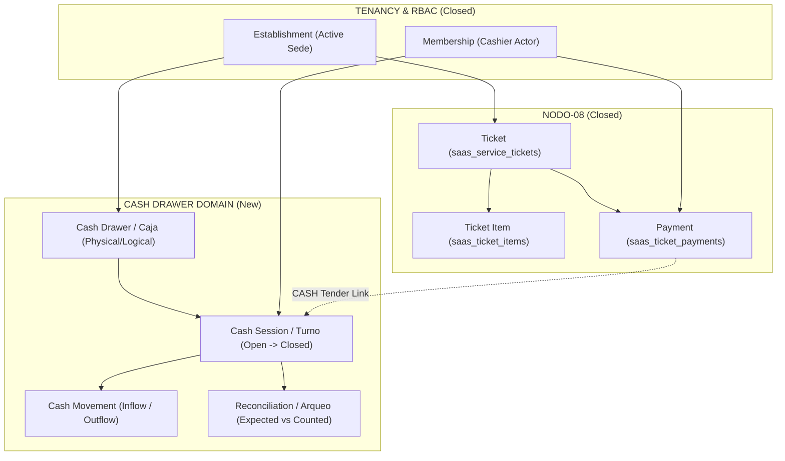

# GO-08.46 — DISCOVERY
## CASH DRAWER / CAJA SaaS v1.0

**Document ID:** `GO-08.46-DISCOVERY-CASH-DRAWER-v1.0`  
**Domain:** Cash Drawer / Caja / Turnos de Caja / Arqueo / Movimientos de Efectivo (GlowApp SaaS)  
**Authority:** Director del Proyecto GlowApp SaaS  
**Governing Documents:**
- SOUL + Governance
- NODO-01..NODO-08 (Ratified & Closed)
- Staff Provisioning (GO-08.39 Backend / GO-08.45 Frontend Closed)
- Customer Domain (GO-08.19 Closed)
- POS / Checkout (`SCR-12` Closed)  
**Status:** `DISCOVERY COMPLETE — CONTRACT NOT AUTHORIZED` 🔒  
**Date:** September 13, 2026  

---

## 1. Executive Summary

Este documento consolida el **Descubrimiento Arquitectónico Físico** para el dominio **CASH DRAWER / CAJA SaaS v1.0** en la plataforma GlowApp.

El objetivo es establecer con rigor el estado real del repositorio, las dependencias con los nodos cerrados (`NODO-08` Tickets, `SCR-12` POS, `Staff Provisioning`, `Active Context`), los límites de dominio, los flujos de apertura, arqueo, movimientos manuales, conciliación de efectivo y las decisiones arquitectónicas abiertas que deben resolverse antes de elaborar el contrato formal.

> [!IMPORTANT]
> **REGLA ABSOLUTA DE DISCOVERY:**
> Este documento es exclusivamente investigativo y analítico. No implementa código, no crea tablas, no crea migraciones, no expone endpoints y no altera ningún nodo cerrado.

---

## 2. Physical Evidence & Repo Search

Una búsqueda exhaustiva en todo el repositorio (`backend/`, `frontend/`, `migrations/`, `tests/`, `ncp/`) arrojó los siguientes hallazgos físicos:

1. **Inexistencia de Modelo de Caja:** No existen tablas, modelos, controladores ni servicios para `cash_drawer`, `cash_session`, `cash_register`, `caja`, `arqueo`, `apertura_caja`, `cierre_caja`, ni `movimientos_caja`.
2. **Registro Aislado de Pagos en NODO-08:** La tabla `saas_ticket_payments` (`backend/migrations/072_saas_service_tickets.sql`) registra transacciones individuales con la restricción:
   ```sql
   payment_method IN ('CASH', 'CARD', 'TRANSFER', 'OTHER')
   ```
3. **Manejo en Frontend POS (`SCR-12`):** `TicketPaymentModal` permite seleccionar `Efectivo (CASH)`, `Tarjeta (CARD)`, `Transferencia (TRANSFER)` u `Otro (OTHER)`. Al registrar un pago `CASH`, este impacta el saldo del ticket (`balance_due`), pero **no se vincula a ninguna sesión de caja física o lógica**, ni verifica si existe una caja abierta en la sede.
4. **Trazabilidad Existente en Pagos:** `saas_ticket_payments` registra `received_by_membership_id`, `amount`, `reference_code`, `created_at`, `tenant_id`, y `establishment_id`.

---

## 3. Current State

| Capacidad | Estado Físico | Evidencia en Código |
|---|:---:|---|
| **Apertura de Caja** | **NO EXISTE** | Ningún endpoint ni estructura para registrar saldo inicial / base de caja. |
| **Movimientos Manuales (Ingresos / Retiros)** | **NO EXISTE** | Sin soporte para gastos menores, sangrías a banco, o inyecciones de efectivo. |
| **Cobro CASH en Tickets** | **EXISTE (Parcial)** | Soportado en `saas_ticket_payments`, pero huérfano de sesión de caja. |
| **Arqueo de Caja (Cash Count)** | **NO EXISTE** | Sin soporte para conteo físico de billetes/monedas al finalizar turno. |
| **Cálculo de Diferencias (Sobrante / Faltante)** | **NO EXISTE** | Sin cálculo de `Expected Cash vs Counted Cash`. |
| **Cierre de Caja** | **NO EXISTE** | Sin sellado de sesión ni bloqueo de operaciones sobre la jornada. |
| **Historial y Auditoría de Turnos** | **NO EXISTE** | Sin trazabilidad de cierres históricos por establecimiento. |
| **Control de Multi-Cajas por Sede** | **NO DEFINIDO** | No se ha determinado si un salón opera con 1 caja única o múltiples cajas/TPVs. |

---

## 4. Existing Implementation Audit (NODO-08 & SCR-12)

### 4.1 Persistencia Actual en `saas_ticket_payments`
```sql
CREATE TABLE IF NOT EXISTS saas_ticket_payments (
    id UUID PRIMARY KEY DEFAULT gen_random_uuid(),
    ticket_id UUID NOT NULL,
    tenant_id INTEGER NOT NULL,
    establishment_id UUID NOT NULL,
    payment_method VARCHAR(20) NOT NULL,
    amount NUMERIC(12, 2) NOT NULL,
    reference_code VARCHAR(100),
    received_by_membership_id UUID NOT NULL,
    created_at TIMESTAMPTZ NOT NULL DEFAULT CURRENT_TIMESTAMP,
    ...
);
```

### 4.2 Hallazgo Crítico de NODO-08
- En `nodo08TicketsService.js` (`addPayment`), el registro de un pago `CASH` valida el rol del actor (`OWNER`, `MANAGER`, `RECEPTIONIST`), bloquea sobrepagos y actualiza el saldo del ticket a `PAID`.
- **Ausencia de Guardián de Caja:** No existe ninguna comprobación de que el establecimiento tenga una sesión de caja activa. Un recepcionista puede registrar un pago en efectivo a medianoche o con la sede cerrada sin que quede registrado en ningún turno de caja.

---

## 5. Domain Boundary

Es imperativo preservar las fronteras de dominio sin contaminar entidades:

$$\mathbf{CASH\ DRAWER \neq TICKET \neq PAYMENT \neq APPOINTMENT \neq MEMBERSHIP \neq CUSTOMER}$$



---

## 6. Functional Objectives

Para la versión v1.0 de Cash Drawer, se evalúa la necesidad funcional de:

1. **Apertura de Caja (`OPEN_SESSION`):**
   - Declaración de base inicial en efectivo (`opening_balance` $\ge 0$).
   - Asignación de operador responsable (`opened_by_membership_id`).
   - Timestamp de apertura (`opened_at`).
2. **Movimientos de Efectivo No Operativos (`MANUAL_MOVEMENTS`):**
   - **Ingresos (`CASH_IN`):** Base adicional, cambio traído de banco, aportes.
   - **Retiros / Egresos (`CASH_OUT`):** Gastos menores (café, insumos urgentes), anticipos de propinas, sangría a bóveda o consignación bancaria.
   - Requieren motivo obligatorio (`reason`), monto (> 0) y membership responsable.
3. **Integración con Pagos CASH (`AUTOMATIC_INFLOW`):**
   - Todo pago de ticket con `payment_method = 'CASH'` debe vincularse a la sesión de caja activa del establecimiento.
4. **Arqueo y Cierre de Caja (`CLOSE_SESSION`):**
   - Conteo de efectivo físico (`counted_cash`).
   - Cálculo automático de efectivo esperado (`expected_cash`):
     $$\text{Expected Cash} = \text{Opening Balance} + \sum \text{Cash Payments} + \sum \text{Cash Inflows} - \sum \text{Cash Outflows}$$
   - Determinación de diferencia:
     $$\text{Difference} = \text{Counted Cash} - \text{Expected Cash}$$
     - $\text{Difference} = 0 \rightarrow$ Cuadrada (Balanced).
     - $\text{Difference} > 0 \rightarrow$ Sobrante (Surplus).
     - $\text{Difference} < 0 \rightarrow$ Faltante (Shortage).
   - Notas/justificación de cierre (`closing_notes`).
   - Bloqueo inmutable de la sesión (`status = 'CLOSED'`).

---

## 7. Payment Boundary & Split Tender

### 7.1 Regla de Segregación de Medios de Pago
En una transacción con **Split Tender** (pago dividido):
$$\text{Ticket Total: } \$100.000 = \$40.000\text{ CASH} + \$60.000\text{ CARD}$$

- **Impacto en Caja:** Únicamente los **\$40.000 CASH** incrementan el `expected_cash` físico en la gaveta.
- **Auditoría Electrónica:** Los **\$60.000 CARD** se registran en el resumen del cierre como total electrónico informativo, pero **no forman parte del conteo físico de billetes**.

---

## 8. Active Context & Multi-Tenant Boundaries

- **Inyección Canónica:** Todas las operaciones de caja operan bajo `ActiveContextHolder` y encabezado `x-active-membership-id`.
- **Aislamiento Multi-Tenant Estricto:**
  $$\text{Tenant A} \neq \text{Tenant B} \quad \land \quad \text{Establishment 1} \neq \text{Establishment 2}$$
- Toda tabla de caja deberá contar con RLS:
  ```sql
  tenant_id = NULLIF(current_setting('app.tenant_id', true), '')::integer
  ```
- No se permite transferir efectivo ni conciliar sesiones entre diferentes sedes o tenants.

---

## 9. RBAC & Staff Relationship Discovery

| Acción de Caja | `OWNER` | `MANAGER` | `RECEPTIONIST` | `PROFESSIONAL` |
|---|:---:|:---:|:---:|:---:|
| **Abrir Sesión de Caja** | Permitido | Permitido | Permitido | Denegado |
| **Registrar Pago CASH en Ticket** | Permitido | Permitido | Permitido | Denegado |
| **Registrar Ingreso Manual (`CASH_IN`)** | Permitido | Permitido | Permitido | Denegado |
| **Registrar Retiro Manual (`CASH_OUT`)** | Permitido | Permitido | Condicionado / Permitido | Denegado |
| **Realizar Arqueo y Cierre de Caja** | Permitido | Permitido | Permitido | Denegado |
| **Ver Resumen de Expected Cash durante turno** | Permitido | Permitido | Configurable (Cierre Ciego vs Abierto) | Denegado |
| **Consultar Historial de Cierres de Sede** | Permitido | Permitido | Denegado (Solo su turno) | Denegado |
| **Aprobar / Justificar Diferencias de Caja** | Permitido | Permitido | Denegado | Denegado |

---

## 10. Concurrency & Integrity Risks

1. **Doble Apertura Simultánea:** Dos recepcionistas abriendo caja en la misma sede al mismo tiempo $\rightarrow$ Requiere bloqueo `UNIQUE (establishment_id) WHERE status = 'OPEN'` o control de concurrencia en base de datos.
2. **Pago CASH sin Caja Abierta:** Si un ticket intenta cobrarse en efectivo cuando la caja está cerrada $\rightarrow$ Debe definirse si se bloquea con error `CASH_DRAWER_NOT_OPEN` o si se permite bajo modalidad degradada.
3. **Cierre con Tickets Abiertos Pendientes:** ¿Se permite cerrar caja si hay tickets en estado `OPEN` en el salón? $\rightarrow$ Sí, los tickets `OPEN` no tienen pagos CASH pendientes de conciliar; los tickets ya pagados (`PAID`) tienen sus pagos imputados.
4. **Pagos Concurrentes durante el Cierre:** Si se registra un pago CASH en el milisegundo exacto en que se ejecuta el cierre $\rightarrow$ Requiere transacción `SERIALIZABLE` o `FOR UPDATE` sobre la sesión de caja.

---

## 11. Dependency Matrix

| Componente / Dominio | Tipo de Dependencia | Naturaleza de la Relación |
|---|:---:|---|
| **`NODO-08` (`saas_ticket_payments`)** | **HARD DEPENDENCY** | Los pagos CASH alimentan las entradas de la sesión de caja. |
| **`ActiveContextHolder` & `ApiService`** | **HARD DEPENDENCY** | Provee `tenant_id`, `establishment_id` y `membership_id`. |
| **`Staff Provisioning` (`memberships`)** | **HARD DEPENDENCY** | Provee la identidad del cajero/operador y su rol RBAC. |
| **`SCR-12` (`ServiceTicketCheckoutScreen`)** | **SOFT DEPENDENCY** | El modal de pago interactúa con el estado de caja. |
| **`SCR-05` (`HubSalonScreen`)** | **SOFT DEPENDENCY** | Punto de entrada para el nuevo módulo "Caja / Cash Drawer". |
| **`Customer Domain` (`saas_customers`)** | **NO DEPENDENCY** | La caja no tiene relación directa con clientes. |
| **`Appointments` (`saas_appointments`)** | **NO DEPENDENCY** | La caja opera a nivel de pagos de tickets, no de citas. |

---

## 12. Reuse / Extend / New Matrix

| Componente | Clasificación | Justificación |
|---|:---:|---|
| `saas_ticket_payments` | **EXTEND / SOFT-LINK** | Se puede agregar `cash_session_id (UUID NULL)` o vincular por rango temporal `(establishment_id, created_at BETWEEN opened_at AND closed_at)`. |
| `SaasNavigationOrchestrator` | **EXTEND** | Agregar ruta canónica hacia la nueva pantalla de Caja (`SCR-16`). |
| `HubSalonScreen` | **EXTEND** | Conectar botón de módulo Caja en la sección de accesos directos. |
| Tablas DDL de Caja (`saas_cash_drawers`, `saas_cash_sessions`, `saas_cash_movements`) | **NEW** | Entidades completamente nuevas. |
| Frontend Screens (`CashDrawerScreen`, `OpenCashModal`, `CloseCashModal`, `CashMovementModal`) | **NEW** | Superficies visuales para la operación de caja. |

---

## 13. Open Architectural Decisions (Requieren Ratificación)

Antes de redactar el contrato de Cash Drawer, deben someterse a decisión arquitectónica los siguientes 7 puntos:

1. **DEC-01: ¿Caja Única por Sede vs. Múltiples Cajas Físicas?**
   - *Opción A (Recomendada v1.0):* Caja Única por Establecimiento (1 gaveta principal por sede).
   - *Opción B:* Multi-caja / Multi-TPV con identificador de caja física (`cash_drawer_id`).
2. **DEC-02: ¿Sesión por Turno/Operador vs. Sesión Diaria de Salón?**
   - *Opción A (Recomendada v1.0):* Sesión por Turno (un operador abre, opera y cierra; si cambia de turno, se realiza arqueo y el nuevo operador abre su turno).
   - *Opción B:* Sesión de Sede Global compartida por todos los recepcionistas del día.
3. **DEC-03: ¿Exigencia Estricta de Caja Abierta para Pagos CASH?**
   - *Opción A (Recomendada):* Estricta. No se puede cobrar en `CASH` en `SCR-12` si la caja está cerrada (`CASH_DRAWER_REQUIRED`). Otros métodos (`CARD`, `TRANSFER`) sí se permiten.
   - *Opción B:* Flexible. Permite pagos CASH sin caja abierta y los acumula en un estado "sin conciliar".
4. **DEC-04: ¿Cierre Ciego (Blind Close) vs. Cierre Visible?**
   - *Opción A:* Cierre Ciego para Recepcionistas (el cajero cuenta el dinero sin ver el `expected_cash` en pantalla para evitar fraude; el sistema calcula la diferencia tras ingresar el conteo).
   - *Opción B:* Cierre Visible (se muestra el saldo esperado en todo momento).
5. **DEC-05: ¿Clasificación de Movimientos Manuales?**
   - Categorías mínimas para `CASH_IN` (Base adicional, Ajuste) y `CASH_OUT` (Gasto menor, Anticipo propina, Retiro a bóveda/banco).
6. **DEC-06: ¿Cierre con Diferencias (Sobrante/Faltante)?**
   - ¿Se permite cerrar con diferencia si el operador ingresa una justificación obligatoria, o requiere autorización de `OWNER`/`MANAGER`?
7. **DEC-07: ¿Vínculo Físico de Pagos a la Sesión?**
   - *Opción A:* Foreign Key explícita `cash_session_id` en `saas_ticket_payments` (requiere migración ligera sobre tabla cerrada o tabla intermedia).
   - *Opción B (Zero-Change en NODO-08):* Tabla intermedia `saas_cash_session_payments` o resolución por rango `created_at BETWEEN opened_at AND closed_at`.

---

## 14. Recommended Next Step

Proceder a:
**GO-08.47 — ARCHITECTURAL DECISIONS: CASH DRAWER & CAJA SaaS v1.0** para resolver los 7 puntos abiertos antes de la emisión del contrato formal.

---

## 15. Estado Final

```
STATUS:
DISCOVERY COMPLETE — CONTRACT NOT AUTHORIZED

IMPLEMENTATION:
NOT AUTHORIZED

NEXT:
GO-08.47 — CASH DRAWER DOMAIN CONTRACT

NO CODE.
NO SQL.
NO MIGRATION.
NO FRONTEND CHANGES.
NO BACKEND CHANGES.
NO CLOSED-NODE CHANGES.
```
