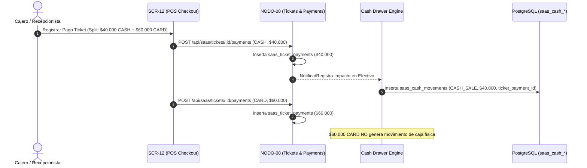
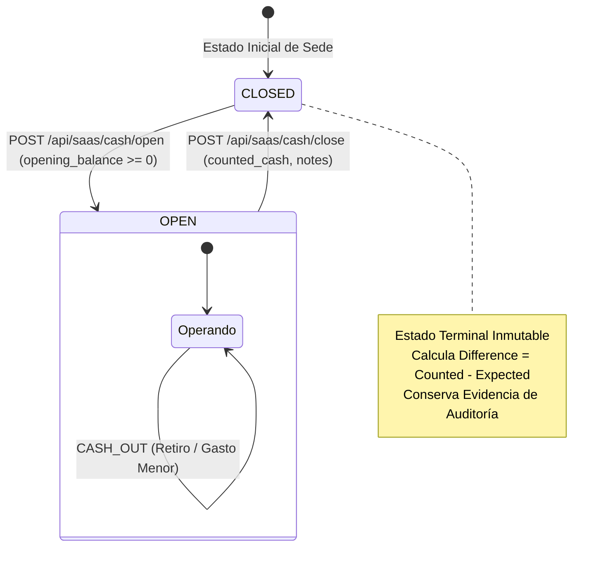

# GO-08.47 — CASH DRAWER DOMAIN CONTRACT v1.0
## DOMAIN & ARCHITECTURAL SPECIFICATION

**Document ID:** `GO-08.47-CASH-DRAWER-DOMAIN-CONTRACT-v1.0`  
**Domain:** Cash Drawer / Caja / Turnos de Caja / Arqueo / Movimientos de Efectivo (GlowApp SaaS)  
**Authority:** Director del Proyecto GlowApp SaaS  
**Governing Documents:**
- SOUL + Governance
- `NODO-08` (Service Tickets & Payments — Closed & Immutable)
- `Staff Provisioning` (Memberships & RBAC — Closed & Immutable)
- `Customer Domain` (`SCR-13` — Closed & Immutable)
- `POS / Checkout` (`SCR-12` — Closed & Immutable)
- [`ncp/GO-08.46-DISCOVERY-CASH-DRAWER-v1.0.md`](file:///C:/Users/Compu%20casa/.gemini/antigravity/worktrees/beauty-app/database_audit_read_only/ncp/GO-08.46-DISCOVERY-CASH-DRAWER-v1.0.md)  
**Status:** `CONTRACT READY — IMPLEMENTATION NOT AUTHORIZED` 🔒  
**Date:** September 13, 2026  

---

## 1. Domain Boundary & Core Invariants

El dominio **CASH DRAWER / CAJA** gestiona la custodia física y la trazabilidad del dinero en efectivo en el establecimiento.

### 1.1 Invariante Fundamental de Segregación
$$\mathbf{CASH\ DRAWER \neq TICKET \neq PAYMENT \neq APPOINTMENT \neq MEMBERSHIP \neq CUSTOMER}$$

- **`TICKET` (NODO-08):** Representa la cuenta u orden de servicio (ítems, descuentos, impuestos, propinas, saldo pendiente).
- **`PAYMENT` (NODO-08):** Representa la transacción de cobro (`saas_ticket_payments`) con su respectivo método (`CASH`, `CARD`, `TRANSFER`, `OTHER`).
- **`CASH SESSION` (Cash Drawer):** Representa el intervalo temporal de custodia de efectivo (turno de caja) abierto por un colaborador responsable, acumulando entradas y salidas físicas hasta su arqueo y cierre inmutable.
- **`CASH MOVEMENT` (Cash Drawer):** Registro atómico e inmutable de cualquier flujo de dinero en efectivo (ingreso manual, gasto menor, sangría a banco, o pago de ticket).
- **`MEMBERSHIP` (Staff Provisioning):** Identidad y rol del colaborador que opera la caja o autoriza movimientos.

### 1.2 Regla de Cero Modificación sobre Nodos Cerrados
> [!IMPORTANT]
> **PRESERVACIÓN DE NODO-08 & NODOS CERRADOS:**
> Este contrato **no modifica** la estructura ni la lógica de `saas_service_tickets`, `saas_ticket_items` ni `saas_ticket_payments`.
> El dominio de Caja **consume** la evidencia de cobros en efectivo mediante una tabla de movimientos operacionales (`saas_cash_movements`) que referencia `saas_ticket_payments(id)` sin alterar la tabla cerrada.

---

## 2. Canonical Relationship & Split Tender

### 2.1 Flujo de Vinculación Canónica


### 2.2 Regla de Split Tender (Pago Dividido)
En cualquier venta con múltiples medios de pago:
$$\text{Ticket Total} = \sum \text{Payments}$$
- **Impacto en Caja:** Únicamente los pagos con `payment_method = 'CASH'` impactan la gaveta de efectivo físico.
- **Otros Medios (`CARD`, `TRANSFER`, `OTHER`):** No afectan el balance de efectivo en caja. Se consolidan en los reportes de cierre de turno como totales informativos de medios electrónicos.

---

## 3. Decisiones Arquitectónicas Ratificadas (v1.0)

1. **DEC-01 (Caja Única por Establecimiento):**  
   Para v1.0, cada establecimiento opera con **una (1) gaveta lógica/física principal**. No se requiere gestión multi-TPV empresarial.
2. **DEC-02 (Sesión por Turno / Operador):**  
   La caja se opera bajo el concepto de **Sesión de Caja (Turno)**. Solo puede existir **exactamente una (1) sesión `OPEN`** simultánea por establecimiento.
3. **DEC-03 (Exigencia de Caja Abierta para Cobros CASH):**  
   Para registrar un pago con `payment_method = 'CASH'` en el POS, **es obligatorio que exista una sesión de caja `OPEN`** en el establecimiento. Si la caja está cerrada, el backend rechaza el pago CASH con código `CASH_DRAWER_NOT_OPEN`. Los pagos con `CARD` y `TRANSFER` permanecen permitidos.
4. **DEC-04 (Arqueo con Cierre Ciego para Operadores):**  
   Al cerrar la caja, el operador ingresa el conteo físico de dinero (`counted_cash`) sin que la pantalla le revele el `expected_cash` previamente (Cierre Ciego anti-fraude). El backend calcula la diferencia y sella la sesión. `OWNER` y `MANAGER` pueden auditar en todo momento el esperado y la diferencia.
5. **DEC-05 (Tipología de Movimientos Manuales):**  
   - `CASH_IN`: `BASE_ADICIONAL`, `CAMBIO_SENCILLO`, `OTRO_INGRESO`.
   - `CASH_OUT`: `GASTO_MENOR` (Caja menor), `ANTICIPO_PROPINA`, `RETIRO_BANCO` (Sangría a bóveda o banco), `OTRO_EGRESO`.
   - `CASH_SALE`: Entrada automática generada por cobro de ticket en efectivo.
6. **DEC-06 (Sesión Cerrada es Terminal):**  
   El estado `CLOSED` es **definitivo e inmutable**. Una sesión cerrada jamás puede reabrirse (`CANNOT_REOPEN_CLOSED_SESSION`).
7. **DEC-07 (Reversiones / Refunds):**  
   Las devoluciones de efectivo a clientes están declaradas **OUT OF SCOPE** para v1.0, dado que NODO-08 no admite reembolsos de pagos liquidados. Si un gasto o ajuste excepcional ocurre, se registra como movimiento manual `CASH_OUT` con motivo justificado.

---

## 4. Lifecycle & State Machine



---

## 5. Mathematical Formulation of Reconciliation

Para cualquier sesión de caja $S$:

### 5.1 Saldo Esperado en Caja (`expected_cash`)
$$\text{Expected Cash} = B_0 + \sum M_{\text{CASH\_SALE}} + \sum M_{\text{CASH\_IN}} - \sum M_{\text{CASH\_OUT}}$$
Donde:
- $B_0$: Base de apertura declarada (`opening_balance` $\ge 0.00$).
- $M_{\text{CASH\_SALE}}$: Pagos de tickets en efectivo imputados a la sesión.
- $M_{\text{CASH\_IN}}$: Ingresos manuales registrados durante la sesión.
- $M_{\text{CASH\_OUT}}$: Retiros y gastos menores registrados durante la sesión.

### 5.2 Determinación de la Diferencia de Caja (`difference`)
$$\text{Difference} = \text{Counted Cash} - \text{Expected Cash}$$

- **$\text{Difference} = 0.00$:** Caja Cuadrada (`BALANCED`).
- **$\text{Difference} > 0.00$:** Sobrante de Efectivo (`SURPLUS`).
- **$\text{Difference} < 0.00$:** Faltante de Efectivo (`SHORTAGE`).

---

## 6. RBAC Matrix

| Capacidad / Endpoint | `OWNER` | `MANAGER` | `RECEPTIONIST` | `PROFESSIONAL` |
|---|:---:|:---:|:---:|:---:|
| **Consultar Estado de Caja Actual (`GET /current`)** | Permitido | Permitido | Permitido | Denegado |
| **Abrir Sesión de Caja (`POST /open`)** | Permitido | Permitido | Permitido | Denegado |
| **Registrar Ingreso Manual (`POST /movements` IN)** | Permitido | Permitido | Permitido | Denegado |
| **Registrar Retiro / Gasto Menor (`POST /movements` OUT)** | Permitido | Permitido | Permitido | Denegado |
| **Cerrar y Realizar Arqueo (`POST /close`)** | Permitido | Permitido | Permitido | Denegado |
| **Ver `expected_cash` en tiempo real (Auditoría en vivo)** | Visible | Visible | Oculto (Cierre Ciego) | Denegado |
| **Consultar Historial de Sesiones Pasadas (`GET /history`)** | Permitido | Permitido | Denegado (Solo sesión propia) | Denegado |
| **Consultar Detalle de Sesión Histórica (`GET /sessions/:id`)** | Permitido | Permitido | Denegado | Denegado |

---

## 7. Multi-Tenant & Active Context Invariant

- **Encabezado Canónico:** Toda petición privada a `/api/saas/cash/*` exige `x-active-membership-id` y token JWT.
- **Resolución de Contexto:** El backend resuelve `tenant_id`, `establishment_id`, `membership_id` y `role` en memoria vía `activeContextMiddleware`.
- **Aislamiento Multi-Tenant Estricto:**
  $$\text{Tenant}_A \cap \text{Tenant}_B = \emptyset \quad \land \quad \text{Establishment}_1 \cap \text{Establishment}_2 = \emptyset$$
- Todas las tablas del dominio de caja cuentan con **Row Level Security (RLS)** estricto por `tenant_id`.

---

## 8. Data Model Specification (DDL)

### 8.1 Tabla `saas_cash_sessions`
Representa los turnos o intervalos de operación de caja.

```sql
CREATE TABLE IF NOT EXISTS saas_cash_sessions (
    id UUID PRIMARY KEY DEFAULT gen_random_uuid(),
    tenant_id INTEGER NOT NULL,
    establishment_id UUID NOT NULL,
    
    -- Apertura
    opened_by_membership_id UUID NOT NULL,
    opened_at TIMESTAMPTZ NOT NULL DEFAULT CURRENT_TIMESTAMP,
    opening_balance NUMERIC(12, 2) NOT NULL DEFAULT 0.00,
    
    -- Estado
    status VARCHAR(20) NOT NULL DEFAULT 'OPEN',
    
    -- Cierre y Arqueo
    closed_by_membership_id UUID,
    closed_at TIMESTAMPTZ,
    expected_cash NUMERIC(12, 2),
    counted_cash NUMERIC(12, 2),
    difference NUMERIC(12, 2),
    closing_notes TEXT,
    
    -- Timestamps de Auditoría
    created_at TIMESTAMPTZ NOT NULL DEFAULT CURRENT_TIMESTAMP,
    updated_at TIMESTAMPTZ NOT NULL DEFAULT CURRENT_TIMESTAMP,
    
    -- Restricciones de Integridad
    CONSTRAINT fk_cash_sessions_tenant 
        FOREIGN KEY (tenant_id) 
        REFERENCES tenants(id) 
        ON DELETE CASCADE,
    CONSTRAINT fk_cash_sessions_establishment 
        FOREIGN KEY (establishment_id, tenant_id) 
        REFERENCES establishments(id, tenant_id) 
        ON DELETE RESTRICT,
    CONSTRAINT fk_cash_sessions_opener 
        FOREIGN KEY (opened_by_membership_id, establishment_id, tenant_id) 
        REFERENCES memberships(id, establishment_id, tenant_id) 
        ON DELETE RESTRICT,
    CONSTRAINT fk_cash_sessions_closer 
        FOREIGN KEY (closed_by_membership_id, establishment_id, tenant_id) 
        REFERENCES memberships(id, establishment_id, tenant_id) 
        ON DELETE RESTRICT,
        
    CONSTRAINT chk_cash_session_status CHECK (status IN ('OPEN', 'CLOSED')),
    CONSTRAINT chk_cash_session_opening_balance CHECK (opening_balance >= 0.00),
    CONSTRAINT chk_cash_session_closing_integrity CHECK (
        (status = 'OPEN' AND closed_at IS NULL AND counted_cash IS NULL) OR
        (status = 'CLOSED' AND closed_at IS NOT NULL AND closed_by_membership_id IS NOT NULL AND counted_cash IS NOT NULL)
    )
);

-- Índice Único Parcial: Máximo 1 sesión OPEN por establecimiento
CREATE UNIQUE INDEX IF NOT EXISTS idx_unique_open_cash_session_per_est 
    ON saas_cash_sessions(establishment_id, tenant_id) 
    WHERE status = 'OPEN';

CREATE INDEX IF NOT EXISTS idx_cash_sessions_establishment 
    ON saas_cash_sessions(establishment_id, tenant_id, opened_at DESC);
```

### 8.2 Tabla `saas_cash_movements`
Representa todos los flujos atómicos de dinero dentro de una sesión.

```sql
CREATE TABLE IF NOT EXISTS saas_cash_movements (
    id UUID PRIMARY KEY DEFAULT gen_random_uuid(),
    session_id UUID NOT NULL,
    tenant_id INTEGER NOT NULL,
    establishment_id UUID NOT NULL,
    
    -- Tipología y Categoría
    movement_type VARCHAR(20) NOT NULL,
    category VARCHAR(50) NOT NULL,
    amount NUMERIC(12, 2) NOT NULL,
    reason TEXT NOT NULL,
    
    -- Trazabilidad
    performed_by_membership_id UUID NOT NULL,
    ticket_payment_id UUID, -- NULL si es movimiento manual
    created_at TIMESTAMPTZ NOT NULL DEFAULT CURRENT_TIMESTAMP,
    
    -- Restricciones de Integridad
    CONSTRAINT fk_cash_movements_session 
        FOREIGN KEY (session_id) 
        REFERENCES saas_cash_sessions(id) 
        ON DELETE RESTRICT,
    CONSTRAINT fk_cash_movements_tenant 
        FOREIGN KEY (tenant_id) 
        REFERENCES tenants(id) 
        ON DELETE CASCADE,
    CONSTRAINT fk_cash_movements_establishment 
        FOREIGN KEY (establishment_id, tenant_id) 
        REFERENCES establishments(id, tenant_id) 
        ON DELETE RESTRICT,
    CONSTRAINT fk_cash_movements_performer 
        FOREIGN KEY (performed_by_membership_id, establishment_id, tenant_id) 
        REFERENCES memberships(id, establishment_id, tenant_id) 
        ON DELETE RESTRICT,
    CONSTRAINT fk_cash_movements_ticket_payment 
        FOREIGN KEY (ticket_payment_id) 
        REFERENCES saas_ticket_payments(id) 
        ON DELETE RESTRICT,
        
    CONSTRAINT chk_cash_movement_type CHECK (movement_type IN ('CASH_SALE', 'CASH_IN', 'CASH_OUT')),
    CONSTRAINT chk_cash_movement_amount CHECK (amount > 0.00)
);

CREATE INDEX IF NOT EXISTS idx_cash_movements_session 
    ON saas_cash_movements(session_id, created_at ASC);

CREATE INDEX IF NOT EXISTS idx_cash_movements_ticket_payment 
    ON saas_cash_movements(ticket_payment_id);
```

---

## 9. API Contract Specification

Todos los endpoints se exponen bajo el prefijo canónico `/api/saas/cash`.

### 9.1 `GET /api/saas/cash/current`
Consulta la sesión activa de caja en el establecimiento.
- **Auth:** Bearer Token + `x-active-membership-id`.
- **Roles:** `OWNER`, `MANAGER`, `RECEPTIONIST`.
- **Response (200) — Con Caja Abierta:**
  ```json
  {
    "is_open": true,
    "session": {
      "id": "uuid",
      "opened_at": "2026-09-13T08:00:00Z",
      "opening_balance": 150000.00,
      "opened_by": { "membership_id": "uuid", "name": "Ana Recepción" },
      "metrics": {
        "cash_sales_total": 420000.00,
        "cash_in_total": 50000.00,
        "cash_out_total": 30000.00,
        "expected_cash": 590000.00,
        "movements_count": 12
      }
    }
  }
  ```
  *(Nota: Para rol `RECEPTIONIST`, el campo `expected_cash` se devuelve como `null` si aplica la política de cierre ciego).*
- **Response (200) — Sin Caja Abierta:**
  ```json
  {
    "is_open": false,
    "session": null
  }
  ```

### 9.2 `POST /api/saas/cash/open`
Abre una nueva sesión de caja en el establecimiento.
- **Auth:** Bearer Token + `x-active-membership-id`.
- **Roles:** `OWNER`, `MANAGER`, `RECEPTIONIST`.
- **Request Body:**
  ```json
  {
    "opening_balance": 150000.00,
    "notes": "Base inicial recibida en billetes de denominación baja"
  }
  ```
- **Response (201):** Objeto `session` creado con estado `OPEN`.
- **Errores:**
  - `409 CASH_SESSION_ALREADY_OPEN`: Ya existe una sesión activa en la sede.
  - `400 INVALID_OPENING_BALANCE`: Monto base $< 0.00$.

### 9.3 `POST /api/saas/cash/movements`
Registra un movimiento manual de efectivo (`CASH_IN` o `CASH_OUT`).
- **Auth:** Bearer Token + `x-active-membership-id`.
- **Roles:** `OWNER`, `MANAGER`, `RECEPTIONIST`.
- **Request Body:**
  ```json
  {
    "movement_type": "CASH_OUT",
    "category": "GASTO_MENOR",
    "amount": 25000.00,
    "reason": "Compra de café y agua para recepción"
  }
  ```
- **Response (201):** Objeto `movement` creado.
- **Errores:**
  - `422 CASH_DRAWER_NOT_OPEN`: No hay caja abierta.
  - `400 INVALID_MOVEMENT_DATA`: Monto $\le 0$ o motivo vacío.
  - `422 INSUFFICIENT_CASH_IN_DRAWER`: Si un `CASH_OUT` supera el efectivo físico estimado en gaveta.

### 9.4 `GET /api/saas/cash/sessions/:id/movements`
Lista los movimientos atómicos de una sesión.
- **Auth:** Bearer Token + `x-active-membership-id`.
- **Roles:** `OWNER`, `MANAGER`, `RECEPTIONIST`.
- **Response (200):** Lista de movimientos ordenados cronológicamente con desglose de motivo, autor y ticket relacionado si aplica.

### 9.5 `POST /api/saas/cash/close`
Realiza el arqueo y sella la sesión de caja actual.
- **Auth:** Bearer Token + `x-active-membership-id`.
- **Roles:** `OWNER`, `MANAGER`, `RECEPTIONIST`.
- **Request Body:**
  ```json
  {
    "counted_cash": 590000.00,
    "closing_notes": "Cierre de turno tarde. Todo conforme sin novedades."
  }
  ```
- **Response (200):**
  ```json
  {
    "success": true,
    "session": {
      "id": "uuid",
      "status": "CLOSED",
      "opened_at": "2026-09-13T08:00:00Z",
      "closed_at": "2026-09-13T16:00:00Z",
      "opening_balance": 150000.00,
      "expected_cash": 590000.00,
      "counted_cash": 590000.00,
      "difference": 0.00,
      "reconciliation_status": "BALANCED",
      "closed_by_name": "Ana Recepción"
    }
  }
  ```
- **Errores:**
  - `422 CASH_DRAWER_NOT_OPEN`: No hay caja abierta para cerrar.
  - `400 INVALID_COUNTED_AMOUNT`: Monto contado $< 0.00$.

### 9.6 `GET /api/saas/cash/history`
Consulta el historial paginado de sesiones de caja de la sede.
- **Auth:** Bearer Token + `x-active-membership-id`.
- **Roles:** `OWNER`, `MANAGER`.
- **Query Params:** `?page=1&limit=20&date_from=2026-09-01&date_to=2026-09-30`.
- **Response (200):** Lista de sesiones con metadata de apertura, cierre, diferencias y operador.

---

## 10. Frontend Specification (`SCR-16` Cash Drawer Cockpit)

Para la implementación frontend se define la superficie:
- **`SCR-16` (`CashDrawerScreen`):**
  - **Estado Caja Cerrada:** Banner informativo con botón destacado `[Abrir Caja]`.
  - **Estado Caja Abierta:** Panel de turno actual con saldo base, total ventas en efectivo, total entradas/salidas manuales, lista en vivo de movimientos y botones de acción rápida:
    - `[+ Ingreso de Efectivo]` (`SCR-16-M1`)
    - `[- Retiro / Gasto]` (`SCR-16-M2`)
    - `[Cerrar Turno y Arquear]` (`SCR-16-M3`)
  - **Pestaña Historial:** Tabla/lista de cierres pasados con badges de estado (`BALANCED`, `SURPLUS`, `SHORTAGE`).

---

## 11. Concurrency & Transactional Guarantees

1. **Garantía Anti-Doble Apertura:** Controlada mediante índice único parcial en PostgreSQL (`idx_unique_open_cash_session_per_est`). Si dos solicitudes concurrentes intentan abrir caja, una de ellas fallará con violación de restricción única (`23505`), retornando error limpio `409 CASH_SESSION_ALREADY_OPEN`.
2. **Garantía de Cierre Atómico:** La operación de cierre adquiere bloqueo de fila (`SELECT ... FOR UPDATE`) sobre la sesión activa, calcula la sumatoria agregada de movimientos en la misma transacción (`BEGIN ... COMMIT`) y sella el estado a `CLOSED`.
3. **Inmutabilidad de Movimientos:** Los movimientos registrados en `saas_cash_movements` no admiten `UPDATE` ni `DELETE`.

---

## 12. Scope Definition

### 12.1 IN SCOPE (v1.0)
- Sesiones de caja (Turnos de caja) por establecimiento.
- Apertura con base inicial declarada.
- Registro de movimientos manuales (`CASH_IN`, `CASH_OUT`).
- Imputación operativa de cobros de tickets en efectivo (`CASH_SALE`).
- Arqueo físico con cálculo de diferencias (`BALANCED`, `SURPLUS`, `SHORTAGE`).
- Cierre inmutable de sesión.
- Historial y auditoría de turnos para Owner y Manager.

### 12.2 OUT OF SCOPE (v1.0)
- Liquidación de nómina / pago de comisiones automáticas.
- Facturación electrónica DIAN / Impuestos fiscales directos.
- Conciliación bancaria automatizada con pasarelas de tarjetas.
- Devoluciones físicas de dinero a clientes (Refunds).
- Gestión multi-caja por sede (TPVs independientes simultáneos).

---

## 13. Acceptance Criteria (Verificables)

1. **Apertura:**
   - Un usuario con rol `RECEPTIONIST`, `MANAGER` u `OWNER` puede abrir caja con una base inicial $\ge 0.00$.
   - No se permite abrir una segunda sesión si ya existe una sesión `OPEN` en la misma sede (Error 409).
2. **Pagos de Tickets:**
   - El POS (`SCR-12`) permite registrar pagos `CASH` únicamente si la caja de la sede está `OPEN`.
   - El pago `CASH` genera automáticamente su registro en `saas_cash_movements`.
   - En pagos mixtos (Split Tender), solo el componente en efectivo afecta la caja.
3. **Movimientos Manuales:**
   - Se pueden registrar ingresos y retiros manuales con motivo justificado.
   - Los movimientos se ordenan cronológicamente y afectan el saldo esperado.
4. **Cierre y Arqueo:**
   - El operador ingresa su conteo de efectivo.
   - El sistema calcula con precisión de centavos la diferencia (`Counted - Expected`).
   - La sesión pasa a `CLOSED` y no permite nuevas transacciones.
5. **Auditoría y RBAC:**
   - Profesionales no pueden abrir, operar ni cerrar la caja.
   - Todas las tablas poseen RLS activo por `tenant_id`.

---

## 14. Estado Final

```
STATUS:
CONTRACT READY — IMPLEMENTATION NOT AUTHORIZED

NEXT:
GO-08.48 — INDEPENDENT CASH DRAWER CONTRACT AUDIT

IMPLEMENTATION:
NOT AUTHORIZED

CHANGES:
DOCUMENTATION ONLY
```
