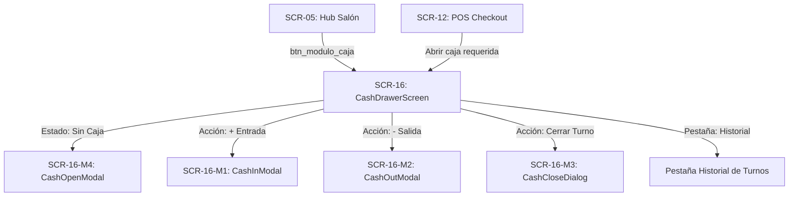
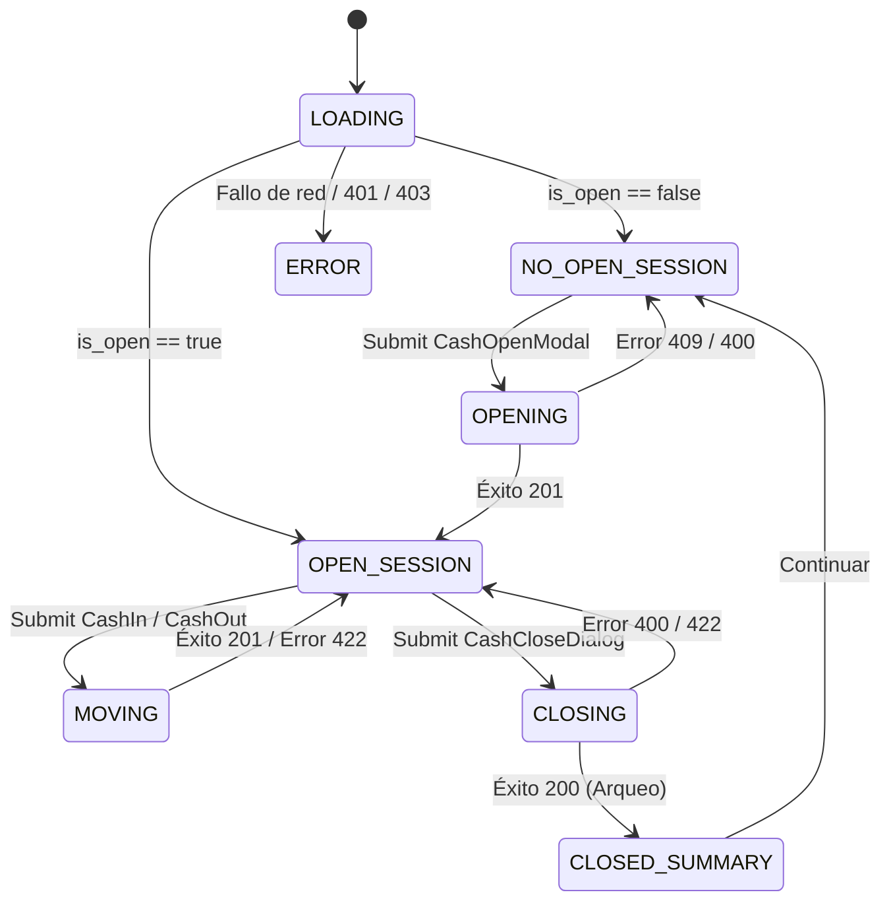

# GO-08.52 — DISCOVERY — CASH DRAWER FRONTEND v1.0
## ARCHITECTURAL & FUNCTIONAL DISCOVERY SPECIFICATION

**Document ID:** `GO-08.52-DISCOVERY-CASH-DRAWER-FRONTEND-v1.0`  
**Domain:** Cash Drawer / Caja / Turnos de Caja / Arqueo / Movimientos de Efectivo (GlowApp SaaS)  
**Role:** Architect + Discovery Agent under NCP  
**Authority:**
- Arquitectura SaaS aprobada por Director
- `GO-08.47` — Cash Drawer Domain Contract v1.0
- `GO-08.48` — Independent Contract Audit (`AUDIT PASS WITH OBSERVATIONS`)
- `GO-08.49` — Cash Drawer Backend Implementation v1.0
- `GO-08.50` — Independent Backend Audit (`AUDIT PASS WITH OBSERVATIONS`)
- `GO-08.51` — Formal Closure Cash Drawer Backend v1.0 (`CLOSED / IMMUTABLE`)
- `NODO-08` — Service Tickets & Payments (`CLOSED / IMMUTABLE`)
- `Staff Provisioning` (`SCR-14`, `SCR-15` — `CLOSED / IMMUTABLE`)
- `Customer Domain` (`SCR-13` — `CLOSED / IMMUTABLE`)
- `POS / Checkout` (`SCR-12` — `CLOSED / IMMUTABLE`)
- Frontend SaaS existente como evidencia  
**Status:** `DISCOVERY COMPLETE — IMPLEMENTATION NOT AUTHORIZED` 🔍  
**Date:** September 13, 2026  

---

## 1. Executive Summary & Objective

El objetivo de este documento de descubrimiento es definir con precisión la experiencia de usuario (UX), componentes visuales, estados reactivos, flujos de navegación, diálogos modales, validaciones de formularios y matriz de permisos para la superficie **`SCR-16` (Cash Drawer Cockpit)** y sus diálogos satélites en GlowApp SaaS.

> [!IMPORTANT]
> **REGLA FUNDAMENTAL DE INMUTABILIDAD:**
> El backend de Cash Drawer v1.0 (`075_saas_cash_drawer.sql`, `saasCashService.js`, `saasCashController.js`, `saasCashRoutes.js`) y todos los nodos previos (`NODO-01` a `NODO-08`, `Staff Provisioning`, `Customer Domain`) están **CERRADOS E INMUTABLES**.
> El frontend consumirá estrictamente los contratos HTTP y DDL ya auditados y formalizados.

---

## 2. Catálogo de API Backend Disponible

El frontend de Cash Drawer interactuará exclusivamente con los siguientes endpoints implementados y sellados bajo el prefijo canónico `/api/saas/cash`:

| Endpoint | Método HTTP | Roles Autorizados | Propósito | Request Body / Query | Response DTO | Códigos de Error |
|---|:---:|:---:|---|---|---|:---:|
| `/api/saas/cash/current` | `GET` | `OWNER`, `MANAGER`, `RECEPTIONIST` | Consulta la sesión activa de la sede y métricas acumuladas. | Ninguno | `{ is_open: bool, session: SessionDTO? }` | `401`, `403` |
| `/api/saas/cash/open` | `POST` | `OWNER`, `MANAGER`, `RECEPTIONIST` | Abre un nuevo turno de caja en la sede activa. | `{ opening_balance: double, notes?: string }` | `{ success: bool, session: SessionDTO }` | `400`, `403`, `409` |
| `/api/saas/cash/movements` | `POST` | `OWNER`, `MANAGER`, `RECEPTIONIST` | Registra un movimiento manual (`CASH_IN` / `CASH_OUT`). | `{ movement_type: string, category?: string, amount: double, reason: string }` | `{ success: bool, movement: MovementDTO }` | `400`, `403`, `422` |
| `/api/saas/cash/close` | `POST` | `OWNER`, `MANAGER`, `RECEPTIONIST` | Cierra la sesión activa y realiza el arqueo final. | `{ counted_cash: double, closing_notes?: string }` | `{ success: bool, session: ClosedSessionDTO }` | `400`, `403`, `422` |
| `/api/saas/cash/sessions/:id/movements` | `GET` | `OWNER`, `MANAGER`, `RECEPTIONIST` | Lista cronológica de movimientos de la sesión. | Ninguno | `{ success: bool, session_id: uuid, count: int, movements: MovementDTO[] }` | `401`, `403`, `404` |
| `/api/saas/cash/history` | `GET` | `OWNER`, `MANAGER` | Historial paginado de sesiones pasadas. | `?page=1&limit=20&date_from=&date_to=` | `{ success: bool, page: int, limit: int, total: int, sessions: SessionSummaryDTO[] }` | `401`, `403` |
| `/api/saas/cash/sessions/:id` | `GET` | `OWNER`, `MANAGER` | Consulta detallada de una sesión histórica específica. | Ninguno | `{ success: bool, session: FullSessionDetailDTO }` | `401`, `403`, `404` |

---

## 3. Superficies y Pantallas Descubiertas

Se define una pantalla principal (`SCR-16`) y cuatro diálogos modales satélites:



### 3.1 `SCR-16` — `CashDrawerScreen` (Cockpit de Caja)
Cockpit operativo centralizado con pestañas:
1. **Pestaña 1: Turno Actual (Live Cockpit):**
   - **Estado `NO_OPEN_SESSION`:** Ilustración vacía, banner explicativo y botón principal `[+ Abrir Turno de Caja]`.
   - **Estado `OPEN_SESSION`:**
     - **Header de Turno:** Responsable de apertura, fecha/hora de inicio, badge `EN OPERACIÓN`.
     - **Tarjetas de Métricas:**
       - Saldo Inicial de Base (`opening_balance`).
       - Ventas en Efectivo (`cash_sales_total`).
       - Entradas Manuales (`cash_in_total`).
       - Salidas / Gastos (`cash_out_total`).
       - Saldo Esperado en Gaveta (`expected_cash`) — *Oculto para `RECEPTIONIST`*.
     - **Barra de Acciones Rápidas:**
       - `[+ Ingreso de Efectivo]` (Dispara `SCR-16-M1`).
       - `[- Retiro / Gasto]` (Dispara `SCR-16-M2`).
       - `[Cerrar Turno y Arquear]` (Dispara `SCR-16-M3`).
     - **Feed de Movimientos en Vivo:** Lista ordenada cronológicamente de todas las transacciones de efectivo con badges de tipo (`VENTA`, `INGRESO`, `EGRESO`), categoría, autor y hora.
2. **Pestaña 2: Historial de Turnos (`SCR-16-TAB-HISTORY`):**
   - Visible exclusivamente para roles `OWNER` y `MANAGER`.
   - Tabla responsiva con paginación, filtros de fecha, y badges de conciliación (`CUADRADA`, `SOBRANTE`, `FALTANTE`).
   - Al tocar un turno, abre el visor de detalle con desglose de movimientos del turno pasado.

### 3.2 Modales y Diálogos Satélites
- **`SCR-16-M4` (`CashOpenModal`):**
  - Campo: Monto de Base Inicial (`opening_balance`, predeterminado en `$0.00` o valor sugerido).
  - Campo: Notas / Observaciones de apertura (opcional).
  - Botones: `[Cancelar]` y `[Confirmar y Abrir Turno]`.
- **`SCR-16-M1` (`CashInModal`):**
  - Selector de Categoría: `BASE_ADICIONAL`, `CAMBIO_SENCILLO`, `OTRO_INGRESO`.
  - Campo: Monto a Ingresar ($ > 0.00$).
  - Campo: Motivo / Justificación (obligatorio).
  - Botones: `[Cancelar]` y `[Registrar Entrada]`.
- **`SCR-16-M2` (`CashOutModal`):**
  - Selector de Categoría: `GASTO_MENOR`, `ANTICIPO_PROPINA`, `RETIRO_BANCO`, `OTRO_EGRESO`.
  - Campo: Monto a Retirar ($ > 0.00$).
  - Campo: Motivo / Justificación (obligatorio).
  - Indicador de Fondos Disponibles Estimados (para evitar sobregiro).
  - Botones: `[Cancelar]` y `[Registrar Egreso]`.
- **`SCR-16-M3` (`CashCloseDialog` - Arqueo Ciego y Cierre):**
  - Banner informativo de arqueo físico.
  - Campo principal: Efectivo Contado Físico (`counted_cash`).
  - Campo: Notas de cierre / Justificación de discrepancias (opcional).
  - Botón: `[Proceder al Cierre Definitivo]`.
  - **Vista de Resultado Post-Cierre:** Modal de resumen con el resultado emitido por el servidor:
    - Saldo Contado vs Saldo Esperado.
    - Diferencia calculada ($+\$$, $-\$$ o $\$0.00$).
    - Badge de Reconciliación: `BALANCED` (Verde), `SURPLUS` (Azul), `SHORTAGE` (Rojo).

---

## 4. Política de Cierre Ciego (*Blind Close*) en Frontend

> [!CAUTION]
> **REGLA ABSOLUTA DE SEGURIDAD Y PRIVACIDAD FINANCIERA:**
> Para el rol `RECEPTIONIST`, el backend devuelve `metrics.expected_cash = null`.
> **El frontend NO DEBE:**
> 1. Intentar calcular localmente `expected_cash` sumando los movimientos en memoria.
> 2. Mostrar estimaciones de saldo esperado en pantalla para el recepcionista.
> 3. Mostrar la diferencia antes de enviar el conteo físico.
> 
> El recepcionista cuenta físicamente el dinero en la gaveta, introduce el valor contado, y el servidor es la única entidad autoritativa que calcula y sella la diferencia.

---

## 5. Matriz de Visualización y Capacidades RBAC en Frontend

| Elemento UI / Acción | `OWNER` | `MANAGER` | `RECEPTIONIST` | `PROFESSIONAL` |
|---|:---:|:---:|:---:|:---:|
| **Acceso a `SCR-16` desde Hub Salón** | Visible | Visible | Visible | Oculto / Denegado (403) |
| **Botón `[Abrir Turno de Caja]`** | Habilitado | Habilitado | Habilitado | Deshabilitado / Oculto |
| **Tarjeta `Saldo Esperado` en Vivo** | Visible ($) | Visible ($) | Oculta / Masked (`---`) | N/A |
| **Botones `[+ Entrada]` y `[- Salida]`** | Habilitado | Habilitado | Habilitado | N/A |
| **Botón `[Cerrar Turno y Arquear]`** | Habilitado | Habilitado | Habilitado | N/A |
| **Pestaña `Historial de Turnos`** | Visible | Visible | Oculta | N/A |
| **Detalle de Turnos Pasados** | Visible | Visible | Oculto | N/A |

---

## 6. Integración con Active Context y Navegación

### 6.1 Tenencia de Contexto
- `CashDrawerScreen` consume `ActiveContextHolder().activeMembershipId` y `ActiveContextHolder().activeEstablishmentId`.
- Todas las peticiones HTTP realizadas a través del servicio frontend incluirán automáticamente el encabezado `x-active-membership-id`.
- Si el usuario conmuta de sede en el selector (`SCR-04`), `CashDrawerScreen` detecta el cambio y recarga automáticamente el estado de caja de la nueva sede activa.

### 6.2 Entry Points de Navegación
1. **Desde `HubSalonScreen` (`SCR-05`):**
   - Se incorpora el botón de acceso rápido `[Caja / Turno]` (`btn_modulo_caja`) en la sección de atajos modulares.
   - En el `SaasNavigationOrchestrator`, se expondrá el método estático `navigateToCashDrawer(BuildContext context)`.
2. **Desde `ServiceTicketCheckoutScreen` (`SCR-12`):**
   - Al seleccionar método de pago `CASH`, si la caja está cerrada, el checkout muestra una advertencia con botón `[Ir a Abrir Caja]` que navega hacia `SCR-16`.

---

## 7. Máquina de Estados del Frontend (`CashDrawerState`)



---

## 8. Formatos y Tipografía Visual

Siguiendo el sistema de diseño existente (`glow_tokens.dart`, `theme.dart`, `glass_card.dart`):
- **Moneda:** Formateador estándar COP `$#,##0.00`.
- **Badges de Reconciliación:**
  - `BALANCED`: Fondo verde esmeralda (`#E8F5E9`), texto verde oscuro (`#2E7D32`), ícono `Icons.check_circle_outline`.
  - `SURPLUS`: Fondo azul cielo (`#E3F2FD`), texto azul marino (`#1565C0`), ícono `Icons.trending_up`.
  - `SHORTAGE`: Fondo rojo suave (`#FFEBEE`), texto rojo oscuro (`#C62828`), ícono `Icons.warning_amber_rounded`.
- **Badges de Movimiento:**
  - `CASH_SALE`: Azul con ícono de ticket (`Icons.receipt_long`).
  - `CASH_IN`: Verde con ícono de entrada (`Icons.arrow_downward`).
  - `CASH_OUT`: Ámbar/Naranja con ícono de salida (`Icons.arrow_upward`).

---

## 9. Decisiones de Descubrimiento (Discovery Decisions)

1. **DISC-DEC-01 (Single Screen con Tabs vs Multi-Screen):**  
   `CashDrawerScreen` (`SCR-16`) unificará en una sola pantalla con pestañas (`Turno Actual` e `Historial de Cierres`), optimizando la ergonomía en tablets y desktops de recepción sin requerir múltiples rutas anidadas.
2. **DISC-DEC-02 (Modal de Resumen de Cierre):**  
   Al completar el arqueo exitosamente, se mostrará un diálogo de confirmación visual (`ReconciliationSummaryDialog`) que detalla el resultado financiero (`BALANCED`, `SURPLUS`, `SHORTAGE`) antes de transicionar la UI al estado `NO_OPEN_SESSION`.
3. **DISC-DEC-03 (Protección contra doble envío):**  
   Todos los botones de apertura, movimiento y cierre deshabilitarán su interacción durante las peticiones en vuelo con spinners circulares para evitar transacciones duplicadas por taps repetidos.
4. **DISC-DEC-04 (Categorías Predeterminadas):**  
   Los desplegables de categorías en `SCR-16-M1` y `SCR-16-M2` utilizarán exactamente los enums autorizados en el backend:
   - `CASH_IN`: `BASE_ADICIONAL`, `CAMBIO_SENCILLO`, `OTRO_INGRESO`.
   - `CASH_OUT`: `GASTO_MENOR`, `ANTICIPO_PROPINA`, `RETIRO_BANCO`, `OTRO_EGRESO`.

---

## 10. Decisiones Abiertas (Open Decisions)

$$\mathbf{OPEN\ DECISIONS = 0}$$

No existen ambigüedades ni contradicciones arquitectónicas. El backend cerrado `/api/saas/cash/*` provee el 100% de los datos y comportamientos requeridos para la experiencia de usuario.

---

## 11. Contrato de Pruebas Frontend Futuro (`saas_cash_drawer_test.dart`)

Para la futura implementación, se planifica una suite de pruebas de widgets e integración que cubra:
1. Renderizado de estado inicial sin caja (`NO_OPEN_SESSION`).
2. Apertura exitosa de turno con base inicial (`SCR-16-M4`).
3. Renderizado de estado de caja abierta con métricas y feed de movimientos.
4. Registro de entrada manual `CASH_IN` (`SCR-16-M1`).
5. Registro de salida manual `CASH_OUT` (`SCR-16-M2`).
6. Manejo de error de fondos insuficientes en `CASH_OUT` (422).
7. Visualización de movimientos generados por tickets `CASH_SALE`.
8. Enmascaramiento de `expected_cash` para rol `RECEPTIONIST` (Blind Close).
9. Revelación de `expected_cash` para roles `OWNER` y `MANAGER`.
10. Flujo de arqueo y cierre con resultado `BALANCED`.
11. Flujo de arqueo y cierre con resultado `SURPLUS`.
12. Flujo de arqueo y cierre con resultado `SHORTAGE`.
13. Ocultamiento de pestaña Historial para rol `RECEPTIONIST`.
14. Listado paginado de historial para rol `OWNER`.
15. Bloqueo de acceso y vista 403 para rol `PROFESSIONAL`.
16. Manejo de desconexión y reintentos de red.

---

## 12. Bloque de Estado Final

```
GO-08.52 STATUS

DISCOVERY:
COMPLETE

IMPLEMENTATION:
NOT AUTHORIZED

BACKEND:
UNCHANGED (CLOSED / IMMUTABLE)

SQL:
UNCHANGED (CLOSED / IMMUTABLE)

FRONTEND:
DISCOVERED (READY FOR CONTRACT)

NEXT:
GO-08.53 — CASH DRAWER FRONTEND CONTRACT v1.0
```
