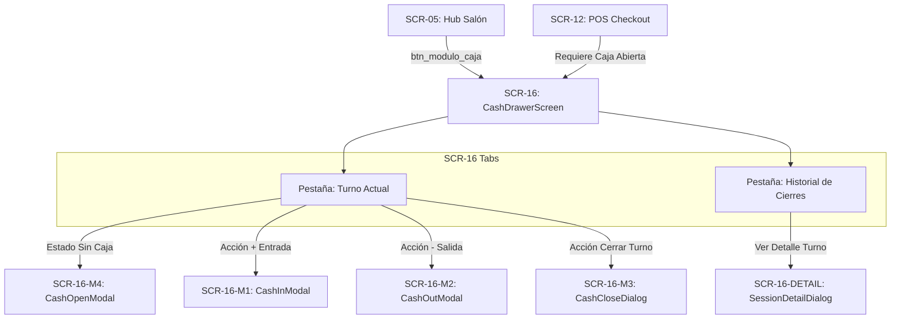

# GO-08.53 — CASH DRAWER FRONTEND CONTRACT v1.0
## FRONTEND ARCHITECTURAL & BINDING SPECIFICATION

**Document ID:** `GO-08.53-CASH-DRAWER-FRONTEND-CONTRACT-v1.0`  
**Domain:** Cash Drawer / Caja / Turnos de Caja / Arqueo / Movimientos de Efectivo (GlowApp SaaS)  
**Role:** Architect under NCP  
**Authority:**
- Arquitectura SaaS aprobada por Director
- SOUL + Governance
- `GO-08.47` — Cash Drawer Domain Contract v1.0
- `GO-08.48` — Independent Contract Audit (`AUDIT PASS WITH OBSERVATIONS`)
- `GO-08.49` — Cash Drawer Backend Implementation v1.0
- `GO-08.50` — Independent Backend Audit (`AUDIT PASS WITH OBSERVATIONS`)
- `GO-08.51` — Formal Closure Cash Drawer Backend v1.0 (`CLOSED / IMMUTABLE`)
- `GO-08.52` — Cash Drawer Frontend Discovery v1.0
- `NODO-08` — Service Tickets & Payments (`CLOSED / IMMUTABLE`)
- `Staff Provisioning` (`SCR-14`, `SCR-15` — `CLOSED / IMMUTABLE`)
- `Customer Domain` (`SCR-13` — `CLOSED / IMMUTABLE`)
- `POS / Checkout` (`SCR-12` — `CLOSED / IMMUTABLE`)  
**Status:** `CONTRACT READY — IMPLEMENTATION NOT AUTHORIZED` 🔒  
**Date:** September 13, 2026  

---

## 1. Reglas Fundamentales e Invariantes Arquitectónicas

1. **Inmutabilidad del Backend:** El backend de Cash Drawer v1.0 y todos los módulos cerrados previos (`NODO-01` a `NODO-08`, `Staff Provisioning`, `Customer Domain`) son **INMUTABLES**. Este contrato no autoriza ninguna modificación a archivos de backend, migraciones SQL, controladores ni rutas de servidor.
2. **Autoridad Financiera Estricta:** El servidor PostgreSQL es la **única entidad autoritativa** en materia financiera. El frontend nunca calcula ni sustituye la conciliación matemática, el cálculo de saldo esperado, ni el estado de arqueo (`BALANCED`, `SURPLUS`, `SHORTAGE`).
3. **Cierre Ciego Inviolable (*Blind Close*):** Para el rol `RECEPTIONIST`, el frontend nunca computará, estimará ni mostrará el saldo esperado (`expected_cash`), respetando el valor `null` provisto por el backend.

---

## 2. Superficies Canónicas y Componentes UI

El frontend de Cash Drawer se estructura alrededor de la pantalla principal **`SCR-16`** y cuatro diálogos modales satélites:



### 2.1 `SCR-16` — `CashDrawerScreen` (Cockpit de Caja)
- **Ruta / Widget:** `lib/screens/saas/cash_drawer_screen.dart`
- **Pestaña 1: Turno Actual (`CurrentTurnTab`):**
  - **Estado `NO_OPEN_SESSION`:**
    - Ilustración / Ícono: `Icons.point_of_sale_outlined` (64px, color ámbar/índigo).
    - Título: "No hay turno de caja abierto".
    - Subtítulo: "Abre un turno para registrar ingresos, egresos y cobrar tickets en efectivo en el POS."
    - Botón primario: `[+ Abrir Turno de Caja]` (`key: Key('btn_abrir_caja_empty')`).
  - **Estado `OPEN_SESSION`:**
    - **Header de Turno:** Identificador de sesión (primeros 8 caracteres), nombre del colaborador de apertura, hora de inicio (`HH:mm a`), badge verde `OPERANDO`.
    - **Tarjetas de Balance:**
      - `Base de Apertura`: Saldo inicial declarado.
      - `Ventas en Efectivo`: Sumatoria de tickets cobrados en efectivo (`CASH_SALE`).
      - `Entradas Manuales`: Sumatoria de ingresos manuales (`CASH_IN`).
      - `Salidas / Gastos`: Sumatoria de egresos manuales (`CASH_OUT`).
      - `Saldo Esperado en Gaveta`: Saldo calculado en vivo (`opening + sales + in - out`). **Enmascarado como `---` u oculto si el rol es `RECEPTIONIST`**.
    - **Barra de Acciones Rápidas:**
      - Botón `[+ Ingreso de Efectivo]` (`key: Key('btn_ingreso_efectivo')`) $\rightarrow$ Abre `SCR-16-M1`.
      - Botón `[- Retiro / Gasto]` (`key: Key('btn_retiro_gasto')`) $\rightarrow$ Abre `SCR-16-M2`.
      - Botón `[Cerrar Turno y Arquear]` (`key: Key('btn_cerrar_turno')`) $\rightarrow$ Abre `SCR-16-M3`.
    - **Feed de Movimientos en Vivo:**
      - Encabezado con contador total de transacciones.
      - Lista scrolleable ordenada cronológicamente con badges distintivos:
        - `VENTA`: Azul (`Icons.receipt_long`) con ID de ticket asociado.
        - `INGRESO`: Verde (`Icons.arrow_downward`) con categoría y motivo.
        - `EGRESO`: Naranja (`Icons.arrow_upward`) con categoría y motivo.
- **Pestaña 2: Historial de Cierres (`HistoryTab`):**
  - Visible **únicamente** para roles `OWNER` y `MANAGER`. (Oculta para `RECEPTIONIST`).
  - Tabla / Lista paginada con fecha de apertura/cierre, base, esperado, contado, diferencia, operador de cierre y badge de conciliación:
    - `BALANCED` (Verde, `Icons.check_circle_outline`).
    - `SURPLUS` (Azul, `Icons.trending_up`).
    - `SHORTAGE` (Rojo, `Icons.warning_amber_rounded`).
  - Filtros opcionales por rango de fechas (`date_from`, `date_to`).
  - Al seleccionar un turno histórico, abre el diálogo `SCR-16-DETAIL`.

### 2.2 Modales y Diálogos Satélites

#### `SCR-16-M4` — `CashOpenModal` (Apertura de Turno)
- **Título:** "Apertura de Turno de Caja"
- **Campos:**
  - `opening_balance`: Campo numérico monetario ($\ge 0.00$), con valor predeterminado `$0.00`.
  - `notes`: Campo de texto opcional para observaciones (e.g. desglose de billetes de baja denominación).
- **Acciones:**
  - `[Cancelar]` (`key: Key('btn_cancelar_apertura')`)
  - `[Confirmar y Abrir Turno]` (`key: Key('btn_confirmar_apertura')`)

#### `SCR-16-M1` — `CashInModal` (Ingreso Manual de Efectivo)
- **Título:** "Registrar Ingreso de Efectivo"
- **Campos:**
  - `category`: Desplegable con opciones exactas: `BASE_ADICIONAL`, `CAMBIO_SENCILLO`, `OTRO_INGRESO`.
  - `amount`: Campo numérico monetario ($> 0.00$, obligatorio).
  - `reason`: Campo de texto obligatorio describiendo la justificación.
- **Acciones:**
  - `[Cancelar]` (`key: Key('btn_cancelar_ingreso')`)
  - `[Registrar Ingreso]` (`key: Key('btn_confirmar_ingreso')`)

#### `SCR-16-M2` — `CashOutModal` (Retiro / Gasto Menor)
- **Título:** "Registrar Retiro o Gasto Menor"
- **Campos:**
  - `category`: Desplegable con opciones exactas: `GASTO_MENOR`, `ANTICIPO_PROPINA`, `RETIRO_BANCO`, `OTRO_EGRESO`.
  - `amount`: Campo numérico monetario ($> 0.00$, obligatorio).
  - `reason`: Campo de texto obligatorio describiendo la justificación.
- **Validación UX:** Si el monto excede el saldo en gaveta estimado, muestra advertencia de fondos insuficientes.
- **Acciones:**
  - `[Cancelar]` (`key: Key('btn_cancelar_egreso')`)
  - `[Registrar Egreso]` (`key: Key('btn_confirmar_egreso')`)

#### `SCR-16-M3` — `CashCloseDialog` (Arqueo y Cierre de Turno)
- **Título:** "Arqueo Físico y Cierre de Caja"
- **Campos:**
  - `counted_cash`: Campo numérico monetario ($\ge 0.00$, obligatorio) con el conteo físico de dinero en la gaveta.
  - `closing_notes`: Campo de texto opcional para justificaciones o notas de cierre.
- **Comportamiento Post-Submit:**
  - Al recibir respuesta exitosa `200` del backend, abre el diálogo `ReconciliationSummaryDialog` mostrando:
    - Efectivo Contado declarado.
    - Efectivo Esperado calculado por el backend.
    - Diferencia calculada ($+\$$, $-\$$ o $\$0.00$).
    - Badge de Reconciliación: `BALANCED`, `SURPLUS` o `SHORTAGE`.
    - Botón `[Finalizar]` que retorna al estado `NO_OPEN_SESSION`.

---

## 3. Mapeo Canónico de API y Modelos DTO

### 3.1 Modelos de Datos Dart (`lib/models/saas/saas_cash_model.dart`)

```dart
enum CashSessionStatus { open, closed }
enum CashMovementType { cashSale, cashIn, cashOut }
enum ReconciliationStatus { balanced, surplus, shortage }

class SaasCashSession {
  final String id;
  final String establishmentId;
  final String openedByMembershipId;
  final String openedByName;
  final String? openedByEmail;
  final DateTime openedAt;
  final double openingBalance;
  final CashSessionStatus status;
  final DateTime? closedAt;
  final String? closedByName;
  final double? expectedCash;
  final double? countedCash;
  final double? difference;
  final ReconciliationStatus? reconciliationStatus;
  final String? closingNotes;
  final SaasCashMetrics? metrics;

  const SaasCashSession({
    required this.id,
    required this.establishmentId,
    required this.openedByMembershipId,
    required this.openedByName,
    this.openedByEmail,
    required this.openedAt,
    required this.openingBalance,
    required this.status,
    this.closedAt,
    this.closedByName,
    this.expectedCash,
    this.countedCash,
    this.difference,
    this.reconciliationStatus,
    this.closingNotes,
    this.metrics,
  });

  factory SaasCashSession.fromJson(Map<String, dynamic> json);
  Map<String, dynamic> toJson();
}

class SaasCashMetrics {
  final double cashSalesTotal;
  final double cashInTotal;
  final double cashOutTotal;
  final double? expectedCash; // null for RECEPTIONIST (Blind Close)
  final int movementsCount;

  const SaasCashMetrics({
    required this.cashSalesTotal,
    required this.cashInTotal,
    required this.cashOutTotal,
    this.expectedCash,
    required this.movementsCount,
  });

  factory SaasCashMetrics.fromJson(Map<String, dynamic> json);
}

class SaasCashMovement {
  final String id;
  final String sessionId;
  final CashMovementType movementType;
  final String category;
  final double amount;
  final String reason;
  final String performedByMembershipId;
  final String performedByName;
  final String? ticketPaymentId;
  final DateTime createdAt;

  const SaasCashMovement({
    required this.id,
    required this.sessionId,
    required this.movementType,
    required this.category,
    required this.amount,
    required this.reason,
    required this.performedByMembershipId,
    required this.performedByName,
    this.ticketPaymentId,
    required this.createdAt,
  });

  factory SaasCashMovement.fromJson(Map<String, dynamic> json);
}
```

### 3.2 Servicio Frontend (`lib/services/saas/saas_cash_service.dart`)

El servicio encapsulará las llamadas HTTP utilizando `ApiService` y `ActiveContextHolder`:

```dart
abstract class ISaasCashService {
  Future<CurrentCashSessionResponse> getCurrentSession();
  Future<SaasCashSession> openSession({required double openingBalance, String? notes});
  Future<SaasCashMovement> recordManualMovement({
    required String movementType,
    required String category,
    required double amount,
    required String reason,
  });
  Future<SaasCashSession> closeSession({required double countedCash, String? closingNotes});
  Future<List<SaasCashMovement>> listMovements(String sessionId);
  Future<CashSessionHistoryResponse> getSessionHistory({int page = 1, int limit = 20, String? dateFrom, String? dateTo});
  Future<SaasCashSession> getSessionById(String sessionId);
}
```

---

## 4. Matriz de Autorización RBAC en Frontend

| Capacidad / Componente | `OWNER` | `MANAGER` | `RECEPTIONIST` | `PROFESSIONAL` |
|---|:---:|:---:|:---:|:---:|
| **Acceso a `SCR-16`** | Permitido | Permitido | Permitido | Denegado (403) |
| **Apertura de Turno (`SCR-16-M4`)** | Permitido | Permitido | Permitido | Denegado |
| **Ingreso Manual (`SCR-16-M1`)** | Permitido | Permitido | Permitido | Denegado |
| **Egreso Manual (`SCR-16-M2`)** | Permitido | Permitido | Permitido | Denegado |
| **Arqueo y Cierre (`SCR-16-M3`)** | Permitido | Permitido | Permitido | Denegado |
| **Visualización `expected_cash` en vivo** | Visible ($) | Visible ($) | Oculto (`---`) | Denegado |
| **Pestaña `Historial de Cierres`** | Visible | Visible | Oculta | Denegado |
| **Consulta de Turno Histórico (`SCR-16-DETAIL`)** | Permitido | Permitido | Denegado | Denegado |

---

## 5. Máquina de Estados Reactiva (`CashDrawerState`)

El controlador o StateNotifier de `SCR-16` manejará los siguientes estados:

```
[INIT]
  │
  ▼
[LOADING] ──(Error 401/403/Red)──► [ERROR]
  │
  ├─(is_open == false)──────────► [NO_OPEN_SESSION]
  │                                    │
  │                             (Open Success)
  │                                    │
  └─(is_open == true)───────────► [OPEN_SESSION]
                                       │
                                (Close Success)
                                       │
                                       ▼
                              [CLOSED_SUMMARY]
                                       │
                                  (Continuar)
                                       │
                                       ▼
                               [NO_OPEN_SESSION]
```

---

## 6. Mapeo de Errores y Mensajes Localizados

| Código de Error Backend | Mensaje al Usuario (SnackBar / Banner) | Acción de Recuperación |
|---|---|---|
| `ACTIVE_CONTEXT_REQUIRED` | "Contexto de sede requerido para operar caja." | Redirige al selector de sede (`SCR-04`). |
| `FORBIDDEN_ROLE` | "No tienes permisos para realizar operaciones de caja en esta sede." | Bloquea la acción y muestra aviso. |
| `CASH_SESSION_ALREADY_OPEN` | "Ya existe una sesión de caja abierta en este establecimiento." | Recarga el estado de sesión activa. |
| `CASH_DRAWER_NOT_OPEN` | "No hay una caja abierta para registrar esta operación." | Ofrece abrir turno (`SCR-16-M4`). |
| `INVALID_OPENING_BALANCE` | "El monto de apertura debe ser mayor o igual a $0.00." | Resalta el campo del formulario en rojo. |
| `INVALID_MOVEMENT_AMOUNT` | "El monto del movimiento debe ser estrictamente mayor a $0.00." | Resalta el campo del formulario en rojo. |
| `REASON_REQUIRED` | "Debes ingresar un motivo o justificación para este movimiento." | Resalta el campo de texto en rojo. |
| `INSUFFICIENT_CASH_IN_DRAWER` | "Fondos insuficientes en gaveta para realizar este egreso." | Muestra alerta de sobregiro y saldo disponible. |
| `INVALID_COUNTED_AMOUNT` | "El monto de efectivo contado no puede ser negativo." | Resalta el campo en rojo. |
| `FORBIDDEN_CROSS_ESTABLISHMENT` | "Acceso denegado a registros de otra sede." | Retorna a la vista de la sede activa. |

---

## 7. Integración con Navegación (`SaasNavigationOrchestrator`)

### 7.1 Desde `HubSalonScreen` (`SCR-05`)
Se añade el atajo de navegación en la barra de accesos rápidos:
```dart
_buildShortcutButton(
  key: const Key('btn_modulo_caja'),
  icon: Icons.point_of_sale_outlined,
  label: 'Caja / Turno (SCR-16)',
  onTap: widget.onNavigateToCashDrawer ?? () => SaasNavigationOrchestrator.navigateToCashDrawer(context),
)
```

### 7.2 Desde `ServiceTicketCheckoutScreen` (`SCR-12`)
Al seleccionar método `CASH` en el POS:
- Si el backend rechaza con `422 CASH_DRAWER_NOT_OPEN`:
  - Se muestra un banner contextual: *"Para recibir pagos en efectivo debes abrir la caja de la sede."*
  - Botón: `[Abrir Caja]` $\rightarrow$ invoca `SaasNavigationOrchestrator.navigateToCashDrawer(context)`.

---

## 8. Contrato de Pruebas de Frontend (`saas_cash_drawer_test.dart`)

Para la futura implementación (`GO-08.55`), la suite de pruebas frontend deberá validar de forma obligatoria los siguientes **16 escenarios**:

1. **Estado Inicial Sin Caja:** Renderiza vista `NO_OPEN_SESSION` con botón `[+ Abrir Turno de Caja]`.
2. **Apertura de Turno (`SCR-16-M4`):** Valida monto $\ge 0.00$ y transiciona a `OPEN_SESSION`.
3. **Manejo de Conflicto (409):** Muestra error si ya existe caja abierta al intentar abrir otra.
4. **Renderizado de Caja Abierta:** Muestra tarjetas de métricas y feed de movimientos.
5. **Ingreso Manual (`SCR-16-M1`):** Envía `CASH_IN` con categoría y motivo, actualizando el feed.
6. **Egreso Manual (`SCR-16-M2`):** Envía `CASH_OUT` con categoría y motivo.
7. **Fondos Insuficientes (422):** Muestra error descriptivo si `CASH_OUT` supera los fondos disponibles.
8. **Visualización de `CASH_SALE`:** Presenta movimientos automáticos originados por tickets POS sin permitir creación manual.
9. **Blind Close para `RECEPTIONIST`:** Oculta `expected_cash` en tarjetas y cabecera (`expected_cash == null`).
10. **Visibilidad de `expected_cash` para `OWNER`/`MANAGER`:** Muestra el valor financiero calculado en vivo.
11. **Cierre de Caja `BALANCED`:** Envía conteo exacto y presenta badge verde `CUADRADA`.
12. **Cierre de Caja `SURPLUS`:** Envía conteo con sobrante y presenta badge azul `SOBRANTE`.
13. **Cierre de Caja `SHORTAGE`:** Envía conteo con faltante y presenta badge rojo `FALTANTE`.
14. **RBAC Pestaña Historial:** Oculta la pestaña de historial para rol `RECEPTIONIST` y la muestra para `OWNER`/`MANAGER`.
15. **Paginación de Historial:** Lista sesiones históricas y abre el diálogo de detalle (`SCR-16-DETAIL`).
16. **Protección RBAC `PROFESSIONAL`:** Deniega acceso y muestra vista 403.

---

## 9. Decisiones Aprobadas y Decisiones Abiertas

### Decisiones Aprobadas (Approved Decisions)
1. **APP-DEC-01 (Diseño Monolítico de Pantalla con Pestañas):** `CashDrawerScreen` consolida el turno activo y el historial de cierres en pestañas unificadas.
2. **APP-DEC-02 (Modal de Resumen de Arqueo):** El arqueo finaliza con una pantalla modal de resumen antes de pasar a caja cerrada.
3. **APP-DEC-03 (Protección de Blind Close en Widget Tree):** El widget de saldo esperado evalúa condicionalmente el rol del usuario y el valor `null` del DTO.

### Decisiones Abiertas (Open Decisions)
$$\mathbf{OPEN\ DECISIONS = 0}$$

No existen ambigüedades arquitectónicas ni funcionales. El contrato está completamente definido y listo para auditoría independiente.

---

## 10. Bloque de Estado Final

```
GO-08.53 STATUS

CONTRACT:
READY FOR INDEPENDENT AUDIT

IMPLEMENTATION:
NOT AUTHORIZED

BACKEND:
UNCHANGED (CLOSED / IMMUTABLE)

SQL:
UNCHANGED (CLOSED / IMMUTABLE)

NEXT:
GO-08.54 — INDEPENDENT CASH DRAWER FRONTEND CONTRACT AUDIT
```
