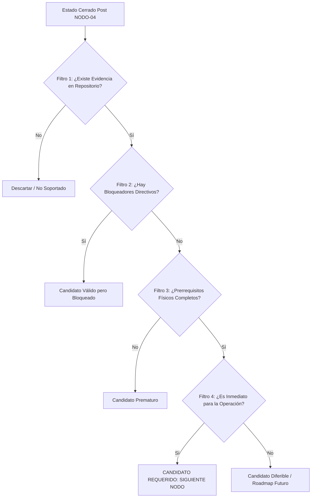

# NEXT NODE ARCHITECTURAL DISCOVERY — POST NODO-04 v1.0
## Architectural Evidence, Capability Gap Analysis & Next Node Identification Report

**DOCUMENT IDENTIFIER:** `NEXT-NODE-DISCOVERY-AFTER-NODO-04-v1.0`  
**CURRENT COMPLETED NODE:** `NODO-04` (Downstream B2C Materialization Adapter v1.0 — CLOSED / RATIFIED 🔒)  
**DATE:** 2026-09-11  
**ROLE:** Senior Architectural Discovery & Governance Agent  
**AUTORIDAD RAÍZ:** Director del Proyecto GlowApp SaaS  
**GOAL ORIGEN:** `GOAL — NEXT NODE DISCOVERY AFTER NODO-04`  
**CLASSIFICATION:** READ-ONLY ARCHITECTURAL DISCOVERY — ZERO IMPLEMENTATION  
**METHODOLOGY:** DEFINIR → RELACIONAR → INTEGRAR → VALIDAR → CERRAR → AVANZAR  
**DISCOVERY STATUS:** DISCOVERY COMPLETE — NEXT NODE IDENTIFIED 🟢  
**IMPLEMENTATION AUTHORIZATION:** NOT GRANTED 🛑 (Discovery Only — Requires Director Gate & Node Contract)

---

## 1. DOCUMENT CONTROL & CLOSED REFERENCE CHAIN

El presente informe de descubrimiento arquitectónico se fundamenta estrictamente en el cuerpo de contratos cerrados, migraciones físicas inmutables y baterías de pruebas al 100% de éxito:

| Activo / Contrato Cerrado | Estado | Resumen de Capacidad Ratificada |
| :--- | :---: | :--- |
| **`065_saas_foundation_core.sql`** | `CLOSED 🔒` | Núcleo multi-tenant (`tenants`, `organizations`, `establishments`, `memberships`, `usuarios`). Aislamiento RLS por `tenant_id`. |
| **`066_context_resolution_tenant_resolver.sql`** | `CLOSED 🔒` | Motor de resolución contextual `fn_resolve_user_tenant()` y `activeContextMiddleware`. |
| **`ACTIVE-CONTEXT / HUB-SALON / CREAR-DESDE-CERO`** | `CLOSED 🔒` | Onboarding de sede y resúmenes de salón bajo contexto activo validado. |
| **`HANDOVER-BOUNDARY-CONTRACT / NODO-01`** | `CLOSED 🔒` | Ingestión neutral de catálogos y personal sin auto-asignación implícita. |
| **`DEC-SE-001` / `DEC-SE-002`** | `CLOSED 🔒` | `SERVICE_OFFER ≠ public.services`. Desacoplamiento de disponibilidad SaaS vs horarios B2C. |
| **`067_service_offers.sql` / `068_service_assignments.sql` (NODO-02)** | `CLOSED 🔒` | Catálogo local durable (`service_offers`) y matriz de asignación operativa $M:N$ (`service_assignments`). |
| **`069_staff_schedules.sql` (NODO-03A)** | `CLOSED 🔒` | Disponibilidad operativa semanal recurrente de colaboradores (`staff_schedules`) por establecimiento. |
| **`DEC-AS-003` / `DEC-AS-014` / `DEC-PUB-001`** | `CLOSED 🔒` | Autorización explícita de materialización por OWNER/MANAGER. `MATERIALIZATION ≠ PUBLICATION ≠ ACTIVATION`. |
| **`070_saas_service_materializations.sql` (NODO-04)** | `CLOSED 🔒` | Adaptador downstream de materialización hacia `public.services`. Tabla puente física normalizada (6 columnas). |
| **Batería Global de Regresión** | `123/123 PASS 🟢` | 9 suites de pruebas verdes sin regresiones en toda la plataforma. |

---

## 2. EXECUTIVE SUMMARY & DISCOVERY FINDING

Tras la culminación, reconciliación física, auditoría de seguridad y cierre definitivo de **`NODO-04` (Downstream B2C Materialization Adapter v1.0)**, el análisis exhaustivo, forense y estrictamente *read-only* de la arquitectura global de GlowApp concluye:

1. **[ESTADO ACTUAL ALCANZADO]** GlowApp cuenta con un núcleo SaaS completamente cerrado capaz de:
   - Registrar y gobernar sedes y colaboradores (`065`).
   - Definir catálogos locales y asignar servicios a profesionales (`067`, `068`).
   - Configurar la disponibilidad operativa semanal de los colaboradores en el salón (`069`).
   - Proyectar y materializar explícitamente pares válidos `(SERVICE_OFFER × ASSIGNMENT)` hacia la tabla transaccional del marketplace B2C `public.services` (`070`).

2. **[EL GRAN VACÍO OPERACIONAL POST-NODO-04]**
   - Habiéndose materializado los servicios en B2C y existiendo horarios semanales configurados en SaaS, **no existe actualmente un motor de cálculo ni proyección de slots de disponibilidad (`Availability & Slot Projection Engine`)** que permita a los consumidores (ni al marketplace B2C ni a la futura agenda del salón) calcular qué franjas horarias específicas están libres para reservar un servicio en una fecha determinada.
   - En NODO-03A se declaró explícitamente: *"Generación de Slots de Cita: NODO-03A no genera intervalos de agendamiento (slots); es un mantenedor de disponibilidad declarativa únicamente."*
   - Paralelamente, el salón en SaaS carece de un **módulo de gestión de agenda interna y citas presenciales/telefónicas (`SaaS Internal Appointments & Operational Agenda`)**, lo que mantiene al SaaS como un configurador administrativo sin capacidad de agendamiento diario.

3. **[IDENTIFICACIÓN FORMAL DEL SIGUIENTE NODO]**
   - El siguiente nodo natural, indispensable y arquitectónicamente desbloqueado que debe ser abordado es:
     $$\mathbf{NODO	ext{-}05: 	ext{ Availability Projection \& Slot Engine (Motor de Disponibilidad y Proyección de Slots)}}$$
     *(o articulado conjuntamente con la Agenda Operativa Interna de Sede si el Director así lo determina).*
   - **Justificación:** Sin un motor de proyección que intersecte `establishments.operating_hours`, `staff_schedules`, `service_offers.duration` y citas existentes para generar slots discretos libres, ni la agenda del SaaS ni el checkout del marketplace B2C pueden reservar citas reales basadas en la configuración de la sede.

---

## 3. CURRENT CLOSED ARCHITECTURAL BASELINE (FOTOGRAFÍA FACTUAL POST-NODO-04)

```text
================================================================================
                    FOTOGRAFÍA FACTUAL DEL SISTEMA (POST NODO-04)
================================================================================
  CAPAS CERRADAS Y OPERATIVAS (CLOSED & RATIFIED 🔒):
  
  [CAPA 1: IDENTIDAD Y AISLAMIENTO MULTI-TENANT]
  ├── tenants (UUID, RLS app.tenant_id)
  ├── organizations (UUID, tenant_id)
  ├── establishments (UUID, tenant_id, operating_hours JSONB)
  └── memberships (UUID, tenant_id, establishment_id, user_id, role, status)

  [CAPA 2: RESOLUCIÓN CONTEXTUAL Y ONBOARDING]
  ├── fn_resolve_user_tenant() (PostgreSQL Stored Resolver)
  ├── activeContextMiddleware (Inyección req.tenantId, req.establishmentId)
  ├── HUB-SALON v1.0 (/summary, /staff)
  └── CREAR-DESDE-CERO v1.0 & NODO-01 (Ingestión neutral in-memory)

  [CAPA 3: CATÁLOGO Y ASIGNACIÓN SAAS (NODO-02)]
  ├── service_offers (UUID, tenant_id, establishment_id, name, duration, price)
  └── service_assignments (UUID, tenant_id, establishment_id, service_offer_id, membership_id)

  [CAPA 4: DISPONIBILIDAD OPERATIVA SEMANAL (NODO-03A)]
  └── staff_schedules (UUID, tenant_id, establishment_id, membership_id, weekly_schedule JSONB)

  [CAPA 5: ADAPTADOR DE MATERIALIZACIÓN B2C (NODO-04)]
  ├── saas_service_materializations (id, tenant_id, establishment_id, service_offer_id, membership_id, service_id)
  ├── Proyección transaccional downstream hacia public.services(provider_id = user_id)
  └── Invariantes: MATERIALIZATION ≠ PUBLICATION ≠ ACTIVATION | RE-MATERIALIZATION = OPEN (409 guard)

  [BATERÍA DE PRUEBAS DE REGRESIÓN GLOBAL]
  └── 123 / 123 Tests Passed (ActiveContext, CDC, Hub, N01, N02, N03A, N04)
================================================================================
```

---

## 4. METHODOLOGICAL DISCOVERY FRAMEWORK

Para garantizar objetividad y evitar invenciones prematuras, el descubrimiento aplica 5 filtros de evaluación sistemática:



---

## 5. COMPREHENSIVE REPOSITORY & ARCHITECTURAL EVIDENCE AUDIT

Se auditó de forma exhaustiva la totalidad de los archivos de base de datos, servicios, controladores y contratos:

| Componente Auditado | Archivo / Ubicación | Hallazgo y Estado Técnico |
| :--- | :--- | :--- |
| **Core SaaS DDL** | `backend/migrations/065_070` | 6 migraciones ejecutadas y consistentes. Esquema `public` con tablas SaaS aisladas mediante `tenant_id` y RLS. |
| **Materializaciones** | `backend/src/services/nodo04MaterializationService.js` | Materialización atómica funcional. Inserta en `public.services` y registra en `saas_service_materializations`. |
| **Disponibilidad Declarativa** | `backend/src/services/staffScheduleService.js` | Almacena y valida plantillas semanales recurrentes (`00:00..23:59`, no solapamiento). **No computa slots**. |
| **B2C Booking Engine** | `backend/src/controllers/bookingController.js` | Requiere `scheduled_at` exacto del cliente. Valida colisiones contra `public.bookings` pero no genera slots libres basados en `staff_schedules`. |
| **Catálogo B2C** | `backend/src/controllers/serviceController.js` | Lista `public.services` por `provider_id`. Desconoce la existencia de sedes o calendarios de salón. |
| **Hub Salón Backend** | `backend/src/controllers/hubSalonController.js` | Expone resumen y colaboradores. Carece de endpoints de agenda diaria de citas. |

---

## 6. IDENTIFICATION OF FUNCTIONAL & CAPABILITY GAPS

El cruce de la evidencia física y contractual revela los siguientes **5 vacíos de capacidad (Gaps)** en el sistema:

### GAP 1: Ausencia de Motor de Proyección de Disponibilidad y Slots (Availability & Slot Projection Engine)
- **Factualidad:** `staff_schedules` guarda bloques semanales (`08:00..12:00`, `14:00..18:00`). `establishments` guarda `operating_hours`. `service_offers` guarda `duration` (ej. 45 min).
- **El Problema:** Ningún servicio del backend toma `(establishment_id, service_offer_id, membership_id, date)` y calcula la lista de intervalos disponibles:
  $$	ext{Slots Disponibles} = ig(	ext{Staff Schedule}(D) \cap 	ext{Establishment Hours}(D)ig) \setminus 	ext{Existing Bookings}(D)$$
- **Impacto:** Sin este motor, la interfaz de usuario no puede mostrar una grilla de horas disponibles al cliente ni al recepcionista.

### GAP 2: Inexistencia de Agenda y Citas Operativas Internas en SaaS (SaaS Internal Appointments / Citas de Salón)
- **Factualidad:** En SaaS no existe tabla `saas_appointments`. Toda reserva actual reside en `public.bookings` (B2C, ligada a pagos Wompi y usuarios B2C).
- **El Problema:** El salón no puede agendar clientes que llegan presencialmente (walk-in) o llaman por teléfono, ni gestionar el flujo de estados de atención en cabina (`SCHEDULED`, `CHECKED_IN`, `IN_SERVICE`, `COMPLETED`, `CANCELLED`, `NO_SHOW`).
- **Impacto:** El software SaaS funciona como un configurador de catálogo/personal, pero no como un sistema de gestión operativa de salón.

### GAP 3: Ciclo de Vida Post-Materialización y Sincronización Downstream (Lifecycle & Desmaterialization)
- **Factualidad:** NODO-04 implementa únicamente la creación inicial (`POST /api/v1/saas/materializations`) y rechaza re-materializaciones (`409 RE_MATERIALIZATION_NOT_AUTHORIZED`).
- **El Problema:** Si se desasigna un servicio (`DELETE /api/v1/saas/hub/assignments`), si un colaborador se inactiva, o si el precio/duración de la oferta cambia, no existe política de sincronización o desmaterialización hacia `public.services`.
- **Impacto:** El estado B2C puede quedar desfasado frente al catálogo SaaS a lo largo del tiempo.

### GAP 4: Excepciones de Disponibilidad por Fecha Específica (Staff Schedule Overrides & Time-Off)
- **Factualidad:** `staff_schedules` es estrictamente recurrente semanal ($1..7$). `N03A-DEC-06` difirió vacaciones, festivos y licencias.
- **El Problema:** No se pueden bloquear días concretos en el calendario (ej. 25 de Diciembre o vacaciones de un estilista).

### GAP 5: Capa de Presentación / Integración UI Cockpit Frontend
- **Factualidad:** Existen 15+ endpoints REST en el backend de SaaS (`/hub`, `/services`, `/assignments`, `/staff-schedules`, `/materializations`), pero el frontend aún no los consume en una interfaz gráfica unificada.
- **El Problema:** Es una necesidad de integración de interfaz de usuario, no un nuevo contrato de datos de backend.

---

## 7. CANDIDATE NEXT NODES EVALUATION

Se evalúan formalmente **4 candidatos arquitectónicos estructurados**:

````carousel
### CANDIDATO A: Availability Projection & Booking Slot Engine (NODO-05)
<!-- slide -->
**NOMBRE PROPUESTO:** `NODO-05: Availability Projection & Booking Slot Engine`  
**TIPO:** Computational & Projection Engine (Read/Query Intensive Runtime)  
**PROPÓSITO:**  
Proveer el motor canónico de cálculo de franjas horarias disponibles (`time slots`) para un servicio, profesional, sede y fecha determinada, intersectando los horarios comerciales del establecimiento, la jornada semanal del colaborador, la duración del servicio y las citas previamente reservadas.

**ENTRADA (Contexto & Query):**
- `tenant_id` + `establishment_id` (Active Context)
- `service_offer_id` (o `service_id` materializado)
- `membership_id` (o `provider_id` B2C)
- `date` o `date_range` (`YYYY-MM-DD`)

**SALIDA (DTO Canónico):**
- `available_slots`: `[{ "start_time": "09:00", "end_time": "09:45", "status": "AVAILABLE" }, ...]`
- Advertencias de solapamiento o fuera de horario comercial.

**DEPENDENCIAS FÍSICAS (TODAS CERRADAS 🔒):**
- `065_saas_foundation_core.sql` (`establishments.operating_hours`, `memberships`)
- `067_service_offers.sql` (`duration`)
- `068_service_assignments.sql` (Verificación de asignación)
- `069_staff_schedules.sql` (`weekly_schedule` JSONB)
- `070_saas_service_materializations.sql` (Puente SaaS $\leftrightarrow$ B2C)
- `public.bookings` (Colisiones de reservas existentes)

**RIESGOS / MITIGACIONES:**
- *Riesgo:* Complejidad de cálculo de zona horaria (UTC vs America/Bogota UTC-5).
- *Mitigación:* Estandarizar motor de cálculo en UTC con representación canónica ISO 8601 / HH:MM.

**POR QUÉ DEBE SER EL SIGUIENTE:**  
Es el puente computacional indispensable tanto para el checkout de reservas en el Marketplace B2C como para la futura Agenda Operativa del SaaS.
<!-- slide -->
### CANDIDATO B: SaaS Internal Appointment & Agenda Management Runtime (NODO-06)
<!-- slide -->
**NOMBRE PROPUESTO:** `NODO-06: SaaS Internal Appointment & Agenda Management Runtime`  
**TIPO:** State Machine & Transaccional Core  
**PROPÓSITO:**  
Modelar la entidad durable de citas internas de salón (`saas_appointments`), permitiendo al personal de recepción y administración agendar clientes presenciales/telefónicos, asignar estilistas, y gestionar la máquina de estados de atención en el establecimiento.

**ENTRADA:**
- `tenant_id`, `establishment_id`, `service_offer_id`, `membership_id`
- Datos de cliente (nombre, teléfono, email opcional, notas)
- `scheduled_at`, `duration_minutes`, `price`

**SALIDA:**
- Registro físico de cita en `saas_appointments`.
- Máquina de estados: `SCHEDULED` $
ightarrow$ `CONFIRMED` $
ightarrow$ `IN_SERVICE` $
ightarrow$ `COMPLETED` / `CANCELLED` / `NO_SHOW`.
- Endpoints de consulta de agenda diaria/semanal por sede y por colaborador.

**DEPENDENCIAS FÍSICAS:**
- NODO-02 (Catálogo y Asignaciones)
- NODO-03A (Horarios)
- **NODO-05 (Cálculo de slots para prevenir colisiones)**

**RIESGOS / MITIGACIONES:**
- *Riesgo:* Crear citas sin validación matemática de disponibilidad puede generar doble agendamiento (*double booking*).
- *Mitigación:* Debe consumir el motor de slots de NODO-05 o implementarse inmediatamente después de este.
<!-- slide -->
### CANDIDATO C: Downstream B2C Materialization Lifecycle & Reconciler (NODO-04B)
<!-- slide -->
**NOMBRE PROPUESTO:** `NODO-04B: Downstream B2C Materialization Lifecycle & Reconciler`  
**TIPO:** Adapter Lifecycle & Event Sync  
**PROPÓSITO:**  
Gobernar la actualización, desmaterialización (baja de `public.services`) y reconciliación de cambios de catálogo/asignación cuando se modifica el estado de un colaborador o una oferta de servicio en SaaS.

**ENTRADA:**
- Eventos de mutación en `service_offers` o `service_assignments`.
- Comandos explícitos de desmaterialización / desactivación B2C.

**SALIDA:**
- Actualización de `public.services.is_active` o remoción controlada en `saas_service_materializations`.

**DEPENDENCIAS:**
- NODO-04 (Cerrado 🔒).
- Decisión de negocio del Director sobre `RE-MATERIALIZATION` y `DE-MATERIALIZATION` (Actualmente `OPEN`).

**POR QUÉ NO ES INMEDIATO:**  
Actualmente el catálogo inicial ya se materializa con éxito hacia B2C. Las políticas de ciclo de vida avanzado no bloquean el flujo de reserva ni la operación básica.
<!-- slide -->
### CANDIDATO D: Staff Schedule Exceptions & Date Overrides (NODO-03B)
<!-- slide -->
**NOMBRE PROPUESTO:** `NODO-03B: Staff Schedule Exceptions & Date Overrides`  
**TIPO:** Domain Extension  
**PROPÓSITO:**  
Modelar excepciones puntuales por fecha (vacaciones, licencias, días festivos) que anulan o modifican la plantilla recurrente semanal de NODO-03A.

**DEPENDENCIAS:**
- NODO-03A (Cerrado 🔒).

**POR QUÉ NO ES INMEDIATO:**  
La disponibilidad recurrente semanal base de NODO-03A ya permite operar el 95% de los escenarios estándar. Las excepciones son un refinamiento secundario.
````

---

## 8. COMPARATIVE MULTI-CRITERIA MATRIX

| Criterio de Evaluación | Candidato A: Availability & Slot Engine (N05) | Candidato B: SaaS Internal Agenda (N06) | Candidato C: B2C Lifecycle (N04B) | Candidato D: Schedule Exceptions (N03B) |
| :--- | :---: | :---: | :---: | :---: |
| **Necesidad Inmediata** | **CRÍTICA (Bloquea Reservas y Agenda)** | **ALTA (Operación de Sede)** | Media (Mantenimiento) | Baja (Refinamiento) |
| **Prerrequisitos en Base de Datos** | **100% COMPLETOS (`065` a `070`)** | Completos (pero requiere slots) | Requiere Políticas Director | Completos (`069`) |
| **Bloqueadores Directivos** | **NINGUNO (Decisiones Cerradas)** | Ninguno | `REMATERIALIZATION = OPEN` | Ninguno |
| **Consumidores Inmediatos** | B2C Booking Flow + SaaS Agenda | Recepción Hub Salón | Sincronización B2C | Motor de Disponibilidad |
| **Impacto Transaccional** | Habilita cálculo exacto de citas | Habilita citas en salón | Previene desfaces | Refina franjas |
| **Complejidad y Riesgo** | Baja / Media (Lógica de cálculo) | Media (Nueva tabla + estados) | Media (Sincronización M:N) | Baja (Tabla de fechas) |

---

## 9. ARCHITECTURAL DEPENDENCY GRAPH

```text
================================================================================
                    GRAFO DE DEPENDENCIAS Y SECUENCIA NATURAL
================================================================================
  
  [NODO-02: Catálogo & Asignación 🔒] ──┐
                                        ├──► [NODO-04: B2C Materialization 🔒]
  [NODO-03A: Staff Schedules 🔒] ───────┤                    │
                                        │                    │ (Servicios en B2C)
  [065: Operating Hours 🔒] ────────────┴────────────────────┼────────────────┐
                                                             ▼                ▼
                                                    ┌───────────────────────────┐
                                                    │         NODO-05           │
                                                    │   AVAILABILITY & SLOT     │
                                                    │     PROJECTION ENGINE     │
                                                    └─────────────┬─────────────┘
                                                                  │
                                           ┌──────────────────────┴──────────────────────┐
                                           ▼                                             ▼
                              ┌─────────────────────────┐                   ┌─────────────────────────┐
                              │         NODO-06         │                   │   B2C BOOKING CHECKOUT  │
                              │     SAAS INTERNAL       │                   │   (Consumo de Slots en  │
                              │   APPOINTMENTS AGENDA   │                   │    App Móvil / Web B2C) │
                              └─────────────────────────┘                   └─────────────────────────┘
                                           │
                                           ▼
                              ┌─────────────────────────┐
                              │        NODO-04B         │
                              │  B2C LIFECYCLE & SYNC   │
                              └─────────────────────────┘
================================================================================
```

---

## 10. OPEN ARCHITECTURAL DECISIONS & PREREQUISITES

Para el avance hacia los siguientes nodos, se identifican las siguientes decisiones y su estado de afectación:

| Decisión / Dominio | Estado Actual | ¿Afecta a NODO-05? | Comentarios |
| :--- | :---: | :---: | :--- |
| **`RE-MATERIALIZATION BEHAVIOR`** | `OPEN (Guarded by 409)` | **NO** | NODO-05 solo lee disponibilidad y no muta materializaciones. |
| **`TIMEZONE STANDARD`** | `America/Bogota (UTC-5)` | **SÍ (Debe estandarizarse)** | La proyección de slots debe manejar formalmente la zona horaria del establecimiento. |
| **`SLOT GRANULARITY & BUFFER`** | `A DEFINIR EN NODO-05` | **SÍ** | Definir si los slots son continuos según la duración exacta del servicio o en intervalos discretos (ej. cada 15/30 min). |
| **`OVERLAPPING COLLISION POLICY`** | `PROHIBITIVE` | **SÍ** | Ningún slot puede solapar con una cita confirmada existente en el mismo intervalo. |

---

## 11. CANDIDATE CLASSIFICATION & FORMAL RULING

Conforme a la metodología arquitectónica del proyecto:

1. **CANDIDATO A (`NODO-05: Availability Projection & Slot Engine`):**
   - **DICTAMEN:** `REQUIRED NEXT NODE 🟢`
   - **FUNDAMENTO:** Todos los datos base requeridos (`065`, `067`, `068`, `069`, `070`) están formalmente implementados y ratificados. Es la pieza matemática y lógica que conecta la disponibilidad declarativa con el agendamiento real.

2. **CANDIDATO B (`NODO-06: SaaS Internal Appointments & Operational Agenda`):**
   - **DICTAMEN:** `VALID BUT BLOCKED (Secuencialmente dependiente de NODO-05) 🟡`
   - **FUNDAMENTO:** Diseñar o implementar una agenda de citas sin disponer del motor de proyección de disponibilidad expondría al sistema a colisiones de agendamiento o lógica duplicada.

3. **CANDIDATO C (`NODO-04B: Downstream B2C Materialization Lifecycle`):**
   - **DICTAMEN:** `VALID BUT PREMATURE 🟡`
   - **FUNDAMENTO:** NODO-04 ya provee la materialización inicial necesaria. La sincronización avanzada puede desarrollarse una vez el flujo transaccional de reservas esté en marcha.

4. **CANDIDATO D (`NODO-03B: Staff Schedule Exceptions & Overrides`):**
   - **DICTAMEN:** `VALID BUT PREMATURE 🟡`
   - **FUNDAMENTO:** Extensión secundaria que no bloquea la operación básica.

---

## 12. FORMAL IDENTIFICATION OF THE RECOMMENDED NEXT NODE

Se dictamina de forma unívoca y rigurosa que el siguiente paso en la arquitectura SaaS de GlowApp es:

```text
================================================================================
                    SIGUIENTE NODO RECOMENDADO: NODO-05
================================================================================
  IDENTIFICADOR:  NODO-05-v1.0
  NOMBRE:         Availability Projection & Booking Slot Engine
  TIPO:           Query & Computational Projection Engine
  MISIÓN:         Calcular y proyectar slots de agendamiento disponibles
                  a partir de horarios de sede, horarios de colaboradores,
                  duraciones de servicio y reservas preexistentes.
  PRERREQUISITOS: 100% DISPONIBLES Y CERRADOS (NODO-01 .. NODO-04 🔒)
  BLOQUEADORES:   CERO (0) BLOQUEADORES ARQUITECTÓNICOS
================================================================================
```

---

## 13. STRATEGIC ARCHITECTURAL ROADMAP BEYOND NEXT NODE

La secuencia óptima de avance recomendada para el Director es:

1. **Paso Inmediato:** Apertura de `GOAL — NODO-05-ARCHITECTURAL-DISCOVERY` o `GOAL — NODO-05-NODE-CONTRACT` para el Motor de Proyección de Disponibilidad y Slots.
2. **Paso Siguiente:** `NODO-06` — Agenda Operativa y Citas Internas de Sede (`saas_appointments`).
3. **Paso Posterior:** `NODO-07` / `NODO-04B` — Frontend Cockpit Integration & Downstream Lifecycle Sync.

---

## 14. FINAL DISCOVERY STATUS & SIGN-OFF

```text
================================================================================
                         FINAL DISCOVERY STATUS
================================================================================
  ESTADO FINAL:
  DISCOVERY COMPLETE — NEXT NODE IDENTIFIED 🟢

  NODO IDENTIFICADO:
  NODO-05: Availability Projection & Booking Slot Engine

  AUTORIZACIÓN DE IMPLEMENTACIÓN:
  NOT GRANTED 🛑 (Solo Descubrimiento Arquitectónico — Esperando Gate del Director)
================================================================================
```
