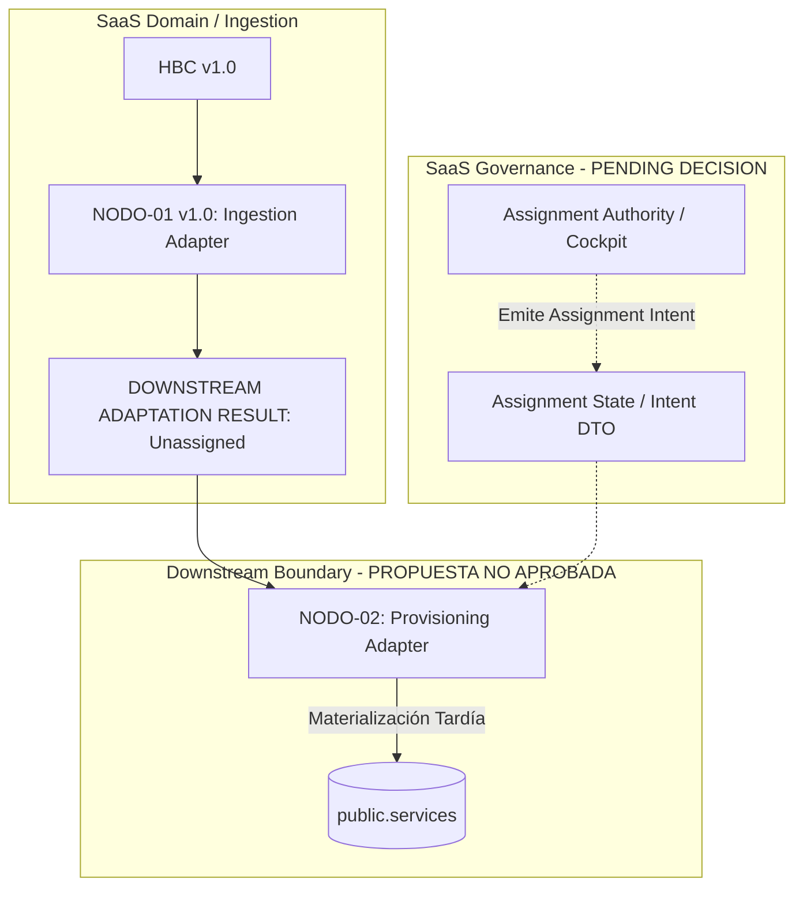

# NODO-02-ARCHITECTURAL-DEFINITION-GATE-v1.0
## Puerta de Definición y Reconciliación Arquitectónica: Nodo 02

**GATE_ID:** `N02-001-R1`  
**ESTADO:** `COMPLETED — PENDING DIRECTOR APPROVAL 🟡`  
**TIPO:** Architectural Reconciliation & Definition Gate  
**AUTORIDAD:** Director del Proyecto GlowApp SaaS  
**GOAL ORIGEN:** N02-001 / N02-001-R1  
**CONTRATOS RELACIONADOS:** `HANDOVER-BOUNDARY-CONTRACT-v1.0.md`, `NODO-01-NODE-CONTRACT-v1.0.md`, `DEC-SE-001-DECISION-RECORD-v1.0.md`, `DEC-SE-002-DECISION-RECORD-v1.0.md`, `HANDOVER-SEMANTIC-RECONCILIATION-v1.0.md`  
**FECHA DE RECONCILIACIÓN:** 2026-09-10  

---

## 1. EXECUTIVE FINDING & EPISTEMOLOGICAL TAXONOMY

Para evitar la cristalización prematura de hipótesis como arquitectura, este análisis clasifica estrictamente cada afirmación bajo la taxonomía:

* **[FACT]**: Hecho comprobable físicamente en el repositorio (código, migraciones, pruebas).
* **[EVIDENCE]**: Deducción directa respaldada por contratos y decisiones formalmente aprobados.
* **[INFERENCE]**: Razonamiento lógico sobre el comportamiento esperado del sistema, aún no formalizado.
* **[PROPOSAL]**: Hipótesis o recomendación de diseño pendiente de aprobación del Director (`PROPUESTA — NO APROBADA`).

### Hallazgo Principal:
1. **[FACT]** `NODO-01-v1.0` entrega en memoria un DTO `DOWNSTREAM ADAPTATION RESULT` que contiene ofertas de servicio con `assignment: { status: "NOT_ESTABLISHED", provider_id: null }`.
2. **[EVIDENCE]** `DEC-SE-001` prohíbe taxativamente la creación de filas en `public.services` mientras no exista una asignación explícita.
3. **[FACT]** No existe actualmente en el repositorio ninguna entidad, tabla o relación formal denominada `establishment_service` (`UNDEFINED / FUTURE DESIGN`).
4. **[EVIDENCE]** `CAPABILITY` (`assigned_categories`) no constituye una asignación (`HR-DEC-001`). No existe regla aprobada de auto-asignación (`NO RULE DEFINED`).
5. **[FACT]** No existe actualmente en el repositorio ninguna regla, rol o endpoint que defina la **Autoridad de Asignación** (`ASSIGNMENT AUTHORITY = UNDEFINED`).
6. **[INFERENCE]** `ASSIGNMENT` y `MATERIALIZATION` son dos responsabilidades conceptualmente distintas que no deben fusionarse ni asumirse como automáticas.
7. **[DICTAMEN]** No se cuenta todavía con suficiente definición de autoridad y persistencia para redactar un Node Contract cerrado para `NODO-02`. Se requiere resolución previa de decisiones por parte del Director (**`B — ARCHITECTURAL DECISION REQUIRED`**).

---

## 2. ESTADO DE ENTRADA ARQUITECTÓNICA (ACTIVOS CERRADOS E INMUTABLES)

```text
================================================================================
ESTADO DE ENTRADA ARQUITECTÓNICA:

SaaS Core (Tenancy, Organizations, Establishments, Memberships) -> CLOSED 🔒
Active Context Module (Header Transport, Server-side Authority) -> CLOSED 🔒
Hub Salón (Summary, Staff List, Verification Gate)              -> CLOSED 🔒
Crear Desde Cero (16-Attribute Context Package, State Engine)   -> CLOSED 🔒
Handover Boundary Contract v1.0 (DTO Inmutable, RLS Isolation)  -> CLOSED 🔒
NODO-01 v1.0 (Handover Ingestion & Downstream Adapter)          -> CLOSED 🔒
DEC-SE-001 (Instanciación Tardía / Asignación Explícita)        -> APPROVED / CLOSED 🔒
DEC-SE-002 (Autonomía Desacoplada de Ubicación y Horarios)      -> APPROVED / CLOSED 🔒
Pre-Nodo 01 (PostgreSQL public schema, Bookings, Services)      -> IMMUTABLE 🔒
================================================================================
```

---

## 3. ANÁLISIS DE LA SALIDA DE NODO 01

### 3.1. Qué Contiene Físicamente `DOWNSTREAM ADAPTATION RESULT` [FACT]:
* `target_establishment_descriptor`: Metadatos del establecimiento (`establishment_id`, `name`, `city`, `address`, `location_coordinates`, `operating_hours`).
* `eligible_professionals`: Array de identidades `[{ user_id, membership_id, role, capabilities }]`.
* `candidate_service_descriptors`: Array de servicios `[{ catalog_service_id, name, duration_minutes, base_price, currency, assignment: { status: "NOT_ESTABLISHED", provider_id: null } }]`.
* `contract_state`: Literal formal `"HBC_INGESTED_UNASSIGNED"`.

### 3.2. Qué NO Contiene Físicamente [FACT]:
* **No contiene `provider_id`** en los descriptores de servicio.
* **No contiene vínculos operacionales** entre un `user_id` específico y un `catalog_service_id`.
* **No contiene efectos de persistencia** en `public.services`, `public.perfiles_prestador`, ni `public.usuarios`.

### 3.3. Por Qué No Puede Persistir Directamente en B2C [EVIDENCE]:
* **Restricción Física:** `public.services` impone `provider_id NOT NULL REFERENCES usuarios(id)`.
* **Restricción Contractual:** `DEC-SE-001` declara inválido generar un `provider_id` artificial o sintético para forzar la persistencia en `public.services`.

---

## 4. RECONCILIACIÓN SEMÁNTICA: IDENTIDAD vs CAPACIDAD vs ASIGNACIÓN

Queda formalmente ratificado el axioma de separación de dominios:

$$\text{IDENTITY} \neq \text{ROLE} \neq \text{CAPABILITY} \neq \text{ASSIGNMENT} \neq \text{B2C PROVIDER}$$

```text
+-------------------+--------------------------------------------------------------+------------------------------------+
| Dimensión         | Definición Factual                                           | Representación Física Actual       |
+-------------------+--------------------------------------------------------------+------------------------------------+
| IDENTITY          | Sujeto único de autenticación global en el sistema.          | public.usuarios.id (UUID)          |
| ROLE              | Nivel de autorización contextual dentro del tenant SaaS.     | organization_memberships.role      |
| CAPABILITY        | Aptitud temática declarada por el colaborador en la sede.   | people_initial_roles.capabilities  |
| ASSIGNMENT        | Vínculo operacional explícito colaborador <-> servicio.     | NO DEFINIDO EN BD / MEMORIA        |
| B2C PROVIDER      | Cuenta habilitada en el marketplace para recibir reservas.   | public.perfiles_prestador          |
+-------------------+--------------------------------------------------------------+------------------------------------+
```

### Relación `capability` $\rightarrow$ `service_offer` [EVIDENCE]:
* Conforme a `HANDOVER-SEMANTIC-RECONCILIATION-v1.0.md` (`HR-DEC-001` y `HR-DEC-002`), la coincidencia temática entre `capabilities` y la categoría de un servicio **NO constituye una asignación**.
* No existe en el repositorio ninguna regla de auto-asignación ni pre-asignación derivada.
* **Estado Actual:** `NO RULE DEFINED`.

---

## 5. ANÁLISIS DE AUTORIDAD DE ASIGNACIÓN (ASSIGNMENT AUTHORITY)

Se separa rigurosamente **SaaS Access Authority** de **Assignment Authority**:

* **SaaS Access Authority [FACT]:** El middleware `activeContextMiddleware` valida que un usuario con membresía `OWNER` o `MANAGER` pueda interactuar con los endpoints del establecimiento.
* **Assignment Authority [EVIDENCE]:** La facultad formal y las reglas de negocio para vincular operativamente a un colaborador con una oferta comercial no están especificadas en ningún contrato ni código.

### Respuestas a las Preguntas de Auditoría:
* **Q1: ¿Existe actualmente una autoridad formalmente definida para crear assignment?**  
  **NO.** No hay especificación formal que asigne dicha facultad a un rol exclusivo.
* **Q2: ¿Existe una regla aprobada sobre quién puede asignar?**  
  **NO.** No existe regla de negocio formalizada (`OWNER` únicamente, `MANAGER`, o auto-asignación por el profesional).
* **Q3: ¿Existe un endpoint, servicio o persistencia existente que represente assignment?**  
  **NO.** No existe tabla, columna ni endpoint en backend para capturar o guardar una asignación.
* **Q4: Conclusión de Autoridad:**  
  $$\text{ASSIGNMENT AUTHORITY} = \text{UNDEFINED}$$

---

## 6. ANÁLISIS CONCEPTUAL: ASIGNACIÓN vs MATERIALIZACIÓN

* **Principio [EVIDENCE]:** `ASSIGNMENT` (acto de gobernanza/planificación) y `MATERIALIZATION` (acto técnico de inserción en el esquema transaccional B2C) son conceptualmente independientes.

### Respuestas a las Preguntas Fundamentales:
* **Q5: ¿Qué información mínima representa una asignación? [INFERENCE]**
  - Identificador de la oferta de servicio del establecimiento.
  - Identidad del colaborador (`user_id` / `membership_id`).
  - Autoridad que emite la asignación (`assigned_by`, `timestamp`).
* **Q6: ¿Qué información mínima necesita la materialización B2C (`public.services`)? [FACT]**
  - `provider_id` (`usuarios.id`).
  - `nombre` (varchar).
  - `precio` (numeric).
  - `duracion_minutos` (integer).
  - `is_active` (boolean).
* **Q7: ¿Puede existir una asignación válida sin materialización inmediata? [EVIDENCE]**
  - **SÍ.** Bajo `DEC-SE-001` (Instanciación Tardía), un establecimiento puede tener colaboradores asignados internamente en su catálogo sin que la oferta esté publicada o activa para reservas B2C en `public.services`.
* **Restricción `DEC-SE-001` [EVIDENCE]:**
  $$\text{service\_offer} + \text{assignment NOT\_ESTABLISHED} \implies \text{NO public.services}$$
  **No se debe asumir como automatismo que:**
  $$\text{assignment} \implies \text{public.services (INMEDIATO)}$$

---

## 7. ANÁLISIS DE PERSISTENCIA E IDEMPOTENCIA FÍSICA

### 7.1. Estatus del Concepto `establishment_service`:
* El concepto `establishment_service` **NO existe** en las migraciones `001` a `066`.
* No existen tablas puente de asignación en la base de datos.
* **Clasificación:** `UNDEFINED / FUTURE DESIGN`. No puede ser utilizado como premisa para definir `NODO-02`.

### 7.2. Necesidad de Persistencia de Asignación:
* ¿Requiere la asignación una tabla persistente en el esquema `public` o en un esquema SaaS, o puede transferirse como comando efímero?
* **Estado Actual:** `PERSISTENCE REQUIREMENT = UNDEFINED`. Requiere decisión del Director.

---

## 8. REEVALUACIÓN RIGUROSA DE OPCIONES ARQUITECTÓNICAS

Se reevalúan las 5 opciones bajo evidencia física y contractual:

```text
+-------------------------------------------------------------------------------+-----------------------------------+
| Opción Arquitectónica                                                         | Grado de Soporte en Evidencia     |
+-------------------------------------------------------------------------------+-----------------------------------+
| OPTION A: Assignment pertenece a una capacidad existente de SaaS             | NOT SUPPORTED                     |
|           (Hub Salón lista personal pero no captura asignaciones a servicios) |                                   |
|                                                                               |                                   |
| OPTION B: Assignment requiere un nuevo nodo SaaS                              | PARTIALLY SUPPORTED               |
|           (Es una responsabilidad B2B pura, pero carece de definición)        |                                   |
|                                                                               |                                   |
| OPTION C: Materialization requiere un nodo downstream independiente           | PARTIALLY SUPPORTED               |
|           (La inserción en public.services es desacoplable, pero requiere     |                                   |
|            input de asignación que hoy no existe)                             |                                   |
|                                                                               |                                   |
| OPTION D: Assignment y Materialization requieren separación explícita         | SUPPORTED BY EVIDENCE             |
|           (Conceptualmente demostrado por DEC-SE-001 y modelo semántico)      |                                   |
|                                                                               |                                   |
| OPTION E: No existe evidencia suficiente para seleccionar arquitectura        | SUPPORTED BY EVIDENCE             |
|           (Faltan decisiones de autoridad, persistencia y triggering)         |                                   |
+-------------------------------------------------------------------------------+-----------------------------------+
```

---

## 9. TOPOLOGÍA CONCEPTUAL PROPUESTA (PROPUESTA — NO APROBADA)

La siguiente topología describe la hipótesis de trabajo recomendada, sujeta a la aprobación de las decisiones pendientes:



---

## 10. DECISIONES REQUERIDAS DEL DIRECTOR (DIRECTOR DECISION REQUIRED)

Antes de proceder a la redacción del Node Contract de `NODO-02`, se requiere someter a consideración del Director las siguientes decisiones arquitectónicas:

1. **`DEC-AS-001` (Assignment Authority & Workflow):**  
   ¿Quién tiene la autoridad de asignar un colaborador a un servicio dentro del establecimiento (`OWNER`, `MANAGER`, o mutuo acuerdo)? ¿Dónde se captura esta intención?
2. **`DEC-AS-002` (Assignment Persistence Model):**  
   ¿Debe la asignación persistirse en una tabla relacional SaaS (e.g. `service_assignments`) o tratarse como un payload/comando transportado directamente hacia la materialización?
3. **`DEC-AS-003` (Materialization Triggering Policy):**  
   ¿La materialización en `public.services` ocurre inmediatamente al asignar, o se realiza bajo demanda/publicación explícita del catálogo?

---

## 11. CONCLUSIÓN Y DICTAMEN DE LA PUERTA (GATE OUTCOME)

```text
================================================================================
GATE READINESS ASSESSMENT:

1. ¿Se comprende el problema de continuidad tras NODO-01?       -> SÍ ✅
2. ¿Se eliminaron hipótesis no aprobadas (establishment_service)?-> SÍ ✅
3. ¿Se ratificó la separación IDENTITY ≠ CAPABILITY ≠ ASSIGNMENT?-> SÍ ✅
4. ¿Está definida la Autoridad de Asignación?                   -> NO ❌ (UNDEFINED)
5. ¿Está definido el Modelo de Persistencia de Asignación?      -> NO ❌ (UNDEFINED)
6. ¿Se puede redactar un Node Contract v1.0 sin estas bases?    -> NO ❌ (Prematuro)

DICTAMEN FINAL:
B — ARCHITECTURAL DECISION REQUIRED 🟡
================================================================================
```

---
*Fin del documento reconciliado de Puerta de Definición Arquitectónica de Nodo 02.*
