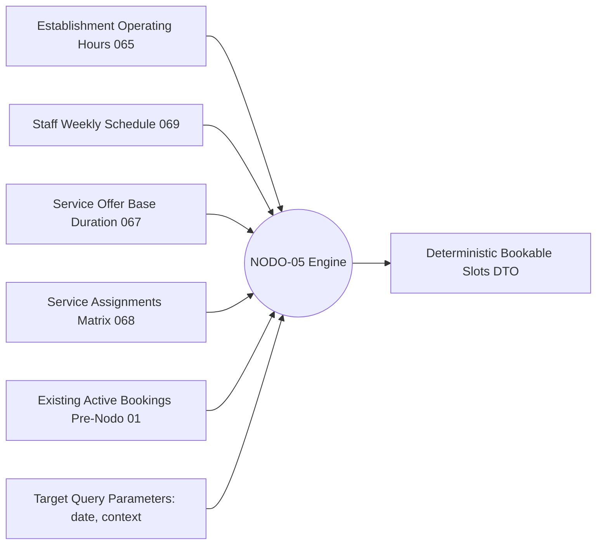

# NODO-05 — ARCHITECTURAL DEFINITION & DISCOVERY REPORT v1.0
## Availability Projection & Booking Slot Engine — Capability Boundary & Semantic Definition

**DOCUMENT IDENTIFIER:** `NODO-05-ARCHITECTURAL-DEFINITION-DISCOVERY-v1.0`  
**CURRENT STATUS:** `DEFINITION READY FOR DIRECTOR GATE 🟡`  
**DATE:** 2026-09-11  
**ROLE:** Senior Architectural Discovery & Governance Agent  
**AUTORIDAD RAÍZ:** Director del Proyecto GlowApp SaaS  
**GOAL ORIGEN:** `GOAL — NODO-05 ARCHITECTURAL DEFINITION & DISCOVERY`  
**CLASSIFICATION:** READ-ONLY ARCHITECTURAL DEFINITION — ZERO CODE / ZERO DDL  
**METHODOLOGY:** DEFINIR → RELACIONAR → INTEGRAR → VALIDAR → CERRAR → AVANZAR  
**IMPLEMENTATION AUTHORIZATION:** NOT GRANTED 🛑 (Discovery & Architectural Definition Only)

---

## 1. EXECUTIVE SUMMARY

El presente documento define formalmente la frontera de capacidad, el modelo semántico, las responsabilidades computacionales y las dependencias de **`NODO-05` (Availability Projection & Booking Slot Engine)**, tras la ratificación y cierre de NODO-04.

### Hallazgos Principales:
1. **[NATURALEZA DEL NODO: MOTOR DE CÁLCULO EN MEMORIA]** `NODO-05` no es una tabla de base de datos ni una entidad persistente. Es una **capacidad computacional de solo lectura (`Read-Only Projection Engine`)** que transforma la disponibilidad declarativa semanal (`staff_schedules`), los horarios de sede (`establishments.operating_hours`), las duraciones de servicio (`service_offers.base_duration`), la matriz de asignación (`service_assignments`) y las colisiones de reservas (`public.bookings`) en una secuencia determinística de **franjas horarias reservables (*bookable slots*)**.
2. **[CERO NUEVAS TABLAS FÍSICAS]** La persistencia de slots generaría bloat masivo de base de datos e inconsistencias de concurrencia. La proyección de slots es transitoria y computada *on-demand*.
3. **[AISLAMIENTO ESTRICTO DE FRONTERAS]** `NODO-05` **NO es el dueño de la agenda de citas, NO es el motor de checkout, NO crea reservas, NO muta `public.services` y NO es un adaptador B2C**. Su única responsabilidad es el **cálculo puro de disponibilidad temporal**.
4. **[EVALUACIÓN DE DEPENDENCIAS DE RESERVAS]** La lectura de citas existentes para restar intervalos ocupados (*busy intervals*) es una dependencia de lectura no bloqueante, que consume las reservas registradas en `public.bookings` (Pre-Nodo 01) sin mutar el esquema B2C.
5. **[DICTAMEN]** `DEFINITION READY FOR DIRECTOR GATE 🟡`. El alcance y las fronteras están completamente delimitados y listos para la revisión y decisiones de política del Director.

---

## 2. CURRENT ARCHITECTURAL BASELINE

El sistema cuenta con 6 capas físicas cerradas y ratificadas:

```text
================================================================================
                     LÍNEA BASE FÍSICA Y CONTRACTUAL CERRADA
================================================================================
  [065] FOUNDATION CORE:          tenants, organizations, establishments,
                                  memberships, usuarios (RLS app.tenant_id 🔒)
  [066] CONTEXT RESOLUTION:       fn_resolve_user_tenant() + activeContextMiddleware 🔒
  [067] SERVICE OFFERS (N02):     service_offers (base_duration, base_price) 🔒
  [068] SERVICE ASSIGNMENTS (N02):service_assignments (M:N Offer <-> Membership) 🔒
  [069] STAFF SCHEDULES (N03A):   staff_schedules (Weekly recurring intervals 1..7) 🔒
  [070] B2C MATERIALIZATION (N04):saas_service_materializations (Bridge to public.services) 🔒
  [REGRESIÓN GLOBAL]:             123 / 123 Tests Green (0 fallos) 🟢
================================================================================
```

### Axiomas de Separación Invariante:
$$\text{ESTABLISHMENT OPERATING HOURS} \neq \text{STAFF SCHEDULE}$$
$$\text{STAFF SCHEDULE} \neq \text{AVAILABILITY PROJECTION}$$
$$\text{AVAILABILITY PROJECTION} \neq \text{BOOKABLE SLOT}$$
$$\text{BOOKABLE SLOT} \neq \text{APPOINTMENT / BOOKING}$$
$$\text{ASSIGNMENT} \neq \text{MATERIALIZATION} \neq \text{PUBLICATION} \neq \text{ACTIVATION}$$

---

## 3. NODO-05 PROBLEM STATEMENT

### La Brecha Identificada:
`NODO-03A` cumplió su contrato cerrando el registro declarativo de horarios semanales (`staff_schedules`: bloques de tiempo recurrentes por día de la semana). Sin embargo, una plantilla semanal declarativa (ej. *"Lunes 08:00 a 12:00"*) no responde directamente a las preguntas operativas del negocio:
- *¿A qué horas exactas puedo agendar un corte de cabello de 45 minutos el próximo martes 15 de Septiembre?*
- *¿Está disponible la estilista María a las 10:15 considerando que ya tiene una cita de 10:00 a 11:00?*
- *¿Qué estilistas de la sede pueden atender un tinte de 120 minutos entre las 14:00 y las 18:00?*

**Definición del Problema:** Se requiere un motor determinístico y sin efectos secundarios (*pure function / query runtime*) que proyecte la disponibilidad declarativa en franjas horarias concretas (*slots*), intersectando todas las restricciones contextuales del establecimiento, personal, servicio y reservas existentes.

---

## 4. EVIDENCE (EVIDENCIA REVISADA EN REPOSITORIO)

| Activo Auditado | Tipo | Evidencia Factual y Estado Actual |
| :--- | :--- | :--- |
| [`/backend/migrations/065_saas_foundation_core.sql`](file:///C:/Users/Compu%20casa/.gemini/antigravity/worktrees/beauty-app/database_audit_read_only/backend/migrations/065_saas_foundation_core.sql) | DDL Físico | `establishments.operating_hours JSONB` almacena la jornada comercial general de la sede. |
| [`/backend/migrations/067_service_offers.sql`](file:///C:/Users/Compu%20casa/.gemini/antigravity/worktrees/beauty-app/database_audit_read_only/backend/migrations/067_service_offers.sql) | DDL Físico | `service_offers.base_duration INTEGER NOT NULL CHECK (base_duration > 0)` define la duración del servicio en minutos. |
| [`/backend/migrations/068_service_assignments.sql`](file:///C:/Users/Compu%20casa/.gemini/antigravity/worktrees/beauty-app/database_audit_read_only/backend/migrations/068_service_assignments.sql) | DDL Físico | `service_assignments` vincula $M:N$ qué `membership_id` puede ejecutar qué `service_offer_id`. |
| [`/backend/migrations/069_staff_schedules.sql`](file:///C:/Users/Compu%20casa/.gemini/antigravity/worktrees/beauty-app/database_audit_read_only/backend/migrations/069_staff_schedules.sql) | DDL Físico | `staff_schedules` define intervalos `(day_of_week 1..7, start_time TIME, end_time TIME)` para cada miembro en una sede. |
| [`/backend/src/controllers/bookingController.js`](file:///C:/Users/Compu%20casa/.gemini/antigravity/worktrees/beauty-app/database_audit_read_only/backend/src/controllers/bookingController.js) | B2C Runtime | `public.bookings` almacena `scheduled_at TIMESTAMPTZ`, `provider_id INTEGER`, `estado` y valida colisiones mediante timestamp arithmetic. |
| [`/ncp/NODO-03A-NODE-CONTRACT-v1.0.md`](file:///C:/Users/Compu%20casa/.gemini/antigravity/worktrees/beauty-app/database_audit_read_only/ncp/NODO-03A-NODE-CONTRACT-v1.0.md) | Contrato | Cláusula 6.1: *"Generación de Slots de Cita: NODO-03A no genera intervalos de agendamiento (slots); es un mantenedor de disponibilidad declarativa únicamente."* |
| [`/ncp/DEC-SE-002-DECISION-RECORD-v1.0.md`](file:///C:/Users/Compu%20casa/.gemini/antigravity/worktrees/beauty-app/database_audit_read_only/ncp/DEC-SE-002-DECISION-RECORD-v1.0.md) | Decisión | Desacoplamiento total entre horarios de personal en SaaS y `perfiles_prestador.horarios_atencion` B2C. |

---

## 5. CONCEPTUAL INPUTS (ENTRADAS CONCEPTUALES MÍNIMAS)

Para computar una proyección de disponibilidad determinística, `NODO-05` requiere estrictamente los siguientes **6 insumos** (ni más ni menos):



1. **Contexto Activo del Establecimiento:** `tenant_id` + `establishment_id` (Inyectado por `activeContextMiddleware`).
2. **Fecha Objetivo (`target_date`):** Fecha del calendario gregoriano (`YYYY-MM-DD`). A partir de esta fecha se deriva el día de la semana canónico ($1 = \text{Lunes} \dots 7 = \text{Domingo}$).
3. **Oferta de Servicio (`service_offer_id`):** Identificador de la oferta cuyo `base_duration` rige la longitud del slot.
4. **Matriz de Asignación (`service_assignments`):** Filtra los `membership_id` elegibles y activos para ejecutar dicha oferta.
5. **Horarios Declarados (`staff_schedules`):** Bloques de tiempo semanales de los colaboradores asignados para el día correspondiente.
6. **Intervalos Ocupados (*Busy Intervals*):** Citas existentes en `public.bookings` con `estado != 'CANCELADA'` asociadas al `user_id` de los colaboradores para la fecha consultada.

---

## 6. COMPUTATIONAL RESPONSIBILITY (RESPONSABILIDAD COMPUTACIONAL)

`NODO-05` es una función determinística de transformación $f(\text{Inputs}) \to \text{Slots}$:

$$\text{Disponibilidad Bruta}(M, D) = \text{StaffSchedule}(M, D)$$
$$\text{Ventana Válida}(M, D) = \text{Disponibilidad Bruta}(M, D) \cap \text{EstablishmentHours}(D) \quad \text{(Sujeto a Política)}$$
$$\text{Espacio Libre}(M, D) = \text{Ventana Válida}(M, D) \setminus \bigcup \text{ExistingBookings}(M, D)$$
$$\text{Slots Reservables}(M, D, \text{Duration}) = \{ [t_{\text{start}}, t_{\text{start}} + \text{Duration}] \subseteq \text{Espacio Libre}(M, D) \mid t_{\text{start}} \in \text{Grid}(\text{Granularity}) \}$$

### Responsabilidades Incluidas:
1. Validar que la fecha sea válida y no pertenezca al pasado (configurable por timezone de sede).
2. Obtener los colaboradores asignados al servicio en la sede activa.
3. Cargar la jornada declarada de dichos colaboradores para el día de la semana.
4. Cargar las citas confirmadas/pendientes existentes en el rango de tiempo.
5. Discretizar los bloques continuos libres en candidatos de inicio (*start times*) que permitan albergar la duración completa del servicio.
6. Retornar el DTO estructurado de slots.

---

## 7. SLOT SEMANTICS (SEMÁNTICA DEL SLOT EN GLOWAPP)

> [!IMPORTANT]
> **Definición Canónica:** En GlowApp, un **`Slot` (Franja de Agendamiento)** es un **intervalo de tiempo candidato continuo $[t_{\text{start}}, t_{\text{end}}]$** con:
> 1. $t_{\text{end}} = t_{\text{start}} + \text{service\_offers.base\_duration}$.
> 2. $t_{\text{start}}$ alineado con la granularidad temporal configurada.
> 3. Ausencia total de colisión con citas preexistentes.
> 4. Inclusión completa dentro del horario laboral del colaborador asignado.

Un `Slot` **NO** es una cita, **NO** bloquea la base de datos y **NO** garantiza exclusividad hasta que una transacción de reserva lo confirme.

---

## 8. AVAILABILITY SEMANTICS (ESTADOS DE DISPONIBILIDAD)

A nivel de proyección, `NODO-05` clasifica el resultado en 3 estados conceptuales:

```text
+-----------------------+-----------------------------------------------------------------------+
| Estado de Respuesta   | Significado Semántico                                                 |
+-----------------------+-----------------------------------------------------------------------+
| AVAILABLE_SLOTS       | Existen 1..N franjas donde el servicio puede ejecutarse completamente. |
| NO_SLOTS_AVAILABLE    | El colaborador trabaja pero su jornada está 100% copada de citas.     |
| STAFF_NOT_WORKING     | El colaborador no tiene jornada configurada o no labora ese día.      |
| NO_STAFF_ASSIGNED     | La oferta de servicio no tiene ningún colaborador asignado en la sede.|
+-----------------------+-----------------------------------------------------------------------+
```

---

## 9. MULTI-PROFESSIONAL / ASSIGNMENT SEMANTICS

Dado que una `service_offer` puede tener $0..N$ profesionales asignados en `service_assignments`:

1. **Modo Específico (Targeted Query):**
   - El cliente/usuario solicita: `(service_offer_id, membership_id, date)`.
   - `NODO-05` proyecta exclusivamente los slots de ese colaborador específico.
   - Si el `membership_id` no está asignado al servicio: Retorna error de validación `422 UNASSIGNED_PROFESSIONAL`.

2. **Modo Agregado / "Cualquier Profesional" (Aggregated Query):**
   - El cliente/usuario solicita: `(service_offer_id, date)` sin especificar colaborador.
   - `NODO-05` calcula los slots para **todos los colaboradores activos asignados** y fusiona (*union*) los slots de inicio disponibles.
   - Cada slot resultante incluye la lista de `available_memberships: [UUID, ...]` capacitados para atender en esa franja.

3. **Caso de Cero Asignaciones (Zero Assignments):**
   - Si una oferta no tiene asignaciones en `service_assignments`, `NODO-05` retorna inmediatamente `slots: []` con estado `NO_STAFF_ASSIGNED`.

---

## 10. TEMPORAL RULES (REGLAS TEMPORALES Y GRANULARIDAD)

### 10.1. Zona Horaria Canónica
- Las sedes operan primariamente en Colombia (`America/Bogota` — UTC-5).
- Los cálculos temporales internos deben realizarse en tiempo local del establecimiento o normalizados con offset UTC explícito, evitando desfases por horario de verano o conversiones ambiguas.

### 10.2. Granularidad Temporal / Step Increment (`step_minutes`)
- **Situación Actual:** La duración del servicio es exacta (`base_duration`, ej. 45 min).
- **Decisión Requerida:** ¿A qué intervalos de inicio se generan los slots?
  - *Opción A (Grid Fijo):* Slots cada 15 o 30 minutos (ej. 08:00, 08:15, 08:30, 08:45...).
  - *Opción B (Continuo / Back-to-Back):* Slots inmediatamente contiguos según duración.
- **Recomendación:** Soportar un `step_minutes` estándar (ej. 15 o 30 minutos, por defecto 15 min).

### 10.3. Desborde de Horario de Sede (*Establishment Hours Mismatch*)
- En NODO-03A, cuando el horario del colaborador excede los horarios de sede, se emite una advertencia no bloqueante (`out_of_operating_hours_warning`).
- **Decisión Requerida para NODO-05:**
  - *Opción 1 (Intersección Estricta):* Los slots solo se generan dentro del horario comercial de la sede ($\text{Staff} \cap \text{Establishment}$).
  - *Opción 2 (Staff Prevalente):* Se generan slots según el horario del colaborador, incluyendo un flag `out_of_operating_hours: true` en el slot si cae fuera de la sede.
- **Recomendación:** Opción 1 como comportamiento por defecto, con Opción 2 habilitada si el establecimiento permite atención fuera de jornada comercial.

---

## 11. BOOKING / RESERVATION DEPENDENCY ANALYSIS

### Evaluación Especial de Dependencia de Reservas:

> [!IMPORTANT]
> **Pregunta Crítica:** ¿Requiere NODO-05 conocer las citas existentes para calcular la disponibilidad?
> **Respuesta:** **SÍ (para disponibilidad neta/efectiva).** Sin consultar las citas existentes, el sistema retornaría slots ya reservados, causando colisiones operativas inmediatas.

### Estado Factual de la Dependencia:
1. **Fuente de Datos Existente:** `public.bookings` (Pre-Nodo 01) almacena `scheduled_at`, `provider_id` y `service_id` (del cual se obtiene la duración).
2. **Vinculación de Identidad:** `memberships.user_id ≡ usuarios.id ≡ perfiles_prestador.id` (Aprobado y Ratificado en Director Gate N04).
3. **Naturaleza de la Interacción:** `NODO-05` realiza exclusivamente consultas `SELECT` de lectura contra `public.bookings`.
4. **¿Bloquea NODO-05?:** **NO BLOQUEA.** La consulta de solo lectura de intervalos ocupados no muta `public.bookings`, no crea reservas y no redefine la semántica de pagos o checkout.

---

## 12. B2C BOUNDARY ANALYSIS (PRESERVACIÓN DE FRONTERAS)

`NODO-05` respeta estrictamente las fronteras de dominio:

```text
+------------------------------------+---------------------------------------------------+
| Dominio SaaS (NODO-05)            | Dominio B2C Marketplace (Pre-Nodo 01)             |
+------------------------------------+---------------------------------------------------+
| • Consume service_offers           | • NO escribe en public.services                   |
| • Consume staff_schedules          | • NO crea filas en perfiles_prestador             |
| • Consume service_assignments      | • NO procesa pagos ni webhooks Wompi              |
| • Aislado por tenant_id            | • NO muta public.bookings                         |
| • Retorna DTO de cálculo en memoria| • Solo lee citas para restar intervalos ocupados  |
+------------------------------------+---------------------------------------------------+
```

---

## 13. PERSISTENCE ANALYSIS (CERO TABLAS NUEVAS)

Se evalúa la necesidad de persistencia física:

1. **¿Se necesita una tabla `slots` o `availability_cache`?**
   - **DICTAMEN: NO.**
   - **Justificación:** Los slots son efímeros y altamente dinámicos. Persistir slots en disco causaría:
     - Millones de filas generadas para fechas futuras.
     - Problemas de invalidación masiva ante cualquier cambio de horario o cita.
     - Condiciones de carrera al consultar slots obsoletos.
2. **Conclusión:** `NODO-05` requiere **CERO migraciones SQL, CERO tablas nuevas y CERO columnas**.

---

## 14. CONSUMERS (CONSUMIDORES EVIDENCIADOS)

Existen exactamente **2 consumidores reales** para la capacidad de NODO-05:

1. **Consumidor Interno SaaS (Hub Salón & Futura Agenda):**
   - Pantalla de reservas de salón (walk-ins / llamadas telefónicas) que consulta qué colaboradores tienen horas libres para agendar a un cliente en recepción.
2. **Consumidor Downstream B2C (Marketplace Booking Flow):**
   - Pantalla de selección de fecha/hora en la aplicación móvil de GlowApp que consulta los slots disponibles de un prestador en su sede antes de invocar `POST /api/bookings`.

---

## 15. NON-SCOPE (FUERA DE ALCANCE EXPLÍCITO)

Para evitar desbordamiento conceptual (*scope creep*), queda explícitamente fuera de NODO-05:

1. **Creación / Mutación de Reservas:** `NODO-05` no crea citas ni modifica estados de reservas.
2. **Bloqueo / Hold Temporal de Slots (*Slot Reservation Lock*):** No implementa carritos de compra ni bloqueos temporales de 10 minutos (diferido a checkout/booking engine).
3. **Gestión de Agenda Interna:** No define la entidad `saas_appointments` (corresponde a NODO-06).
4. **Excepciones / Vacaciones:** No implementa bloqueos por fecha específica (diferido a NODO-03B).
5. **Precios Dinámicos / Promociones:** No altera precios en función del horario.
6. **Interfaz de Usuario (Frontend):** No implementa componentes gráficos ni vistas de calendario.

---

## 16. ARCHITECTURAL GAPS (VACÍOS A DECIDIR POR EL DIRECTOR)

Se identifican formalmente **3 vacíos de decisión** que deben ser sancionados por el Director:

```text
+--------+------------------------------------+---------------------------------------------------------------+
| Gap ID | Tema de Decisión                   | Opciones para el Director                                     |
+--------+------------------------------------+---------------------------------------------------------------+
| GAP-01 | Step Increment (Granularidad)      | A: Fijo 15 min | B: Fijo 30 min | C: Configurable por Sede     |
+--------+------------------------------------+---------------------------------------------------------------+
| GAP-02 | Boundary Intersect Policy          | A: Strict (Staff ∩ Sede) | B: Staff Prevalent con Warning      |
+--------+------------------------------------+---------------------------------------------------------------+
| GAP-03 | Booking Source Interface           | A: Direct SELECT en public.bookings | B: Internal Booking Adapter|
+--------+------------------------------------+---------------------------------------------------------------+
```

---

## 17. DECISIONS REQUIRED (MATRIZ DE DECISIONES REQUERIDAS)

Para formular el `Implementation Contract` de NODO-05, el Director debe ratificar:

1. **DEC-N05-01 (Naturaleza del Motor):** Ratificar que NODO-05 es un motor computacional en memoria de solo lectura (Cero tablas DDL).
2. **DEC-N05-02 (Granularidad de Slots):** Sancionar el incremento temporal por defecto (Recomendado: 15 minutos).
3. **DEC-N05-03 (Política de Intersección de Horarios):** Sancionar si los slots fuera del horario comercial de la sede son truncados o marcados con advertencia.
4. **DEC-N05-04 (Consumo de Citas B2C):** Autorizar la consulta de solo lectura a `public.bookings` para el cálculo de intervalos ocupados.

---

## 18. PROVISIONAL NODO-05 DEFINITION (DEFINICIÓN PROVISIONAL DEL NODO)

```text
================================================================================
                    DEFINICIÓN PROVISIONAL DE NODO-05 v1.0
================================================================================
  NODE_ID:        NODO-05-v1.0
  NOMBRE:         Availability Projection & Booking Slot Engine
  TIPO:           Read-Only Computational Projection Engine (In-Memory Runtime)
  
  CONTRATO DE ENTRADA:
  - Header/Context: req.tenantId, req.establishmentId
  - Query Params:   service_offer_id (UUID, Required)
                    target_date (YYYY-MM-DD, Required)
                    membership_id (UUID, Optional)
                    step_minutes (Integer, Optional, Default: 15)

  CONTRATO DE SALIDA:
  - target_date:                 YYYY-MM-DD
  - day_of_week:                 1..7
  - service_offer_id:            UUID
  - service_duration_minutes:    Integer
  - step_minutes:                Integer
  - total_slots_found:           Integer
  - slots: [
      {
        "start_time": "09:00",
        "end_time": "09:45",
        "available_memberships": [ "uuid-1", "uuid-2" ]
      }
    ]

  EFECTOS SECUNDARIOS: CERO (0) MUTACIONES EN BASE DE DATOS
================================================================================
```

---

## 19. ARCHITECTURAL RISKS & MITIGATIONS

1. **Riesgo de Timezone Drifting:**
   - *Riesgo:* Desfase de horas entre el cliente, el servidor Node.js y PostgreSQL.
   - *Mitigación:* Forzar evaluación de fechas con hora local del establecimiento (`America/Bogota`) y parseo explícito `HH:MM`.
2. **Riesgo de Rendimiento en Consultas Agregadas:**
   - *Riesgo:* Consultar disponibilidad de 20 colaboradores para un mes completo podría generar consultas lentas.
   - *Mitigación:* Acotar las consultas de proyección a un rango máximo de días (ej. 1 a 7 días por request).

---

## 20. DIRECTOR GATE

```text
================================================================================
                         DIRECTOR GATE STATUS
================================================================================
  ESTADO DEL DOCUMENTO:
  DEFINITION READY FOR DIRECTOR GATE 🟡

  DICTAMEN TÉCNICO:
  1. NODO-05 queda claramente delimitado como un motor de proyección en memoria.
  2. No requiere nuevas tablas ni migraciones físicas.
  3. No invade la creación de reservas, agenda de salón ni pagos B2C.
  4. Queda listo para la emisión de las Decisiones del Director y posterior
     elaboración del Implementation Contract.

  AUTORIZACIÓN DE IMPLEMENTACIÓN:
  NOT GRANTED 🛑 (Esperando pronunciamiento del Director)
================================================================================
```
