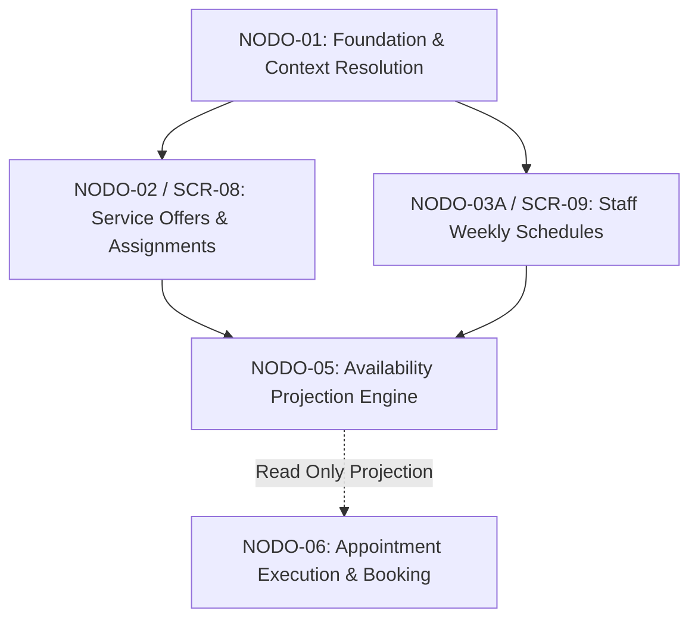

# NODO-05 — NODE CONTRACT
## GLOWAPP SaaS: AVAILABILITY PROJECTION & BOOKING SLOT ENGINE
**ESTADO:** CLOSED / IMMUTABLE 🔒  
**CONTRATO:** v1.0 — RATIFIED  
**IMPLEMENTACIÓN:** CONFORMANT  
**AUDITORÍA:** PASS (25/25 Casos Conformes, Zero Findings)  
**FECHA DE CIERRE:** 2026-09-12  
**AUTORIDAD DE CIERRE:** Director del Proyecto GlowApp SaaS (GO-07.1)  

---

## 1. PROPÓSITO DEL NODO
`NODO-05` es el motor computacional determinista, en memoria y estrictamente de sólo lectura (`READ-ONLY`) del SaaS.  
Responde con precisión matemática y temporal a la consulta:
> *"¿Cuáles intervalos de tiempo (slots) son reservables para una oferta de servicio específica en una sede determinada para una fecha calendario específica en la zona horaria America/Bogota?"*

### Límites de Responsabilidad Inviolables:
- **NO persiste** slots ni reservas en la base de datos (Zero Database Mutation).
- **NO genera** identificadores primarios (UUIDs) para slots proyectados.
- **NO muta** citas en `saas_appointments` ni reservas en `public.bookings`.
- **NO administra** catálogos ni asignaciones (responsabilidad exclusiva de `NODO-02`).
- **NO administra** horarios semanales del personal (responsabilidad exclusiva de `NODO-03A`).
- **NO publica** servicios hacia el canal B2C (responsabilidad exclusiva de `NODO-04`).

---

## 2. POSICIÓN EN LA CADENA SAAS Y LÍMITES DE DOMINIO



- **N01 (SaaS Foundation & Context):** Provee aislamiento multi-tenant, establecimientos y resolución de membresías vía `x-active-membership-id`.
- **N02 (Service Offers & Assignments):** Define ofertas (`service_offers`) y asignación de colaboradores (`service_assignments`).
- **N03A (Staff Schedules):** Define la disponibilidad operativa semanal recurrente (`staff_schedules`).
- **N05 (Availability Projection):** Proyecta en tiempo real los slots reservables cruzando oferta, horarios de sede, horarios de personal y ocupaciones.
- **N06 (Appointment Execution):** Consume la disponibilidad proyectada para materializar citas transaccionales en `saas_appointments`.

---

## 3. DEPENDENCIAS AGUAS ARRIBA Y POLÍTICA DE INMUTABILIDAD

| Dependencia | Tabla / Artefacto Físico | Campos Consumidos | Política de Modificación |
| :--- | :--- | :--- | :--- |
| **Active Context** | `req.headers['x-active-membership-id']` | `active_membership_id`, `tenant_id`, `establishment_id`, `role` | **INMUTABLE** |
| **Sede (N01)** | `establishments` | `id`, `tenant_id`, `operating_hours` (JSONB) | **INMUTABLE** |
| **Oferta (N02)** | `service_offers` | `id`, `tenant_id`, `establishment_id`, `name`, `base_duration` | **INMUTABLE** |
| **Asignación (N02)** | `service_assignments` | `id`, `tenant_id`, `establishment_id`, `service_offer_id`, `membership_id` | **INMUTABLE** |
| **Horario Staff (N03A)** | `staff_schedules` | `membership_id`, `establishment_id`, `day_of_week`, `start_time`, `end_time` | **INMUTABLE** |
| **Membresías (N01)** | `memberships` | `id`, `tenant_id`, `establishment_id`, `user_id`, `role`, `status` | **INMUTABLE** |
| **Ocupación B2C** | `public.bookings` | `provider_id` (= `user_id`), `scheduled_at`, `estado` != 'CANCELADA' | **INMUTABLE** |
| **Ocupación SaaS (N06)** | `saas_appointments` | `membership_id`, `scheduled_at`, `end_time`, `status` NOT IN ('CANCELLED', 'NO_SHOW') | **INMUTABLE** |

---

## 4. CONTRATO DE ACTIVE CONTEXT (RECONCILIACIÓN 1)

`NODO-05` utiliza exclusivamente el mecanismo de contexto activo unificado y cerrado:
- **Header Canónico:** `x-active-membership-id: <UUID>`
- **Middleware:** `activeContextMiddleware` valida token JWT y el header contra la tabla `memberships`.
- **Inyección en Handler:** Inyecta en el objeto `req`:
  - `req.tenantId` (INTEGER)
  - `req.establishmentId` (UUID)
  - `req.membershipId` (UUID)
  - `req.activeContext` (Objeto con metadata completa de membresía y establecimiento).
- **Aislamiento RLS:** Transaccional vía `SELECT set_config('app.tenant_id', $1, true)`.

> [!IMPORTANT]
> Queda terminantemente prohibido introducir cabeceras alternativas como `x-establishment-id` o parámetros manuales de tenant. Toda resolución de sede y tenant es estrictamente derivada de la membresía activa autenticada.

---

## 5. ESTRUCTURA FÍSICA DE ENTIDADES CONSUMIDAS

### 5.1 `service_offers` (Migration 067 — CLOSED)
- `id` (UUID, PK)
- `tenant_id` (INTEGER, FK `tenants`)
- `establishment_id` (UUID, FK `establishments`)
- `name` (VARCHAR(255))
- `description` (TEXT)
- `base_duration` (INTEGER, minutos > 0)
- `base_price` (NUMERIC(12, 2))
- `created_at`, `updated_at` (TIMESTAMPTZ)
*(Nota Forense: No posee columna `is_active`).*

### 5.2 `service_assignments` (Migration 068 — CLOSED)
- `id` (UUID, PK)
- `tenant_id` (INTEGER)
- `establishment_id` (UUID)
- `service_offer_id` (UUID)
- `membership_id` (UUID)
- `created_at` (TIMESTAMPTZ)
*(Nota Forense: No posee columna `is_active`; la existencia de la tupla representa asignación activa).*

### 5.3 `staff_schedules` (Migration 069 — CLOSED)
- `id` (UUID, PK)
- `tenant_id` (INTEGER)
- `establishment_id` (UUID)
- `membership_id` (UUID)
- `day_of_week` (SMALLINT, 1=Lunes .. 7=Domingo)
- `start_time` (TIME WITHOUT TIME ZONE, ej. '09:00:00')
- `end_time` (TIME WITHOUT TIME ZONE, ej. '13:00:00')
- `created_at`, `updated_at` (TIMESTAMPTZ)
*(Nota Forense: Cada bloque horario es un registro independiente. No existen campos `time_ranges` JSON ni `is_active`).*

### 5.4 `establishments` (Migration 065 — CLOSED)
- `id` (UUID, PK)
- `tenant_id` (INTEGER)
- `organization_id` (UUID)
- `name` (VARCHAR(255))
- `operating_hours` (JSONB)
- `is_active` (BOOLEAN)
*(Nota Forense: La tabla física es `establishments`, no `saas_establishments`).*

---

## 6. FUENTES DE OCUPACIÓN Y DETECCIÓN DE COLISIONES (RECONCILIACIÓN 5)

### 6.1 Evidencia Física
1. **Ocupación B2C (`public.bookings`):**
   - Vínculo con personal: `bookings.provider_id` corresponde a `memberships.user_id` (entero).
   - Intervalo: Inicio en `scheduled_at` (TIMESTAMPTZ), fin en `scheduled_at + services.duration_minutes`.
   - Estados bloqueantes: `estado != 'CANCELADA'`.
   - Estados no bloqueantes: `estado = 'CANCELADA'`.
2. **Ocupación SaaS Interna (`saas_appointments` — Migration 071):**
   - Vínculo con personal: `saas_appointments.membership_id` (UUID).
   - Intervalo: `scheduled_at` hasta `end_time` (TIMESTAMPTZ).
   - Estados bloqueantes: `'SCHEDULED'`, `'CONFIRMED'`, `'CHECKED_IN'`, `'IN_SERVICE'`, `'COMPLETED'`.
   - Estados no bloqueantes: `'CANCELLED'`, `'NO_SHOW'`.

### 6.2 Detección de Colisión Semi-Abierta $[t_1, t_2)$
Un slot candidato $[S_{\text{start}}, S_{\text{end}})$ colisiona con una ocupación $[O_{\text{start}}, O_{\text{end}})$ si y sólo si:
$$S_{\text{start}} < O_{\text{end}} \land S_{\text{end}} > O_{\text{start}}$$

### 6.3 Prevención de Doble Conteo
Dado que la colisión se evalúa como la pertenencia del slot a la unión de intervalos ocupados:
$$\text{Ocupado}(m, \text{date}) = \bigcup O_{\text{B2C}}(user\_id) \cup \bigcup O_{\text{SaaS}}(membership\_id)$$
No existe riesgo de doble substracción o penalización, ya que el slot simplemente se descarta si intersecta cualquier intervalo ocupado.

---

## 7. MANEJO DE ZONA HORARIA Y SEMÁNTICA TEMPORAL

- **Zona Horaria Canónica:** `America/Bogota` (UTC-5 fijo, sin cambio de horario de verano / DST).
- **Semántica de Parámetros:**
  - `target_date`: Fecha calendario local en Bogotá (`YYYY-MM-DD`).
  - `day_of_week`: Entero 1..7 (1=Lunes, 7=Domingo) computado en base a `target_date`.
  - `start_time` / `end_time`: Expresados en minutos desde medianoche (0..1440) convertidos a formato local `HH:MM`.
  - **Límites de consulta UTC para ocupaciones:**
    $$\text{UTC\_Start} = \text{target\_date } 00:00:00 -05:00 = 05:00:00\text{Z}$$
    $$\text{UTC\_End} = \text{target\_date } 23:59:59.999 -05:00 = 04:59:59.999\text{Z (+1 día)}$$

---

## 8. MODELO MATEMÁTICO DE DISPONIBILIDAD

Para cada colaborador elegible $m$ asignado a la oferta:
1. **Ventana de Operación:**
   $$W(m, d) = \text{StaffSchedule}(m, d) \cap \text{EstablishmentHours}(e, d)$$
2. **Generación de Slots Candidatos:**
   $$S_k = [t_k, t_k + D) \quad \text{donde } D = \text{service\_offers.base\_duration}$$
   $$t_{k+1} = t_k + \text{step\_minutes} \quad (\text{default } 15 \text{ min})$$
   Condición: $S_k \subseteq W(m, d)$.
3. **Filtrado de Ocupación:**
   $$\text{Slot Válido}(S_k, m) \iff \forall O \in \text{Occupancies}(m, \text{target\_date}): \neg \text{Collision}(S_k, O)$$
4. **Agregación Multi-Profesional:**
   Si $m_1, m_2, \dots, m_j$ tienen disponible el mismo slot $[t_{\text{start}}, t_{\text{end}})$, el slot se agrupa con:
   `available_memberships: ["uuid_1", "uuid_2", ...]` ordenado alfanuméricamente.

---

## 9. CONTRATO CANÓNICO DEL ENDPOINT (DTO)

### 9.1 Endpoint
- **Ruta:** `GET /api/v1/saas/hub/availability/projection`
- **Headers Requeridos:**
  - `Authorization: Bearer <JWT>`
  - `x-active-membership-id: <UUID>`
- **Query Parameters:**
  - `service_offer_id` (UUID, Requerido)
  - `target_date` (String `YYYY-MM-DD`, Requerido)
  - `membership_id` (UUID, Opcional)
  - `step_minutes` (Integer 5..120, Opcional, default: 15)
  - `projection_mode` (`TARGETED` | `AGGREGATED`, Opcional)

### 9.2 Response DTO Canónico (200 OK)
```json
{
  "status": "success",
  "data": {
    "establishment_id": "99999999-9999-9999-9999-999999999999",
    "service_offer_id": "11111111-1111-1111-1111-111111111111",
    "target_date": "2026-03-30",
    "day_of_week": 1,
    "service_duration_minutes": 45,
    "step_minutes": 15,
    "projection_mode": "AGGREGATED",
    "slots": [
      {
        "start_time": "09:00",
        "end_time": "09:45",
        "available_memberships": [
          "22222222-2222-2222-2222-222222222222",
          "33333333-3333-3333-3333-333333333333"
        ]
      },
      {
        "start_time": "09:15",
        "end_time": "10:00",
        "available_memberships": [
          "22222222-2222-2222-2222-222222222222"
        ]
      }
    ]
  }
}
```

---

## 10. MATRIZ DE ERRORES Y CASOS BORDE RECONCILIADOS

| Condición | Código HTTP | Error Code | Comportamiento / Mensaje |
| :--- | :---: | :--- | :--- |
| Header `x-active-membership-id` ausente | `400` | `MISSING_ACTIVE_MEMBERSHIP_HEADER` | Rechazo inmediato por middleware. |
| Header `x-active-membership-id` no es UUID | `400` | `INVALID_MEMBERSHIP_UUID` | Rechazo inmediato por middleware. |
| `service_offer_id` no es UUID | `400` | `INVALID_SERVICE_OFFER_ID` | `service_offer_id debe ser un UUID válido.` |
| `target_date` inválido / malformado | `400` | `INVALID_TARGET_DATE` | `target_date debe tener un formato de fecha válido (YYYY-MM-DD).` |
| `step_minutes` fuera de rango (5..120) | `400` | `INVALID_STEP_MINUTES` | `step_minutes debe ser un entero entre 5 y 120.` |
| `projection_mode` inválido | `400` | `INVALID_PROJECTION_MODE` | `projection_mode debe ser TARGETED o AGGREGATED.` |
| `service_offer_id` inexistente en la sede | `404` | `SERVICE_OFFER_NOT_FOUND` | `La oferta de servicio especificada no existe en la sede activa.` |
| `membership_id` inexistente en la sede (TARGETED) | `404` | `MEMBERSHIP_NOT_FOUND` | `La membresía especificada no existe en la sede activa.` |
| `membership_id` no activa (TARGETED) | `422` | `INACTIVE_MEMBERSHIP` | `La membresía del colaborador no se encuentra activa.` |
| `membership_id` no asignado a la oferta (TARGETED) | `422` | `UNASSIGNED_PROFESSIONAL` | `El colaborador especificado no está asignado a esta oferta de servicio.` |
| Oferta sin colaboradores asignados (AGGREGATED) | `200` | N/A | Retorna `slots: []` (Disponibilidad determinista vacía). |
| Sede cerrada en el día consultado | `200` | N/A | Retorna `slots: []`. |
| Personal sin horario en el día | `200` | N/A | Retorna `slots: []` o excluye al miembro. |
| Ocupación total de la jornada | `200` | N/A | Retorna `slots: []`. |

---

## 11. INMUTABILIDAD Y ZERO PERSISTENCE GUARANTEE

- `NODO-05` no crea tablas, no altera esquemas y no ejecuta operaciones `INSERT`, `UPDATE` o `DELETE`.
- Toda la computación de intersección y colisiones ocurre en memoria durante la ejecución de la consulta.
- Garantía de aislamiento RLS transaccional con `SET LOCAL` (`set_config('app.tenant_id', ..., true)`).

---
**FIN DEL CONTRATO DE NODO-05 (RECONCILIADO)**
