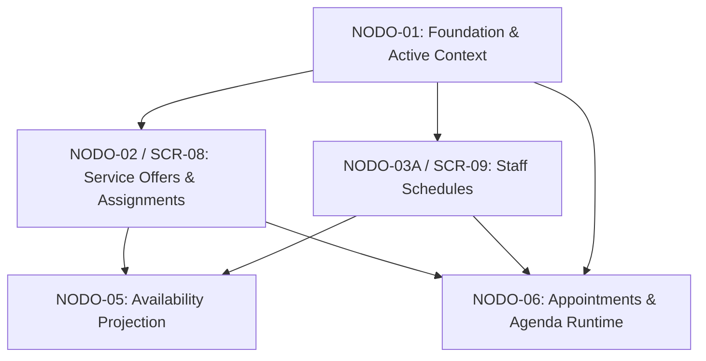
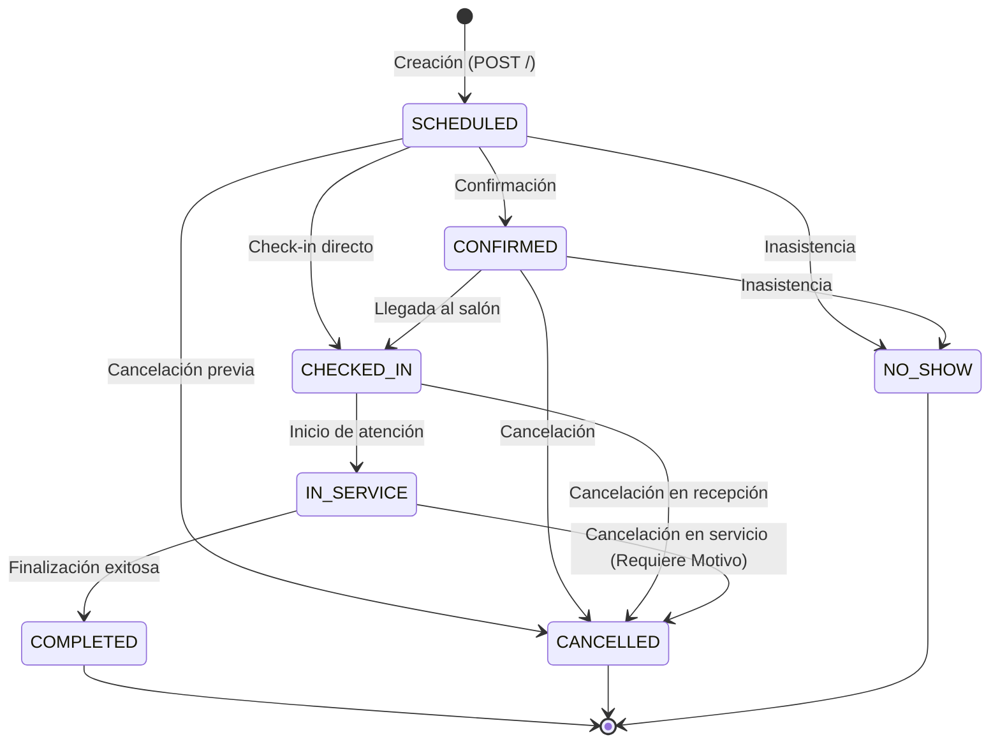

# NODO-06 — NODE CONTRACT v1.0
## GLOWAPP SaaS: APPOINTMENTS & OPERATIONAL AGENDA RUNTIME
**ESTADO:** CLOSED / IMMUTABLE 🔒  
**CONTRATO:** v1.0 — RATIFIED  
**IMPLEMENTACIÓN:** CONFORMANT  
**AUDITORÍA:** PASS (0 BLOCKER, 0 MAJOR, 0 MINOR, 0 OBSERVATIONS)  
**FECHA DE CIERRE:** 2026-09-12  
**AUTORIDAD DE CIERRE:** Director del Proyecto GlowApp SaaS (GO-06.6)  

---

## 1. PURPOSE (PROPÓSITO)

`NODO-06` es la **autoridad transaccional y de persistencia** para la creación, consulta, ciclo de vida operacional y proyección de agenda de citas internas dentro del SaaS de GlowApp.  

### Distinción Fundamental frente a NODO-05:
- **NODO-05 (Availability Projection Engine):** Es un runtime computacional efímero, en memoria y de sólo lectura que responde: *"¿Qué intervalos de tiempo parecen reservables para una oferta?"*. No reserva espacio, no crea locks y sus resultados no garantizan persistencia.
- **NODO-06 (Appointment Runtime):** Es la autoridad final de persistencia y concurrencia que responde: *"¿Qué cita queda efectivamente creada, asegurada contra colisiones y gestionada a través de su ciclo de vida operacional?"*.
- **Independencia Operativa:** NODO-06 **no depende** de invocar al endpoint de NODO-05 para crear citas; valida de forma atómica y directa sus propias invariantes relacionales y de concurrencia en base de datos.

---

## 2. SCOPE (ALCANCE)

### Responsabilidades Permitidas e Incluidas:
1. Creación transaccional de citas (`saas_appointments`) para clientes Registrados e Invitados (Guest).
2. Captura de snapshots inmutables de catálogo (`service_name_snapshot`, `duration_minutes_snapshot`, `price_snapshot`).
3. Validación de asignación activa entre colaborador y oferta de servicio (`service_assignments`).
4. Ejecución determinista de la máquina de estados operacional (7 estados, 16 transiciones permitidas).
5. Protección física contra sobre-reserva y doble reserva concurrente mediante restricción de exclusión (`EXCLUDE USING gist`).
6. Pre-check de colisiones contra reservas existentes del Marketplace B2C (`public.bookings`).
7. Proyección de la agenda operativa diaria consolidada por profesional (`GET /agenda`).
8. Control de acceso granular basado en roles (`OWNER`, `MANAGER`, `RECEPTIONIST`, `PROFESSIONAL`) bajo Active Context.

---

## 3. DOMAIN BOUNDARIES (LÍMITES DE DOMINIO)



### Límites Estrictos de Responsabilidad:
- **NODO-06 NO administra ni muta:**
  - Ofertas de servicio (`service_offers` — NODO-02).
  - Asignaciones de personal (`service_assignments` — NODO-02).
  - Horarios semanales de trabajo (`staff_schedules` — NODO-03A).
  - Catálogos ni sincronizaciones B2C (`NODO-04`).
  - Slots efímeros de disponibilidad (`NODO-05`).
  - Membresías ni identidades de usuario (`NODO-01`).
- **NODO-06 NO escribe en:** `public.bookings` (las reservas Marketplace B2C son exclusivamente de sólo lectura para efectos de pre-check de colisión).

---

## 4. ACTIVE CONTEXT (CONTEXTO ACTIVO)

NODO-06 reutiliza estrictamente el subsistema de Active Context:
- **Cabecera Canónica Obligatoria:** `x-active-membership-id: <UUID>`
- **Middleware:** `authMiddleware` + `activeContextMiddleware`
- **Resolución Server-Side:** La pertenencia de la cita a `tenant_id` y `establishment_id` es derivada automáticamente por el servidor desde la membresía activa autenticada.
- **Prohibiciones Explícitas:**
  - Prohibido el uso de `x-establishment-id`.
  - Prohibido el paso manual de `tenant_id` o `establishment_id` en query params o body como autoridad contextual.
- **Aislamiento RLS:** Transaccional mediante `SELECT set_config('app.tenant_id', $1, true);`.

---

## 5. DEPENDENCIES (DEPENDENCIAS AGUAS ARRIBA)

| Dependencia | Entidad Física | Modo de Acceso | Cláusula de Uso |
| :--- | :--- | :---: | :--- |
| **SaaS Foundation (N01)** | `tenants`, `establishments`, `memberships`, `usuarios` | `READ-ONLY` | Validación de tenant, sede activa, rol y datos de cliente registrado. |
| **Catalog & Assignments (N02)** | `service_offers`, `service_assignments` | `READ-ONLY` | Snapshot de oferta y validación de asignación profesional. |
| **Staff Schedules (N03A)** | `staff_schedules` | `READ-ONLY` | Proyección de turnos laborales en `GET /agenda`. |
| **Marketplace B2C Legacy** | `public.bookings`, `public.services` | `READ-ONLY` | Pre-check de colisiones y visualización de ocupación externa en agenda. |

---

## 6. APPOINTMENT ENTITY (ESTRUCTURA DE `saas_appointments`)

Tabla física oficial: `public.saas_appointments` (Migration 071)

```sql
CREATE TABLE saas_appointments (
    id UUID PRIMARY KEY DEFAULT gen_random_uuid(),
    tenant_id INTEGER NOT NULL,
    establishment_id UUID NOT NULL,
    service_offer_id UUID NOT NULL,
    membership_id UUID NOT NULL,

    -- Representación Dual de Cliente (XOR)
    customer_user_id INTEGER,
    guest_name VARCHAR(150),
    guest_phone VARCHAR(30),
    guest_email VARCHAR(255),

    -- Fronteras Temporales (Instantes Absolutos UTC)
    scheduled_at TIMESTAMPTZ NOT NULL,
    end_time TIMESTAMPTZ NOT NULL,

    -- Snapshots Inmutables de Catálogo
    service_name_snapshot VARCHAR(255) NOT NULL,
    duration_minutes_snapshot INTEGER NOT NULL,
    price_snapshot NUMERIC(12, 2) NOT NULL,

    -- Máquina de Estados y Cancelación
    status VARCHAR(30) NOT NULL DEFAULT 'SCHEDULED',
    cancellation_reason TEXT,

    -- Auditoría
    created_at TIMESTAMPTZ NOT NULL DEFAULT CURRENT_TIMESTAMP,
    updated_at TIMESTAMPTZ NOT NULL DEFAULT CURRENT_TIMESTAMP
);
```

---

## 7. CLIENT REPRESENTATION (MODELO DUAL DE CLIENTE)

Se implementa un modelo de representación dual de cliente gobernado por la restricción física `chk_saas_appointments_client_representation` (XOR estricto):

1. **Modo REGISTERED (Cliente Registrado):**
   - `customer_user_id` es obligatorio y debe existir en la tabla `usuarios` del mismo tenant.
   - `guest_name`, `guest_phone` y `guest_email` deben ser estrictamente `NULL`.
2. **Modo GUEST (Cliente Invitado / Walk-in):**
   - `customer_user_id` debe ser estrictamente `NULL`.
   - `guest_name` es obligatorio (cadena limpia $\ge 2$ caracteres).
   - `guest_phone` es obligatorio (cadena limpia $\ge 7$ caracteres).
   - `guest_email` es opcional (cadena limpia si se provee).

> [!IMPORTANT]
> Queda prohibido enviar simultáneamente `customer_user_id` y campos `guest_*`. El backend rechazará la petición con error `400 INVALID_CLIENT_IDENTITY_MODE`.

---

## 8. CREATION CONTRACT (CONTRATO DE CREACIÓN)

- **Endpoint:** `POST /api/v1/saas/hub/appointments`
- **Flujo Transaccional Canónico de Creación:**
  1. Autenticar JWT y validar `x-active-membership-id` vía `activeContextMiddleware`.
  2. Iniciar transacción en PostgreSQL con `BEGIN`.
  3. Ejecutar `SELECT set_config('app.tenant_id', $1, true);` para activar RLS en el scope de la transacción.
  4. Validar que la oferta `service_offer_id` exista en el establecimiento y tenant activo.
  5. Validar que el colaborador `membership_id` exista, pertenezca a la sede y tenga estado `ACTIVE`.
  6. Validar que exista la asignación `(service_offer_id, membership_id)` en `service_assignments`.
  7. Obtener snapshots de nombre (`name`), duración (`base_duration`) y precio (`base_price`).
  8. Calcular `end_time = scheduled_at + (base_duration * INTERVAL '1 minute')`.
  9. Pre-check de colisiones en `public.bookings`: verificar que el usuario del prestador no tenga reservas activas (`CONFIRMADA`, `COMPLETADA`, `EN_PROGRESO`, `PENDIENTE_PAGO`) que se solapen con `[scheduled_at, end_time)`. Si colisiona, arrojar `409 APPOINTMENT_OCCUPANCY_COLLISION`.
  10. Insertar en `saas_appointments` con estado inicial `'SCHEDULED'`.
  11. Si la restricción física GiST `uq_saas_appointments_no_overlap` detecta solapamiento concurrente en PostgreSQL, capturar error `23P01` y mapearlo deterministamente a `409 APPOINTMENT_OCCUPANCY_COLLISION`.
  12. Ejecutar `COMMIT` y retornar payload `201 Created`.

---

## 9. SNAPSHOT CONTRACT (CONTRATO DE SNAPSHOTS)

Al momento de crear la cita, se capturan y congelan los siguientes campos:
- `service_name_snapshot` $\leftarrow$ `service_offers.name`
- `duration_minutes_snapshot` $\leftarrow$ `service_offers.base_duration`
- `price_snapshot` $\leftarrow$ `service_offers.base_price`

**Invariante de Inmutabilidad:** Los snapshots son de sólo lectura y jamás se actualizan cuando la oferta de servicio origen sea modificada o eliminada en NODO-02.

---

## 10. STATE MACHINE (MÁQUINA DE ESTADOS OPERACIONAL)



### Matriz de Transiciones Permitidas (16 Reglas):
| Estado Origen | Estados Destino Permitidos | Requisitos / Validaciones Especiales |
| :--- | :--- | :--- |
| **`SCHEDULED`** | `CONFIRMED`, `CHECKED_IN`, `CANCELLED`, `NO_SHOW` | Ninguno adicional. |
| **`CONFIRMED`** | `CHECKED_IN`, `CANCELLED`, `NO_SHOW` | Ninguno adicional. |
| **`CHECKED_IN`** | `IN_SERVICE`, `CANCELLED` | Ninguno adicional. |
| **`IN_SERVICE`** | `COMPLETED`, `CANCELLED` | Si el destino es `CANCELLED`, `cancellation_reason` es **estrictamente obligatorio**. |
| **`COMPLETED`** | *Ninguno (Terminal)* | Transición rechazada (`422 INVALID_STATE_TRANSITION`). |
| **`CANCELLED`** | *Ninguno (Terminal)* | Transición rechazada (`422 INVALID_STATE_TRANSITION`). |
| **`NO_SHOW`** | *Ninguno (Terminal)* | Transición rechazada (`422 INVALID_STATE_TRANSITION`). |

### Contrato de Invocación y Naturaleza de Transición:
- **Endpoint Canónico Contractual:** `PATCH /api/v1/saas/hub/appointments/:id/status` es el único endpoint formal del contrato para la ejecución de transiciones de estado operacional.
- **Alias Físico de Compatibilidad:** `PUT /api/v1/saas/hub/appointments/:id/status` existe físicamente en las rutas exclusivamente como *Physical compatibility alias*.
- **Determinismo y Ausencia de Idempotencia:** Tanto `PATCH` como `PUT` ejecutan exactamente la misma lógica de negocio en el servicio. La máquina de estados **NO permite auto-transiciones** ($S \rightarrow S$). Toda solicitud que intente transicionar una cita a su mismo estado actual (ej. repetir `status: 'CONFIRMED'` sobre una cita que ya se encuentra en `'CONFIRMED'`) será rechazada con error `422 INVALID_STATE_TRANSITION`. Por lo tanto, el endpoint opera como un despachador de transiciones no idempotente.

---

## 11. AGENDA PROJECTION (PROYECCIÓN OPERACIONAL DE AGENDA)

- **Endpoint:** `GET /api/v1/saas/hub/appointments/agenda`
- **Parámetros:** `target_date` (`YYYY-MM-DD`, obligatorio), `membership_id` (UUID, opcional).
- **Semántica:**
  - Es una **proyección de sólo lectura** en memoria.
  - No crea slots, no altera estados ni genera locks en base de datos.
  - Cruza en memoria para cada profesional:
    1. Turnos operativos configurados en `staff_schedules` para ese día de la semana (`shifts`).
    2. Citas internas activas en `saas_appointments` (`appointments`).
    3. Reservas Marketplace B2C activas en `public.bookings` (`marketplace_bookings`).
  - La agenda proyectada **no es autoridad de disponibilidad** para reservas futuras; es un tablero de control visual para el Salón.

---

## 12. CONCURRENCY & DOUBLE BOOKING PROTECTION (CONCURRENCIA)

La prevención de doble reserva es garantizada a nivel de motor de base de datos mediante PostgreSQL GiST:
```sql
ALTER TABLE saas_appointments 
    ADD CONSTRAINT uq_saas_appointments_no_overlap 
    EXCLUDE USING gist (
        establishment_id WITH =,
        membership_id WITH =,
        tstzrange(scheduled_at, end_time, '[)') WITH &&
    ) WHERE (status NOT IN ('CANCELLED', 'NO_SHOW'));
```
- **Intervalos Semi-Abiertos:** Utiliza `[scheduled_at, end_time)`. Por consiguiente, una cita que finaliza exactamente a las `10:00` y otra que inicia a las `10:00` **no colisionan** (Back-to-Back permitido).
- **Liberación de Capacidad:** Los estados `CANCELLED` y `NO_SHOW` están excluidos del índice GiST, liberando instantáneamente el rango temporal para nuevas reservas sin requerir borrado físico.

---

## 13. B2C LEGACY INTERACTION (INTERACCIÓN CON MARKETPLACE B2C)

- `NODO-06` **no muta** `public.bookings`.
- `NODO-06` lee `public.bookings` en su pre-check atómico para impedir que un colaborador atienda dos clientes en el mismo instante procedentes de canales distintos (Marketplace vs. Salón).
- Las reservas en `public.bookings` son tratadas como entidades externas y desacopladas del catálogo SaaS.

---

## 14. RBAC & PERMISSION MATRIX (MATRIZ DE AUTORIZACIÓN)

| Rol en Active Context | `POST /` (Crear Cita) | `PATCH /:id/status` (Transicionar) | `GET /agenda` (Ver Agenda) | `GET /:id` (Ver Detalle) |
| :--- | :---: | :---: | :---: | :---: |
| **`OWNER`** | Cualquier profesional de la sede | Cualquier cita de la sede | Toda la sede | Cualquier cita de la sede |
| **`MANAGER`** | Cualquier profesional de la sede | Cualquier cita de la sede | Toda la sede | Cualquier cita de la sede |
| **`RECEPTIONIST`** | Cualquier profesional de la sede | Cualquier cita de la sede | Toda la sede | Cualquier cita de la sede |
| **`PROFESSIONAL`** | **Sólo a sí mismo** (`target == caller`) | **Sólo sus propias citas** | **Sólo su propia agenda** | **Sólo sus propias citas** |

> [!NOTE]
> Los clientes (`CUSTOMER`) no acceden directamente a los endpoints `/saas/hub/appointments`; su interacción se realiza a través de interfaces B2C públicas o materializadas.

---

## 15. ERROR CONTRACT (MATRIZ DE ERRORES Y CÓDIGOS HTTP)

| Error Code | HTTP Status | Causa Disparadora |
| :--- | :---: | :--- |
| `MISSING_ACTIVE_MEMBERSHIP_HEADER` | `400` | Header `x-active-membership-id` ausente. |
| `INVALID_MEMBERSHIP_UUID` | `400` | Formato inválido de UUID en cabecera de membresía. |
| `INVALID_TIME_FORMAT` | `400` | Parámetro `scheduled_at` o `target_date` malformado. |
| `INVALID_CLIENT_IDENTITY_MODE` | `400` | Conflicto XOR en cliente o datos de invitado insuficientes. |
| `UNAUTHORIZED_ROLE` | `403` | Rol sin permisos para la operación sobre el profesional o cita. |
| `SERVICE_OFFER_NOT_FOUND` | `404` | Oferta de servicio inexistente en la sede/tenant. |
| `APPOINTMENT_NOT_FOUND` | `404` | Cita no encontrada en el establecimiento. |
| `APPOINTMENT_OCCUPANCY_COLLISION` | `409` | Solapamiento con otra cita SaaS (GiST) o reserva B2C. |
| `INACTIVE_MEMBERSHIP` | `422` | La membresía del colaborador no está en estado `ACTIVE`. |
| `INVALID_SERVICE_ASSIGNMENT` | `422` | El profesional no está asignado a la oferta de servicio. |
| `INVALID_STATE_TRANSITION` | `422` | Transición de estado no autorizada por la máquina de estados. |
| `CANCELLATION_REASON_REQUIRED` | `422` | Cancelación de cita `IN_SERVICE` sin motivo textual. |
| `INACTIVE_MEMBERSHIP_CANNOT_EXECUTE`| `422` | La membresía del actor ejecutor se encuentra inactiva/suspendida. |

---

## 16. TRANSACTIONS & RLS (TRANSACCIONES Y SEGURIDAD)

- Todas las mutaciones de citas se ejecutan dentro de bloques `BEGIN ... COMMIT` con manejo de errores `ROLLBACK`.
- En cada conexión tomada del pool se ejecuta:
  `SELECT set_config('app.tenant_id', $1, true);`
  con el parámetro `is_local = true` para garantizar que la variable de sesión muera al finalizar la transacción y evitar fugas de tenant en conexiones reutilizadas.

---

## 17. INVARIANTS (INVARIANTES DEL SISTEMA)

1. **Aislamiento Multi-Tenant Compuesto:** Toda cita pertenece de forma inmutable a un `tenant_id` y `establishment_id`.
2. **Validación Temporal Estricta:** `end_time = scheduled_at + duration` con `scheduled_at < end_time`.
3. **Exclusión GiST:** Cero solapamientos para citas no canceladas del mismo colaborador.
4. **Inmutabilidad de Snapshots:** El snapshot congelado jamás muta ante cambios en `service_offers`.
5. **Determinismo de Estados Terminales:** Citas en `COMPLETED`, `CANCELLED` o `NO_SHOW` no pueden ser alteradas.

---

## 18. TIMEZONE (ZONA HORARIA CANÓNICA)

- **Zona Horaria Oficial:** `America/Bogota` (UTC-5 fijo, sin cambio de horario de verano / DST).
- Las fechas en base de datos se almacenan en `TIMESTAMPTZ` (UTC absoluto) y se proyectan en las respuestas DTO con offset explícito `-05:00` (ej. `2026-09-15T09:00:00-05:00`).

---

## 19. ENDPOINT CONTRACT (RESUMEN DE RUTAS CANÓNICAS)

| Método | Ruta Canónica | Descripción |
| :--- | :--- | :--- |
| `POST` | `/api/v1/saas/hub/appointments` | Creación de nueva cita interna (Modo Dual). |
| `GET` | `/api/v1/saas/hub/appointments/agenda` | Proyección de agenda diaria operativa por colaborador. |
| `GET` | `/api/v1/saas/hub/appointments/:id` | Detalle completo de una cita por su UUID. |
| `PATCH`| `/api/v1/saas/hub/appointments/:id/status`| Único endpoint canónico contractual para transiciones de estado operacional. |
| `PUT`  | `/api/v1/saas/hub/appointments/:id/status`| Alias físico de compatibilidad (*Physical compatibility alias*). Ejecuta la misma máquina estricta de estados no auto-transitiva. |

---

## 20. AUDIT REQUIREMENTS (REQUISITOS DE AUDITORÍA)

Una auditoría de cumplimiento contra este contrato debe verificar:
1. Respeto absoluto al aislamiento multi-tenant RLS y header `x-active-membership-id`.
2. Verificación de existencia de asignación en `service_assignments` previa a la inserción.
3. Precisión del snapshot de catálogo y cálculo exacto de `end_time`.
4. Rechazo riguroso de colisiones concurrentes (código HTTP `409`).
5. Cumplimiento estricto de las 16 reglas de la máquina de estados y obligatoriedad de `cancellation_reason`.
6. Confinamiento de permisos por rol (RBAC).

---

## 21. EXPLICIT NON-GOALS (LÍMITES EXPLÍCITOS FUERA DE ALCANCE)

Quedan expresamente fuera del alcance de este nodo:
- Pasarelas de pago y facturación electrónica (módulos Fintech / Payment).
- Envío de notificaciones push, SMS o correos electrónicos transaccionales.
- Recordatorios automáticos a clientes.
- Integración y sincronización con Google Calendar u otros calendarios externos.
- Reorganización o migración de la tabla `public.bookings`.
- Gestión de inventario o productos consumidos durante el servicio.

---

## 22. ACCEPTANCE CRITERIA (CRITERIOS DE ACEPTACIÓN)

1. Creación atómica de citas en modo registrado e invitado con snapshots inmutables.
2. Inviolabilidad física ante solicitudes de citas solapadas concurrentes (GiST).
3. Transiciones de estado validadas contra la máquina canónica de 7 estados.
4. Consulta y proyección de agenda diaria operativa en $< 50	ext{ ms}$.
5. 100% de tests unitarios e integrales en verde sin modificaciones en nodos precedentes.

---
**FIN DEL NODO-06 NODE CONTRACT v1.0**
