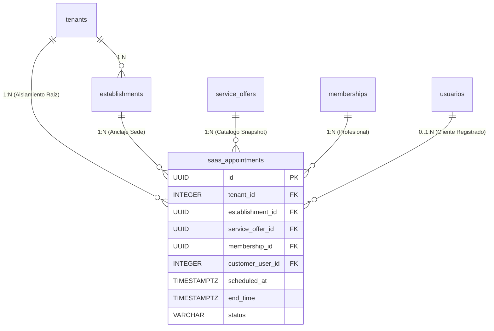

# NODO-06 — PHYSICAL ARCHITECTURE DISCOVERY REPORT v1.0
## SaaS Internal Appointments & Operational Agenda Engine

================================================================================
PROJECT: GlowApp SaaS  
AUTHORITY: Director del Proyecto  
NODE IDENTIFIER: NODO-06  
NODE NAME: SaaS Internal Appointments & Operational Agenda Engine  
CORPUS / REPOSITORY: Diegoromerov/belleza-app  
WORKTREE: `C:\Users\Compu casa\.gemini\antigravity\worktrees\beauty-app\database_audit_read_only`  
CLASSIFICATION: PHYSICAL ARCHITECTURE DISCOVERY — ZERO IMPLEMENTATION  
BASELINE: NODO-05 CLOSED / NODO-06 NODE CONTRACT v1.0 APPROVED  
STATUS: READY FOR PHYSICAL ARCHITECTURE DEFINITION 🟢  
================================================================================

---

## 1. CURRENT PHYSICAL EVIDENCE (EVIDENCIA FÍSICA ACTUAL)

La inspección forense del entorno de base de datos (`beauty_db` en PostgreSQL 15/16) y del árbol de migraciones cerrado (`065` a `070`) arroja la siguiente evidencia física concluyente:

1. **Extensiones del Motor:**
   - `uuid-ossp` y `postgis` habilitadas en Foundation `065`.
   - `btree_gist` (versión 1.7) **instalada y disponible en el catálogo de PostgreSQL**, lo que habilita soporte nativo para restricciones de exclusión indexadas (`EXCLUDE USING gist`) sobre tipos escalares y rangos temporales.

2. **Estructuras Físicas Multi-Tenant Cerradas (Inmutables):**
   - `tenants`: Raíz de aislamiento multi-inquilino (`id SERIAL PRIMARY KEY`).
   - `organizations`: Capa legal/fiscal (`id UUID PK`, `tenant_id INTEGER NOT NULL`, `UNIQUE(id, tenant_id)`).
   - `establishments`: Sede física operativa (`id UUID PK`, `tenant_id INTEGER NOT NULL`, `organization_id UUID NOT NULL`, `UNIQUE(id, tenant_id)`).
   - `usuarios`: Identidades de usuario (`id SERIAL PRIMARY KEY`, `tenant_id INTEGER`, `UNIQUE(id, tenant_id)`).
   - `memberships`: Vínculo contextual Identity $\leftrightarrow$ Sede (`id UUID PK`, `tenant_id INTEGER NOT NULL`, `establishment_id UUID NOT NULL`, `user_id INTEGER NOT NULL`, `role VARCHAR(50)` [`OWNER`, `MANAGER`, `PROFESSIONAL`, `RECEPTIONIST`], `status VARCHAR(30)` [`INVITED`, `ACTIVE`, `SUSPENDED`, `REVOKED`], `UNIQUE(id, establishment_id, tenant_id)` añadida en migración `068`).
   - `service_offers`: Catálogo de servicios de sede (`id UUID PK`, `establishment_id UUID NOT NULL`, `tenant_id INTEGER NOT NULL`, `base_duration INTEGER`, `base_price NUMERIC(12,2)`, `UNIQUE(id, establishment_id, tenant_id)`).
   - `service_assignments`: Matriz $M:N$ de asignación (`id UUID PK`, `service_offer_id UUID`, `membership_id UUID`, `establishment_id UUID`, `tenant_id INTEGER`, `UNIQUE(service_offer_id, membership_id)`).
   - `staff_schedules`: Turnos semanales continuos (`id UUID PK`, `establishment_id UUID`, `membership_id UUID`, `day_of_week SMALLINT` [1-7], `start_time TIME`, `end_time TIME`).

3. **Estructuras B2C Marketplace Existentes (Solo Lectura):**
   - `public.bookings`: Citas B2C marketplace (`id UUID PK`, `client_id INTEGER`, `provider_id INTEGER`, `service_id UUID`, `scheduled_at TIMESTAMPTZ`, `valor_bruto NUMERIC`, `estado estado_cita`, `tenant_id INTEGER`).
   - `public.services`: Servicios ofertados por prestadores marketplace (`id UUID PK`, `provider_id INTEGER`, `duration_minutes INTEGER`, `price NUMERIC`).

4. **Patrón de Seguridad RLS:**
   - Todas las tablas SaaS implementan Row-Level Security bajo la política canónica:
     `USING (tenant_id = NULLIF(current_setting('app.tenant_id', true), '')::integer)`
     `WITH CHECK (tenant_id = NULLIF(current_setting('app.tenant_id', true), '')::integer)`.
   - Contexto de sesión transaccional establecido mediante `SET LOCAL app.tenant_id = $1`.

---

## 2. PROPOSED PHYSICAL MODEL (`saas_appointments`)

Se propone la creación de la tabla física `saas_appointments` en el esquema `public`, diseñada con máxima rigurosidad relacional y dimensional:

```sql
-- ESPECIFICACIÓN FÍSICA PRELIMINAR (DISCOVERY — NO DDL)
CREATE TABLE IF NOT EXISTS saas_appointments (
    id UUID PRIMARY KEY DEFAULT gen_random_uuid(),
    tenant_id INTEGER NOT NULL,
    establishment_id UUID NOT NULL,
    service_offer_id UUID NOT NULL,
    membership_id UUID NOT NULL,
    
    -- Representación de Cliente (Modo Dual Estricto)
    customer_user_id INTEGER,
    guest_name VARCHAR(150),
    guest_phone VARCHAR(30),
    guest_email VARCHAR(255),
    
    -- Fronteras Temporales (Zona Horaria America/Bogota)
    scheduled_at TIMESTAMPTZ NOT NULL,
    end_time TIMESTAMPTZ NOT NULL,
    
    -- Snapshot Operacional Inmutable (Catálogo al momento de agendar)
    service_name_snapshot VARCHAR(255) NOT NULL,
    duration_minutes_snapshot INTEGER NOT NULL,
    price_snapshot NUMERIC(12, 2) NOT NULL,
    
    -- Máquina de Estados Operacionales
    status VARCHAR(30) NOT NULL DEFAULT 'SCHEDULED',
    cancellation_reason TEXT,
    
    -- Auditoría y Trazabilidad
    created_at TIMESTAMPTZ NOT NULL DEFAULT CURRENT_TIMESTAMP,
    updated_at TIMESTAMPTZ NOT NULL DEFAULT CURRENT_TIMESTAMP
);
```

### Justificación de Tipos y Columnas:
1. `id UUID`: Clave primaria no secuencial, inmune a ataques de enumeración.
2. `tenant_id`, `establishment_id`, `membership_id`, `service_offer_id`: Claves dimensionales de anclaje contextual.
3. `scheduled_at` y `end_time TIMESTAMPTZ`: Almacenan timestamps absolutos en UTC internamente, proyectados en `America/Bogota` (UTC-5). `end_time` se persiste físicamente para permitir el indexado GiST de rangos temporales.
4. `duration_minutes_snapshot INTEGER`, `price_snapshot NUMERIC(12,2)`, `service_name_snapshot VARCHAR(255)`: Inmutabilidad histórica ante cambios de catálogo.
5. `cancellation_reason TEXT`: Obligatorio en cancelaciones forzosas de citas en estado `IN_SERVICE`.

---

## 3. RELATIONSHIP MAP (MAPA DE INTEGRIDAD RELACIONAL)

Para garantizar consistencia multi-inquilino absoluta y prevenir citas huérfanas o cruzadas entre sedes/tenants, se proyecta una red de **Claves Foráneas Compuestas con `ON DELETE RESTRICT`**:



### Claves Foráneas Proyectadas:
1. **Tenant Root:**
   `FOREIGN KEY (tenant_id) REFERENCES tenants(id) ON DELETE RESTRICT`
2. **Establishment Anchor (Compuesta Doble):**
   `FOREIGN KEY (establishment_id, tenant_id) REFERENCES establishments(id, tenant_id) ON DELETE RESTRICT`
3. **Service Offer Anchor (Compuesta Triple):**
   `FOREIGN KEY (service_offer_id, establishment_id, tenant_id) REFERENCES service_offers(id, establishment_id, tenant_id) ON DELETE RESTRICT`
4. **Membership Anchor (Compuesta Triple):**
   `FOREIGN KEY (membership_id, establishment_id, tenant_id) REFERENCES memberships(id, establishment_id, tenant_id) ON DELETE RESTRICT`
5. **Customer User Anchor (Compuesta Doble — Opcional):**
   `FOREIGN KEY (customer_user_id, tenant_id) REFERENCES usuarios(id, tenant_id) ON DELETE RESTRICT`

* **Garantía Anti-Corrupción:** Es físicamente imposible agendar una cita asociando una oferta de la Sede A con un profesional de la Sede B o un usuario de otro Tenant.

---

## 4. CONCURRENCY ANALYSIS (ANÁLISIS DE CONCURRENCIA Y NO-COLISIÓN)

**Problema Crítico:** Evitar la doble ocupación (*double booking*) cuando dos solicitudes concurrentes intentan agendar una cita en el mismo intervalo $[t_{\text{start}}, t_{\text{end}})$ para el mismo profesional (`membership_id`).

### Evaluación de Alternativas de PostgreSQL:

| Mecanismo Evaluado | Principio Físico | Ventajas | Desventajas / Riesgos | Veredicto |
| :--- | :--- | :--- | :--- | :---: |
| **Opción 1: Restricción de Exclusión PostgreSQL (`EXCLUDE USING gist`)** | Índice GiST con operador de solapamiento `&&` sobre `tstzrange(scheduled_at, end_time, '[)')` con predicado parcial `WHERE (status NOT IN ('CANCELLED', 'NO_SHOW'))`. | **Garantía matemática a nivel de motor DB.** Cero carreras críticas (*race conditions*). Inmune a bugs en la capa de aplicación. Inmune al nivel de aislamiento de transacción. | Requiere extensión `btree_gist` (ya instalada). Overhead de indexado GiST mínimo. | **RECOMENDADA (ESTÁNDAR DE ORO) 🟢** |
| **Opción 2: Bloqueo Pesimista a Nivel de Fila (`SELECT ... FOR UPDATE` en `memberships`)** | La transacción bloquea el registro del profesional en `memberships` antes de verificar e insertar. | Estándar SQL, no requiere índices GiST. | **Sobre-serialización global:** Bloquea todas las operaciones sobre ese profesional para cualquier fecha/año. Cuello de botella en alta concurrencia. | **NO RECOMENDADA 🔴** |
| **Opción 3: Bloqueos Consultivos Transaccionales (`pg_advisory_xact_lock`)** | Generación de un hash sobre `(membership_id, target_date)` bloqueado durante la transacción. | Serializa únicamente el día del profesional. | Riesgo de colisiones de hash (espacio de 64 bits), no queda expresado en el esquema relacional, fácil de bypass por queries directas. | **COMPLEMENTARIA (OPCIONAL) 🟡** |
| **Opción 4: Aislamiento `SERIALIZABLE`** | Delegar la detección de anomalías al motor SSI de PostgreSQL. | Teóricamente limpio. | Alto índice de abortos de transacción (`40001 serialization_failure`), exige infraestructura compleja de reintentos en cliente. | **NO RECOMENDADA 🔴** |

### Recomendación Arquitectónica:
Implementar **`EXCLUDE USING gist`** como la defensa física primaria e inquebrantable en PostgreSQL:
```sql
CONSTRAINT uq_saas_appointments_no_overlap 
EXCLUDE USING gist (
    establishment_id WITH =,
    membership_id WITH =,
    tstzrange(scheduled_at, end_time, '[)') WITH &&
) WHERE (status NOT IN ('CANCELLED', 'NO_SHOW'));
```
* **Comportamiento:** Si ocurre una colisión concurrente, PostgreSQL rechaza la segunda transacción con `exclusion_violation` (código SQLSTATE `23P01`), la cual es interceptada por el controlador y traducida a `409 CONFLICT: APPOINTMENT_OCCUPANCY_COLLISION`.

---

## 5. ROW-LEVEL SECURITY (RLS) ANALYSIS

1. **Habilitación Obligatoria:**
   `ALTER TABLE saas_appointments ENABLE ROW LEVEL SECURITY;`
2. **Definición de Política Canónica:**
   ```sql
   CREATE POLICY tenant_isolation_saas_appointments ON saas_appointments
       FOR ALL
       USING (tenant_id = NULLIF(current_setting('app.tenant_id', true), '')::integer)
       WITH CHECK (tenant_id = NULLIF(current_setting('app.tenant_id', true), '')::integer);
   ```
3. **Mecanismo en Transacción:** Toda operación ejecutada por el servicio backend se ejecuta dentro de un cliente del pool que ejecuta:
   `SET LOCAL app.tenant_id = $1;`
   garantizando que ninguna consulta o inserción pueda acceder a datos de otro inquilino.

---

## 6. REFERENTIAL INTEGRITY & DELETE/UPDATE SEMANTICS

1. **Política `ON DELETE RESTRICT` Universal:**
   - La eliminación de un `tenant`, `establishment`, `service_offer` o `membership` es rechazada si existen citas asociadas.
2. **Preservación ante Baja de Personal (`MEMBERSHIP INACTIVE`):**
   - Cuando una membresía cambia su estado a `SUSPENDED` o `REVOKED`, **no se dispara ningún cascade destructivo**.
   - Las citas pasadas (`COMPLETED`, `CANCELLED`, `NO_SHOW`) permanecen inmutables en auditoría.
   - Las citas futuras permanecen registradas con la `membership_id` original. La capa de negocio bloquea su ejecución y permite su gestión manual (`CANCELLED` / reprogramación) por directivos (`OWNER`/`MANAGER`).
3. **Prohibición de `HARD DELETE`:**
   - La tabla `saas_appointments` opera como un registro transaccional append-only / status-update. No se permiten `DELETE` físicos desde la aplicación.

---

## 7. CLIENT MODEL (REPRESENTACIÓN DEL MODO DUAL)

Se implementa el modo dual estricto mediante un constraint físico a nivel de tabla:

```sql
CONSTRAINT chk_saas_appointments_client_representation CHECK (
    -- Modo 1: Cliente Registrado
    (customer_user_id IS NOT NULL 
     AND guest_name IS NULL 
     AND guest_phone IS NULL 
     AND guest_email IS NULL)
    OR
    -- Modo 2: Cliente Invitado
    (customer_user_id IS NULL 
     AND guest_name IS NOT NULL AND length(trim(guest_name)) >= 2
     AND guest_phone IS NOT NULL AND length(trim(guest_phone)) >= 7)
)
```

* **Validaciones Físicas:**
  - Si `customer_user_id` está presente, todos los campos `guest_*` deben ser estrictamente `NULL`.
  - Si `customer_user_id` es `NULL`, `guest_name` (mínimo 2 caracteres) y `guest_phone` (mínimo 7 caracteres) son obligatorios. `guest_email` es opcional.
  - Cero creación de registros fantasma en `public.usuarios`.
  - Cero tabla prematura `guest_clients`.

---

## 8. SNAPSHOT MODEL (INMUTABILIDAD OPERACIONAL)

Se capturan tres atributos inmutables al momento de la inserción:
1. `service_name_snapshot VARCHAR(255) NOT NULL`
2. `duration_minutes_snapshot INTEGER NOT NULL CHECK (duration_minutes_snapshot > 0)`
3. `price_snapshot NUMERIC(12, 2) NOT NULL CHECK (price_snapshot >= 0)`

### Restricción de Consistencia Temporal:
```sql
CONSTRAINT chk_saas_appointments_time_consistency 
    CHECK (end_time = scheduled_at + (duration_minutes_snapshot || ' minutes')::interval);
```
* **Garantía:** `end_time` es matemáticamente consistente con `scheduled_at` y la duración del snapshot. Mutaciones futuras en `service_offers.base_duration` o `service_offers.base_price` no alteran los compromisos adquiridos previamente.

---

## 9. STATE PERSISTENCE & CHECK CONSTRAINTS

1. **Restricción de Estados Válidos:**
   ```sql
   CONSTRAINT chk_saas_appointments_status CHECK (
       status IN ('SCHEDULED', 'CONFIRMED', 'CHECKED_IN', 'IN_SERVICE', 'COMPLETED', 'CANCELLED', 'NO_SHOW')
   );
   ```
2. **Restricción de Motivo de Cancelación:**
   ```sql
   CONSTRAINT chk_saas_appointments_cancellation_reason CHECK (
       (status = 'CANCELLED') OR (cancellation_reason IS NULL)
   );
   ```
* **Nota:** La obligatoriedad de `cancellation_reason` cuando el estado previo era `IN_SERVICE` (Regla 12 de N06-DEC-05) se valida contractualmente en la capa de servicio/controlador al ejecutar la transición.

---

## 10. OCCUPANCY MODEL (MATERIALIZACIÓN DE OCUPACIÓN)

1. **Ocupación Activa:**
   $$\mathbf{ActiveOccupancy} \iff \text{status} \notin (\text{'CANCELLED'}, \ \text{'NO\_SHOW'})$$
   - Los estados `SCHEDULED`, `CONFIRMED`, `CHECKED_IN`, `IN_SERVICE` y `COMPLETED` ocupan tiempo físicamente en la línea de tiempo del profesional.
2. **Liberación de Tiempo:**
   - Los estados `CANCELLED` y `NO_SHOW` liberan de inmediato el slot en la restricción de exclusión GiST, permitiendo que ese mismo slot sea agendado para otra cita.

---

## 11. AGENDA PROJECTION (PROYECCIÓN OPERATIVA DE SOLO LECTURA)

La `Agenda` no es una tabla física, sino una **proyección agregada en memoria**.

### Pipeline de Consultas para la Proyección Diaria:
Dado `(tenant_id, establishment_id, target_date)`:
1. **Paso 1 (Profesionales Activos):**
   ```sql
   SELECT m.id AS membership_id, m.user_id, u.nombre, u.apellido
   FROM memberships m
   JOIN usuarios u ON u.id = m.user_id AND u.tenant_id = m.tenant_id
   WHERE m.tenant_id = $1 AND m.establishment_id = $2 
     AND m.role = 'PROFESSIONAL' AND m.status = 'ACTIVE';
   ```
2. **Paso 2 (Turnos Laborales del Día de la Semana):**
   ```sql
   SELECT membership_id, start_time, end_time
   FROM staff_schedules
   WHERE tenant_id = $1 AND establishment_id = $2 AND day_of_week = $dayOfWeek;
   ```
3. **Paso 3 (Citas SaaS del Día):**
   ```sql
   SELECT id, membership_id, scheduled_at, end_time, service_name_snapshot, 
          status, customer_user_id, guest_name
   FROM saas_appointments
   WHERE tenant_id = $1 AND establishment_id = $2
     AND scheduled_at >= $targetDateStart AND scheduled_at < $targetDateEnd
   ORDER BY scheduled_at ASC;
   ```
4. **Paso 4 (Reservas Marketplace B2C Activas — Solo Lectura):**
   ```sql
   SELECT b.id, b.provider_id, b.scheduled_at, b.estado, s.duration_minutes
   FROM bookings b
   JOIN services s ON s.id = b.service_id
   WHERE b.tenant_id = $1 
     AND b.provider_id = ANY($activeUserIds)
     AND b.scheduled_at >= $targetDateStart AND b.scheduled_at < $targetDateEnd
     AND b.estado IN ('CONFIRMADA', 'COMPLETADA', 'EN_PROCESO', 'PENDIENTE_PAGO');
   ```
5. **Paso 5 (Consolidación en Memoria):**
   El servicio de proyección agrupa citas y reservas por profesional, calcula franjas libres y produce el `AgendaProjectionResponseDTO`.

---

## 12. INDEX PROPOSAL (PROPUESTA DE ÍNDICES NO ESPECULATIVOS)

Para asegurar tiempos de respuesta óptimos ($O(\log N)$) en alta concurrencia y proteger el escaneo multi-inquilino, se proponen los siguientes índices estrictamente necesarios:

| Nombre del Índice | Tipo | Columnas Indexadas | Predicado / Condición | Propósito Arquitectónico |
| :--- | :---: | :--- | :--- | :--- |
| `idx_saas_appointments_tenant_id` | B-tree | `(tenant_id)` | — | Soporte a escaneo y políticas RLS. |
| `idx_saas_appointments_establishment_scheduled` | B-tree | `(establishment_id, scheduled_at)` | — | Proyección de Agenda de Sede por fecha. |
| `idx_saas_appointments_membership_scheduled` | B-tree | `(membership_id, scheduled_at)` | — | Consulta de agenda de profesional específico. |
| `idx_saas_appointments_service_offer_id` | B-tree | `(service_offer_id)` | — | Integridad y soporte a claves foráneas. |
| `idx_saas_appointments_customer_user_id` | B-tree | `(customer_user_id)` | `WHERE customer_user_id IS NOT NULL` | Historial de citas de clientes registrados. |
| `uq_saas_appointments_no_overlap` | GiST | `(establishment_id, membership_id, tstzrange(scheduled_at, end_time, '[)'))` | `WHERE status NOT IN ('CANCELLED', 'NO_SHOW')` | **Restricción física de exclusión (No colisión concurrente).** |

---

## 13. RISKS & MITIGATION (ANÁLISIS DE RIESGOS)

| Riesgo Técnico Identificado | Nivel | Mitigación Arquitectónica |
| :--- | :---: | :--- |
| **Deriva de Zona Horaria:** Desfases entre timestamps UTC del servidor y hora local de salón. | **ALTO** | Uso estricto del estándar `TIMESTAMPTZ` en base de datos con parseo y proyección forzada a `America/Bogota` (UTC-5). |
| **Sobrecarga de Conexiones por Locks:** Bloqueos de tabla prolongados en transacciones. | **MEDIO** | El índice GiST resuelve la exclusión atómicamente a nivel de registro en milisegundos sin bloquear filas de catálogo o miembros. |
| **Contaminación de Pool de Conexiones:** Olvido de `SET LOCAL` que filtre datos de otros inquilinos. | **ALTO** | Envoltura obligatoria en transacciones atómicas `BEGIN ... SET LOCAL app.tenant_id ... COMMIT` y reseteo al liberar conexión. |

---

## 14. OPEN DECISIONS (DECISIONES ABIERTAS)

No se identificaron inconsistencias insalvables ni bloqueos de arquitectura. Se ratifica:
1. **Mecanismo de Concurrencia:** La restricción `EXCLUDE USING gist` es técnica y operativamente viable, compatible con el motor PostgreSQL existente.
2. **Snapshot vs FK:** El esquema híbrido (FK `service_offer_id` para trazabilidad + campos `*_snapshot` para inmutabilidad) garantiza integridad y resiliencia histórica.

---

## 15. COMPATIBILITY ASSESSMENT (EVALUACIÓN DE COMPATIBILIDAD)

- **Foundation Core `065`:** 100% compatible (hace uso exacto de `tenants`, `establishments`, `memberships`, `usuarios`).
- **Context Resolution `066`:** 100% compatible con la inyección de `req.activeContext`.
- **Catálogo y Asignaciones `067`, `068`:** 100% compatible con `service_offers` y `service_assignments`.
- **Horarios `069`:** 100% compatible con la lectura de `staff_schedules`.
- **NODO-05 Availability Engine:** 100% preservado e inmutable. NODO-05 se invoca como pre-check antes de persistir la cita.
- **`public.bookings`:** 100% compatible y aislado. Se consulta en modo solo lectura para la proyección de agenda.

---

## 16. RECOMMENDED PHYSICAL ARCHITECTURE (ARQUITECTURA FÍSICA RECOMENDADA)

Se concluye que la arquitectura física descubierta es **completamente sólida, coherente, segura y compatible con todos los nodos cerrados precedentes**.

### Resumen de Recomendaciones:
1. Crear una única tabla `saas_appointments` en migración `071_saas_appointments.sql` (cuando sea formalmente autorizada).
2. Proteger la no-colisión concurrente mediante la restricción de exclusión `EXCLUDE USING gist` sobre `tstzrange(scheduled_at, end_time, '[)')`.
3. Implementar el modo dual de cliente mediante un constraint `CHECK` explícito.
4. Implementar snapshots inmutables de servicio con validación de duración.
5. Preservar RLS bajo el estándar de aislamiento multi-tenant de Foundation `065`.
6. Mantener `Agenda` como proyección en memoria sin tablas físicas adicionales.

---

## 17. DICTAMEN DE DISCOVERY Y ESTADO FINAL

```
================================================================================
            DICTAMEN DE DISCOVERY DE ARQUITECTURA FÍSICA — NODO-06
================================================================================
ESTADO: READY FOR PHYSICAL ARCHITECTURE DEFINITION 🟢
EVIDENCIA FÍSICA: 100% AUDITADA Y VERIFICADA EN POSTGRESQL
CONCURRENCIA: EXCLUDE USING gist VALIDADA CON EXTENSIÓN btree_gist
INTEGRIDAD REFERENCIAL: ON DELETE RESTRICT EN TODA LA CADENA DIMENSIONAL
COMPATIBILIDAD CON NODOS CERRADOS: 100% PRESERVADA (N01 - N05 INMUTABLES)
CÓDIGO / DDL / MIGRACIONES EJECUTADAS: CERO (SOLO DISCOVERY REPORT)
PRÓXIMO PASO: COMPUERTA DIRECTIVA → GO NODO-06 PHYSICAL ARCHITECTURE DESIGN / CONTRACT
================================================================================
```
