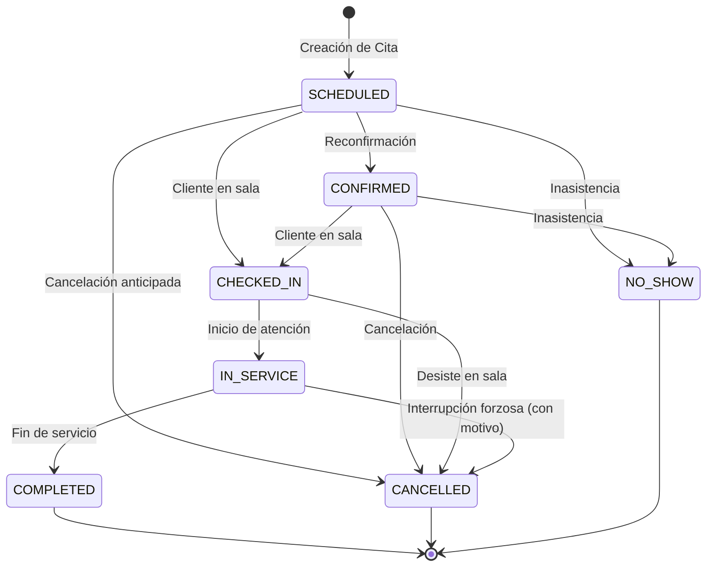

# NODO-06 — SEMANTIC DECISION BUNDLE v1.0
## SaaS Internal Appointments & Operational Agenda Engine — Formal Semantic Decision Record & Focused Reconciliation v1.1

================================================================================
PROJECT: GlowApp SaaS  
AUTHORITY: Director del Proyecto  
NODE: NODO-06 — SaaS Internal Appointments & Operational Agenda Engine  
CORPUS / REPOSITORY: Diegoromerov/belleza-app  
WORKTREE: `C:\Users\Compu casa\.gemini\antigravity\worktrees\beauty-app\database_audit_read_only`  
CLASSIFICATION: READ-ONLY SEMANTIC RECONCILIATION — ZERO IMPLEMENTATION  
BASELINE: NODO-05 CLOSED / NODO-06 ARCHITECTURAL DISCOVERY CLOSED  
DOCUMENT STATUS: READY FOR DIRECTOR APPROVAL 🟡  
================================================================================

---

## 1. EXECUTIVE SUMMARY & RECONCILIATION INTENT

El presente documento formaliza el marco conceptual, límites, invariantes y reglas de negocio de **`NODO-06` (SaaS Internal Appointments & Operational Agenda Engine)**, integrando la **Reconciliación Semántica v1.1** requerida por la Dirección del Proyecto para resolver de forma rigurosa y sin ambigüedades:
1. La delimitación estricta de la relación entre NODO-06 y NODO-05 CLOSED.
2. El comportamiento semántico y canónico de citas futuras cuando una membresía pasa a estado inactivo (`SUSPENDED` / `REVOKED`).

### Principio Fundamental de Desacoplamiento (Anti-Bundling Policy):
Se ratifica la frontera ontológica inquebrantable entre los 7 conceptos clave del dominio de belleza:

```text
┌─────────────────────────────────────────────────────────────────────────────┐
│                   GLOWAPP CANONICAL CONCEPT SEPARATION                      │
├─────────────────┬───────────────────────────────────────────────────────────┤
│ Concepto        │ Definición Canónica y Límite de Responsabilidad           │
├─────────────────┼───────────────────────────────────────────────────────────┤
│ AVAILABILITY    │ Proyección efímera y determinista de slots libres (N05)   │
│ APPOINTMENT     │ Compromiso operativo transaccional en sede (N06)          │
│ AGENDA          │ Vista de proyección operativa consolidada de jornada (N06)│
│ B2C BOOKING     │ Reserva de cliente final en marketplace B2C (Pre-Nodo 01) │
│ PAYMENT         │ Transacción financiera / pasarela de pagos (Fintech)      │
│ CHECKOUT        │ Flujo de selección de servicios + cobro (B2C / POS)       │
│ PUBLICATION     │ Autorización explícita de visibilidad comercial (DEC-PUB) │
└─────────────────┴───────────────────────────────────────────────────────────┘
```

---

## 2. DECISION REGISTER & RECONCILIATION INVENTORY

```text
+------------+------------------------------------------+------------------------------------+----------------------------------+
| Código     | Título de la Decisión                    | Estado de Decisión                 | Impacto Arquitectónico           |
+------------+------------------------------------------+------------------------------------+----------------------------------+
| N06-DEC-01 | Canonical Definition of APPOINTMENT      | RECONCILED — READY FOR APPROVAL 🟡 | Definición ontológica de Cita    |
| N06-DEC-02 | Operational Identity & Invariants        | RECONCILED — READY FOR APPROVAL 🟡 | 5-tupla obligatoria de relación  |
| N06-DEC-03 | Client Identity Model (Guest vs User)    | RECONCILED — READY FOR APPROVAL 🟡 | Soporte dual sin usuarios fakes  |
| N06-DEC-04 | Canonical Definition of AGENDA           | RECONCILED — READY FOR APPROVAL 🟡 | Proyección de lectura / No tabla |
| N06-DEC-05 | Operational State Machine & Lifecycle    | RECONCILED — READY FOR APPROVAL 🟡 | 7 estados y matriz de 16 reglas  |
| N06-DEC-06 | Atomic Creation & Concurrency Guarantee  | RECONCILED — READY FOR APPROVAL 🟡 | Pre-check vs Atomic Guard        |
| N06-DEC-07 | Historical Operational Snapshot Policy   | RECONCILED — READY FOR APPROVAL 🟡 | Inmutabilidad de precio/duración |
| N06-DEC-08 | Membership Inactive & Future Appts (v1.1)| RECONCILED — READY FOR APPROVAL 🟡 | Política Canónica Alternativa C  |
| N06-DEC-09 | Active Occupancy Definition              | RECONCILED — READY FOR APPROVAL 🟡 | Regla de bloqueo de citas N06    |
| N06-DEC-10 | Authority & Role Permissions Matrix      | RECONCILED — READY FOR APPROVAL 🟡 | Control de acceso contextual     |
| N06-DEC-11 | Physical Isolation from public.bookings  | RECONCILED — READY FOR APPROVAL 🟡 | Entidad saas_appointments        |
| N06-DEC-12 | Relationship NODO-06 <-> NODO-05 (v1.1)  | RECONCILED — READY FOR APPROVAL 🟡 | Inmutabilidad de N05 CLOSED      |
| N06-DEC-13 | Non-Goals & Anti-Bundling Boundaries     | RECONCILED — READY FOR APPROVAL 🟡 | Exclusión de Pagos/POS/Nómina    |
+------------+------------------------------------------+------------------------------------+----------------------------------+
```

---

## 3. SEMANTIC RECONCILIATION v1.1 — CORRECCIONES ARQUITECTÓNICAS FOCALIZADAS

---

### CORRECCIÓN 1 — RELACIÓN NODO-06 ↔ NODO-05 RESPECTO DE `saas_appointments` (N06-DEC-12)

#### 1. Delimitación Estricta e Inmutabilidad de NODO-05:
1. **NODO-05 Continúa Formalmente CLOSED e Inmutable:**
   - La suite de 25 pruebas y el motor de NODO-05 aprobado **NO SE MODIFICAN**.
   - NODO-05 no incorpora automáticamente `saas_appointments` en su código ni en su contrato actual.
2. **Naturaleza de NODO-05 como `AVAILABILITY PRE-CHECK`:**
   - NODO-05 se mantiene estrictamente como el motor de cálculo en memoria que evalúa disponibilidad comercial y turnos declarados (`staff_schedules`) descontando reservas existentes de `public.bookings`.
   - NODO-05 es un **chequeo previo optimista** que asiste a la UI y a la creación de citas, pero **NO provee garantías transaccionales de bloqueo ni exclusión mutua**.
3. **Responsabilidad de Integridad y Concurrencia en NODO-06:**
   - La garantía atómica de evitar colisiones físicas entre citas de salón pertenece **exclusiva y soberanamente a NODO-06** en su capa de persistencia (`saas_appointments`).
4. **Evolución Futura de NODO-05:**
   - La incorporación de `saas_appointments` como fuente formal de proyección para NODO-05 no se asume resuelta ni implícita: **requerirá una decisión arquitectónica directiva y una evolución formal downstream de NODO-05** (ej. NODO-05 v1.1) cuando NODO-06 esté completado y validado.

---

### CORRECCIÓN 2 — MEMBRESÍA INACTIVA Y CITAS FUTURAS PENDIENTES (N06-DEC-08)

#### 1. Planteamiento del Escenario:
$$	ext{Membresía ACTIVE} \longrightarrow 	ext{Cita Futura en estado SCHEDULED o CONFIRMED} \longrightarrow 	ext{Membresía pasa a INACTIVE (SUSPENDED / REVOKED)}$$

#### 2. Análisis Explícito de Alternativas:
* **Alternativa A (Ocupación Forzada sin Ejecución):** La cita continúa bloqueando la franja temporal del colaborador aunque este no pueda atenderla.
  - *Problema:* Bloquea la agenda del salón sobre un empleado inactivo sin aportar solución operativa.
* **Alternativa B (Liberación Automática Silenciosa de Ocupación):** La cita se mantiene pero se desvincula de la ocupación, permitiendo agendar a otros colaboradores sin aviso.
  - *Problema:* Genera inconsistencia en el registro histórico y omite el seguimiento de la cita concertada con el cliente.
* **Alternativa C (Registro Preservado con Bloqueo de Ejecución y Gestión de Contingencia):**
  - La cita permanece registrada en base de datos asociada a la membresía histórica para trazabilidad y auditoría.
  - La cita queda **estrictamente bloqueada para ejecución** (el miembro inactivo tiene prohibido hacer check-in, iniciar o completar).
  - La cita se muestra en la agenda de sede con advertencia de contingencia para que el `OWNER` o `MANAGER` la cancele o gestione manualmente.
  - La cancelación masiva automática y la reasignación algorítmica quedan explícitamente declaradas **`OUT OF SCOPE FOR NODO-06`**, delegadas a un nodo posterior de gobernanza de personal.

#### 3. Decisión Canónica Aprobada: **ALTERNATIVA C**

| Dimensión | Regla Canónica Sancionada en NODO-06 |
| :--- | :--- |
| **Efecto sobre el Registro** | La cita permanece intacta en `saas_appointments` asociada a la `membership_id` original. No se elimina ni se muta automáticamente. |
| **Efecto sobre el Historial** | Citas pasadas (`COMPLETED`, `CANCELLED`, `NO_SHOW`) son permanentes e inmutables para auditoría y contabilidad. |
| **Efecto sobre la Ejecución** | **Bloqueo Total de Transición:** Una membresía inactiva (`SUSPENDED` / `REVOKED`) tiene estrictamente prohibido ejecutar `CHECKED_IN`, `IN_SERVICE` o `COMPLETED` (`422 INACTIVE_MEMBERSHIP_CANNOT_EXECUTE`). |
| **Efecto sobre NODO-05** | Como NODO-05 filtra únicamente colaboradores con `status = 'ACTIVE'`, el miembro inactivo **no genera slots disponibles** en las proyecciones de NODO-05. |
| **Efecto sobre la Ocupación** | La cita preserva su franja horaria en el registro del colaborador inactivo, impidiendo citas duplicadas sobre el mismo registro. Para otros colaboradores activos, sus agendas son físicamente independientes. |
| **Alcance de NODO-06** | NODO-06 permite al `OWNER` o `MANAGER` consultar citas en contingencia y ejecutar cancelaciones manuales (`CANCELLED`) o reprogramaciones según las capacidades base del nodo. |
| **Delegación Explícita** | La cancelación masiva automática en cascada y la reasignación automática inteligente quedan **explícitamente fuera de NODO-06** y delegadas a un nodo posterior (*Staff Offboarding / Workforce Governance Engine*). |

---

## 4. SEMANTIC DECISION RECORDS RATIFICADOS

---

### N06-DEC-01 — DEFINICIÓN CANÓNICA DE APPOINTMENT (CITA OPERATIVA)
Una **`Appointment`** es un compromiso operativo transaccional formalizado entre un Establecimiento físico (`establishments.id`), un Colaborador Profesional activo (`memberships.id`) y un Cliente (Registrado o Invitado) para prestar una Oferta de Servicio (`service_offers.id`) en una ventana temporal continua $[t_{	ext{start}}, t_{	ext{end}}]$ donde $t_{	ext{end}} = t_{	ext{start}} + 	ext{service\_offers.base\_duration}$.

---

### N06-DEC-02 — IDENTIDAD OPERATIVA E INVARIANTES DE LA APPOINTMENT
Toda cita requiere obligatoriamente una **5-tupla relacional**:
1. `tenant_id` (Aislamiento RLS).
2. `establishment_id` (Sede física explícita; no existen citas flotantes).
3. `service_offer_id` (Oferta durable del catálogo SaaS).
4. `membership_id` (Colaborador activo asignado al servicio en esa sede).
5. `client` (Representación válida de cliente registrado o invitado).

---

### N06-DEC-03 — MODELO DE IDENTIDAD DEL CLIENTE (GUEST vs. REGISTERED)
* **Modo Dual Estricto:**
  - *Modo `REGISTERED`:* `customer_user_id` PRESENTE (`INTEGER REFERENCES usuarios(id)`), atributos `guest_*` en `NULL`.
  - *Modo `GUEST`:* `customer_user_id` en `NULL`, atributos planos obligatorios `guest_name VARCHAR NOT NULL` (mínimo 2 caracteres), `guest_phone VARCHAR NOT NULL` (teléfono válido), `guest_email VARCHAR NULL`.
* **Prohibición:** Cero usuarios fantasma en `usuarios` y cero tablas prematuras `guest_clients` en NODO-06.

---

### N06-DEC-04 — DEFINICIÓN CANÓNICA DE AGENDA
La **`Agenda` NO es una tabla física de base de datos**. Es una **proyección operativa de solo lectura (View / Operational Query Projection)** que sintetiza por sede y fecha:
1. Columnas de colaboradores con turnos de trabajo (`staff_schedules`).
2. Citas operativas agendadas (`saas_appointments`).
3. Reservas marketplace (`public.bookings`).
4. Franjas disponibles de agendamiento.

---

### N06-DEC-05 — MÁQUINA DE ESTADOS OPERATIVA (MATRIZ DE 16 REGLAS)



| Estado Actual | Acción | Estado Siguiente | ¿Permitido? | Justificación Semántica |
| :--- | :--- | :--- | :---: | :--- |
| **`SCHEDULED`** | `confirm` | **`CONFIRMED`** | **SÍ** | Reconfirmación previa vía telefónica o mensaje. |
| **`SCHEDULED`** | `check_in` | **`CHECKED_IN`** | **SÍ** | El cliente llega a la sala de espera sin confirmación previa. |
| **`SCHEDULED`** | `cancel` | **`CANCELLED`** | **SÍ** | Cancelación anticipada por el cliente o el salón. |
| **`SCHEDULED`** | `no_show` | **`NO_SHOW`** | **SÍ** | La hora transcurrió y el cliente nunca se presentó. |
| **`CONFIRMED`** | `check_in` | **`CHECKED_IN`** | **SÍ** | El cliente confirmado llega a la sala de espera. |
| **`CONFIRMED`** | `cancel` | **`CANCELLED`** | **SÍ** | Cancelación posterior a la reconfirmación. |
| **`CONFIRMED`** | `no_show` | **`NO_SHOW`** | **SÍ** | El cliente reconfirmado no asistió. |
| **`CHECKED_IN`** | `start_service` | **`IN_SERVICE`** | **SÍ** | El colaborador inicia el servicio en estación/cabina. |
| **`CHECKED_IN`** | `cancel` | **`CANCELLED`** | **SÍ** | El cliente desiste mientras esperaba en sala. |
| **`CHECKED_IN`** | `no_show` | — | **NO** | Contradicción física: El cliente ya fue marcado como presente. |
| **`IN_SERVICE`** | `complete` | **`COMPLETED`** | **SÍ** | Servicio finalizado con éxito (Terminal Positivo). |
| **`IN_SERVICE`** | `cancel` | **`CANCELLED`** | **SÍ (Con Motivo)** | Interrupción durante el servicio (ej. fuerza mayor). |
| **`IN_SERVICE`** | `no_show` | — | **NO** | Contradicción física: El cliente ya está en atención. |
| **`COMPLETED`** | *cualquiera* | — | **NO** | Estado Terminal Inmutable. |
| **`CANCELLED`** | *cualquiera* | — | **NO** | Estado Terminal Inmutable. |
| **`NO_SHOW`** | *cualquiera* | — | **NO** | Estado Terminal Inmutable. |

---

### N06-DEC-06 — CONCURRENCIA Y CREACIÓN ATÓMICA DE APPOINTMENTS
1. NODO-05 opera como `AVAILABILITY PRE-CHECK` optimista.
2. La creación de la cita en NODO-06 **DEBE SER ESTRICTAMENTE ATÓMICA Y MUTUAMENTE EXCLUYENTE** respecto de la ocupación temporal del profesional en el establecimiento.
3. Si dos solicitudes colisionan en el mismo instante, exactamente una tiene éxito y la otra es rechazada con `409 CONFLICT: APPOINTMENT_OCCUPANCY_COLLISION`.
4. El mecanismo físico de base de datos se clasifica formalmente como **`PHYSICAL ARCHITECTURE REQUIRED`**.

---

### N06-DEC-07 — POLÍTICA DE SNAPSHOT HISTÓRICO INMUTABLE
Al momento de creación, la cita captura como snapshot operacional inmutable:
* `service_name_snapshot` (Nombre comercial pactado).
* `duration_minutes_snapshot` (Duración que define el intervalo físico ocupado $[t_{	ext{start}}, t_{	ext{end}}]$).
* `price_snapshot` (Precio base pactado).
Mutaciones posteriores en `service_offers` **NO alteran** citas previamente creadas.

---

### N06-DEC-09 — REGLA DE OCUPACIÓN ACTIVA (ACTIVE OCCUPANCY RULE)
Para la prevención de colisiones en NODO-06:
$$\mathbf{ActiveOccupancyRule} \iff 	ext{status} 
otin (	ext{'CANCELLED'}, \ 	ext{'NO\_SHOW'})$$
* `SCHEDULED`, `CONFIRMED`, `CHECKED_IN`, `IN_SERVICE`: Bloquean franja activa para el profesional.
* `COMPLETED`: Bloquea históricamente el intervalo transcurrido.
* `CANCELLED`, `NO_SHOW`: **Liberan inmediatamente el slot** para agendamiento.

---

### N06-DEC-10 — MATRIZ DE PERMISOS Y ROLES DE SEDE
* **OWNER / MANAGER / RECEPTIONIST:** Acceso completo de visualización de agenda y agendamiento/cambio de estado para cualquier colaborador de la sede.
* **PROFESSIONAL:** Visualización de su propia agenda y actualización de estado de sus propias citas (`CHECKED_IN` $	o$ `IN_SERVICE` $	o$ `COMPLETED`).
* **Cross-Tenant / Cross-Establishment:** Rechazo tajante con `403 FORBIDDEN` o `404 NOT_FOUND`.

---

### N06-DEC-11 — SEPARACIÓN FÍSICA RESPECTO DE `public.bookings`
* `public.bookings` (B2C Marketplace) permanece **completamente intacta** (cero modificaciones DDL).
* Las citas SaaS residen en su propia entidad física (`saas_appointments`) bajo aislamiento RLS.

---

### N06-DEC-13 — LÍMITES ESTRICTOS Y NO-OBJETIVOS (ANTI-BUNDLING BOUNDARIES)
Quedan formalmente excluidos de NODO-06:
1. Pagos y pasarelas de pago (Wompi).
2. Caja registradora / POS / Arqueos de efectivo.
3. Liquidación de comisiones y nómina.
4. Notificaciones automáticas (WhatsApp / Push).
5. Facturación electrónica DIAN.

---

## 5. COMPROBACIÓN DE CONSISTENCIA GLOBAL

Se verificó la compatibilidad cruzada de las decisiones tomadas:
* **Concurrencia (N06-DEC-06) vs Ocupación (N06-DEC-09):** Compatibilidad 100% (atomicidad sobre estados no cancelados).
* **Lifecycle de Membresía (N06-DEC-08) vs Agenda (N06-DEC-04):** Compatibilidad 100% (citas en contingencia visibles en agenda sin ejecución de staff inactivo).
* **NODO-05 CLOSED vs NODO-06 (N06-DEC-12):** Compatibilidad 100% (cero mutación a NODO-05; pre-check optimista desacoplado de la garantía de inserción atómica).
* **Handover Boundary & NODO-02 Assignments (N06-DEC-02):** Invariantes de catálogo y asignación preservados estrictamente.

---

## 6. DICTAMEN DE RECONCILIACIÓN Y ESTADO FORMAL

```
================================================================================
                    DICTAMEN FORMAL DE RECONCILIACIÓN v1.1
================================================================================
ESTADO: READY FOR DIRECTOR APPROVAL 🟡
PUNTOS RECONCILIADOS:
1. NODO-06 <-> NODO-05: NODO-05 permanece CLOSED e inmutable; opera como Pre-Check;
   la garantía atómica es de N06; la federación de ocupación es downstream formal.
2. Inactive Membership + Future Appts: Alternativa C sancionada (registro preservado,
   bloqueo de ejecución, N05 ignora al staff inactivo, automatizaciones out-of-scope).
CÓDIGO / DDL: ZERO MODIFICACIONES / ZERO CÓDIGO FUNCIONAL
SIGUIENTE PASO: COMPUERTA DIRECTIVA → NODO-06 NODE CONTRACT v1.0
================================================================================
```
