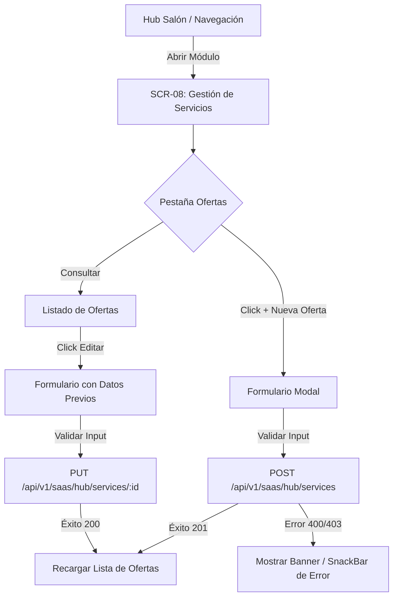
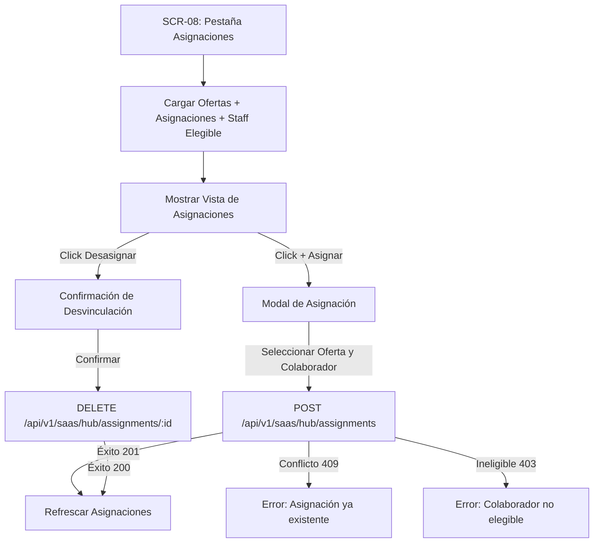

# NODO-07 — ARQUITECTURA FÍSICA: NODO-02 UI / SCR-08
## SERVICE OFFERS & SERVICE ASSIGNMENTS

**Documento:** `NODO-07-NODO-02-UI-PHYSICAL-ARCHITECTURE.md`  
**Estado:** `ARCHITECTURAL SPECIFICATION` — Listo para auditoría del Director  
**Alcance:** Frontend SaaS para la gestión física de Ofertas de Servicio y Asignaciones de Personal (SCR-08)  
**Restricción:** `ZERO CODE CHANGES` — No se modifica código Dart, JS ni SQL durante esta fase.

---

## 1. OBJETIVO

Definir de manera determinista y exhaustiva la arquitectura física para la interfaz de usuario **SCR-08 (NODO-02 UI)** dentro de la aplicación Flutter GlowApp SaaS, permitiendo a los administradores de un establecimiento (`OWNER`, `MANAGER`) gestionar:
1. **Ofertas de Servicio (Service Offers):** Catálogo base de servicios del establecimiento (nombre, descripción, duración base, precio base).
2. **Asignaciones de Servicio (Service Assignments):** Vínculos operativos entre una oferta de servicio y un colaborador elegible con membresía activa (`PROFESSIONAL`, `OWNER`, `MANAGER`).

---

## 2. AUTORIDAD Y MARCO DE GOBERNANZA

Esta especificación se rige estrictamente bajo:
- **`DEC-AS-001` (v1.0):** Restricción de autoridad (actor) a `OWNER` / `MANAGER`.
- **`DEC-AS-006` (v1.0):** Vínculo canónico obligatorio con `ACTIVE MEMBERSHIP`.
- **`DEC-AS-012` (v1.0):** Desasignación pura (`DELETE /api/v1/saas/hub/assignments/:id`) sin eliminación de entidades padre.
- **`DEC-AS-014` (v1.0):** Definición consolidada de asignación como capacidad operativa.
- **Reconciliación Forense Aprobada (Opción A):** Reconocimiento de roles operativos elegibles (`PROFESSIONAL`, `OWNER`, `MANAGER`) con estado `ACTIVE`.
- **Invariantes NODO-07:** Transporte contextual exclusivo mediante `x-active-membership-id` vía `ActiveContextHolder` y `ApiService`. Cero persistencia local de estado de sesión SaaS.

---

## 3. ENDPOINTS REALES DE BACKEND

Los endpoints existen físicamente en el backend de Node.js/Express y están respaldados por migraciones de PostgreSQL (`067_service_offers.sql`, `068_service_assignments.sql`):

### 3.1. Ofertas de Servicio (`serviceOfferRoutes.js` -> `/api/v1/saas/hub/services`)
| Método | Ruta | Controller / Service | Autoridad Mínima | Descripción |
| :--- | :--- | :--- | :--- | :--- |
| `POST` | `/api/v1/saas/hub/services` | `serviceOfferController.createServiceOffer` | `OWNER`, `MANAGER` | Crea una nueva oferta de servicio en la sede activa |
| `GET` | `/api/v1/saas/hub/services` | `serviceOfferController.listServiceOffers` | `OWNER`, `MANAGER`, `PROFESSIONAL`, `RECEPTIONIST` | Lista todas las ofertas de la sede activa |
| `GET` | `/api/v1/saas/hub/services/:id` | `serviceOfferController.getServiceOfferById` | `OWNER`, `MANAGER`, `PROFESSIONAL`, `RECEPTIONIST` | Detalle de una oferta específica |
| `PUT` | `/api/v1/saas/hub/services/:id` | `serviceOfferController.updateServiceOffer` | `OWNER`, `MANAGER` | Actualización de campos mutables (`name`, `description`, `base_duration`, `base_price`) |

> [!IMPORTANT]
> **Campos de Ofertas de Servicio:**
> - Permitidos: `id`, `name`, `description`, `base_duration`, `base_price`, `created_at`, `updated_at`.
> - **Prohibidos / Inexistentes:** `DELETE`, `is_active`, `category`, `publication`, `activation`. (La eliminación y activación no existen físicamente en el contrato cerrado NODO-02).

### 3.2. Asignaciones de Servicio (`serviceAssignmentRoutes.js` -> `/api/v1/saas/hub/assignments`)
| Método | Ruta | Controller / Service | Autoridad Mínima | Descripción |
| :--- | :--- | :--- | :--- | :--- |
| `POST` | `/api/v1/saas/hub/assignments` | `serviceAssignmentController.createAssignment` | `OWNER`, `MANAGER` | Vincula una oferta con una membresía elegible |
| `GET` | `/api/v1/saas/hub/assignments` | `serviceAssignmentController.listEstablishmentAssignments` | `OWNER`, `MANAGER`, `PROFESSIONAL`, `RECEPTIONIST` | Lista todas las asignaciones de la sede |
| `GET` | `/api/v1/saas/hub/assignments/staff/:membership_id` | `serviceAssignmentController.getAssignmentsByStaff` | `OWNER`, `MANAGER`, `PROFESSIONAL`, `RECEPTIONIST` | Filtra asignaciones por colaborador |
| `GET` | `/api/v1/saas/hub/assignments/offer/:service_offer_id` | `serviceAssignmentController.getAssignmentsByOffer` | `OWNER`, `MANAGER`, `PROFESSIONAL`, `RECEPTIONIST` | Filtra asignaciones por oferta de servicio |
| `DELETE` | `/api/v1/saas/hub/assignments/:id` | `serviceAssignmentController.deleteAssignment` | `OWNER`, `MANAGER` | Desasignación pura (elimina únicamente la tupla de relación) |

---

## 4. TARGET DISCOVERY: RESOLUCIÓN DE MIEMBROS ELEGIBLES

Se realizó la auditoría forense en `backend/src/routes`, `backend/src/controllers` y `backend/src/services`.

### 4.1. Endpoint Identificado y Verificado
- **Ruta:** `GET /api/v1/saas/hub/staff`
- **Controller:** `hubSalonController.getStaff` (`backend/src/controllers/hubSalonController.js:60-92`)
- **Service:** `hubSalonService.getHubStaff` (`backend/src/services/hubSalonService.js:119-179`)
- **Middleware:** `authMiddleware`, `activeContextMiddleware` (exige `x-active-membership-id`)

### 4.2. Estructura de Respuesta Real
```json
{
  "status": "success",
  "data": {
    "establishment_id": "99999999-9999-9999-9999-999999999999",
    "staff_count": 2,
    "members": [
      {
        "membership_id": "11111111-1111-1111-1111-111111111111",
        "user_id": 101,
        "user_name": "Ana Profesional",
        "user_email": "ana@glownet.com",
        "role": "PROFESSIONAL",
        "relation_type": "STAFF_EMPLOYEE",
        "status": "ACTIVE",
        "joined_at": "2026-03-01T10:00:00.000Z"
      }
    ]
  }
}
```

### 4.3. Validación de Suficiencia de Datos
El endpoint `GET /api/v1/saas/hub/staff` entrega el 100% de los datos requeridos:
- `membership_id` (UUID para el payload de asignación)
- `user_name` / `user_email` (Identidad visible en la UI)
- `role` (Para filtrar elegibilidad: `PROFESSIONAL`, `OWNER`, `MANAGER`)
- `status` (Para confirmar `ACTIVE`)

> [!TIP]
> **No es necesario crear ningún endpoint nuevo en backend.** La infraestructura cliente Flutter ya cuenta con el DTO `HubStaffMember` y el método `HubSalonService.getStaff()`, el cual puede ser reutilizado directamente por el nuevo servicio de NODO-02 UI.

---

## 5. DTO ARCHITECTURE (MODELOS FRONTEND)

Se creará el archivo canónico:  
`frontend/lib/models/saas/service_offer_assignment_model.dart`

```dart
// 1. ServiceOfferModel
@immutable
class ServiceOfferModel {
  final String id;
  final int tenantId;
  final String establishmentId;
  final String name;
  final String? description;
  final int baseDuration; // minutos (1 - 1440)
  final double basePrice;  // >= 0.00
  final DateTime createdAt;
  final DateTime? updatedAt;
  ...
}

// 2. ServiceAssignmentModel
@immutable
class ServiceAssignmentModel {
  final String id;
  final int tenantId;
  final String establishmentId;
  final String serviceOfferId;
  final String membershipId;
  final DateTime createdAt;
  ...
}

// 3. ServiceOfferFormData (para formularios de creación / edición)
class ServiceOfferFormData {
  String name;
  String? description;
  int baseDuration;
  double basePrice;
  ...
}

// 4. ServiceAssignmentFormData (para diálogo de asignación)
class ServiceAssignmentFormData {
  String serviceOfferId;
  String membershipId;
  ...
}

// 5. ServiceOffersAndAssignmentsState (estado compuesto para la pantalla)
@immutable
class ServiceOffersAndAssignmentsState {
  final bool isLoading;
  final List<ServiceOfferModel> offers;
  final List<ServiceAssignmentModel> assignments;
  final List<HubStaffMember> eligibleStaff;
  final String? errorMessage;
  final bool isSubmitting;
  ...
}
```

---

## 6. SERVICE ARCHITECTURE (CLIENTE API FRONTEND)

Se creará el archivo canónico:  
`frontend/lib/services/saas/service_offer_assignment_service.dart`

### Métodos del Servicio
1. `Future<List<ServiceOfferModel>> listServiceOffers()`: Consume `GET /api/v1/saas/hub/services`.
2. `Future<ServiceOfferModel> getServiceOfferById(String id)`: Consume `GET /api/v1/saas/hub/services/:id`.
3. `Future<ServiceOfferModel> createServiceOffer(ServiceOfferFormData data)`: Consume `POST /api/v1/saas/hub/services`.
4. `Future<ServiceOfferModel> updateServiceOffer(String id, ServiceOfferFormData data)`: Consume `PUT /api/v1/saas/hub/services/:id`.
5. `Future<List<ServiceAssignmentModel>> listAssignments()`: Consume `GET /api/v1/saas/hub/assignments`.
6. `Future<List<ServiceAssignmentModel>> getAssignmentsByOffer(String offerId)`: Consume `GET /api/v1/saas/hub/assignments/offer/:offerId`.
7. `Future<List<ServiceAssignmentModel>> getAssignmentsByStaff(String membershipId)`: Consume `GET /api/v1/saas/hub/assignments/staff/:membershipId`.
8. `Future<ServiceAssignmentModel> createAssignment(String offerId, String membershipId)`: Consume `POST /api/v1/saas/hub/assignments`.
9. `Future<bool> deleteAssignment(String assignmentId)`: Consume `DELETE /api/v1/saas/hub/assignments/:assignmentId`.
10. `Future<List<HubStaffMember>> getEligibleStaff()`: Consume `GET /api/v1/saas/hub/staff` y filtra localmente `status == 'ACTIVE' && ['PROFESSIONAL', 'OWNER', 'MANAGER'].contains(role)`.

### Invariantes del Servicio:
- Uso estricto de `ApiService` para que el header `x-active-membership-id` se inyecte automáticamente desde `ActiveContextHolder`.
- Cero manejo de estado global persistente (Stateless Service).
- Mapeo determinista de errores HTTP (`400`, `403`, `404`, `409`, `422`, `500`).

---

## 7. SCREEN ARCHITECTURE (PANTALLA SCR-08)

Se creará el archivo canónico:  
`frontend/lib/screens/saas/service_offer_assignment_screen.dart`

### 7.1. Estructura de la Pantalla
Una pantalla única integral con pestañas/vistas segmentadas (`DefaultTabController` o `SegmentedButton`):
- **Pestaña 1: "Ofertas de Servicio" (Catálogo)**
  - Lista de tarjetas con: Nombre, Descripción, Duración (min), Precio ($), y conteo de profesionales asignados.
  - Botón flotante o superior: `+ Nueva Oferta de Servicio` (Visible solo para `OWNER` y `MANAGER`).
  - Acción de tarjeta: `Editar Oferta` (abre modal de edición) y `Ver Asignados`.
- **Pestaña 2: "Asignaciones a Profesionales" (Matriz / Directorio Operativo)**
  - Vista agrupada por Servicio o por Profesional.
  - Indicador de colaborador: Nombre, Rol (`PROFESSIONAL`, `OWNER`, `MANAGER`), badge de estado `ACTIVO`.
  - Botón: `+ Asignar Profesional` (Abre modal para seleccionar Oferta y Staff Elegible).
  - Acción en asignación existente: Botón de desasignar (`Icon(Icons.link_off)`) que invoca confirmación y `DELETE /api/v1/saas/hub/assignments/:id`.

### 7.2. Modales / Diálogos Internos
- `ServiceOfferFormDialog`: Formulario validado con campos `Nombre` (1-255 chars), `Descripción` (opcional, <=2000 chars), `Duración base` (1-1440 min) y `Precio base` (>=0.00). Reutilizado para creación y edición.
- `CreateAssignmentDialog`: Selector desplegable de Oferta de Servicio + Selector desplegable de Colaborador Elegible (filtrado sin recepcionistas ni inactivos, y excluyendo pares ya asignados).
- `ConfirmUnassignDialog`: Diálogo de confirmación que aclara que se desasigna el servicio del profesional sin borrar la oferta ni la membresía.

---

## 8. SERVICE OFFER UX / WORKFLOW



---

## 9. SERVICE ASSIGNMENT UX / WORKFLOW



---

## 10. SEPARACIÓN ESTRICTA: ACTOR AUTHORITY vs TARGET ELIGIBILITY

| Concepto | Regla Arquitectónica | Aplicación en SCR-08 UI |
| :--- | :--- | :--- |
| **Actor Authority (Quién opera)** | Solo `OWNER` y `MANAGER` pueden mutar (crear/editar ofertas, crear/eliminar asignaciones). | Si `ActiveContextHolder.currentContext.role` es `PROFESSIONAL` o `RECEPTIONIST`, los botones de mutación se ocultan o deshabilitan; la UI pasa a modo solo lectura. |
| **Target Eligibility (A quién se asigna)** | Colaboradores activos con rol operativo (`PROFESSIONAL`, `OWNER`, `MANAGER`). | El dropdown de selección de staff en el modal de asignación filtra estrictamente la lista de `HubStaffMember` excluyendo `RECEPTIONIST` o miembros no `ACTIVE`. |

---

## 11. ACTIVE CONTEXT INTEGRATION

1. **Lectura de Contexto:** SCR-08 verifica al inicializarse que `ActiveContextHolder.hasActiveContext == true`.
2. **Inyección en Requests:** `ApiService` adjunta el header `x-active-membership-id: <uuid>` en cada petición HTTP hacia `/api/v1/saas/hub/services` y `/api/v1/saas/hub/assignments`.
3. **Manejo de Pérdida de Contexto:** Si la respuesta es `400 ACTIVE_CONTEXT_REQUIRED` o `401/403`, la pantalla redirige a `/saas/select-context`.
4. **Cero Persistencia:** No se almacena ninguna copia del contexto en storage local.

---

## 12. STATE MODEL & ERROR HANDLING

### Estados de la Pantalla:
1. `initial`: Estado inicial antes de cargar datos.
2. `loading`: Cargando concurrentemente ofertas, asignaciones y personal elegible.
3. `loaded`: Datos listos y presentados en pantalla.
4. `submitting`: Procesando creación/edición de oferta o asignación (con spinners en botones).
5. `error`: Fallo de conexión o autorización presentado con opción de reintentar (`Retry`).

### Manejo de Códigos de Error Backend:
- `400 INVALID_PAYLOAD`: Muestra error específico de validación en el campo correspondiente del formulario.
- `400 IMMUTABLE_FIELD_MODIFICATION`: Notificación de campo protegido.
- `403 INSUFFICIENT_ROLE_AUTHORITY`: "No tiene permisos administrativos para realizar esta acción".
- `403 INELIGIBLE_PROFESSIONAL_TARGET`: "El colaborador seleccionado no es elegible para prestar servicios".
- `404 SERVICE_OFFER_NOT_FOUND` / `MEMBERSHIP_NOT_FOUND`: "El recurso ya no existe en el establecimiento".
- `409 ASSIGNMENT_ALREADY_EXISTS`: "Este profesional ya se encuentra asignado a esta oferta de servicio".
- `422 CROSS_ESTABLISHMENT_MISMATCH`: "Incoherencia de contexto entre sede y membresía".

---

## 13. NAVEGACIÓN Y CONSUMIDORES

- **Ruta Canónica Propuesta:** `/saas/services`
- **Regla Fundamental:** `NO ROUTE WITHOUT CONSUMER`.
- **Estado Actual:** No se registra `/saas/services` en `frontend/lib/main.dart` durante esta fase de arquitectura. Se registrará exclusivamente cuando se autorice la implementación física de SCR-08.
- **Punto de Entrada Futuro:** Tarjeta o botón de acceso directo desde el Hub Salón (`HubSalonScreen`).

---

## 14. TEST ARCHITECTURE (PLAN DE PRUEBAS AUTOMATIZADAS)

Se creará el archivo canónico:  
`frontend/test/saas_service_offer_assignment_test.dart`

### Matriz de Casos de Prueba:
1. **Service Offers:**
   - Listado de ofertas exitoso (renderizado de nombres, duraciones, precios).
   - Creación de oferta con payload válido (`201 Created`).
   - Validación de campos en formulario (nombre vacío, duración <=0 o >1440, precio negativo).
   - Edición de oferta existente (`200 OK`).
   - Verificación de ausencia física de botones de eliminación de ofertas (invariante R1).
2. **Service Assignments:**
   - Listado de asignaciones activas por oferta y por colaborador.
   - Creación de asignación con colaborador elegible (`PROFESSIONAL`, `OWNER`, `MANAGER`).
   - Rechazo en frontend de miembros con rol `RECEPTIONIST` en el selector de staff.
   - Manejo de conflicto de asignación duplicada (`409 Conflict`).
   - Desasignación pura exitosa (`200 OK` tras `DELETE /assignments/:id`).
3. **Control de Acceso y Contexto Activo:**
   - Inyección correcta del header `x-active-membership-id` en todas las llamadas.
   - Modo de solo lectura para rol `PROFESSIONAL` y `RECEPTIONIST` (botones de mutación ocultos).
   - Modo lectura/escritura completo para `OWNER` y `MANAGER`.
   - Manejo de fallo por contexto no inicializado (`400`).

---

## 15. DOWNSTREAM BOUNDARIES (LÍMITES CON OTROS NODOS)

SCR-08 establece las entidades operativas fundamentales requeridas por los nodos posteriores:
- **NODO-03A (`staff_schedules`):** La asignación de servicios precede y complementa la asignación de turnos y horarios laborales del personal.
- **NODO-04 (`saas_service_materializations`):** Las ofertas creadas en SCR-08 son los insumos que posteriormente se materializan y publican para la venta B2C.
- **NODO-05 (`nodo05AvailabilityService`):** El motor de disponibilidad consulta `service_assignments` para calcular qué profesionales pueden atender una oferta en un horario dado.
- **NODO-06 (`nodo06AppointmentsService`):** La creación de citas verifica la existencia de la tupla activa en `service_assignments`.

> [!WARNING]
> SCR-08 **NO** debe implementar ni invocar la lógica de NODO-03A, 04, 05 o 06. Se mantiene estrictamente acotado a Service Offers y Service Assignments.

---

## 16. ARCHIVOS PROTEGIDOS (IMMUTABLE)

Durante la implementación de SCR-08 queda estrictamente prohibido modificar:
- `backend/**` (Todo el backend Node.js permanece cerrado e inmutable).
- `backend/migrations/**` (Todo el esquema SQL permanece inmutable).
- `frontend/lib/services/active_context_holder.dart` (Inmutable).
- `frontend/lib/services/api_service.dart` (Inmutable).
- `frontend/lib/screens/saas/available_context_selector_screen.dart` (Inmutable).
- `frontend/lib/screens/saas/hub_salon_screen.dart` (Inmutable en esta fase).
- `frontend/lib/screens/saas/crear_desde_cero_screen.dart` (Inmutable).
- `frontend/lib/main.dart` (Inmutable hasta autorización de implementación).

---

## 17. RIESGOS Y MITIGACIONES

| Riesgo | Impacto | Mitigación Arquitectónica |
| :--- | :--- | :--- |
| Asignar accidentalmente a personal administrativo (`RECEPTIONIST`) | Error `403` en backend | Filtrado estricto en la capa de UI y Service antes de habilitar la opción de envío. |
| Intento de mutar campos inmutables (`id`, `establishment_id`, `tenant_id`) | Error `400` en backend | El DTO de edición `ServiceOfferFormData` solo expone campos editables (`name`, `description`, `base_duration`, `base_price`). |
| Pérdida de sincronización tras desasignar | Inconsistencia visual | Invocación inmediata de `listAssignments()` tras la respuesta exitosa del `DELETE`. |

---

## 18. ARCHITECTURAL STOPS & DEPENDENCIAS

1. **Target Discovery Resuelto:** No se requiere ningún endpoint nuevo; `GET /api/v1/saas/hub/staff` entrega todos los campos necesarios.
2. **Dependencia de Navegación:** El acceso desde el Hub Salón a SCR-08 será documentado pero no codificado en el Hub hasta que SCR-08 esté 100% implementado y probado.

---

## 19. SECUENCIA DE IMPLEMENTACIÓN FÍSICA AUTORIZABLE

Una vez que el Director apruebe este documento, la implementación se ejecutará en el siguiente orden estricto:
1. Crear `frontend/lib/models/saas/service_offer_assignment_model.dart`.
2. Crear `frontend/lib/services/saas/service_offer_assignment_service.dart`.
3. Crear `frontend/lib/screens/saas/service_offer_assignment_screen.dart`.
4. Registrar la ruta `/saas/services` en `frontend/lib/main.dart`.
5. Crear suite de tests `frontend/test/saas_service_offer_assignment_test.dart` y ejecutar `flutter test`.
6. Generar informe de implementación `ncp/NODO-07-NODO-02-UI-IMPLEMENTATION-REPORT.md`.

---

## 20. DECISIÓN REQUERIDA DEL DIRECTOR

Se solicita al Director del Proyecto:
- **Aprobar** la Arquitectura Física de NODO-02 UI / SCR-08 detallada en este documento.
- **Autorizar** el inicio de la Fase de Implementación Física bajo los archivos y límites especificados.
