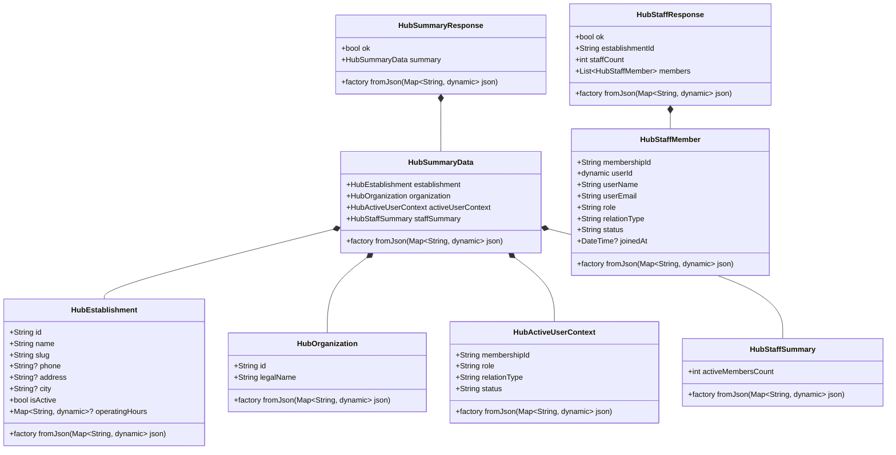
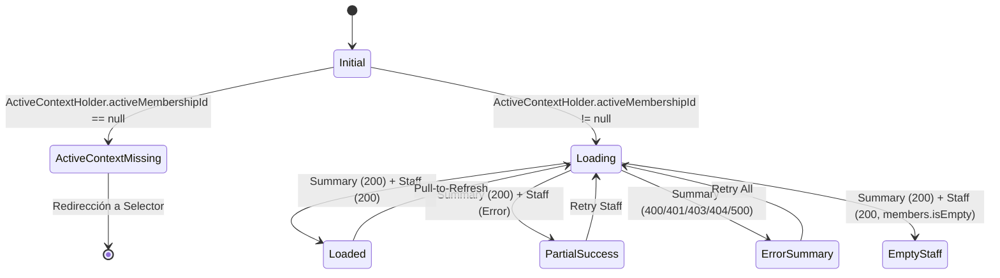

# NODO-07 — FASE 4 — ARQUITECTURA FÍSICA HUB SALÓN
**Document ID**: NODO-07-PHASE-04-HUB-SALON-PHYSICAL-ARCHITECTURE  
**Status**: APPROVED / RECONCILED (AWAITING DIRECTOR IMPLEMENTATION AUTHORIZATION)  
**Date**: 2026-09-12  
**Author**: Director del Proyecto GlowApp SaaS / Agentic System Architecture  
**Scope**: Definición física y estructural reconciliada del Hub Salón para GlowApp SaaS en Flutter.  
**Rule**: ZERO CODE IMPLEMENTATION. ARCHITECTURE DESIGN ONLY.

---

## 1. SCOPE & OBJECTIVE

### 1.1 Scope
El presente documento establece la **Arquitectura Física Formal y Reconciliada** del componente **Hub Salón** (`HubSalonScreen`), sus modelos de transferencia de datos (`HubSummaryResponse`, `HubStaffResponse`) y su servicio de transporte HTTP (`HubSalonService`) dentro de la aplicación cliente Flutter de GlowApp SaaS.

### 1.2 Objective
Transformar el descubrimiento forense aprobado (`NODO-07-PHASE-04-HUB-SALON-DISCOVERY.md`) y las directrices de revisión del Director en una especificación técnica rigurosa y verificable, asegurando:
1. Respeto absoluto del contexto activo (`ActiveContextHolder`) como única autoridad de tenencia en memoria RAM.
2. Cero generación de identificadores sintéticos (`salon_id`, `tenant_id`, etc.).
3. Eliminación total de datos no respaldados por endpoints vigentes (Principio: **NO DATA -> NO CARD**).
4. Reducción conceptual estricta del Hub Salón a un **Cockpit de Contexto, Información Operativa Real y Navegación**.
5. Delimitación infranqueable de fronteras frente a los nodos cerrados de backend (NODO-02 Catálogo, NODO-03A Staff/Horarios, NODO-04 Materialización, NODO-05 Slots, NODO-06 Citas) sin consumir vistas ni calcular lógica de dominio downstream en esta fase.
6. Aislamiento total frente a `ProviderDashboardScreen` (pantalla B2C Home Services de 3,053 líneas).
7. Reconciliación canónica del rol operativo de membresía: **`PROFESSIONAL`** (eliminando cualquier referencia a términos no canónicos como `SPECIALIST`).

---

## 2. ARCHITECTURAL PRECEDENCE & INVARIANTS

### 2.1 Cadena de Precedencia
1. **NODO-07 Contract v1.0**: CLOSED / IMMUTABLE.
2. **NODO-07 Fase 1 (SaaS Client Infrastructure)**: CLOSED / IMMUTABLE (`ActiveContextHolder`, inyección de header `x-active-membership-id` en `ApiService`).
3. **NODO-07 Fase 2 (Available Context Contract & Discovery)**: CLOSED / IMMUTABLE (`DEC-N07-AC-001` - selección explícita obligatoria).
4. **NODO-07 Fase 3 (Available Context Implementation & Final Audit)**: CLOSED / IMMUTABLE (`AvailableContextSelectorScreen`, 21/21 SaaS tests pasando).
5. **NODO-07 Fase 4 (Hub Salón Discovery)**: APPROVED / CLOSED (`ncp/NODO-07-PHASE-04-HUB-SALON-DISCOVERY.md`).

### 2.2 Invariantes de Tenencia y Membresía
- **INVARIANTE 1 (Tenencia en RAM)**: `ActiveContextHolder.activeMembershipId` es la **ÚNICA** clave de contexto permitida para interactuar con los endpoints SaaS del Hub Salón. Reside exclusivamente en memoria de proceso y no se persiste en almacenamiento local ni caché.
- **INVARIANTE 2 (Cero Mutación Automática)**: El Hub Salón **NUNCA** fija, muta o auto-selecciona un `membership_id` en `ActiveContextHolder` durante su ciclo de vida (`initState` o `loadHubData`).
- **INVARIANTE 3 (Guardián de Contexto Local)**: Si `ActiveContextHolder.activeMembershipId == null` al montar el Hub Salón, la pantalla aborta cualquier consulta de negocio y renderiza inmediatamente el estado `active_context_missing`, ofreciendo redirección hacia `AvailableContextSelectorScreen`.
- **INVARIANTE 4 (Aislamiento B2C / SaaS)**: Cero contaminación B2C <-> B2B/SaaS. No se reutilizan widgets acoplados al flujo de servicios a domicilio de `ProviderDashboardScreen`.
- **INVARIANTE 5 (Principio No Data -> No Card)**: No se renderizan tarjetas ni contadores métricos (e.g. citas del día, ingresos, ventas, disponibilidad, ocupación) que no provengan directamente de los endpoints REST autorizados.
- **INVARIANTE 6 (Role != Autorización Frontend)**: El `role` reportado por el backend se utiliza exclusivamente para presentación visual y adaptación de copy. El backend es la autoridad absoluta de control de acceso.

---

## 3. BACKEND FORENSIC ENDPOINT SPECIFICATIONS

El Hub Salón interactúa exclusivamente con los dos endpoints REST autorizados en el backend SaaS (`backend/src/routes/hubSalonRoutes.js` -> `backend/src/controllers/hubSalonController.js` -> `backend/src/services/hubSalonService.js`):

### 3.1 Endpoint 1: Resumen Operativo (`GET /api/v1/saas/hub/summary`)
- **Protección**: `authMiddleware` + `activeContextMiddleware`.
- **Headers Requeridos**:
  - `Authorization: Bearer <jwt_token>`
  - `x-active-membership-id: <uuid>` (inyectado automáticamente por `ApiService`)
- **Status Codes**:
  - `200 OK`: Contexto válido y datos de resumen encontrados.
  - `400 Bad Request`: Header `x-active-membership-id` ausente o no es UUID válido.
  - `401 Unauthorized`: JWT expirado o inválido.
  - `403 Forbidden`: Membresía no activa, usuario no coincide con el token, o sin acceso al establecimiento.
  - `404 Not Found`: Establecimiento o membresía no encontrada.
- **Estructura JSON Canónica (200 OK)**:
```json
{
  "ok": true,
  "summary": {
    "establishment": {
      "id": "c625ebfa-fb6b-4b20-928d-cf42dca9c3da",
      "name": "Salón Central",
      "slug": "salon-central",
      "phone": "+573001112233",
      "address": "Calle 100 # 15-20",
      "city": "Bogotá",
      "is_active": true,
      "operating_hours": {
        "monday": {"open": "08:00", "close": "20:00"}
      }
    },
    "organization": {
      "id": "e9a8d9b1-5360-4963-b847-a7ea6d123b38",
      "legal_name": "Belleza Integral S.A.S."
    },
    "active_user_context": {
      "membership_id": "b3c2a1e0-7489-4a5f-8b2c-9d8e7f6a5b4c",
      "role": "OWNER",
      "relation_type": "PRIMARY",
      "status": "ACTIVE"
    },
    "staff_summary": {
      "active_members_count": 4
    }
  }
}
```

### 3.2 Endpoint 2: Directorio de Personal (`GET /api/v1/saas/hub/staff`)
- **Protección**: `authMiddleware` + `activeContextMiddleware`.
- **Headers Requeridos**:
  - `Authorization: Bearer <jwt_token>`
  - `x-active-membership-id: <uuid>` (inyectado automáticamente por `ApiService`)
- **Status Codes**:
  - `200 OK`: Miembros activos recuperados con éxito.
  - `400 / 401 / 403 / 404`: Señales de infraestructura y contrato gestionadas por middleware.
- **Estructura JSON Canónica (200 OK)**:
```json
{
  "ok": true,
  "establishment_id": "c625ebfa-fb6b-4b20-928d-cf42dca9c3da",
  "staff_count": 2,
  "members": [
    {
      "membership_id": "b3c2a1e0-7489-4a5f-8b2c-9d8e7f6a5b4c",
      "user_id": 7,
      "user_name": "Diego Romero",
      "user_email": "diego@glowapp.com",
      "role": "OWNER",
      "relation_type": "OWNER_PARTNER",
      "status": "ACTIVE",
      "joined_at": "2026-03-01T10:00:00.000Z"
    },
    {
      "membership_id": "f1e2d3c4-b5a6-4978-8899-001122334455",
      "user_id": 12,
      "user_name": "Laura Estilista",
      "user_email": "laura@glowapp.com",
      "role": "PROFESSIONAL",
      "relation_type": "STAFF_EMPLOYEE",
      "status": "ACTIVE",
      "joined_at": "2026-03-05T14:30:00.000Z"
    }
  ]
}
```

> **Evidencia Forense de Roles**: La migración `065_saas_foundation_core.sql` (Línea 77) define el CHECK constraint estricto: `CHECK (role IN ('OWNER', 'MANAGER', 'PROFESSIONAL', 'RECEPTIONIST'))`. El valor canónico para estilistas y especialistas es **`PROFESSIONAL`**.

---

## 4. ACTIVE CONTEXT INTEGRITY & INVARIANTS

### 4.1 Ciclo de Vida del Contexto Activo en Memoria
```
[ Available Context Selector Screen ]
                  │
                  ▼ (Selección Explícita)
[ ActiveContextHolder.setActiveMembershipId(uuid) ]
                  │
                  ▼ Navigator.pushReplacement / push
         [ HubSalonScreen ]
                  │
                  ├──► Lee ActiveContextHolder.activeMembershipId
                  │       │
                  │       ├── [null] ──► Renderiza "Active Context Missing" Error State
                  │       │
                  │       └── [UUID válido] ──► Invoca HubSalonService
                  │                                   │
                  │                                   ▼
                  │                        ApiService.get("/api/v1/saas/hub/...")
                  │                                   │
                  │                                   ▼ Inyecta header
                  │                        `x-active-membership-id: <UUID>`
                  │
                  └──► Botón "Cambiar Sucursal / Contexto"
                          │
                          ▼ Navigator.push
         [ AvailableContextSelectorScreen ]
```

### 4.2 Prohibición de Persistencia Oculta
- `ActiveContextHolder` es memoria de proceso pura. No se persiste en disco, `SharedPreferences` ni cookies.
- Un reinicio real de la aplicación o proceso inicia con `activeMembershipId == null`, requiriendo selección explícita a través de `AvailableContextSelectorScreen`.

---

## 5. HUB SALON DTO MODELS ARCHITECTURE

**Ubicación Proyectada**: `frontend/lib/models/saas/hub_salon_model.dart`  
**Tipo**: Archivo nuevo (`NEW`).

### 5.1 Diagrama de Clases DTO


### 5.2 Estructura y Reglas de Deserialización
- **Correspondencia 1:1 Estricta**: No se agregan campos sintéticos como `permissions`, `capabilities`, `can_edit`, `can_delete`, `is_selected`, `tenant_id_synthetic`, `salon_id_synthetic`.
- **Manejo Defensivo de Nulos**: `phone`, `address`, `city`, `operatingHours` y `joinedAt` son nillables con parseo seguro.
- **Tipos de Identidad**: `userId` soporta `int` o `String` de forma defensiva (`json['user_id']?.toString()`).
- **Valores Canónicos de Rol**: `role` se deserializa tal como lo entrega el backend (`OWNER`, `MANAGER`, `PROFESSIONAL`, `RECEPTIONIST`).

---

## 6. HUB SALON SERVICE ARCHITECTURE

**Ubicación Proyectada**: `frontend/lib/services/hub_salon_service.dart`  
**Tipo**: Archivo nuevo (`NEW`).

### 6.1 Responsabilidades
1. Consumir `GET /api/v1/saas/hub/summary` mediante `ApiService`.
2. Consumir `GET /api/v1/saas/hub/staff` mediante `ApiService`.
3. Ofrecer un método orquestador `getCockpitData()` que ejecute ambas consultas de forma concurrente (`Future.wait`).
4. Mapear respuestas no exitosas a excepciones de dominio (`HubSalonException`).

### 6.2 Definición de Métodos
```dart
class HubSalonService {
  final ApiService _apiService;

  HubSalonService({ApiService? apiService}) 
      : _apiService = apiService ?? ApiService();

  Future<HubSummaryResponse> getSummary() async {
    final response = await _apiService.get('/api/v1/saas/hub/summary');
    if (response.statusCode == 200) {
      return HubSummaryResponse.fromJson(jsonDecode(response.body));
    }
    throw HubSalonException(
      statusCode: response.statusCode,
      message: 'Failed to fetch hub summary',
    );
  }

  Future<HubStaffResponse> getStaff() async {
    final response = await _apiService.get('/api/v1/saas/hub/staff');
    if (response.statusCode == 200) {
      return HubStaffResponse.fromJson(jsonDecode(response.body));
    }
    throw HubSalonException(
      statusCode: response.statusCode,
      message: 'Failed to fetch hub staff',
    );
  }

  Future<HubCockpitData> getCockpitData() async {
    final summaryFuture = getSummary();
    final staffFuture = getStaff();
    final results = await Future.wait([summaryFuture, staffFuture]);
    return HubCockpitData(
      summary: results[0] as HubSummaryResponse,
      staff: results[1] as HubStaffResponse,
    );
  }
}

class HubCockpitData {
  final HubSummaryResponse summary;
  final HubStaffResponse staff;
  HubCockpitData({required this.summary, required this.staff});
}

class HubSalonException implements Exception {
  final int statusCode;
  final String message;
  HubSalonException({required this.statusCode, required this.message});
}
```

---

## 7. HUB SALON UI COMPONENT & SCREEN ARCHITECTURE

**Ubicación Proyectada**: `frontend/lib/screens/saas/hub_salon_screen.dart`  
**Tipo**: Archivo nuevo (`NEW`).

### 7.1 Arquitectura Visual Reconciliada del Cockpit
```
┌─────────────────────────────────────────────────────────────┐
│ App Bar: [Nombre Establecimiento]  [Rol: OWNER] [Sucursales]│
├─────────────────────────────────────────────────────────────┤
│ SECCIÓN A: CONTEXTO DEL SALÓN                               │
│ - Organización Legal: Belleza Integral S.A.S.              │
│ - Dirección: Calle 100 # 15-20, Bogotá                      │
│ - Estado: [ACTIVO / OPERACIONAL]                            │
├─────────────────────────────────────────────────────────────┤
│ SECCIÓN B: ACTIVE CONTEXT BADGE                             │
│ - Membresía: b3c2a1e0... | Relación: PRIMARY / OWNER_PARTNER │
├─────────────────────────────────────────────────────────────┤
│ SECCIÓN C: INFORMACIÓN OPERATIVA REAL (QUICK STATS)         │
│ ┌─────────────────────────────────────────────────────────┐ │
│ │  Personal Activo: 4 integrantes                         │ │
│ │  (Fuente: summary.staff_summary.active_members_count)   │ │
│ └─────────────────────────────────────────────────────────┘ │
├─────────────────────────────────────────────────────────────┤
│ SECCIÓN D: NAVEGACIÓN MODULAR (ACCESOS DIRECTOS)            │
│ [ Catálogo (N02) ]  [ Personal / Horarios (N03A) ] [Agenda] │
├─────────────────────────────────────────────────────────────┤
│ SECCIÓN E: DIRECTORIO DE PERSONAL (PREVIEW REAL)            │
│ - Diego Romero (OWNER)                                      │
│ - Laura Estilista (PROFESSIONAL)                            │
│ - [ Ver Directorio Completo ]                               │
└─────────────────────────────────────────────────────────────┘
```

> **Regla de Visualización**: Se eliminó la tarjeta "Citas Hoy" y cualquier métrica no respaldada por los endpoints vigentes. La métrica de personal activo se presenta de forma única y coherente.

---

## 8. UI STATE ARCHITECTURE & HANDLING

### 8.1 Máquina de Estados del Hub


### 8.2 Matriz de Estados y Códigos de Infraestructura
| Estado UI | Condición Técnica | Comportamiento UI | Acción del Usuario |
| :--- | :--- | :--- | :--- |
| **`loading`** | `isLoading == true` | Skeleton de carga central | Bloqueante |
| **`loaded`** | Summary (200) + Staff (200) | Cockpit completo con Contexto, Personal Activo y Accesos | Pull-to-refresh, navegar módulos, cambiar sucursal |
| **`empty_staff`** | Summary OK, `staff.members.isEmpty` | Header OK + Empty state en directorio de staff | Refresh |
| **`partial_success`** | Summary OK, Staff falló | Contexto y Métricas OK + Banner de error en staff | Botón "Reintentar Personal" |
| **`error_summary`** | Summary falló (400/401/403/404/500/Red) | Vista completa de error con señal de contrato | Botón "Reintentar Carga" |
| **`active_context_missing`** | `activeMembershipId == null` | Bloqueo: "No hay un contexto de salón activo seleccionado" | Botón "Seleccionar Salón" -> Navega a Selector |

> **Semántica de Códigos HTTP**: Los códigos 400 (contexto faltante), 401 (no autenticado), 403 (membresía no autorizada) y 404 (establecimiento no encontrado) son tratados como señales estrictas de infraestructura/contrato de backend, no como lógica de autorización calculada en Flutter.

---

## 9. MULTI-BRANCH CONTEXT SWITCHER SPECIFICATION

### 9.1 Flujo Canónico de Selección Explícita
1. El usuario presiona **"Cambiar Sucursal"** en el Hub.
2. Navegación hacia `AvailableContextSelectorScreen`.
3. El usuario visualiza la lista de salones/membresías disponibles y realiza una **selección explícita** obligatoria (`DEC-N07-AC-001`).
4. `AvailableContextSelectorScreen` invoca `ActiveContextHolder.setActiveMembershipId(selectedMembershipId)`.
5. Al reingresar al Hub Salón, la pantalla detecta el nuevo identificador y recarga automáticamente el cockpit.
6. **Cero persistencia oculta**: No se implementa `last_active_membership_id` ni mecanismos de auto-restauración.

---

## 10. HUB VS PROVIDER DASHBOARD ISOLATION & DISAMBIGUATION

| Dimensión | `ProviderDashboardScreen` (B2C) | `HubSalonScreen` (B2B SaaS) |
| :--- | :--- | :--- |
| **Líneas de Código** | 3,053 líneas monolíticas | ~400-500 líneas modulares y limpias |
| **Modelo de Negocio** | Home Services / Profesional independiente B2C | Salón Físico / Sede Multi-tenant B2B SaaS |
| **Identidad de Tenencia** | `userId` directo en storage / auth token | `ActiveContextHolder.activeMembershipId` en RAM |
| **Header de Transporte** | Ninguno (solo JWT estándar) | `x-active-membership-id: <uuid>` obligatorio |
| **Endpoints Backend** | `/api/v1/provider/*`, `/api/v1/bookings/*` | `/api/v1/saas/hub/summary`, `/api/v1/saas/hub/staff` |
| **Regla de Aislamiento** | **PROHIBIDO MODIFICAR / PROHIBIDO REUTILIZAR WIDGETS ACOPLADOS** | **COMPONENTE INDEPENDIENTE EN `lib/screens/saas/`** |

---

## 11. DOWNSTREAM N02..N06 ARCHITECTURAL BOUNDARIES & DELEGATION PROTOCOLS

El Hub Salón actúa estrictamente como **Cockpit de Visualización y Enrutamiento**, sin consumir ni computar lógica de los nodos cerrados de backend:

1. **NODO-02 (Catálogo de Servicios y Precios)**:
   - *Frontera*: El Hub NO administra ofertas de servicios (`service_offers`), asignaciones ni precios.
   - *Protocolo*: Enrutamiento hacia futura pantalla `SaaSCommercialCatalogScreen`.
2. **NODO-03A (Staff, Especialistas y Horarios)**:
   - *Frontera*: El Hub muestra únicamente el directorio preview obtenido de `GET /api/v1/saas/hub/staff`. NO gestiona horarios semanales (`weekly_schedules`), solapamientos ni excepciones.
   - *Protocolo*: Enrutamiento hacia futura pantalla `SaaSStaffManagementScreen`.
3. **NODO-04 (Sincronización y Materialización)**:
   - *Frontera*: **El Hub actual NO consume N04**. No consulta `/api/v1/saas/hub/materializations/services`, no posee DTOs de N04 ni maneja estados de sincronización.
   - *Protocolo*: Declarado como `Hub -> NAVIGATION / FUTURE DEPENDENCY` exclusivamente.
4. **NODO-05 (Motor de Disponibilidad y Slots)**:
   - *Frontera*: El Hub NO calcula slots, no proyecta disponibilidad, no calcula ocupación ni mantiene intervalos de tiempo.
   - *Protocolo*: Declarado como `Hub -> NAVIGATION / FUTURE DEPENDENCY` exclusivamente.
5. **NODO-06 (Motor de Citas y Transacciones)**:
   - *Frontera*: El Hub NO consulta `/appointments/agenda` ni muestra listados de citas en esta fase.
   - *Protocolo*: Enrutamiento hacia futura pantalla de Agenda N06.

---

## 12. FUTURE PHYSICAL FILE PLAN

### 12.1 Archivos Nuevos a Crear en Implementación (FASE 4 - IMPLEMENTACIÓN)
| Tipo | Ruta del Archivo | Propósito |
| :--- | :--- | :--- |
| `NEW` | `frontend/lib/models/saas/hub_salon_model.dart` | DTOs tipados 1:1 para `summary` y `staff`. |
| `NEW` | `frontend/lib/services/hub_salon_service.dart` | Cliente HTTP de resumen y staff con manejo de excepciones. |
| `NEW` | `frontend/lib/screens/saas/hub_salon_screen.dart` | UI Cockpit del Hub Salón con máquina de estados completa. |
| `NEW` | `frontend/test/saas_hub_salon_test.dart` | Suite de pruebas unitarias y de widgets para el Hub. |

### 12.2 Archivos Protegidos e Inmutables (PROHIBIDO MODIFICAR)
| Archivo | Estado | Razón de Inmutabilidad |
| :--- | :--- | :--- |
| `frontend/lib/services/active_context_holder.dart` | `IMMUTABLE` | Infraestructura Fase 1 cerrada. |
| `frontend/lib/services/api_service.dart` | `IMMUTABLE` | Inyección de headers Fase 1 cerrada. |
| `frontend/lib/models/saas/available_context_model.dart` | `IMMUTABLE` | Fase 3 cerrada. |
| `frontend/lib/services/saas_context_service.dart` | `IMMUTABLE` | Fase 3 cerrada. |
| `frontend/lib/screens/saas/available_context_selector_screen.dart` | `IMMUTABLE` | Fase 3 cerrada. |
| `frontend/lib/screens/provider_dashboard_screen.dart` | `IMMUTABLE` | B2C Marketplace cerrado. |
| `frontend/lib/screens/auth/login_screen.dart` | `IMMUTABLE` | Flujo de login protegido. |
| `frontend/lib/screens/auth/register_screen.dart` | `IMMUTABLE` | Flujo de registro protegido. |
| `frontend/lib/main.dart` | `PROTECTED` | Inalterado. No se registran rutas en esta fase. |

---

## 13. ROUTE & NAVIGATION ARCHITECTURE

### 13.1 Estado de Ruta
- Ruta proyectada: `'/saas/hub'` -> `PROPOSAL — NOT IMPLEMENTED`.
- **Regla Estricta**: No modificar `frontend/lib/main.dart` en esta fase. El control de Active Context pertenece a la pantalla/infraestructura cuando la ruta sea formalmente autorizada para registro.

---

## 14. VERIFICATION & TESTING STRATEGY

La futura suite de pruebas (`frontend/test/saas_hub_salon_test.dart`) verificará:
1. Deserialización DTO 1:1 de `HubSummaryResponse` y `HubStaffResponse` con roles canónicos (`OWNER`, `MANAGER`, `PROFESSIONAL`, `RECEPTIONIST`).
2. Consumo de endpoints con inyección automática de `x-active-membership-id`.
3. Manejo de excepciones ante fallos de red o errores HTTP.
4. Renderizado correcto de estados UI (`loading`, `loaded`, `empty_staff`, `partial_success`, `error_summary`, `active_context_missing`).

---

## 15. SECURITY, TENANCY & PRIVACY SAFEGUARDS

1. **Role != Autorización Frontend**: El campo `role` recibido en `summary.active_user_context.role` se usa únicamente para presentación UX (adaptar copies o badges). El backend es la **única autoridad** sobre autorizaciones y permisos de ejecución.
2. **Anti-ID Spoofing**: El cliente nunca envía `establishment_id` o `organization_id` en el cuerpo de peticiones para determinar acceso; el backend resuelve y valida la tenencia a través del `membership_id` enlazado a la sesión JWT del usuario.
3. **Aislamiento Multi-Tenant RLS**: Garantizado a nivel de base de datos PostgreSQL mediante políticas RLS forzadas en backend.

---

## 16. TECHNICAL & OPERATIONAL RISK ASSESSMENT

| Riesgo Identificado | Impacto | Mitigación Arquitectónica |
| :--- | :--- | :--- |
| Reinicio de la aplicación (proceso termina) | Bajo / Esperado | `ActiveContextHolder` inicia en `null` y la UI renderiza `active_context_missing` con botón de selección explícita. |
| Desincronización entre resumen y directorio de staff | Medio | Carga concurrente protegida (`Future.wait`) con soporte para estado `partial_success`. |
| Acoplamiento con `ProviderDashboard` | Crítico | Pantalla y DTOs 100% aislados en `lib/screens/saas/` y `lib/models/saas/`. |

---

## 17. PHASE CLOSURE & STOP CONDITIONS

- **FASE 4 - ARQUITECTURA FÍSICA**: **RECONCILIADA Y FORMALIZADA**.
- **CÓDIGO IMPLEMENTADO**: **0 LÍNEAS** (Estrictamente cumplido).
- **CONDICIÓN DE PARADA**: **ARCHITECTURAL STOP**.
- **PRÓXIMO PASO**: Esperar auditoría y autorización formal del Director para proceder con la FASE 4 - IMPLEMENTACIÓN FÍSICA.

---

## ARCHITECTURAL RECONCILIATION — DIRECTOR REVIEW

A continuación se detallan los hallazgos, evidencias y correcciones aplicadas para cada una de las observaciones formuladas por el Director:

### 1. Reconciliación Canónica de Roles
- **Finding**: El documento previo utilizaba `"SPECIALIST"` en el ejemplo y diagrama de personal de Hub.
- **Evidence**: Inspección forense en `backend/migrations/065_saas_foundation_core.sql` (Línea 77: `CHECK (role IN ('OWNER', 'MANAGER', 'PROFESSIONAL', 'RECEPTIONIST'))`) y tests unitarios de N01..N06. El término `SPECIALIST` no existe en la base de datos ni en el backend.
- **Correction**: Reemplazo total de `SPECIALIST` por el valor canónico **`PROFESSIONAL`** en DTOs, ejemplos JSON y diagramas.
- **Architectural Consequence**: Cero mappings o conversiones en frontend; correspondencia 1:1 estricta con el contrato de base de datos.

### 2. Eliminación de Métrica "Citas Hoy"
- **Finding**: La maqueta visual incluía una tarjeta de "Citas Hoy", dato no presente en los endpoints autorizados de Hub.
- **Evidence**: `GET /api/v1/saas/hub/summary` entrega únicamente `establishment`, `organization`, `active_user_context` y `staff_summary.active_members_count`. No entrega contadores de citas.
- **Correction**: Eliminación completa de "Citas Hoy" bajo el principio **NO DATA -> NO CARD**.
- **Architectural Consequence**: Cero llamadas no autorizadas a N06 o agregaciones sintéticas en Flutter.

### 3. Reconciliación de NODO-04 (Materialización)
- **Finding**: El documento afirmaba que el Hub "consume vistas ya materializadas por el backend".
- **Evidence**: El Hub actual únicamente consume `/summary` y `/staff`. No consume `/api/v1/saas/hub/materializations/services`.
- **Correction**: N04 queda clasificado formalmente como `Hub -> NAVIGATION / FUTURE DEPENDENCY` (NO `Hub -> READ N04`).
- **Architectural Consequence**: No se agregan DTOs de N04, consultas de materialización ni estados de sincronización al Hub.

### 4. Seguridad: Role != Autorización Frontend
- **Finding**: La formulación previa sugería que la UI del Hub gestionaba permisos y accesos según el rol.
- **Evidence**: El modelo de seguridad SaaS delega la autorización exclusivamente a los middlewares y RLS del backend.
- **Correction**: Reformulación de la sección de seguridad. `role` se utiliza únicamente para presentación UX y badges visuales.
- **Architectural Consequence**: Prohibición de capability matrices o guards de seguridad exclusivos en frontend.

### 5. Consolidación de Quick Stats
- **Finding**: Riesgo de duplicar o inventar métricas operativas.
- **Evidence**: Solo existen `summary.staff_summary.active_members_count` y `staff.staff_count`.
- **Correction**: Consolidación en una única tarjeta de "Personal Activo". Prohibición de inventar métricas no provistas por el backend.
- **Architectural Consequence**: Coherencia absoluta entre payload de backend y visualización del cockpit.

### 6. Reducción Conceptual del Hub como Cockpit
- **Finding**: El Hub contenía definiciones que excedían su rol de presentación y navegación.
- **Evidence**: Contratos cerrados de N01..N06.
- **Correction**: El Hub queda estrictamente acotado a: Contexto, Información Operativa Real y Navegación hacia módulos externos.
- **Architectural Consequence**: Mantenimiento de límites modulares limpios y desacoplados.

### 7. Reconciliación NODO-05 y NODO-06
- **Finding**: Posible ambigüedad sobre cómputo de slots o duplicación de agenda.
- **Evidence**: N05 es el motor de slots y N06 es la agenda transaccional.
- **Correction**: El Hub no consulta `/appointments/agenda` ni calcula slots. N05 y N06 son únicamente accesos de navegación futura.
- **Architectural Consequence**: Cero acoplamiento prematuro con motores de disponibilidad y citas.

### 8. Reconciliación NODO-02 y NODO-03A
- **Finding**: Delimitación de administración de catálogo y configuración de personal.
- **Evidence**: `service_offers` pertenece a N02 y `weekly_schedules` a N03A.
- **Correction**: El Hub solo ofrece accesos de navegación hacia Catálogo (N02) y Personal/Horarios (N03A).
- **Architectural Consequence**: El Hub no muta ofertas, precios ni disponibilidades semanales.

### 9. Aclaración Técnica sobre Memoria de Proceso
- **Finding**: Se mencionaba "garbage collection" como causa de pérdida de contexto.
- **Evidence**: `ActiveContextHolder` es un singleton en memoria RAM de proceso.
- **Correction**: Aclaración técnica: el contexto se pierde únicamente por terminación del proceso (reinicio real de la app).
- **Architectural Consequence**: No se introducen mecanismos de persistencia oculta ni `last_active_membership_id`.

### 10. Estado de Ruta Proyectada
- **Finding**: La ruta `'/saas/hub'` requería estado formal.
- **Evidence**: `main.dart` no debe modificarse en esta fase.
- **Correction**: La ruta queda registrada como `PROPOSAL — NOT IMPLEMENTED`.
- **Architectural Consequence**: Inalterabilidad garantizada de `main.dart`.
