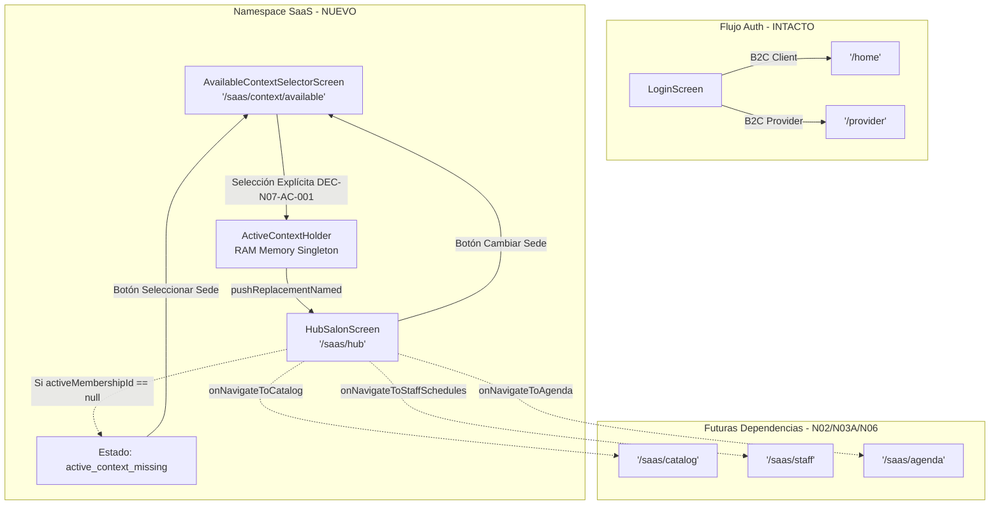

# NODO-07 — FASE 5 — DISCOVERY DE INTEGRACIÓN DE NAVEGACIÓN SAAS
**Document ID**: NODO-07-PHASE-05-SAAS-NAVIGATION-DISCOVERY  
**Status**: DISCOVERY COMPLETE / ARCHITECTURAL REVIEW  
**Date**: 2026-09-12  
**Author**: Director del Proyecto GlowApp SaaS / Agentic System Architecture  
**Scope**: Descubrimiento forense de la integración de navegación para Available Context y Hub Salón en Flutter.  
**Rule**: ZERO CODE IMPLEMENTATION. DISCOVERY & FORENSIC ANALYSIS ONLY.

---

## 1. EXECUTIVE SUMMARY

El presente documento formaliza el descubrimiento forense de la arquitectura de navegación de GlowApp Flutter, con el objetivo de definir cómo conectar de forma segura, determinista y desacoplada los componentes ya cerrados e inmutables:
- **`AvailableContextSelectorScreen`** (NODO-07 Fase 3 — CLOSED)
- **`ActiveContextHolder`** (NODO-07 Fase 1 — CLOSED)
- **`HubSalonScreen`** (NODO-07 Fase 4 — CLOSED)

### Hallazgos Principales:
1. **Sistema de Enrutamiento Actual**: `frontend/lib/main.dart` utiliza un mapa estático declarativo `routes: <String, WidgetBuilder>{ ... }` dentro de `MaterialApp` con `initialRoute: '/home'`.
2. **Desacoplamiento B2C y Auth**: El flujo de Login (`login_screen.dart`) bifurca actualmente hacia `/home` (cliente B2C), `/provider` (prestador independiente B2C) o `/onboarding`. **No requiere ninguna alteración** para habilitar la navegación SaaS.
3. **Mapeo Existente en Available Context**: `AvailableContextSelectorScreen` ya tiene programada la salida canónica hacia `Navigator.pushReplacementNamed(context, '/saas/hub')` tras la selección explícita del usuario (`DEC-N07-AC-001`).
4. **Resiliencia Autónoma del Hub**: `HubSalonScreen` ya incluye un guardián de estado interno (`active_context_missing`) probado y verificado al 100%, eliminando la necesidad de interceptores complejos de navegación en `main.dart`.
5. **Aislamiento Total de Journey**: El módulo Journey permanece en **`ARCHITECTURAL STOP`**. No se implementa autodetección, enrutamiento condicional por rol de login ni mutación de registros.

---

## 2. CURRENT NAVIGATION ARCHITECTURE

### 2.1 Inspección Forense de `frontend/lib/main.dart`
- **Mecanismo Base**: `MaterialApp` con diccionario estático `routes: <String, WidgetBuilder>{ ... }`.
- **Ruta Inicial**: `initialRoute: '/home'`.
- **Navegación Global**: Gestionada mediante `NotificationService.navigatorKey` y `Navigator.pushNamed(...)` / `Navigator.pushReplacementNamed(...)`.

### 2.2 Inventario Completo de Rutas Actuales
| Categoría | Ruta | Pantalla / Componente | Propósito |
| :--- | :--- | :--- | :--- |
| **Auth** | `'/login'` | `LoginScreen` | Inicio de sesión multi-proveedor (Email, Google, Apple, Outlook). |
| **Auth** | `'/register'` | `RegisterScreen` | Registro de usuarios nuevos. |
| **Auth** | `'/forgot-password'` | `ForgotPasswordScreen` | Recuperación de credenciales. |
| **Auth** | `'/onboarding'` | `OnboardingScreen` | Flujo de bienvenida y perfilado inicial. |
| **Auth** | `'/verification-pending'`| `VerificationPendingScreen`| Estado de espera de validación documental. |
| **B2C Marketplace** | `'/home'` | `ProvidersScreen` | Catálogo geolocalizado en mapa de prestadores a domicilio. |
| **B2C Marketplace** | `'/client-bookings'` | `ClientBookingsScreen` | Historial y estado de citas del cliente final. |
| **B2C Marketplace** | `'/booking-tracking'`| `BookingTrackingScreen` | Monitoreo en tiempo real del prestador en ruta. |
| **B2C Provider** | `'/provider'` | `ProviderDashboardScreen`| Cockpit de prestador independiente a domicilio (3,053 líneas).|
| **B2C Provider** | `'/provider/services'`| `ProviderServicesScreen` | Servicios y precios ofrecidos por el profesional independiente. |
| **B2C Provider** | `'/provider/portfolio'`| `ProviderPortfolioScreen`| Galería de trabajos realizados a domicilio. |
| **B2C Provider** | `'/provider/profile'` | `ProviderProfileScreen` | Perfil profesional y horario independiente. |
| **B2C Provider** | `'/provider-route'` | `ProviderRouteScreen` | Vista de navegación GPS hacia el domicilio del cliente. |
| **B2C Provider** | `'/provider/academy'` | `AcademyScreen` | Módulo educativo para prestadores. |
| **Perfil / Soporte**| `'/profile'` | `UserProfileScreen` | Perfil del usuario autenticado. |
| **Perfil / Soporte**| `'/my-glow'` | `MyGlowDashboardScreen` | Dashboard de fidelización y puntos. |
| **Perfil / Soporte**| `'/support'` | `SupportCenterScreen` | Centro de ayuda y tickets. |
| **Perfil / Soporte**| `'/terms'` | `TermsConditionsScreen` | Términos y condiciones de la plataforma. |
| **Perfil / Soporte**| `'/disputes'` | `DisputesListScreen` | Lista de disputas operacionales. |
| **Perfil / Soporte**| `'/dispute'` | `OpenDisputeScreen` | Formulario de apertura de disputa. |
| **Perfil / Soporte**| `'/chat'` | `ChatListScreen` | Mensajería interna cliente <-> prestador. |
| **Perfil / Soporte**| `'/store'` | `StoreScreen` | Tienda de productos capilares y cosméticos. |
| **Módulos IA** | `'/ideas'` / `'/biometric-consent'` | Módulos Biométricos | Consentimiento y análisis facial IA. |
| **Módulos IA** | `'/evolution'` / `'/glowup-card'` | Diagnósticos IA | Visualización de análisis capilar y colorimetría. |
| **Módulos IA** | `'/wardrobe'` / `'/outfit-result'` | Diagnósticos IA | Recomendador de estilo y vestuario. |

> **Evidencia Forense**: Actualmente **NO existe ninguna ruta SaaS registrada** en `main.dart`. No existe `'/saas/hub'` ni `'/saas/context/available'`.

---

## 3. CURRENT AUTH NAVIGATION

### 3.1 Inspección Forense de `frontend/lib/screens/auth/login_screen.dart`
En `_handleLogin()` (Líneas 48-60):
```dart
if (result != null && mounted) {
  final bool onboardingCompleto = result['user']['onboarding_completo'] ?? false;
  final String? role = result['user']['role'];
  if (onboardingCompleto) {
    if (role == 'provider') {
      Navigator.pushReplacementNamed(context, '/provider');
    } else {
      Navigator.pushReplacementNamed(context, '/home');
    }
  } else {
    Navigator.pushReplacementNamed(context, '/onboarding');
  }
}
```
### 3.2 Comportamiento Observado
- El post-login evalúa únicamente `onboarding_completo` y `role == 'provider'`.
- Este flujo pertenece 100% al modelo **B2C Marketplace** y no contiene lógica SaaS ni Journey.
- **Conclusión**: Modificar `login_screen.dart` para desviar condicionalmente hacia SaaS violaría la regla de **Aislamiento B2C** y reactivaría prematuramente **Journey**. Por ende, Login y Register deben permanecer **INTACTOS**.

---

## 4. AVAILABLE CONTEXT EXIT ANALYSIS

### 4.1 Inspección Forense de `available_context_selector_screen.dart`
En `_handleExplicitSelection(AvailableContextItem item)` (Líneas 76-86):
```dart
void _handleExplicitSelection(AvailableContextItem item) {
  // Establecer el membership_id explícitamente en el ActiveContextHolder en memoria
  ActiveContextHolder().setActiveMembershipId(item.membershipId);

  if (widget.onContextSelected != null) {
    widget.onContextSelected!(item);
  } else {
    // Intentar navegar al Hub Salón si la ruta existe
    Navigator.of(context).pushReplacementNamed('/saas/hub');
  }
}
```

### 4.2 Comportamiento Observado
- Al seleccionar una sede, el selector actualiza `ActiveContextHolder` en memoria RAM.
- Si no se proporciona un callback custom (`onContextSelected == null`), invoca `Navigator.pushReplacementNamed(context, '/saas/hub')`.
- **Conclusión**: `AvailableContextSelectorScreen` fue concebido desde la Fase 3 para entregar el control a la ruta `'/saas/hub'`.

---

## 5. HUB ENTRY & CONTEXT RECOVERY ANALYSIS

### 5.1 Inspección Forense de `hub_salon_screen.dart`
En `_checkContextAndLoad()` (Líneas 59-73):
```dart
void _checkContextAndLoad() {
  final activeId = _contextHolder.activeMembershipId;
  if (activeId == null || activeId.isEmpty) {
    setState(() {
      _activeContextMissing = true;
      _isLoading = false;
      _cockpitData = null;
      _summaryError = null;
    });
    return;
  }
  _lastLoadedMembershipId = activeId;
  _loadCockpitData();
}
```

En `_handleContextSwitch()` (Líneas 133-153):
```dart
Future<void> _handleContextSwitch() async {
  if (widget.onNavigateToContextSelector != null) {
    widget.onNavigateToContextSelector!();
    _checkContextAndLoad();
    return;
  }

  await Navigator.of(context).push(
    MaterialPageRoute(
      builder: (_) => const AvailableContextSelectorScreen(),
    ),
  );

  if (!mounted) return;

  final currentId = _contextHolder.activeMembershipId;
  if (currentId != _lastLoadedMembershipId) {
    _checkContextAndLoad();
  }
}
```

### 5.2 Comportamiento Observado
- El Hub es autosuficiente: si se monta sin contexto activo, no se rompe ni lanza excepciones no controladas; renderiza `_buildActiveContextMissingView()`.
- Desde dicha vista, el botón "Seleccionar Sede Operativa" abre `AvailableContextSelectorScreen`.
- Al volver de la selección, detecta si `activeMembershipId` cambió y recarga el cockpit automáticamente.

---

## 6. `/saas/hub` ROUTE ANALYSIS

### 6.1 Estado Actual
- **Ruta**: `'/saas/hub'`.
- **Estado**: `PROPOSAL — NOT REGISTERED`.
- **Archivo Destino para Registro Futuro**: `frontend/lib/main.dart` (en el mapa `routes`).

### 6.2 Opciones de Registro Arquitectónico
1. **Opción A (Directa y Autónoma — RECOMENDADA)**:
   ```dart
   '/saas/hub': (_) => const HubSalonScreen(),
   ```
   *Ventajas*: Cero lógica intermedia en `main.dart`. Delega el control del estado ausente a `HubSalonScreen`, el cual ya cuenta con su máquina de estados y pruebas unitarias passing (Test 7).
2. **Opción B (Guardián en Ruta / Redirección Inmediata)**:
   ```dart
   '/saas/hub': (context) {
     if (ActiveContextHolder().activeMembershipId == null) {
       return const AvailableContextSelectorScreen();
     }
     return const HubSalonScreen();
   },
   ```
   *Desventajas*: Introduce acoplamiento innecesario en `main.dart` y enmascara la ruta solicitada por el usuario en lugar de presentar un estado claro de contexto faltante.

---

## 7. ACTIVE CONTEXT MISSING ANALYSIS

| Escenario | Entrada a `/saas/hub` sin Active Context |
| :--- | :--- |
| **Comportamiento Técnico** | `ActiveContextHolder().activeMembershipId == null`. |
| **Respuesta del Hub** | `_activeContextMissing = true`. Cero peticiones a `/summary` o `/staff`. |
| **Respuesta Visual** | Renderiza `_buildActiveContextMissingView()` con icono de advertencia, explicación clara y botón "Seleccionar Sede Operativa". |
| **Acción del Usuario** | Tap en el botón $	o$ Abre `AvailableContextSelectorScreen` $	o$ Selección Explícita $	o$ Setea `activeMembershipId` $	o$ Carga Hub. |
| **Veredicto Arquitectónico** | El comportamiento A (Hub autónomo) es el más robusto, predecible y fiel a las invariantes de Fase 4. |

---

## 8. B2C ISOLATION ANALYSIS

1. **Rutas B2C Intactas**: `/home` (`ProvidersScreen`) y `/provider` (`ProviderDashboardScreen`) operan sobre sus propios endpoints (`/api/v1/providers`, `/api/v1/bookings`) sin inyección de `x-active-membership-id`.
2. **Cero Dependencias Cruzadas**: El árbol de widgets del Hub Salón no importa temas, widgets acoplados ni modelos de la capa B2C.
3. **Persistencia Aislada**: El token JWT de autenticación es compartido a nivel de sesión en `SecureStorageService`, pero la tenencia SaaS reside exclusivamente en RAM (`ActiveContextHolder`).

---

## 9. JOURNEY BOUNDARY ANALYSIS

- **Regla Estricta**: **`JOURNEY CONTINÚA EN ARCHITECTURAL STOP`**.
- **Qué NO se debe implementar**:
  - No crear redirecciones automáticas basadas en membership tras el Login.
  - No alterar el flujo de bienvenida ni el Onboarding.
  - No implementar asistentes automáticos de creación de salón desde Login.
- **Punto de Entrada Autorizado**: La navegación a SaaS en esta etapa se activa de forma explícita o mediante la ruta canónica `'/saas/context/available'` $	o$ `'/saas/hub'`.

---

## 10. FUTURE SAAS ROUTE NAMESPACE

Para garantizar el orden y evitar colisiones con rutas existentes, todas las futuras pantallas SaaS se organizarán bajo el namespace **`/saas/*`**:

| Ruta Propuesta | Pantalla Proyectada | Nodo Relacionado | Estado Actual |
| :--- | :--- | :--- | :--- |
| `'/saas/context/available'`| `AvailableContextSelectorScreen` | NODO-07 Fase 3 | Lista para registro |
| `'/saas/hub'` | `HubSalonScreen` | NODO-07 Fase 4 | Lista para registro |
| `'/saas/catalog'` | `SaaSCommercialCatalogScreen` | NODO-02 | Futura dependencia |
| `'/saas/staff'` | `SaaSStaffManagementScreen` | NODO-03A | Futura dependencia |
| `'/saas/agenda'` | `SaaSCalendarAgendaScreen` | NODO-06 | Futura dependencia |

---

## 11. PROPOSED NAVIGATION ARCHITECTURE (FASE 5)



---

## 12. CANDIDATE FILES FOR IMPLEMENTATION

Cuando el Director autorice la **Fase 5 — Implementación de Navegación SaaS**, el alcance de modificación será mínimo y estrictamente acotado:

| Archivo | Rol en Fase 5 | Modificación Proyectada |
| :--- | :--- | :--- |
| `frontend/lib/main.dart` | **Único Objetivo de Implementación** | Importar `AvailableContextSelectorScreen` y `HubSalonScreen`, y agregar las rutas `'/saas/context/available'` y `'/saas/hub'` al diccionario `routes`. |
| `frontend/lib/screens/saas/available_context_selector_screen.dart` | `PROTECTED / READ ONLY` | Ninguna modificación necesaria (ya utiliza `'/saas/hub'`). |
| `frontend/lib/screens/saas/hub_salon_screen.dart` | `PROTECTED / READ ONLY` | Ninguna modificación necesaria (ya maneja `active_context_missing`). |
| `frontend/lib/services/active_context_holder.dart` | `IMMUTABLE` | Ninguna modificación. |
| `frontend/lib/services/api_service.dart` | `IMMUTABLE` | Ninguna modificación. |
| `frontend/lib/screens/auth/login_screen.dart` | `DO NOT TOUCH` | Ninguna modificación. |
| `frontend/lib/screens/provider_dashboard_screen.dart` | `DO NOT TOUCH` | Ninguna modificación. |

---

## 13. TEST STRATEGY (FASE 5)

Para la futura fase de implementación, se proyectará un nuevo archivo de pruebas: `frontend/test/saas_navigation_test.dart` verificando:
1. **Route Existence**: `Navigator.pushNamed(context, '/saas/hub')` y `Navigator.pushNamed(context, '/saas/context/available')` resuelven sus respectivos widgets en el árbol de `MaterialApp`.
2. **Context Missing Flow**: Navegar directamente a `'/saas/hub'` sin contexto en memoria renderiza `active_context_missing`.
3. **Context Present Flow**: Navegar a `'/saas/hub'` con contexto en memoria renderiza el Cockpit y dispara la carga de datos.
4. **Selector to Hub Flow**: Ejecutar selección explícita en `AvailableContextSelectorScreen` realiza `pushReplacementNamed` a `'/saas/hub'`.
5. **B2C Route Integrity**: Comprobar que las rutas B2C (`/home`, `/provider`, `/login`) siguen instanciándose sin efectos colaterales.

---

## 14. SECURITY & GOVERNANCE

1. **Rutas como Vistas, No Autorizaciones**: El registro de una ruta en `main.dart` no otorga acceso a datos de tenencia. Toda consulta realizada por `HubSalonService` viaja con `x-active-membership-id` y es validada por el middleware de base de datos (`activeContextMiddleware` + RLS).
2. **Anti-Tampering**: Si un usuario accede a `'/saas/hub'` con un token no perteneciente a la membresía activa, el backend responderá con `403 Forbidden` y la pantalla transicionará a `error_summary`.

---

## 15. RISKS & MITIGATIONS

| Riesgo | Impacto | Mitigación Arquitectónica |
| :--- | :--- | :--- |
| Colisión de nombres de rutas | Medio | Uso de namespace estricto y unificado `'/saas/*'`. |
| Acceso directo a `'/saas/hub'` sin contexto previo | Bajo | `HubSalonScreen` ya maneja `active_context_missing` con navegación guiada al selector. |
| Contaminación de `login_screen.dart` | Crítico | Mantener Login en `DO NOT TOUCH` hasta que Journey sea formalmente diseñado y autorizado. |

---

## 16. ARCHITECTURAL DECISION QUESTIONS

1. **¿Dónde se registra `/saas/hub`?**  
   *Respuesta*: En el mapa `routes: <String, WidgetBuilder>{ ... }` dentro de `MaterialApp` en `frontend/lib/main.dart`.
2. **¿Qué mecanismo actual de Flutter debe utilizarse?**  
   *Respuesta*: El sistema declarativo estándar de rutas nombradas (`Navigator.pushNamed` / `Navigator.pushReplacementNamed`).
3. **¿Qué ocurre si Active Context es null?**  
   *Respuesta*: `HubSalonScreen` entra automáticamente en el estado `active_context_missing`, presentando un botón para seleccionar sede.
4. **¿Cómo se evita tocar B2C?**  
   *Respuesta*: Dejando `ProvidersScreen`, `ProviderDashboardScreen` y sus servicios completamente inalterados.
5. **¿Cómo se evita tocar Journey?**  
   *Respuesta*: Manteniendo `login_screen.dart` y `register_screen.dart` sin lógica condicional de entrada SaaS.
6. **¿Cómo se conecta Available Context con Hub?**  
   *Respuesta*: Mediante la llamada ya implementada en Fase 3: `Navigator.of(context).pushReplacementNamed('/saas/hub')`.
7. **¿Qué archivos serían necesarios modificar para implementar?**  
   *Respuesta*: Exclusivamente `frontend/lib/main.dart` (para registrar los 2 endpoints de ruta) y crear `frontend/test/saas_navigation_test.dart`.
8. **¿Existe algún conflicto con la arquitectura actual?**  
   *Respuesta*: Ninguno. El diseño es 100% compatible con la infraestructura existente.
9. **¿La integración requiere modificar Fase 3 o Fase 4?**  
   *Respuesta*: **NO**. Tanto Fase 3 como Fase 4 permanecen completamente inmutables.
10. **¿Puede implementarse de forma aislada?**  
    *Respuesta*: **SÍ**, como una fase puramente de enrutamiento (Fase 5).

---

## 17. FINAL DISCOVERY VERDICT

```
====================================================================
DISCOVERY VERDICT: COMPLETE & VERIFIED
SAAS NAVIGATION INTEGRATION PATH: FULLY DETERMINED
JOURNEY BOUNDARY: STRICTLY PRESERVED (STOP)
B2C ISOLATION: 100% SECURED
NEXT STEP: AWAITING DIRECTOR PHYSICAL ARCHITECTURE AUTHORIZATION
====================================================================
```
