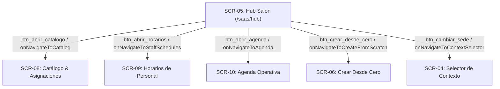

# NODO-07 — CONTRATO DE ORQUESTACIÓN DE NAVEGACIÓN DEL HUB SaaS v1.0
## GlowApp SaaS: Hub Navigation Orchestration & Deep Screen Flow Contract

**ESTADO:** CONTRACT v1.0 — RATIFIED 🔒  
**TRACK:** NODO-07 (SaaS UI Architecture)  
**TIPO DE ARTEFACTO:** Canonical Navigation Orchestration Contract  
**AUTORIDAD DE RATIFICACIÓN:** Director del Proyecto GlowApp SaaS (GO-07.17)  
**FECHA DE RATIFICACIÓN:** 2026-09-12  
**DOCUMENT VERSION:** v1.0.0 (Ratified)  

---

## 1. PURPOSE (PROPÓSITO)

El presente contrato formaliza de manera determinista, exhaustiva y canónica la orquestación integral del flujo de navegación para el subsistema **GlowApp SaaS** a partir de la selección de contexto activo, el tablero central operativo (**Hub Salón / SCR-05**), la navegación hacia sus pantallas satélite operativas (**SCR-04, SCR-06, SCR-08, SCR-09, SCR-10, SCR-11**) y los protocolos de retorno y recarga de estado.

Garantiza:
1. **Unidireccionalidad y Predecibilidad:** La topología de navegación refleja estrictamente el modelo de Navigator 1.0 (imperativo) probado físicamente en el frontend.
2. **Invarianza Estricta de Contexto Activo:** El identificador contextual (`ActiveContextHolder` $\\to$ `x-active-membership-id`) permanece inalterable a lo largo de toda la navegación profunda.
3. **Consistencia Transaccional en Retornos:** Los retornos de flujos de mutación (ej. `SCR-11` $\\to$ `SCR-10`) ejecutan recargas bajo demanda (*Demand Refresh*) de manera determinista sin provocar ciclos infinitos de recarga.

---

## 2. SCOPE (ALCANCE)

### En Alcance:
- Registro y resolución de rutas canónicas SaaS bajo el namespace `/saas/*`.
- Definición de los contratos de interfaz y callbacks de navegación de `HubSalonScreen` (`SCR-05`), `AgendaOperativaScreen` (`SCR-10`) y `ReservaInternaScreen` (`SCR-11`).
- Orquestación de saltos hacia `AvailableContextSelectorScreen` (`SCR-04`), `CrearDesdeCeroScreen` (`SCR-06`), `ServiceOfferAssignmentScreen` (`SCR-08`), y `StaffScheduleScreen` (`SCR-09`).
- Semántica de retornos (`Navigator.pop`) y propagación de resultados booleanos.
- Reglas de control de acceso por rol (RBAC) aplicadas a la navegación frontend.
- Comportamiento ante pérdida de contexto o acceso directo sin contexto activo.

### Fuera de Alcance (Explicit Non-Goals):
- Autenticación neutral y registro de cuentas (`SCR-01`, `SCR-02`, `SCR-03` como ForgotPasswordScreen).
- Lógica interna de resolución de Journey (`GRD-01`).
- Rutas del Marketplace B2C (`/home`, `/client-bookings`, `/provider`, etc.).
- Modificación de migraciones o lógica backend de `NODO-01` a `NODO-06`.
- Modificación de pantallas satélite ya cerradas (`SCR-08`, `SCR-09`, `SCR-10`, `SCR-11`).
- Migración a nuevos routers (ej. GoRouter o Navigator 2.0).
- Rediseño estético del Hub Salón.

---

## 3. CANONICAL ENTRY POINT

1. **Ruta Raíz SaaS:** `/saas/hub` registrada estáticamente en `frontend/lib/main.dart`.
2. **Mecanismo de Despacho:**
   ```dart
   routes: {
     '/saas/hub': (context) => const HubSalonScreen(),
   }
   ```
3. **Precondición de Entrada:**
   - La aplicación debe tener un token JWT válido en `FlutterSecureStorage`.
   - `ActiveContextHolder().activeMembershipId` debe contener un UUID v4 válido correspondiente a una membresía en estado `ACTIVE`.
4. **Guard Autónomo de Entrada:** Si `/saas/hub` es montado con `ActiveContextHolder().activeMembershipId == null`, `HubSalonScreen` no crashea ni redirecciona ciegamente; renderiza de forma determinista la vista de guarda `_buildActiveContextMissingView()`, cuyo botón `btn_seleccionar_contexto_missing` conduce a `AvailableContextSelectorScreen` (`SCR-04`).

---

## 4. NAVIGATION ARCHITECTURE

- **Motor:** Flutter `Navigator 1.0` (Stack Imperativo de Rutas).
- **Mecanismo de Transición:** `MaterialPageRoute` con paso de callbacks e inyección de dependencias por constructor.
- **Desacoplamiento Modular:** Cada pantalla satélite es autosuficiente y expone callbacks funcionales para delegar la navegación a su contenedor o usar `Navigator.of(context).pop()` por defecto.

---

## 5. CANONICAL SaaS SCREEN MAP

Reconciliación canónica de identificadores de pantalla del subsistema SaaS:

| Screen ID | Nombre del Widget | Ruta / Modo de Invocación | Módulo Funcional | Estado de Cierre |
| :--- | :--- | :--- | :--- | :---: |
| **SCR-04** | `AvailableContextSelectorScreen` | Modal `MaterialPageRoute` / Cambio Sede | Selector Explícito de Sedes / Contextos | **CLOSED / IMMUTABLE 🔒** |
| **SCR-05** | `HubSalonScreen` | Named Route `/saas/hub` | Cockpit Operativo Central de Sede | **CLOSED / IMMUTABLE 🔒** |
| **SCR-06** | `CrearDesdeCeroScreen` | Modal `MaterialPageRoute` desde Hub | Asistente Aprovisionamiento / Handover | **CLOSED / IMMUTABLE 🔒** |
| **SCR-08** | `ServiceOfferAssignmentScreen` | `MaterialPageRoute` desde Hub | Catálogo de Servicios y Asignaciones Staff | **CLOSED / IMMUTABLE 🔒** |
| **SCR-09** | `StaffScheduleScreen` | `MaterialPageRoute` desde Hub | Horarios Semanales y Disponibilidad Staff | **CLOSED / IMMUTABLE 🔒** |
| **SCR-10** | `AgendaOperativaScreen` | `MaterialPageRoute` desde Hub | Agenda Operativa y Flujo de Citas | **CLOSED / IMMUTABLE 🔒** |
| **SCR-11** | `ReservaInternaScreen` | `MaterialPageRoute` desde SCR-10 | Reserva Interna / Creación con Slots | **CLOSED / IMMUTABLE 🔒** |

---

## 6. HUB NAVIGATION DESTINATIONS (SCR-05)

`HubSalonScreen` (`SCR-05`) actúa como el nodo raíz de navegación operativa para la sede activa, orquestando las siguientes salidas mediante sus controles físicos:



---

## 7. TRANSICIÓN SCR-10 $\\longrightarrow$ SCR-11

La creación de nuevas citas internas se realiza exclusivamente mediante la transición guiada desde `SCR-10` hacia `SCR-11`:

1. **Punto de Activación:** Botón primario `[ + Nueva Cita ]` (`btn_nueva_cita`) en `AgendaOperativaScreen` (`SCR-10`).
2. **Callback Disparado:** `onNavigateToCreateAppointment`.
3. **Paso de Parámetros Contextuales:**
   - `initialDate`: La fecha actual observada en la agenda (`target_date` en formato `YYYY-MM-DD`).
   - `preselectedMembershipId`: UUID del colaborador seleccionado en el filtro (o `null` si opera en modo agregado).
4. **Patrón de Invocación:**
   ```dart
   final result = await Navigator.of(context).push<bool>(
     MaterialPageRoute(
       builder: (_) => ReservaInternaScreen(
         initialDate: _selectedDate,
         onAppointmentCreated: () => Navigator.of(context).pop(true),
         onCancel: () => Navigator.of(context).pop(false),
       ),
     ),
   );
   if (result == true) {
     _fetchAgenda(); // Demand Refresh inmediato
   }
   ```

---

## 8. RETURN SEMANTICS (SEMÁNTICA DE RETORNOS)

Los retornos en el stack de navegación operan bajo reglas deterministas:

| Flujo de Retorno | Disparador Físico | Valor de Retorno (`pop`) | Comportamiento en la Pantalla Receptora |
| :--- | :--- | :---: | :--- |
| **`SCR-11` $\\to$ `SCR-10` (Éxito)** | `btn_confirmar_reserva` | `true` | **Demand Refresh:** `SCR-10` invoca `_fetchAgenda()` y recarga los slots/citas del día. |
| **`SCR-11` $\\to$ `SCR-10` (Cancelación)** | `btn_cancelar` / AppBar Back | `false` o `null` | **Cero Mutación:** `SCR-10` preserva su estado visual sin recargas de red innecesarias. |
| **`SCR-10` $\\to$ `SCR-05`** | `btn_regresar_hub` / AppBar Back | `void` | Retorna al Hub Salón. |
| **`SCR-09` $\\to$ `SCR-05`** | `btn_regresar` / AppBar Back | `void` | Retorna al Hub Salón. |
| **`SCR-08` $\\to$ `SCR-05`** | `btn_regresar` / AppBar Back | `void` | Retorna al Hub Salón. |
| **`SCR-06` $\\to$ `SCR-05` (Éxito)** | Botón Finalizar Handover | `true` | Retorna al Hub Salón y dispara refresco del cockpit. |
| **`SCR-04` $\\to$ `SCR-05`** | Selección de Sede / Cierre Modal | `membership_id` | Si `currentId != lastId`, el Hub dispara `_loadCockpitData()`. |

---

## 9. ACTIVE CONTEXT INVARIANCE

> [!IMPORTANT]
> **CONTINUIDAD ABSOLUTA DE CONTEXTO SaaS:**  
> La combinación de `ActiveContextHolder` (en cliente) y el header HTTP `x-active-membership-id` (en peticiones) constituye el **único mecanismo formal de continuidad de contexto**.

1. **Inmutabilidad en Subpantallas:** Ninguna pantalla satélite (`SCR-06`, `SCR-08`, `SCR-09`, `SCR-10`, `SCR-11`) tiene permitido:
   - Cambiar de tenant o establecimiento directamente.
   - Forzar la selección de un `membership_id` alternativo.
   - Limpiar el `ActiveContextHolder` unilateralmente.
2. **Propagación HTTP:** Todas las peticiones generadas por los servicios SaaS (`HubSalonService`, `SaasAgendaService`, `SaasReservaInternaService`, `StaffScheduleService`, `ServiceOfferAssignmentService`) delegan en `ApiService`, garantizando la inyección uniforme del header.

---

## 10. CONTEXT SWITCHING (CAMBIO DE SEDE)

1. El cambio de sede operativa sólo puede iniciarse desde `HubSalonScreen` (`SCR-05`) mediante el botón `btn_cambiar_sede` (o desde la vista de falta de contexto).
2. Abre modalmente `AvailableContextSelectorScreen` (`SCR-04`).
3. Al seleccionar una nueva membresía activa:
   - `SCR-04` invoca `ActiveContextHolder().setActiveMembershipId(newId)`.
   - Se ejecuta `Navigator.pop(context, true)`.
4. Al retomar el control, `HubSalonScreen` evalúa si el identificador activo cambió y ejecuta la recarga integral de los indicadores de la nueva sede (`_loadCockpitData()`).

---

## 11. REFRESH & RELOAD SEMANTICS

Existen tres modalidades estrictas de actualización de datos:

1. **Mount Refresh (Inicial):** Ejecutado en el `initState()` de cada pantalla al montarse por primera vez.
2. **Demand Refresh (Por Demanda):** Ejecutado por una pantalla receptora tras recibir `true` en el retorno de un flujo hijo (ej. `SCR-10` tras `SCR-11` exitoso).
3. **Full Cockpit Reload:** Ejecutado exclusivamente en `HubSalonScreen` ante un cambio formal de membresía en `ActiveContextHolder`.

---

## 12. RBAC NAVIGATION BOUNDARIES

Matriz de accesibilidad y navegación según el rol de la membresía activa:

| Rol Canónico | `SCR-04` (Sedes) | `SCR-06` (Setup) | `SCR-08` (Catálogo) | `SCR-09` (Horarios) | `SCR-10` (Agenda) | `SCR-11` (Reserva) |
| :--- | :---: | :---: | :---: | :---: | :---: | :---: |
| **`OWNER`** | Permitido | Permitido | Completo (Read/Write) | Completo (Todos) | Completo (Todos) | Agregado / Específico |
| **`MANAGER`** | Permitido | Permitido | Completo (Read/Write) | Completo (Todos) | Completo (Todos) | Agregado / Específico |
| **`RECEPTIONIST`** | Permitido | Oculto / Bloqueado | Solo Lectura | Solo Lectura | Completo (Todos) | Agregado / Específico |
| **`PROFESSIONAL`** | Permitido | Oculto / Bloqueado | Solo Lectura | Confinado (Mi Horario) | Confinado (Mi Agenda) | Confinado (Propio) |

> [!NOTE]
> La navegación frontend actúa como una capa de usabilidad (UX). La seguridad real y la autorización definitiva son impuestas en todo momento por el backend mediante RLS y `activeContextMiddleware`.

---

## 13. B2C / SaaS BOUNDARY

- **Espacio de Rutas SaaS (`/saas/*`):** Requiere sesión autenticada y `ActiveContextHolder` con membresía activa.
- **Espacio de Rutas B2C (`/home`, `/explore`, `/client-bookings`):** Opera de forma pública o con identidad de cliente final sin header de membresía SaaS.
- **Aislamiento:** La navegación dentro de `/saas/*` no interfiere con las pilas de navegación ni los estados del marketplace B2C.

---

## 14. PHYSICAL CALLBACK CONTRACTS

Inventario exhaustivo de firmas de callbacks soportados físicamente:

### `HubSalonScreen` (`SCR-05`):
- `final VoidCallback? onNavigateToCatalog;`
- `final VoidCallback? onNavigateToStaffSchedules;`
- `final VoidCallback? onNavigateToAgenda;`
- `final VoidCallback? onNavigateToCreateFromScratch;`
- `final VoidCallback? onNavigateToContextSelector;`

### `AgendaOperativaScreen` (`SCR-10`):
- `final VoidCallback? onNavigateToCreateAppointment;`
- `final VoidCallback? onNavigateToHub;`

### `ReservaInternaScreen` (`SCR-11`):
- `final VoidCallback? onAppointmentCreated;`
- `final VoidCallback? onCancel;`

---

## 15. ERROR & MISSING-CONTEXT BEHAVIOR

1. **Ausencia de Contexto (`activeMembershipId == null`):**
   - Si una pantalla satélite (`SCR-08`, `SCR-09`, `SCR-10`, `SCR-11`) se abre sin contexto activo, muestra un estado vacío/informativo con mensaje `Falta contexto activo` sin generar excepciones no controladas.
   - `HubSalonScreen` renderiza la vista interactiva de guarda `_buildActiveContextMissingView()`.
2. **Error de Red o Fallo de Servidor (`500` / SocketException):**
   - Todas las pantallas presentan un banner o widget de error con botón explícito de reintento (`Reintentar`), que reejecuta la carga inicial sin destruir el stack de navegación.

---

## 16. ACCEPTANCE CRITERIA (CRITERIOS DE ACEPTACIÓN)

Para que la orquestación de navegación se considere plenamente conforme:
1. **Regresión Total:** Las 11 suites de prueba SaaS (118 pruebas compuestas por 105 pruebas de pantalla/flujo y 13 pruebas unitarias de servicio) deben ejecutarse y reportar `100% PASS`.
2. **Análisis Estático:** `flutter analyze` en los componentes de navegación y pantallas SaaS debe reportar `0 errors`.
3. **Invarianza de Contexto:** Las pruebas automatizadas deben verificar que ninguna navegación deep-link o salto satélite muta ni destruye `ActiveContextHolder`.
4. **Cero Dependencia de Guards Globales:** La navegación no debe requerir interceptores globales en `main.dart` para resolver el estado de falta de contexto.

---

## 17. EXPLICIT NON-GOALS

1. No se modificará el sistema de autenticación (`RegisterScreen`, `LoginScreen`).
2. No se alterará el esquema relacional ni los endpoints de backend (`NODO-01` a `NODO-06`).
3. No se modificarán los contratos cerrados de `SCR-08`, `SCR-09`, `SCR-10` ni `SCR-11`.
4. No se migrará `main.dart` a GoRouter ni frameworks de enrutamiento de terceros.

---

```
================================================================================
FIN DEL CONTRATO DE ORQUESTACIÓN DE NAVEGACIÓN SaaS (RATIFICADO)
================================================================================
ESTADO: CONTRACT v1.0 — RATIFIED 🔒
================================================================================
```
