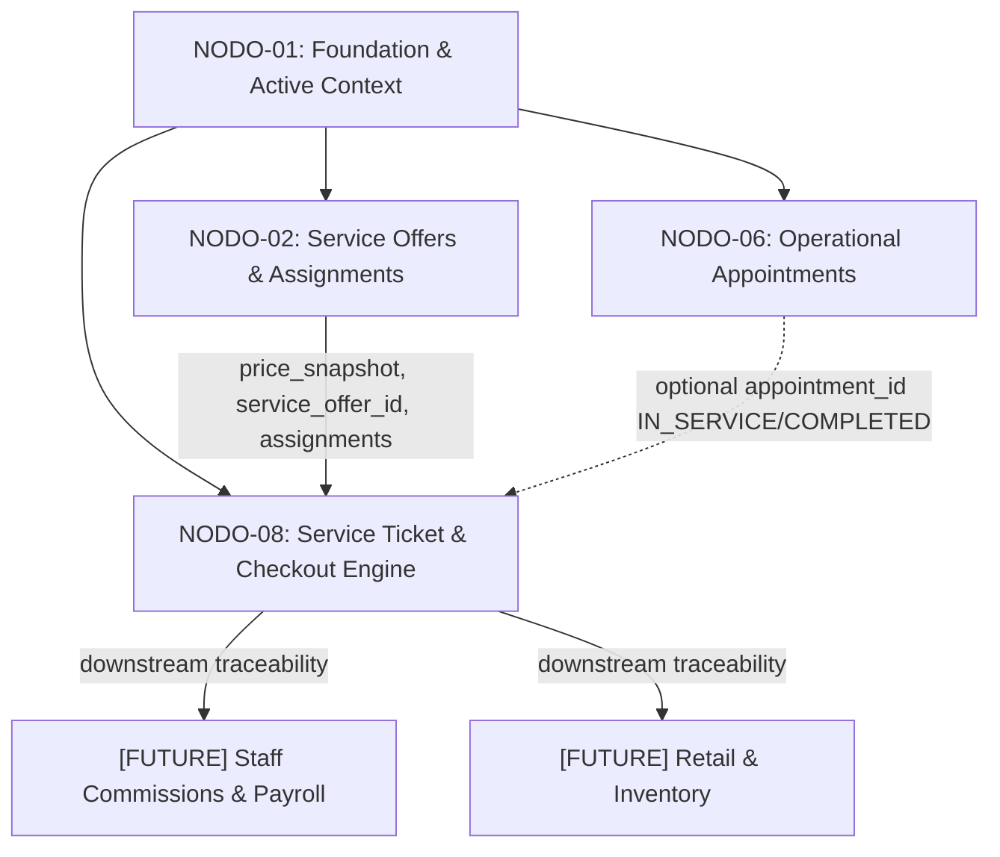

# NODO-08 — NODE CONTRACT v1.0
## GLOWAPP SaaS: SERVICE TICKET & FINANCIAL CHECKOUT ENGINE
**ESTADO:** CONTRACT v1.0 — RATIFIED 🔒  
**DOMINIO:** Financial Settlement / Service Ticket  
**AUTORIDAD DIRECTIVA:** Director del Proyecto GlowApp SaaS (GO-07.28, GO-07.30)  
**FECHA DE CREACIÓN:** 2026-09-12  
**FECHA DE RECONCILIACIÓN:** 2026-09-12 (Post-Audit GO-07.29)  

---

## 1. PURPOSE (PROPÓSITO)

`NODO-08` es la **autoridad transaccional y de persistencia financiera** para la creación, tarifación, consolidación de consumos multi-servicio, registro de pagos presenciales en mostrador (*split tender*), y cierre económico de atenciones realizadas en el salón físico.

### Distinción Fundamental frente a NODO-06:
- **NODO-06 (Appointments & Operational Agenda Runtime):** Es la autoridad operacional encargada de la reserva de tiempo, asignación de sillones y estado de servicio (`SCHEDULED` → `IN_SERVICE` → `COMPLETED`).
- **NODO-08 (Service Ticket & Checkout Engine):** Es la autoridad financiera encargada de convertir las atenciones operacionales culminadas o consumos espontáneos de mostrador en un documento transaccional monetario inmutable (`SERVICE_TICKET`), consolidando ítems, asignaciones profesionales, medios de pago físicos y recibos de liquidación.
- **Independencia Relacional:** `NODO-06` permanece `CLOSED / IMMUTABLE` 🔒. La relación entre ambos dominios es estrictamente unidireccional y desacoplada mediante la columna nullable `saas_service_tickets.appointment_id`.

---

## 2. SCOPE (ALCANCE)

### Responsabilidades Incluidas en V1:
1. Creación y gestión de documentos financieros (`saas_service_tickets`) para clientes Registrados (`REGISTERED`) e Invitados (`GUEST`).
2. Soporte de origen dual: tickets originados desde citas operacionales (`appointment_id`) y tickets de mostrador directos (*walk-in* / `appointment_id IS NULL`).
3. Generación de folio humano consecutivo e incremental por establecimiento (`TICK-000001`) mediante incremento atómico seguro contra condiciones de carrera.
4. Agrupación 1:N de ítems consumidos (`saas_ticket_items`) con soporte de tipo `SERVICE` (vinculado a catálogo NODO-02) y tipo `CUSTOM` (concepto y precio libre en mostrador).
5. Trazabilidad obligatoria del colaborador ejecutor (`performed_by_membership_id`) por cada ítem individual, con validación de asignación activa en `NODO-02`.
6. Congelamiento estricto de precios (`unit_price_snapshot`) al momento de la inserción del ítem.
7. Mutabilidad controlada de ítems y ajustes de cabecera en fases `DRAFT` y `OPEN` según RBAC y recálculo determinista en servidor.
8. Liquidación mediante pagos fraccionados (*split tender* / 1 Ticket : N Pagos) en `saas_ticket_payments` con soporte de medios físicos: `CASH`, `CARD`, `TRANSFER`, `OTHER`.
9. Ejecución determinista de máquina de estados (`DRAFT` → `OPEN` → `PAID` → `CLOSED`, con soporte de anulación `VOID`).
10. Control de acceso estricto basado en roles (`OWNER`, `MANAGER`, `RECEPTIONIST`, `PROFESSIONAL`) bajo Active Context.

---

## 3. DOMAIN BOUNDARIES & EXCLUSIONS (LÍMITES Y EXCLUSIONES)



### Exclusiones Formales de NODO-08 V1:
1. **Comisiones y Nómina:** NODO-08 **NO** calcula, liquida ni almacena porcentajes ni montos de comisión de personal. Provee exclusivamente la trazabilidad de `performed_by_membership_id` y `unit_price_snapshot` para procesamiento posterior diferido.
2. **Inventario y Stock Minorista:** NODO-08 **NO** administra inventario, bodegas ni catálogo de productos con control de existencias. Los consumos de mostrador no-servicio se registran como `CUSTOM`.
3. **Motor Fiscal / Leyes Tributarias:** NODO-08 **NO** implementa un motor tributario ni lógica impositiva legal. Los campos `tax_amount` y `discount_amount` son valores monetarios transaccionales directos.
4. **Tratamiento Legal / Pool de Propinas:** `tip_amount` es un valor transaccional libre. No se aplican reglas de reparto (*tip pool*) ni deducciones fiscales.
5. **Aislamiento B2C:** NODO-08 **NO** escribe ni lee de `public.bookings`, `public.services`, ni interactúa con Stripe Connect / Payment Intents online.

---

## 4. ACTIVE CONTEXT (CONTEXTO ACTIVO)

NODO-08 se rige por la autoridad canónica e inmutable de Active Context:
- **Cabecera HTTP Canónica Obligatoria:** `x-active-membership-id: <UUID>`
- **Runtime Frontend:** `ActiveContextHolder` (gestiona en RAM únicamente `_activeMembershipId`).
- **Resolución Server-Side:** `activeContextMiddleware` valida la membresía activa y deriva en el servidor `tenant_id`, `establishment_id` y `role`.
- **Prohibiciones Absolutas:**
  - Prohibido el uso de headers sintéticos (`x-active-establishment-id`, `x-tenant-id`, etc.).
  - Prohibido el paso de `tenant_id` o `establishment_id` en el body o query params como autoridad contextual.
- **Aislamiento RLS:** Transaccional mediante `SELECT set_config('app.tenant_id', $1, true);`.

---

## 5. NODO-06 BOUNDARY & APPOINTMENT ORIGIN RULES

1. **Inmutabilidad Absoluta de NODO-06:** La tabla `saas_appointments` **NO** se modifica, **NO** recibe columna foránea `ticket_id` y permanece inalterada.
2. **Cardinalidad Cita → Ticket:** Una cita operacional en `saas_appointments` puede estar asociada a **como máximo UN ticket de servicio activo (no-VOID)**. Si un ticket previo es anulado (`VOID`), se permite crear un nuevo ticket para la misma cita.
3. **Estados de Cita Habilitados para Origen de Ticket:**
   - Un ticket con `appointment_id` únicamente puede originarse si la cita se encuentra en estado operacional:
     - `IN_SERVICE`
     - `COMPLETED`
   - Se rechaza con error `400 / 422` la creación de tickets asociados a citas en estados: `SCHEDULED`, `CONFIRMED`, `CHECKED_IN`, `CANCELLED` o `NO_SHOW`.
4. **Validación de Sede y Tenant:** El servidor valida que el `tenant_id` y `establishment_id` de la cita coincidan exactamente con el contexto activo de la sesión.

---

## 6. RATIFIED ARCHITECTURAL DECISIONS

En estricto cumplimiento de las directivas GO-07.28 y GO-07.30, se incorporan las siguientes decisiones ratificadas:

| Código | Decisión Ratificada | Implementación Contractual |
| :--- | :--- | :--- |
| **`DEC-08-01`** | **Perímetro de Ítems V1** | Soportar exclusivamente tipos `SERVICE` y `CUSTOM / MANUAL`. `PRODUCT` e `INVENTORY` quedan formalmente excluidos. |
| **`DEC-08-02`** | **Soporte de Split Tender** | Relación 1:N entre `saas_service_tickets` y `saas_ticket_payments`. Medios: `CASH`, `CARD`, `TRANSFER`, `OTHER`. Sin pasarelas online externas. |
| **`DEC-08-03`** | **Folio Humano Consecutivo Atómico** | Cada ticket posee `id` (UUID PK) y `ticket_number` incremental por establecimiento con formato `TICK-000001`, generado vía `UPDATE ... RETURNING` bajo transacción atómica. |

---

## 7. DATA MODEL DDL (ESPECIFICACIÓN RELACIONAL CANDIDATA)

### 7.1 Tabla `saas_service_tickets` (Cabecera Financiera)

```sql
CREATE TABLE saas_service_tickets (
    id UUID PRIMARY KEY DEFAULT gen_random_uuid(),
    tenant_id INTEGER NOT NULL,
    establishment_id UUID NOT NULL,
    ticket_number VARCHAR(30) NOT NULL,
    
    -- Origen Opcional de Cita Operacional (NODO-06)
    appointment_id UUID,
    
    -- Representación Dual de Cliente (XOR)
    client_mode VARCHAR(20) NOT NULL DEFAULT 'GUEST',
    customer_user_id INTEGER,
    guest_name_snapshot VARCHAR(150),
    guest_phone_snapshot VARCHAR(30),
    guest_email_snapshot VARCHAR(255),
    
    -- Máquina de Estados Financiera
    status VARCHAR(30) NOT NULL DEFAULT 'DRAFT',
    
    -- Componentes Financieros Transaccionales (Server-Calculated)
    subtotal_amount NUMERIC(12, 2) NOT NULL DEFAULT 0.00,
    discount_amount NUMERIC(12, 2) NOT NULL DEFAULT 0.00,
    discount_reason VARCHAR(255),
    tax_amount NUMERIC(12, 2) NOT NULL DEFAULT 0.00,
    tip_amount NUMERIC(12, 2) NOT NULL DEFAULT 0.00,
    total_amount NUMERIC(12, 2) NOT NULL DEFAULT 0.00,
    paid_amount NUMERIC(12, 2) NOT NULL DEFAULT 0.00,
    balance_due NUMERIC(12, 2) NOT NULL DEFAULT 0.00,
    
    -- Notas y Observaciones
    notes TEXT,
    
    -- Trazabilidad de Actores (Memberships)
    created_by_membership_id UUID NOT NULL,
    closed_by_membership_id UUID,
    voided_by_membership_id UUID,
    void_reason TEXT,
    
    -- Tiempos Transaccionales
    created_at TIMESTAMPTZ NOT NULL DEFAULT NOW(),
    updated_at TIMESTAMPTZ NOT NULL DEFAULT NOW(),
    closed_at TIMESTAMPTZ,
    voided_at TIMESTAMPTZ,
    
    -- Restricciones de Integridad
    CONSTRAINT fk_tickets_tenant FOREIGN KEY (tenant_id) 
        REFERENCES saas_tenants(id) ON DELETE CASCADE,
    CONSTRAINT fk_tickets_establishment FOREIGN KEY (establishment_id) 
        REFERENCES saas_establishments(id) ON DELETE RESTRICT,
    CONSTRAINT fk_tickets_appointment FOREIGN KEY (appointment_id) 
        REFERENCES saas_appointments(id) ON DELETE SET NULL,
    CONSTRAINT fk_tickets_customer FOREIGN KEY (customer_user_id) 
        REFERENCES usuarios(id) ON DELETE RESTRICT,
    CONSTRAINT fk_tickets_creator FOREIGN KEY (created_by_membership_id) 
        REFERENCES saas_memberships(id) ON DELETE RESTRICT,
    CONSTRAINT fk_tickets_closer FOREIGN KEY (closed_by_membership_id) 
        REFERENCES saas_memberships(id) ON DELETE RESTRICT,
    CONSTRAINT fk_tickets_voider FOREIGN KEY (voided_by_membership_id) 
        REFERENCES saas_memberships(id) ON DELETE RESTRICT,
        
    -- Restricción de Unicidad de Folio por Establecimiento
    CONSTRAINT uq_ticket_number_per_establishment UNIQUE (establishment_id, ticket_number),
    
    -- Restricción XOR de Cliente
    CONSTRAINT chk_ticket_client_mode CHECK (
        (client_mode = 'GUEST' AND customer_user_id IS NULL AND guest_name_snapshot IS NOT NULL) OR
        (client_mode = 'REGISTERED' AND customer_user_id IS NOT NULL)
    ),
    
    -- Restricción de Estado
    CONSTRAINT chk_ticket_status CHECK (
        status IN ('DRAFT', 'OPEN', 'PAID', 'CLOSED', 'VOID')
    ),
    
    -- Restricciones Numéricas No Negativas
    CONSTRAINT chk_ticket_amounts_non_negative CHECK (
        subtotal_amount >= 0.00 AND
        discount_amount >= 0.00 AND
        tax_amount >= 0.00 AND
        tip_amount >= 0.00 AND
        total_amount >= 0.00 AND
        paid_amount >= 0.00 AND
        balance_due >= 0.00
    )
);

CREATE INDEX idx_tickets_establishment_status ON saas_service_tickets(establishment_id, status);
CREATE INDEX idx_tickets_created_at ON saas_service_tickets(establishment_id, created_at DESC);

-- Índice Único Parcial: Máximo 1 Ticket Activo por Cita Operacional (FINDING-AUD-002)
CREATE UNIQUE INDEX idx_tickets_active_appointment 
ON saas_service_tickets(appointment_id) 
WHERE appointment_id IS NOT NULL AND status != 'VOID';
```

### 7.2 Tabla `saas_ticket_items` (Líneas de Servicios e Ítems Custom)

```sql
CREATE TABLE saas_ticket_items (
    id UUID PRIMARY KEY DEFAULT gen_random_uuid(),
    ticket_id UUID NOT NULL,
    tenant_id INTEGER NOT NULL,
    establishment_id UUID NOT NULL,
    
    -- Tipo de Ítem (DEC-08-01)
    item_type VARCHAR(20) NOT NULL DEFAULT 'SERVICE',
    service_offer_id UUID,
    
    -- Trazabilidad de Profesional Ejecutor Obligatoria
    performed_by_membership_id UUID NOT NULL,
    
    -- Snapshots y Tarifación Congelada
    title_snapshot VARCHAR(255) NOT NULL,
    quantity INTEGER NOT NULL DEFAULT 1,
    unit_price_snapshot NUMERIC(12, 2) NOT NULL,
    discount_amount NUMERIC(12, 2) NOT NULL DEFAULT 0.00,
    total_amount NUMERIC(12, 2) NOT NULL,
    
    created_at TIMESTAMPTZ NOT NULL DEFAULT NOW(),
    updated_at TIMESTAMPTZ NOT NULL DEFAULT NOW(),
    
    -- Restricciones de Integridad
    CONSTRAINT fk_items_ticket FOREIGN KEY (ticket_id) 
        REFERENCES saas_service_tickets(id) ON DELETE CASCADE,
    CONSTRAINT fk_items_tenant FOREIGN KEY (tenant_id) 
        REFERENCES saas_tenants(id) ON DELETE CASCADE,
    CONSTRAINT fk_items_establishment FOREIGN KEY (establishment_id) 
        REFERENCES saas_establishments(id) ON DELETE RESTRICT,
    CONSTRAINT fk_items_service_offer FOREIGN KEY (service_offer_id) 
        REFERENCES saas_service_offers(id) ON DELETE RESTRICT,
    CONSTRAINT fk_items_performer FOREIGN KEY (performed_by_membership_id) 
        REFERENCES saas_memberships(id) ON DELETE RESTRICT,
        
    CONSTRAINT chk_item_type CHECK (
        (item_type = 'SERVICE' AND service_offer_id IS NOT NULL) OR
        (item_type = 'CUSTOM' AND service_offer_id IS NULL)
    ),
    CONSTRAINT chk_item_quantity CHECK (quantity >= 1),
    CONSTRAINT chk_item_amounts CHECK (
        unit_price_snapshot >= 0.00 AND
        discount_amount >= 0.00 AND
        total_amount >= 0.00
    )
);

CREATE INDEX idx_items_ticket_id ON saas_ticket_items(ticket_id);
CREATE INDEX idx_items_performer ON saas_ticket_items(performed_by_membership_id);
```

### 7.3 Tabla `saas_ticket_payments` (Registro de Pagos Presenciales / Split Tender)

```sql
CREATE TABLE saas_ticket_payments (
    id UUID PRIMARY KEY DEFAULT gen_random_uuid(),
    ticket_id UUID NOT NULL,
    tenant_id INTEGER NOT NULL,
    establishment_id UUID NOT NULL,
    
    -- Método de Pago y Monto (DEC-08-02)
    payment_method VARCHAR(20) NOT NULL,
    amount NUMERIC(12, 2) NOT NULL,
    reference_code VARCHAR(100),
    
    -- Trazabilidad de Recepción
    received_by_membership_id UUID NOT NULL,
    created_at TIMESTAMPTZ NOT NULL DEFAULT NOW(),
    
    -- Restricciones de Integridad
    CONSTRAINT fk_payments_ticket FOREIGN KEY (ticket_id) 
        REFERENCES saas_service_tickets(id) ON DELETE RESTRICT,
    CONSTRAINT fk_payments_tenant FOREIGN KEY (tenant_id) 
        REFERENCES saas_tenants(id) ON DELETE CASCADE,
    CONSTRAINT fk_payments_establishment FOREIGN KEY (establishment_id) 
        REFERENCES saas_establishments(id) ON DELETE RESTRICT,
    CONSTRAINT fk_payments_receiver FOREIGN KEY (received_by_membership_id) 
        REFERENCES saas_memberships(id) ON DELETE RESTRICT,
        
    CONSTRAINT chk_payment_method CHECK (
        payment_method IN ('CASH', 'CARD', 'TRANSFER', 'OTHER')
    ),
    CONSTRAINT chk_payment_amount CHECK (amount > 0.00)
);

CREATE INDEX idx_payments_ticket_id ON saas_ticket_payments(ticket_id);
```

### 7.4 Secuencia de Folio por Establecimiento y Concurrencia Atómica (DEC-08-03, FINDING-AUD-003)

```sql
CREATE TABLE saas_establishment_ticket_sequences (
    establishment_id UUID PRIMARY KEY,
    last_sequence_number BIGINT NOT NULL DEFAULT 0,
    updated_at TIMESTAMPTZ NOT NULL DEFAULT NOW(),
    CONSTRAINT fk_seq_establishment FOREIGN KEY (establishment_id) 
        REFERENCES saas_establishments(id) ON DELETE CASCADE
);
```

#### Protocolo Atómico de Asignación de Folio:
La generación de `ticket_number` debe ejecutarse dentro de la transacción de creación del ticket utilizando la siguiente sentencia atómica que asegura exclusión mutua sin race conditions:

```sql
INSERT INTO saas_establishment_ticket_sequences (establishment_id, last_sequence_number, updated_at)
VALUES ($1, 1, NOW())
ON CONFLICT (establishment_id) 
DO UPDATE SET 
    last_sequence_number = saas_establishment_ticket_sequences.last_sequence_number + 1,
    updated_at = NOW()
RETURNING last_sequence_number;
```
El folio resultante se formatea como `'TICK-' || LPAD(last_sequence_number::text, 6, '0')`.  
**Queda terminantemente prohibido el uso de `SELECT MAX(ticket_number) + 1`.**

---

## 8. SERVICE ASSIGNMENT VALIDATION RULES (FINDING-AUD-004)

Para garantizar consistencia con `NODO-02` y evitar asignaciones inválidas:

1. **Para `item_type = 'SERVICE'`:**
   El backend valida obligatoriamente que:
   - `service_offer_id` pertenece al Active Context, coincidiendo tenant y establishment.
   - `performed_by_membership_id` pertenece al mismo tenant y establishment del Active Context.
   - `performed_by_membership_id` corresponde a una membership cuyo estado es `ACTIVE`.
   - Existe una fila válida en `saas_service_assignments` que relaciona `service_offer_id`, `membership_id`, `tenant_id` y `establishment_id`.
   - La elegibilidad deriva exclusivamente de la existencia de esa relación y de la membership `ACTIVE`; no existe un estado independiente de assignment.
   - El precio unitario (`unit_price_snapshot`) se congela a partir de la tarifa personalizada del profesional (`custom_price`) si existe, o del `base_price` de la oferta.
   - **Nota:** Validación de asignación basada en regla canónica.

2. **Para `item_type = 'CUSTOM'`:**
   - No requiere `service_offer_id` ni `service_assignment`.
   - El `performed_by_membership_id` debe ser un colaborador con membresía `ACTIVE` perteneciente al establecimiento activo.
   - `unit_price_snapshot` es el monto provisto en el payload (validado $\ge 0.00$).

---

## 9. FINANCIAL INTEGRITY & CALCULATION RULES

Todos los totales son calculados estrictamente por el servidor en cada mutación transaccional:

1. **Cálculo de Ítem:**
   $$	ext{item.total\_amount} = (	ext{item.quantity} 	imes 	ext{item.unit\_price\_snapshot}) - 	ext{item.discount\_amount}$$
2. **Cálculo de Ticket:**
   $$	ext{subtotal\_amount} = \sum_{i=1}^{n} 	ext{item}_i	ext{.total\_amount}$$
   $$	ext{total\_amount} = 	ext{subtotal\_amount} - 	ext{ticket.discount\_amount} + 	ext{ticket.tax\_amount} + 	ext{ticket.tip\_amount}$$
3. **Cálculo de Saldo y Liquidación:**
   $$	ext{paid\_amount} = \sum_{p=1}^{m} 	ext{payment}_p	ext{.amount}$$
   $$	ext{balance\_due} = 	ext{total\_amount} - 	ext{paid\_amount}$$
4. **Protección contra Sobrepago:**
   - Ningún pago en `saas_ticket_payments` puede ser registrado si $	ext{amount} > 	ext{balance\_due}$.
5. **Transición a PAID:**
   - Cuando $	ext{balance\_due} = 0.00$ y $	ext{total\_amount} > 0.00$ (o ticket de monto 0.00 liquidado), el estado del ticket transiciona automáticamente a `PAID`.
6. **Inmutabilidad Post-Cierre:**
   - Un ticket en estado `CLOSED` o `VOID` es **estrictamente de sólo lectura**. Queda prohibido agregar, modificar o eliminar ítems, aplicar ajustes o registrar pagos.

---

## 10. LIFECYCLE & MUTABILITY STATE MACHINE

```
        ┌──────────┐
        │  DRAFT   ├────────┐
        └────┬─────┘        │
             │ Confirm Items│ (Anular borrador)
             ▼              │
        ┌──────────┐        │
        │   OPEN   ├────────┼─────> [ VOID ]
        └────┬─────┘        │       (Anulación con motivo)
             │ Balance = 0  │
             ▼              │
        ┌──────────┐        │
        │   PAID   │        │
        └────┬─────┘        │
             │ Emit Receipt │
             ▼              │
        ┌──────────┐        │
        │  CLOSED  │        │
        └──────────┘        ┘
```

| Estado | Mutabilidad de Ítems | Ajustes Cabecera | Admite Pagos | Transiciones Permitidas |
| :--- | :---: | :---: | :---: | :--- |
| **`DRAFT`** | ✅ Agregar, Modificar, Eliminar | ✅ Sí (`discount`, `tip`, `notes`) | ❌ No | $	o$ `OPEN`, $	o$ `VOID` |
| **`OPEN`** | ⚠️ Solo `OWNER`/`MANAGER` (Modificar `quantity`/descuento) | ⚠️ Solo `OWNER`/`MANAGER` | ✅ Sí | $	o$ `PAID` (automático al saldar), $	o$ `VOID` |
| **`PAID`** | ❌ No (Inmutable) | ❌ No | ❌ No | $	o$ `CLOSED` |
| **`CLOSED`** | ❌ No (Inmutable) | ❌ No | ❌ No | *Estado Terminal* |
| **`VOID`** | ❌ No (Inmutable) | ❌ No | ❌ No | *Estado Terminal* |

---

## 11. RBAC & PERMISSIONS MATRIX

| Operación | OWNER | MANAGER | RECEPTIONIST | PROFESSIONAL |
| :--- | :---: | :---: | :---: | :---: |
| **Crear Ticket (`DRAFT`)** | ✅ | ✅ | ✅ | ❌ |
| **Agregar Ítems en `DRAFT`** | ✅ | ✅ | ✅ | ❌ |
| **Modificar Ítems en `DRAFT`** | ✅ | ✅ | ✅ | ❌ |
| **Eliminar Ítems en `DRAFT`** | ✅ | ✅ | ✅ | ❌ |
| **Modificar Ítems en `OPEN`** | ✅ | ✅ | ❌ | ❌ |
| **Aplicar Ajustes en `DRAFT`** | ✅ | ✅ | ✅ | ❌ |
| **Aplicar Ajustes en `OPEN`** | ✅ | ✅ | ❌ | ❌ |
| **Confirmar Ticket (`DRAFT` $	o$ `OPEN`)** | ✅ | ✅ | ✅ | ❌ |
| **Registrar Pagos (`saas_ticket_payments`)** | ✅ | ✅ | ✅ | ❌ |
| **Cerrar Ticket (`PAID` $	o$ `CLOSED`)** | ✅ | ✅ | ✅ | ❌ |
| **Anular Ticket (`VOID`)** | ✅ | ✅ | ❌ (Req. Manager) | ❌ |
| **Consultar Todos los Tickets de la Sede** | ✅ | ✅ | ✅ | ❌ |
| **Consultar Ítems Propios de Servicio** | ✅ | ✅ | ✅ | ✅ (Sólo sus ítems) |

---

## 12. API SPECIFICATION (ENDPOINTS REST CANDIDATOS)

Todos los endpoints requieren autenticación JWT y el header canónico `x-active-membership-id: <UUID>`.

### 1. `POST /api/saas/tickets`
- **Descripción:** Crea un nuevo ticket en estado `DRAFT`. Valida estado de cita si `appointment_id` es provisto.
- **Body:**
  ```json
  {
    "appointment_id": "uuid-optional",
    "client_mode": "GUEST",
    "customer_user_id": null,
    "guest_name": "Laura Restrepo",
    "guest_phone": "+573001234567",
    "guest_email": "laura@example.com",
    "notes": "Cliente solicita factura física"
  }
  ```
- **Response 201 Created:** Objeto `saas_service_ticket` completo con `ticket_number` asignado.

### 2. `POST /api/saas/tickets/:id/items`
- **Descripción:** Agrega un ítem al ticket (solo en estado `DRAFT` o `OPEN`).
- **Body (Service):**
  ```json
  {
    "item_type": "SERVICE",
    "service_offer_id": "uuid-offer",
    "performed_by_membership_id": "uuid-member",
    "quantity": 1
  }
  ```
- **Body (Custom):**
  ```json
  {
    "item_type": "CUSTOM",
    "title": "Tratamiento hidratante especial",
    "performed_by_membership_id": "uuid-member",
    "quantity": 1,
    "unit_price": 45000.00
  }
  ```
- **Response 201 Created:** Objeto `saas_ticket_item` y recálculo server-side de cabecera.

### 3. `PATCH /api/saas/tickets/:id/items/:itemId` (FINDING-AUD-001)
- **Descripción:** Modifica un ítem existente en el ticket.
- **Body:**
  ```json
  {
    "quantity": 2,
    "discount_amount": 5000.00,
    "title": "Tratamiento hidratante premium (custom only)",
    "unit_price": 50000.00
  }
  ```
- **Reglas:**
  - En `SERVICE`: sólo permite modificar `quantity` y `discount_amount`. No permite alterar `service_offer_id` ni snapshots de precio base.
  - En `CUSTOM`: permite modificar `quantity`, `discount_amount`, `title` y `unit_price`.
  - Recalcula server-side `total_amount` del ítem y de la cabecera.
- **Response 200 OK:** Ítem actualizado y resumen de cabecera.

### 4. `DELETE /api/saas/tickets/:id/items/:itemId` (FINDING-AUD-001)
- **Descripción:** Elimina un ítem del ticket (permitido en estado `DRAFT`).
- **Response 200 OK:** `{ "deleted": true, "ticket": { ... } }` con totales recalculados.

### 5. `PATCH /api/saas/tickets/:id/adjustments` (FINDING-AUD-001)
- **Descripción:** Aplica ajustes monetarios y notas en la cabecera del ticket.
- **Body:**
  ```json
  {
    "discount_amount": 10000.00,
    "discount_reason": "Descuento por reapertura",
    "tip_amount": 5000.00,
    "notes": "Cliente atendido en cabina 2"
  }
  ```
- **Reglas:** Permitido en `DRAFT` (todos los roles autorizados) y `OPEN` (solo Manager/Owner). Prohibido en `PAID`, `CLOSED` o `VOID`. Recalcula `total_amount` y `balance_due`.
- **Response 200 OK:** Objeto `saas_service_ticket` actualizado.

### 6. `POST /api/saas/tickets/:id/confirm`
- **Descripción:** Pasa el ticket de `DRAFT` a `OPEN`, validando que contenga al menos 1 ítem y congelando el `subtotal_amount`.

### 7. `POST /api/saas/tickets/:id/payments`
- **Descripción:** Registra un pago presencial (*split tender*).
- **Body:**
  ```json
  {
    "payment_method": "CASH",
    "amount": 30000.00,
    "reference_code": null
  }
  ```
- **Response 201 Created:** Objeto `saas_ticket_payment`, balance actualizado y posible transición automática a `PAID`.

### 8. `POST /api/saas/tickets/:id/close`
- **Descripción:** Cierra definitivamente un ticket en estado `PAID` ($	o$ `CLOSED`).

### 9. `POST /api/saas/tickets/:id/void`
- **Descripción:** Anula un ticket (`DRAFT` o `OPEN`). Requiere rol `OWNER` o `MANAGER`.
- **Body:** `{"reason": "Cita cancelada a último momento / error en cobro"}`.

### 10. `GET /api/saas/tickets/:id`
- **Descripción:** Consulta el detalle completo del ticket, sus ítems y sus pagos.

### 11. `GET /api/saas/tickets`
- **Descripción:** Lista tickets de la sede activa con filtros por `status`, `date_range` y paginación.

---

## 13. FRONTEND FUNCTIONAL CONTRACT (SCR-12 CHECKOUT SCREEN CANDIDATE)

### Perímetro de Pantalla:
- **Identificación:** `SCR-12` — *ServiceTicketCheckoutScreen*.
- **Estado de Contexto:** Consume y vigila `ActiveContextHolder().activeMembershipId`. Si no hay contexto activo, redirige al selector.
- **Entrada:** `ticketId` (o `appointmentId` para creación fluida desde `SCR-10 Agenda Operativa`).
- **Capacidades de UI:**
  1. **Cabecera de Resumen:** Visualización de `ticket_number`, nombre del cliente (`GUEST` / `REGISTERED`) y badge de `status`.
  2. **Lista de Ítems:** Visualización de servicios prestados, profesional ejecutor por línea y subtotal. Botón para agregar, editar o eliminar ítem `SERVICE` o `CUSTOM`.
  3. **Panel de Ajustes:** Descuento monetario con motivo y propina opcional.
  4. **Panel de Pagos (Split Tender):** Registro sucesivo de pagos (Efectivo con cálculo de cambio, Datáfono con número de voucher, Transferencia). Barra de progreso de saldo: `Pagado $X / Total $Y (Resta $Z)`.
  5. **Acción Final:** Botón *"Cerrar y Emitir Recibo"* habilitado únicamente cuando `balance_due == 0.00`.
- **Regla de Inmutabilidad:** La interfaz de `SCR-12` no está autorizada para implementación física en esta fase.

---

## 14. OPEN DECISIONS STATUS

Tras la reconciliación documental GO-07.30:
- `DEC-08-01`: Incorporado (Service + Custom).
- `DEC-08-02`: Incorporado (Split Tender).
- `DEC-08-03`: Incorporado (Folio incremental atómico).
- `FINDING-AUD-001`: Resuelto (Endpoints de mutabilidad y ajustes especificados).
- `FINDING-AUD-002`: Resuelto (Índice único condicional Cita-Ticket incorporado).
- `FINDING-AUD-003`: Resuelto (Protocolo de incremento atómico incorporado).
- `FINDING-AUD-004`: Resuelto (Validación contra `saas_service_assignments` incorporada).

**ESTADO:** `NO OPEN ARCHITECTURAL DECISIONS BLOCKING RATIFICATION`.

---

## 15. IMMUTABILITY & CONFORMANCE CHECKLIST

- [x] NODO-01 a NODO-07 permanecen estrictamente `CLOSED / IMMUTABLE` 🔒.
- [x] `saas_appointments` no es alterada ni recibe nuevas columnas FK.
- [x] `ActiveContextHolder` + `x-active-membership-id` es la única autoridad contextual.
- [x] Exclusión absoluta de inventario, pasarelas B2C, comisiones y motores fiscales.
- [x] Consecutivo `ticket_number` aislado por establecimiento y concurrentemente seguro.
- [x] Trazabilidad individual de profesional por ítem (`performed_by_membership_id`).

---
**FIN DEL CONTRATO NODO-08 v1.0 (DRAFT RECONCILIADO)**
