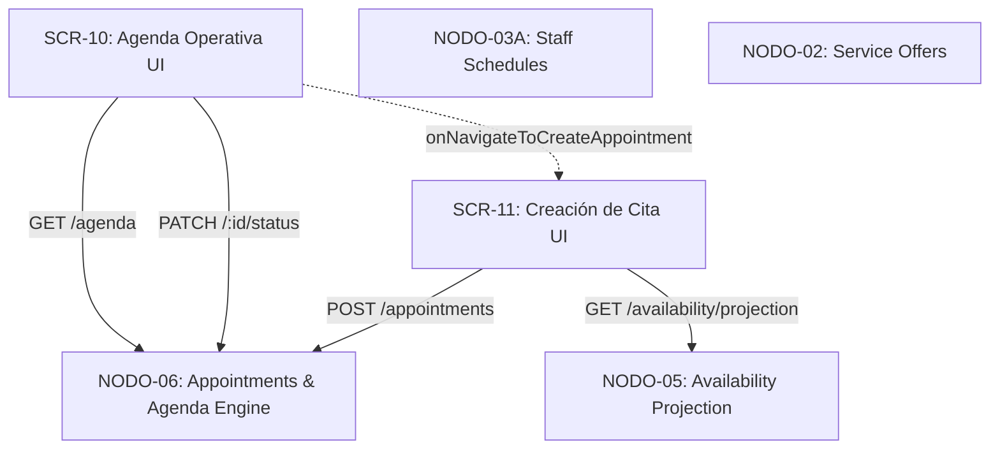

# SCR-10 — SCREEN CONTRACT v1.0
## GLOWAPP SaaS: AGENDA OPERATIVA DE CITAS

**ESTADO:** CONTRACT v1.0 — RATIFIED 🔒
**AUDITORÍA:** PASS (0 DISCREPANCIAS / 0 BREAKING CHANGES)  
**TRACK:** NODO-07 (SaaS UI)  
**TIPO DE ARTEFACTO:** Screen & Service Contract  
**CONSUMIDOR DE:** NODO-06 (Appointments & Operational Agenda Runtime — CLOSED / IMMUTABLE)  
**FECHA DE DEFINICIÓN:** 2026-09-12  
**AUTORIDAD DE RATIFICACIÓN:** Director del Proyecto GlowApp SaaS (GO-07.6)  

---

## 1. PURPOSE (PROPÓSITO)

`SCR-10 (Agenda Operativa de Citas)` es la pantalla central de visualización y control operacional diario de las citas y turnos de trabajo para el establecimiento activo en GlowApp SaaS.

Proporciona al personal del salón (Dueño, Administrador, Recepcionista y Colaboradores) un tablero en tiempo real para:
1. Inspeccionar la agenda diaria de citas desglosada por profesional y turnos laborales.
2. Navegar entre fechas operativas respetando la zona horaria contractual (`America/Bogota`).
3. Monitorear el estado del flujo de clientes en el salón (`SCHEDULED`, `CONFIRMED`, `CHECKED_IN`, `IN_SERVICE`, `COMPLETED`, `CANCELLED`, `NO_SHOW`).
4. Despachar transiciones de estado operacional autorizadas por la máquina de estados de `NODO-06`.
5. Visualizar bloqueos de tiempo correspondientes a reservas externas del Marketplace B2C.
6. Proveer el punto de acceso primario para la creación de nuevas citas (Frontera hacia `SCR-11`).

---

## 2. SCOPE (ALCANCE)

### Responsabilidades Permitidas de SCR-10:
- Consulta y renderizado de la proyección de agenda diaria consumiendo `GET /api/v1/saas/hub/appointments/agenda`.
- Selección y navegación de fechas (`target_date`).
- Filtrado por profesional según matriz RBAC.
- Visualización de turnos de trabajo (`shifts`) configurados en `NODO-03A`.
- Visualización de citas internas SaaS (`appointments`) con sus snapshots inmutables.
- Visualización de reservas externas de Marketplace (`marketplace_bookings`) como bloques informativos de ocupación.
- Ejecución de transiciones de estado mediante `PATCH /api/v1/saas/hub/appointments/:id/status`.
- Solicitud obligatoria de `cancellation_reason` cuando se transiciona desde `IN_SERVICE` a `CANCELLED`.
- Disparo de callback de navegación hacia creación de cita (`onNavigateToCreateAppointment`).

---

## 3. PRECONDITIONS (PRECONDICIONES)

1. Usuario autenticado con token JWT válido.
2. Contexto activo fijado en `ActiveContextHolder` con `activeMembershipId` válido y estado `ACTIVE`.
3. Membresía perteneciente a un establecimiento con rol asignado (`OWNER`, `MANAGER`, `RECEPTIONIST`, o `PROFESSIONAL`).

---

## 4. ENTRY POINT (PUNTO DE ENTRADA)

- **Origen Canónico:** [`HubSalonScreen`](file:///frontend/lib/screens/saas/hub_salon_screen.dart) (`SCR-03`).
- **Hook de Navegación:** Callback `onNavigateToAgenda` enlazado al botón físico `btn_modulo_agenda`.
- **Comportamiento:**
  ```dart
  // Navegación desde HubSalonScreen:
  onNavigateToAgenda: () {
    Navigator.of(context).push(
      MaterialPageRoute(
        builder: (_) => const AgendaOperativaScreen(),
      ),
    );
  }
  ```

---

## 5. ACTIVE CONTEXT (CONTEXTO ACTIVO)

- `SCR-10` opera estrictamente bajo el esquema de **Active Context Unificado**.
- **Cabecera HTTP:** Todas las solicitudes al backend inyectan automáticamente:
  ```http
  x-active-membership-id: <UUID>
  ```
- **Prohibiciones Explícitas:**
  - Prohibido incluir selectores locales de establecimiento o tenant en la UI.
  - Prohibido enviar `tenant_id` o `establishment_id` manuales en query params o headers.
  - La pertenencia y RLS son resueltas 100% server-side.

---

## 6. BACKEND DEPENDENCIES (DEPENDENCIAS BACKEND)

| Dependencia | Nodo / Endpoint | Estado | Modo |
| :--- | :--- | :---: | :---: |
| **NODO-06 (Agenda)** | `GET /api/v1/saas/hub/appointments/agenda` | `CLOSED / IMMUTABLE` | READ-ONLY |
| **NODO-06 (Status)** | `PATCH /api/v1/saas/hub/appointments/:id/status` | `CLOSED / IMMUTABLE` | MUTATION |
| **NODO-01 (Context)** | `ActiveContextHolder` / `x-active-membership-id` | `CLOSED / IMMUTABLE` | CONTEXT |
| **NODO-03A (Shifts)** | Integrado server-side en proyección de agenda | `CLOSED / IMMUTABLE` | READ-ONLY |
| **NODO-02 (Catalog)** | Snapshots congelados en citas | `CLOSED / IMMUTABLE` | READ-ONLY |

---

## 7. REQUEST CONTRACT (CONTRATOS DE SOLICITUD HTTP)

### 7.1. Consulta de Agenda Diaria
- **Método:** `GET`
- **Ruta:** `/api/v1/saas/hub/appointments/agenda`
- **Headers:**
  - `Authorization: Bearer <JWT>`
  - `x-active-membership-id: <UUID>`
- **Query Parameters:**
  - `target_date` (String, requerido): Fecha en formato `YYYY-MM-DD`.
  - `membership_id` (UUID, opcional): Filtrar por un profesional específico (solo permitido para roles con permiso multi-profesional).

### 7.2. Transición de Estado de Cita
- **Método:** `PATCH`
- **Ruta:** `/api/v1/saas/hub/appointments/:id/status`
- **Headers:**
  - `Authorization: Bearer <JWT>`
  - `x-active-membership-id: <UUID>`
  - `Content-Type: application/json`
- **Body:**
  ```json
  {
    "status": "CONFIRMED",
    "cancellation_reason": "Cliente solicitó reagendar"
  }
  ```
  *(Nota: `cancellation_reason` es opcional excepto cuando `status` previo es `IN_SERVICE` y nuevo `status` es `CANCELLED`).*

---

## 8. RESPONSE CONTRACT (CONTRATOS DE RESPUESTA HTTP)

### 8.1. Respuesta `GET /agenda` (200 OK)
```json
{
  "establishment_id": "9b1deb4d-3b7d-4bad-9bdd-2b0d7b3dcb6d",
  "target_date": "2026-09-15",
  "timezone": "America/Bogota",
  "professionals": [
    {
      "membership_id": "c1a2b3c4-d5e6-7f8a-9b0c-1d2e3f4a5b6c",
      "user_id": 101,
      "name": "María Pérez",
      "shifts": [
        {
          "start_time": "08:00",
          "end_time": "12:00"
        },
        {
          "start_time": "14:00",
          "end_time": "18:00"
        }
      ],
      "appointments": [
        {
          "id": "e5f6a7b8-c9d0-1e2f-3a4b-5c6d7e8f9a0b",
          "start_time": "09:00",
          "end_time": "10:00",
          "service_name": "Corte de Cabello Dama",
          "client_name": "Ana Gómez",
          "status": "SCHEDULED"
        }
      ],
      "marketplace_bookings": [
        {
          "id": 501,
          "start_time": "15:00",
          "end_time": "16:00",
          "status": "CONFIRMADA"
        }
      ]
    }
  ]
}
```

### 8.2. Respuesta `PATCH /:id/status` (200 OK)
```json
{
  "id": "e5f6a7b8-c9d0-1e2f-3a4b-5c6d7e8f9a0b",
  "tenant_id": 1,
  "establishment_id": "9b1deb4d-3b7d-4bad-9bdd-2b0d7b3dcb6d",
  "service_offer_id": "7a8b9c0d-1e2f-3a4b-5c6d-7e8f9a0b1c2d",
  "membership_id": "c1a2b3c4-d5e6-7f8a-9b0c-1d2e3f4a5b6c",
  "client_mode": "REGISTERED",
  "customer_user_id": 205,
  "guest_name": null,
  "guest_phone": null,
  "guest_email": null,
  "scheduled_at": "2026-09-15T09:00:00-05:00",
  "end_time": "2026-09-15T10:00:00-05:00",
  "service_name_snapshot": "Corte de Cabello Dama",
  "duration_minutes_snapshot": 60,
  "price_snapshot": 45000.00,
  "status": "CONFIRMED",
  "cancellation_reason": null,
  "created_at": "2026-09-12T14:30:00Z",
  "updated_at": "2026-09-12T14:45:00Z"
}
```

---

## 9. FRONTEND MODELS (DTOs DART)

Ubicación canónica prevista: `frontend/lib/models/saas/saas_agenda_models.dart`

```dart
/// Estados canónicos de cita en NODO-06
enum SaasAppointmentStatus {
  scheduled,
  confirmed,
  checkedIn,
  inService,
  completed,
  cancelled,
  noShow;

  static SaasAppointmentStatus fromString(String val) {
    switch (val.toUpperCase()) {
      case 'SCHEDULED': return SaasAppointmentStatus.scheduled;
      case 'CONFIRMED': return SaasAppointmentStatus.confirmed;
      case 'CHECKED_IN': return SaasAppointmentStatus.checkedIn;
      case 'IN_SERVICE': return SaasAppointmentStatus.inService;
      case 'COMPLETED': return SaasAppointmentStatus.completed;
      case 'CANCELLED': return SaasAppointmentStatus.cancelled;
      case 'NO_SHOW': return SaasAppointmentStatus.noShow;
      default: return SaasAppointmentStatus.scheduled;
    }
  }

  String toBackendString() {
    switch (this) {
      case SaasAppointmentStatus.scheduled: return 'SCHEDULED';
      case SaasAppointmentStatus.confirmed: return 'CONFIRMED';
      case SaasAppointmentStatus.checkedIn: return 'CHECKED_IN';
      case SaasAppointmentStatus.inService: return 'IN_SERVICE';
      case SaasAppointmentStatus.completed: return 'COMPLETED';
      case SaasAppointmentStatus.cancelled: return 'CANCELLED';
      case SaasAppointmentStatus.noShow: return 'NO_SHOW';
    }
  }
}

class SaasAgendaShift {
  final String startTime; // "08:00"
  final String endTime;   // "12:00"

  const SaasAgendaShift({required this.startTime, required this.endTime});

  factory SaasAgendaShift.fromJson(Map<String, dynamic> json) {
    return SaasAgendaShift(
      startTime: json['start_time'] ?? '',
      endTime: json['end_time'] ?? '',
    );
  }
}

class SaasAgendaAppointment {
  final String id;
  final String startTime;   // "09:00"
  final String endTime;     // "10:00"
  final String serviceName; // "Corte de Cabello"
  final String clientName;  // "Ana Gómez" o "Invitado"
  final SaasAppointmentStatus status;

  const SaasAgendaAppointment({
    required this.id,
    required this.startTime,
    required this.endTime,
    required this.serviceName,
    required this.clientName,
    required this.status,
  });

  factory SaasAgendaAppointment.fromJson(Map<String, dynamic> json) {
    return SaasAgendaAppointment(
      id: json['id'] ?? '',
      startTime: json['start_time'] ?? '',
      endTime: json['end_time'] ?? '',
      serviceName: json['service_name'] ?? '',
      clientName: json['client_name'] ?? '',
      status: SaasAppointmentStatus.fromString(json['status'] ?? 'SCHEDULED'),
    );
  }
}

class SaasAgendaMarketplaceBooking {
  final int id;
  final String startTime;
  final String endTime;
  final String status;

  const SaasAgendaMarketplaceBooking({
    required this.id,
    required this.startTime,
    required this.endTime,
    required this.status,
  });

  factory SaasAgendaMarketplaceBooking.fromJson(Map<String, dynamic> json) {
    return SaasAgendaMarketplaceBooking(
      id: json['id'] is int ? json['id'] : int.tryParse(json['id'].toString()) ?? 0,
      startTime: json['start_time'] ?? '',
      endTime: json['end_time'] ?? '',
      status: json['status'] ?? '',
    );
  }
}

class SaasAgendaProfessional {
  final String membershipId;
  final int userId;
  final String name;
  final List<SaasAgendaShift> shifts;
  final List<SaasAgendaAppointment> appointments;
  final List<SaasAgendaMarketplaceBooking> marketplaceBookings;

  const SaasAgendaProfessional({
    required this.membershipId,
    required this.userId,
    required this.name,
    required this.shifts,
    required this.appointments,
    required this.marketplaceBookings,
  });

  factory SaasAgendaProfessional.fromJson(Map<String, dynamic> json) {
    return SaasAgendaProfessional(
      membershipId: json['membership_id'] ?? '',
      userId: json['user_id'] is int ? json['user_id'] : int.tryParse(json['user_id'].toString()) ?? 0,
      name: json['name'] ?? '',
      shifts: (json['shifts'] as List<dynamic>? ?? [])
          .map((s) => SaasAgendaShift.fromJson(s))
          .toList(),
      appointments: (json['appointments'] as List<dynamic>? ?? [])
          .map((a) => SaasAgendaAppointment.fromJson(a))
          .toList(),
      marketplaceBookings: (json['marketplace_bookings'] as List<dynamic>? ?? [])
          .map((b) => SaasAgendaMarketplaceBooking.fromJson(b))
          .toList(),
    );
  }
}

class SaasAgendaProjection {
  final String establishmentId;
  final String targetDate;
  final String timezone;
  final List<SaasAgendaProfessional> professionals;

  const SaasAgendaProjection({
    required this.establishmentId,
    required this.targetDate,
    required this.timezone,
    required this.professionals,
  });

  factory SaasAgendaProjection.fromJson(Map<String, dynamic> json) {
    return SaasAgendaProjection(
      establishmentId: json['establishment_id'] ?? '',
      targetDate: json['target_date'] ?? '',
      timezone: json['timezone'] ?? 'America/Bogota',
      professionals: (json['professionals'] as List<dynamic>? ?? [])
          .map((p) => SaasAgendaProfessional.fromJson(p))
          .toList(),
    );
  }
}
```

---

## 10. SERVICE CONTRACT (CONTRATO DE SERVICIO DART)

Ubicación canónica prevista: `frontend/lib/services/saas/saas_agenda_service.dart`

```dart
abstract class ISaasAgendaService {
  /// Obtiene la proyección de la agenda operativa para una fecha dada.
  Future<SaasAgendaProjection> getAgendaProjection({
    required String targetDate,
    String? membershipId,
  });

  /// Ejecuta una transición de estado sobre una cita existente.
  Future<void> updateAppointmentStatus({
    required String appointmentId,
    required String targetStatus,
    String? cancellationReason,
  });
}
```

**Reglas de Invocación:**
- Debe inyectar la cabecera `x-active-membership-id` obtenida de `ActiveContextHolder().activeMembershipId`.
- Maneja códigos de error estándar (400, 403, 404, 409, 422) y los transforma en excepciones tipadas descriptivas para la UI.

---

## 11. RBAC (MATRIZ DE AUTORIZACIÓN EN UI)

| Rol en Active Context | Selector de Colaborador | Visualización | Acciones de Transición | Botón "Nueva Cita" |
| :--- | :---: | :---: | :---: | :---: |
| **`OWNER`** | Sí (Todos + Filtro Individual) | Toda la sede | Todas las citas de la sede | Habilitado |
| **`MANAGER`** | Sí (Todos + Filtro Individual) | Toda la sede | Todas las citas de la sede | Habilitado |
| **`RECEPTIONIST`** | Sí (Todos + Filtro Individual) | Toda la sede | Todas las citas de la sede | Habilitado |
| **`PROFESSIONAL`** | No (Fijado a sí mismo) | **Solo su propia agenda** | **Solo sus propias citas** | Habilitado (Asignado a sí mismo) |

---

## 12. DATE & TIMEZONE (MANEJO DE FECHAS)

- **Zona Horaria Oficial:** `America/Bogota` (UTC-5 fijo).
- **Fecha Inicial por Defecto:** Fecha actual local en Bogotá formateada como `YYYY-MM-DD`.
- **Controles de Navegación Temporal:**
  - Botón `Día Anterior` ($	ext{target\_date} - 1	ext{ día}$).
  - Botón `Día Siguiente` ($	ext{target\_date} + 1	ext{ día}$).
  - Botón `Hoy` (regreso rápido a la fecha actual).
  - Selector Modal de Calendario (`DatePicker`) para saltar a cualquier fecha.

---

## 13. APPOINTMENT STATE RENDERING (REPRESENTACIÓN VISUAL)

| Estado | Etiqueta Visual | Color Semántico | Transiciones Permitidas desde la UI |
| :--- | :--- | :--- | :--- |
| **`SCHEDULED`** | Agendada | Azul / Neutral (`#1976D2`) | `CONFIRMED`, `CHECKED_IN`, `CANCELLED`, `NO_SHOW` |
| **`CONFIRMED`** | Confirmada | Verde Esmeralda (`#388E3C`) | `CHECKED_IN`, `CANCELLED`, `NO_SHOW` |
| **`CHECKED_IN`** | En Recepción | Ámbar / Alerta (`#F57C00`) | `IN_SERVICE`, `CANCELLED` |
| **`IN_SERVICE`** | En Atención | Púrpura Activo (`#7B1FA2`) | `COMPLETED`, `CANCELLED` *(Requiere Motivo)* |
| **`COMPLETED`** | Finalizada | Gris Neutro / Check (`#455A64`) | *Ninguna (Terminal)* |
| **`CANCELLED`** | Cancelada | Rojo Opaco (`#D32F2F`) | *Ninguna (Terminal)* |
| **`NO_SHOW`** | No Asistió | Naranja Opaco (`#E64A19`) | *Ninguna (Terminal)* |

---

## 14. ALLOWED MUTATIONS (MUTACIONES Y MODALES)

1. **Selector Contextual de Estado:**
   - Al presionar una cita o su menú de acciones, la UI solo muestra las transiciones autorizadas para su estado actual según la tabla anterior.
2. **Modal de Cancelación con Motivo:**
   - Si el usuario selecciona `CANCELLED` y el estado actual es `IN_SERVICE`, la UI **debe** presentar un diálogo emergente con un campo de texto obligatorio:
     `"Motivo de cancelación durante el servicio (obligatorio)"`.
   - Si el campo está vacío o solo contiene espacios, el botón de confirmar cancelación permanece deshabilitado.
3. **Confirmación de Inasistencia (`NO_SHOW`):**
   - Diálogo de confirmación rápida: *"¿Marcar cliente como inasistente?"*.

---

## 15. UI STRUCTURE (ESTRUCTURA DE PANTALLA)

```
┌─────────────────────────────────────────────────────────────┐
│ [←] Agenda Operativa                     [ + Nueva Cita ]   │
├─────────────────────────────────────────────────────────────┤
│ [<]  Ayer  |      Martes, 15 de Septiembre      |  Mañana [>]│
├─────────────────────────────────────────────────────────────┤
│ Colaboradores: [ Todos ] [ María P. ] [ Carlos R. ]         │
├─────────────────────────────────────────────────────────────┤
│ Resumen: [ 8 Citas ]  [ 2 En Atención ]  [ 1 Finalizada ]   │
├─────────────────────────────────────────────────────────────┤
│ ┌─────────────────────────────────────────────────────────┐ │
│ │ MARÍA PÉREZ  •  Turno: 08:00 - 12:00, 14:00 - 18:00     │ │
│ ├─────────────────────────────────────────────────────────┤ │
│ │ [09:00 - 10:00]  Corte Dama                             │ │
│ │                  Cliente: Ana Gómez (Registrada)        │ │
│ │                  Estado: [ AGENDADA ]   [ Acciones ▾ ]  │ │
│ ├─────────────────────────────────────────────────────────┤ │
│ │ [10:30 - 11:30]  Tinte Completo                         │ │
│ │                  Cliente: Laura Restrepo (Invitada)     │ │
│ │                  Estado: [ EN SERVICIO ] [ Finalizar ]  │ │
│ ├─────────────────────────────────────────────────────────┤ │
│ │ [15:00 - 16:00]  🔒 Ocupado (Reserva Marketplace B2C)   │ │
│ └─────────────────────────────────────────────────────────┘ │
└─────────────────────────────────────────────────────────────┘
```

Componentes visuales:
- **`Header Bar`:** Título de la pantalla, botón de regreso al Hub y botón primario `+ Nueva Cita`.
- **`DateNavigationBar`:** Selector de fechas con botones anterior/siguiente y modal de calendario.
- **`StaffFilterChips`:** Chips horizontales para filtrar por colaborador o mostrar todos.
- **`OperationalMetricsRow`:** Mini-cards con contadores del día.
- **`ProfessionalAgendaSection`:** Card contenedora por profesional con su nombre y lista de turnos.
- **`AppointmentTile`:** Tarjeta individual de cita con horarios, nombre de servicio, nombre del cliente, badge de estado y menú de cambio de estado.
- **`MarketplaceBookingTile`:** Tarjeta informativa bloqueada de ocupación externa.

---

## 16. EMPTY, ERROR & LOADING STATES

1. **`Loading State`:** Skeleton / Shimmer cards simulando los profesionales y citas mientras se resuelve la promesa HTTP.
2. **`Empty State (Sin Profesionales)`:**
   - Mensaje: *"No hay colaboradores activos en este establecimiento"*.
3. **`Empty State (Sin Citas en el Día)`:**
   - Mensaje: *"No hay citas programadas para el día seleccionado"*.
   - Botón de acción: `[ + Agendar Cita ]`.
4. **`Error State`:**
   - Mensaje amigable descriptivo del error devuelto por el backend.
   - Botón `[ Reintentar ]` para volver a solicitar la proyección.

---

## 17. SCR-11 BOUNDARY (FRONTERA HACIA NUEVA CITA)

- `SCR-10` expone el callback:
  ```dart
  final VoidCallback? onNavigateToCreateAppointment;
  ```
- **Frontera Estricta:**
  - `SCR-10` **no implementa** el wizard de selección de servicios, asignación de profesional ni consulta de slots de disponibilidad de `NODO-05`.
  - La acción `[ + Nueva Cita ]` delega el control hacia `SCR-11` (Pantalla de Reserva Interna / Creación de Cita).

---

## 18. LEGACY BOUNDARY (FRONTERA B2C LEGACY)

- `SCR-10` **no importa ni referencia** clases o providers de `frontend/lib/providers/` o pantallas de cliente legacy.
- Las reservas Marketplace (`public.bookings`) se presentan exclusivamente como bloques informativos de tiempo ocupado sin opciones de edición de catálogo o cobro B2C.

---

## 19. TEST CONTRACT (CONTRATO DE PRUEBAS WIDGET Y SERVICIO)

La suite de pruebas para `SCR-10` (`test/screens/saas/agenda_operativa_screen_test.dart` y `test/services/saas/saas_agenda_service_test.dart`) debe certificar:

1. **Render Inicial:** Muestra título, barra de fechas y botón de nueva cita.
2. **Active Context Guard:** Solicita `x-active-membership-id` y gestiona fallback si no hay contexto.
3. **Carga Exitosa de Agenda:** Renderiza profesionales, turnos de trabajo y citas devueltas por el mock service.
4. **Cambio de Fecha:** Al interactuar con el selector de fecha, realiza nueva llamada con el `target_date` actualizado.
5. **Filtro de Profesionales:** Oculta/muestra citas al presionar los chips de filtro por colaborador.
6. **Manejo RBAC:** Si el usuario activo tiene rol `PROFESSIONAL`, el selector de colaboradores está oculto y solo se muestra su propia agenda.
7. **Renderizado de Estados:** Cada cita muestra su badge con el color y texto semántico correcto.
8. **Transición Válida:** Seleccionar un nuevo estado dispara la llamada `updateAppointmentStatus` con los parámetros correspondientes.
9. **Validación de Cancelación en Servicio:** Exige `cancellation_reason` antes de permitir confirmar la transición `IN_SERVICE -> CANCELLED`.
10. **Visualización de Reserva B2C:** Renderiza el bloque de bloqueo temporal para reservas del Marketplace.
11. **Manejo de Estados Vacíos y Errores:** Renderiza correctamente empty state y botón de reintento ante fallos de red.
12. **Callback a SCR-11:** Presionar `+ Nueva Cita` invoca `onNavigateToCreateAppointment`.

---

## 20. DOMAIN BOUNDARIES (LÍMITES DE DOMINIO)



### Límites de Responsabilidad:
- **SCR-10 SÍ:**
  - Consulta y proyecta la agenda del día.
  - Solicita transiciones de estado operacional.
  - Conecta el Hub Salón con el flujo de citas.
- **SCR-10 NO:**
  - Modifica plantillas horarias de colaboradores (eso pertenece a `NODO-03A / SCR-09`).
  - Modifica precios o nombres de catálogo (eso pertenece a `NODO-02 / SCR-08`).
  - Modifica la disponibilidad en tiempo real o genera locks efímeros (eso pertenece a `NODO-05`).
  - Modifica o cancela directamente reservas del Marketplace B2C en `public.bookings`.

---

## 21. EXPLICIT NON-GOALS (FUERA DE ALCANCE)

- Cobro en caja, terminal POS o pasarelas de pago (módulo Fintech / Checkout).
- Edición de precios o duraciones sobre citas ya agendadas.
- Envío de notificaciones por WhatsApp, SMS o Push.
- Reasignación de profesional sobre una cita existente (requiere cancelación y nueva reserva).
- Sincronización bidireccional con calendarios externos (Google Calendar / Apple Calendar).

---

## 22. RATIFIED ARCHITECTURAL DECISIONS (DECISIONES RATIFICADAS)

1. **Frecuencia de Actualización (Refresh Mechanism):**  
   - **Decisión Ratificada:** **PULL-TO-REFRESH Y ACTUALIZACIÓN POR DEMANDA / MUTACIÓN.**
   - **Justificación:** Garantiza determinismo estricto, elimina llamadas innecesarias a la red y asegura sincronización inmediata tras cualquier transición de estado (`PATCH /status`) o cambio de fecha/filtro.

2. **Visualización de Datos de Contacto de Clientes Invitados:**  
   - **Decisión Ratificada:** **TARJETA CONCISA + DETALLE SECUNDARIO MODAL.**
   - **Justificación:** Mantiene alta densidad de información y legibilidad en el timeline/grilla de agenda diaria sin saturar la tarjeta. Datos completos (teléfono, notas, snapshot de precio) se consultan de forma secundaria.

---

**FIN DEL SCR-10 SCREEN CONTRACT v1.0**
