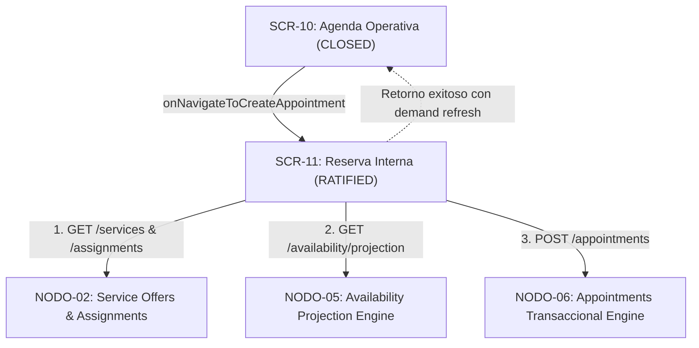

# SCR-11 — SCREEN CONTRACT v1.0
## GLOWAPP SaaS: RESERVA INTERNA / CREACIÓN DE CITA CON SLOTS

**ESTADO:** CONTRACT v1.0 — RATIFIED 🔒  
**TRACK:** NODO-07 (SaaS UI)  
**TIPO DE ARTEFACTO:** Screen & Service Contract  
**CONSUMIDOR DE:** 
- `NODO-05` (Availability Projection & Booking Slot Engine — CLOSED / IMMUTABLE)
- `NODO-06` (Appointments & Operational Agenda Runtime — CLOSED / IMMUTABLE)
- `NODO-02` (Service Offers & Assignments — CLOSED / IMMUTABLE)
**FECHA DE RATIFICACIÓN:** 2026-09-12  
**AUTORIDAD DE RATIFICACIÓN:** Director del Proyecto GlowApp SaaS (GO-07.11)  

---

## 1. PURPOSE (PROPÓSITO)

`SCR-11 (Reserva Interna / Creación de Cita con Slots)` es la pantalla operativa de agendamiento guiado para el personal del salón (`OWNER`, `MANAGER`, `RECEPTIONIST` y `PROFESSIONAL`).

Proporciona un flujo transaccional seguro y determinista para:
1. Seleccionar una oferta de servicio activa de la sede (`NODO-02`).
2. Resolver la fecha de consulta (`target_date`) y colaboradores elegibles según RBAC.
3. Consultar la proyección de slots de tiempo libres computados en memoria por `NODO-05`.
4. Seleccionar un slot exacto y resolver explícitamente el colaborador (`DEC-S11-004`).
5. Capturar la identidad del cliente bajo el modelo dual estricto (Cliente Invitado vs. Registrado, `DEC-S11-002`).
6. Ejecutar la creación atómica y persistencia de la cita en `saas_appointments` (`NODO-06`).
7. Retornar el control a la agenda operativa (`SCR-10`) con recarga inmediata por demanda (`Demand Refresh`).

---

## 2. SCOPE (ALCANCE)

### Responsabilidades Permitidas de SCR-11:
- Consulta del catálogo de ofertas de servicio de la sede vía `GET /api/v1/saas/hub/services` (`NODO-02`).
- Consulta de colaboradores asignados a la oferta vía `GET /api/v1/saas/hub/assignments/offer/:id` (`NODO-02`).
- Consulta de proyección de slots en tiempo real vía `GET /api/v1/saas/hub/availability/projection` (`NODO-05`).
- Captura de formulario con validación en cliente del modelo dual de cliente (XOR estricto).
- Ejecución transaccional de creación vía `POST /api/v1/saas/hub/appointments` (`NODO-06`).
- Manejo determinista de colisiones concurrentes (HTTP `409 APPOINTMENT_OCCUPANCY_COLLISION`).
- Notificación de éxito y retorno a `SCR-10`.

---

## 3. PRECONDITIONS (PRECONDICIONES)

1. Usuario autenticado con token JWT válido.
2. Contexto activo fijado en `ActiveContextHolder` con `activeMembershipId` válido y estado `ACTIVE`.
3. Rol de membresía reconocido (`OWNER`, `MANAGER`, `RECEPTIONIST`, o `PROFESSIONAL`).
4. Al menos una oferta de servicio con colaborador asignado y horario configurado en la sede activa.

---

## 4. ENTRY POINT (PUNTO DE ENTRADA)

- **Origen Canónico:** `SCR-10 (Agenda Operativa de Citas)`.
- **Hook de Activación:** Botón primario `[ + Nueva Cita ]` (`btn_nueva_cita`), disparando el callback `onNavigateToCreateAppointment`.
- **Parámetros Opcionales de Entrada:**
  - `initialDate`: Fecha `YYYY-MM-DD` heredada de la vista activa de `SCR-10` (`DEC-S11-003`).
  - `preselectedMembershipId`: UUID de colaborador si se invoca desde una tarjeta específica.

```dart
// Navegación canónica desde SCR-10:
onNavigateToCreateAppointment: () async {
  final created = await Navigator.of(context).push<bool>(
    MaterialPageRoute(
      builder: (_) => ReservaInternaScreen(
        initialDate: _targetDate,
      ),
    ),
  );
  if (created == true) {
    _loadAgenda(); // Demand Refresh en SCR-10
  }
};
```

---

## 5. ACTIVE CONTEXT (CONTEXTO ACTIVO)

- Todas las peticiones HTTP (`GET /services`, `GET /availability/projection`, `POST /appointments`) inyectan obligatoriamente:
  ```http
  x-active-membership-id: <UUID>
  ```
- `tenant_id` y `establishment_id` son resueltos exclusivamente por el backend mediante `activeContextMiddleware`.
- **Prohibición:** Prohibido enviar cabeceras `x-establishment-id` o parámetros manuales de tenant/sede en la UI.

---

## 6. DOMAIN BOUNDARIES & SEPARATION OF RESPONSIBILITIES



### Límites Estrictos de Responsabilidad:
- **SCR-11:**
  - **SÍ:** Orquesta el flujo guiado de reserva, presenta opciones, captura datos, solicita proyección a N05, solicita creación a N06 y maneja respuestas/errores.
  - **NO:** NO calcula slots ni disponibilidad; NO bloquea slots; NO genera UUIDs; NO persiste citas; NO realiza asignaciones automáticas de colaboradores.
- **NODO-05:**
  - **Autoridad exclusiva** para cálculo de disponibilidad en memoria y generación de slots con `available_memberships`.
  - **NO persiste** citas ni bloquea slots.
- **NODO-06:**
  - **Autoridad exclusiva** para creación y persistencia transaccional de appointments, snapshots inmutables y protección de colisiones GiST (`uq_saas_appointments_no_overlap`).

---

## 7. RATIFIED ARCHITECTURAL DECISIONS (DECISIONES RATIFICADAS)

### DEC-S11-001 — Modo de Proyección AGGREGATED
- **Decisión Ratificada:** Los roles administrativos (`OWNER`, `MANAGER`, `RECEPTIONIST`) pueden utilizar `projection_mode = AGGREGATED` para consultar disponibilidad entre todos los profesionales elegibles asignados a la oferta.
- **Invariante:** `AGGREGATED` solo proyecta la lista de `available_memberships` por slot; **no implica asignación automática**.

### DEC-S11-004 — Resolución Explícita del Profesional (No Asignación Automática)
- **Decisión Ratificada:** Para la creación de citas en `SCR-11 v1.0`, se utilizará **selección explícita del profesional**.
- **Flujo:**
  1. Si se consulta en modo `AGGREGATED`, al seleccionar un slot, `SCR-11` presenta la lista de profesionales disponibles en `available_memberships`.
  2. El usuario selecciona explícitamente el colaborador que atenderá la cita.
  3. `SCR-11` obtiene el `membership_id` concreto.
  4. En modo `TARGETED`, el `membership_id` ya está seleccionado de antemano.
  5. Para rol `PROFESSIONAL`, el `membership_id` queda fijado al membership activo del profesional.
- **Invariante:** El `POST /api/v1/saas/hub/appointments` **SIEMPRE debe contener un `membership_id` concreto**. Queda prohibido el uso de algoritmos de auto-asignación (orden alfabético, rotación, menor carga o aleatorio).

### DEC-S11-002 — Modelo Dual de Cliente y Modo Inicial
- **Decisión Ratificada:** La pestaña/modo inicial de captura en el formulario será **`GUEST` (Invitado)**.
- **Justificación:** Facilita la captura operacional rápida en mostrador bajo el modelo dual XOR soportado por `NODO-06`:
  - **Modo `GUEST`:** `guest_name` ($\ge 2$ caracteres), `guest_phone` ($\ge 7$ caracteres), `guest_email` (opcional).
  - **Modo `REGISTERED`:** `customer_user_id` (entero).
- **Invariante:** Prohibido enviar simultáneamente `customer_user_id` y campos `guest_*`.

### DEC-S11-003 — Herencia y Navegación de Fecha
- **Decisión Ratificada:** `SCR-11` puede recibir de `SCR-10` la fecha que el usuario estaba visualizando como **Initial Target Date**.
- **Comportamiento:** El usuario puede cambiar libremente la fecha dentro de `SCR-11`. Cada cambio de fecha dispara una nueva consulta a `NODO-05`.
- **Zona Horaria:** Todas las fechas y horas se interpretan en `America/Bogota` (UTC-5).

---

## 8. CANONICAL USER FLOW (FLUJO OPERATIVO CANÓNICO)

```
[ PASO 1: SELECCIONAR SERVICIO ]
  │  - Consulta GET /api/v1/saas/hub/services
  │  - Usuario selecciona la oferta de servicio (ej. "Corte Dama - 45 min - $50.000")
  ▼
[ PASO 2: SELECCIONAR FECHA Y MODO DE COLABORADOR ]
  │  - Fecha: YYYY-MM-DD (Default: Initial Target Date o Hoy en Bogotá)
  │  - Profesional:
  │      * Si OWNER/MANAGER/RECEPTIONIST: "Cualquier Profesional" (AGGREGATED) o colaborador específico (TARGETED)
  │      * Si PROFESSIONAL: Confinado a sí mismo (TARGETED)
  ▼
[ PASO 3: CONSULTAR Y SELECCIONAR SLOT ]
  │  - Consulta GET /api/v1/saas/hub/availability/projection
  │  - NODO-05 proyecta slots libres [start_time, end_time)
  │  - Usuario selecciona un slot horario
  │  - Si AGGREGATED y hay múltiples available_memberships -> Usuario selecciona el colaborador explícito (DEC-S11-004)
  ▼
[ PASO 4: CAPTURAR DATOS DEL CLIENTE (DEC-S11-002) ]
  │  - Pestaña GUEST (Default): guest_name, guest_phone, guest_email
  │  - Pestaña REGISTERED: customer_user_id
  ▼
[ PASO 5: CONFIRMACIÓN Y CREACIÓN ATÓMICA ]
  │  - Presentación de resumen (Servicio, Profesional, Fecha, Horario, Precio snapshot, Cliente)
  │  - Envío de POST /api/v1/saas/hub/appointments
  │  - Si 201 Created -> Pop(true) -> Demand Refresh en SCR-10
  │  - Si 409 Collision -> Notificación amigable + recarga automática de slots en N05
```

---

## 9. REQUEST & RESPONSE CONTRACTS

### 9.1 Consulta de Disponibilidad (`NODO-05`)
- **Ruta:** `GET /api/v1/saas/hub/availability/projection`
- **Query Params:**
  - `service_offer_id`: UUID (Requerido)
  - `target_date`: `YYYY-MM-DD` (Requerido)
  - `membership_id`: UUID (Opcional, usado en TARGETED)
  - `step_minutes`: `15` (Opcional)
  - `projection_mode`: `AGGREGATED` | `TARGETED` (Opcional)

### 9.2 Creación de Cita (`NODO-06`)
- **Ruta:** `POST /api/v1/saas/hub/appointments`
- **Body JSON (Modo Invitado / Walk-in):**
  ```json
  {
    "service_offer_id": "7a8b9c0d-1e2f-3a4b-5c6d-7e8f9a0b1c2d",
    "membership_id": "c1a2b3c4-d5e6-7f8a-9b0c-1d2e3f4a5b6c",
    "scheduled_at": "2026-09-15T09:00:00-05:00",
    "guest_name": "Laura Restrepo",
    "guest_phone": "3001234567",
    "guest_email": "laura@ejemplo.com"
  }
  ```
- **Body JSON (Modo Cliente Registrado):**
  ```json
  {
    "service_offer_id": "7a8b9c0d-1e2f-3a4b-5c6d-7e8f9a0b1c2d",
    "membership_id": "c1a2b3c4-d5e6-7f8a-9b0c-1d2e3f4a5b6c",
    "scheduled_at": "2026-09-15T09:00:00-05:00",
    "customer_user_id": 205
  }
  ```

---

## 10. FRONTEND DTOs (MODELOS DART)

```dart
class SaasAvailabilitySlot {
  final String startTime; // "09:00"
  final String endTime;   // "09:45"
  final List<String> availableMemberships;

  const SaasAvailabilitySlot({
    required this.startTime,
    required this.endTime,
    required this.availableMemberships,
  });

  factory SaasAvailabilitySlot.fromJson(Map<String, dynamic> json) {
    return SaasAvailabilitySlot(
      startTime: json['start_time'] ?? '',
      endTime: json['end_time'] ?? '',
      availableMemberships: (json['available_memberships'] as List<dynamic>? ?? [])
          .map((m) => m.toString())
          .toList(),
    );
  }
}

class SaasAvailabilityProjection {
  final String establishmentId;
  final String serviceOfferId;
  final String targetDate;
  final int serviceDurationMinutes;
  final int stepMinutes;
  final String projectionMode;
  final List<SaasAvailabilitySlot> slots;

  const SaasAvailabilityProjection({
    required this.establishmentId,
    required this.serviceOfferId,
    required this.targetDate,
    required this.serviceDurationMinutes,
    required this.stepMinutes,
    required this.projectionMode,
    required this.slots,
  });

  factory SaasAvailabilityProjection.fromJson(Map<String, dynamic> json) {
    return SaasAvailabilityProjection(
      establishmentId: json['establishment_id'] ?? '',
      serviceOfferId: json['service_offer_id'] ?? '',
      targetDate: json['target_date'] ?? '',
      serviceDurationMinutes: json['service_duration_minutes'] is int
          ? json['service_duration_minutes'] as int
          : int.tryParse(json['service_duration_minutes']?.toString() ?? '0') ?? 0,
      stepMinutes: json['step_minutes'] is int
          ? json['step_minutes'] as int
          : int.tryParse(json['step_minutes']?.toString() ?? '15') ?? 15,
      projectionMode: json['projection_mode'] ?? 'AGGREGATED',
      slots: (json['slots'] as List<dynamic>? ?? [])
          .map((s) => SaasAvailabilitySlot.fromJson(s))
          .toList(),
    );
  }
}

class CreateAppointmentPayload {
  final String serviceOfferId;
  final String membershipId;
  final String scheduledAt;
  final int? customerUserId;
  final String? guestName;
  final String? guestPhone;
  final String? guestEmail;

  CreateAppointmentPayload({
    required this.serviceOfferId,
    required this.membershipId,
    required this.scheduledAt,
    this.customerUserId,
    this.guestName,
    this.guestPhone,
    this.guestEmail,
  });

  Map<String, dynamic> toJson() {
    final map = <String, dynamic>{
      'service_offer_id': serviceOfferId,
      'membership_id': membershipId,
      'scheduled_at': scheduledAt,
    };
    if (customerUserId != null) {
      map['customer_user_id'] = customerUserId;
    } else {
      map['guest_name'] = guestName;
      map['guest_phone'] = guestPhone;
      if (guestEmail != null && guestEmail!.trim().isNotEmpty) {
        map['guest_email'] = guestEmail!.trim();
      }
    }
    return map;
  }
}
```

---

## 11. RBAC (MATRIZ DE AUTORIZACIÓN)

| Rol en Active Context | Selección de Oferta | Selección de Profesional | Creación de Cita |
| :--- | :---: | :---: | :---: |
| **`OWNER`** | Todas las ofertas de la sede | Cualquiera asignado o modo agregado | Cualquier colaborador |
| **`MANAGER`** | Todas las ofertas de la sede | Cualquiera asignado o modo agregado | Cualquier colaborador |
| **`RECEPTIONIST`** | Todas las ofertas de la sede | Cualquiera asignado o modo agregado | Cualquier colaborador |
| **`PROFESSIONAL`** | Ofertas donde esté asignado | **Fijado exclusivamente a sí mismo** | **Solo para sí mismo** |

---

## 12. CONCURRENCY & COLLISION HANDLING

1. Si dos terminales seleccionan simultáneamente el mismo slot $[t_{\text{start}}, t_{\text{end}})$ para el mismo colaborador:
   - La primera petición `POST /appointments` procesada por PostgreSQL inserta la cita en `saas_appointments`.
   - La segunda petición es rechazada de forma determinista por la restricción GiST `uq_saas_appointments_no_overlap` de `NODO-06` con código HTTP `409 APPOINTMENT_OCCUPANCY_COLLISION`.
2. **Comportamiento en `SCR-11`:**
   - Captura el error HTTP `409`.
   - Muestra mensaje al usuario: *"El horario seleccionado acaba de ser ocupado por otra reserva. Por favor elija otro horario."*
   - Descarta el slot inválido y vuelve a invocar `GET /availability/projection` para actualizar los horarios disponibles.
   - **Cero locks en frontend.**

---

## 13. UI STRUCTURE (ESTRUCTURA DE PANTALLA)

```
┌─────────────────────────────────────────────────────────────┐
│ [←] Nueva Cita                                              │
├─────────────────────────────────────────────────────────────┤
│ 1. SERVICIO:                                                │
│    [ Corte Dama (45 min - $50.000) ▾ ]                      │
├─────────────────────────────────────────────────────────────┤
│ 2. COLABORADOR & FECHA:                                     │
│    Colaborador: [ (•) Cualquier Disponible ] [ ( ) María P. ]│
│    Fecha:       [<]  15 de Septiembre, 2026  [>]   [ 📅 ]   │
├─────────────────────────────────────────────────────────────┤
│ 3. HORARIOS DISPONIBLES (NODO-05):                          │
│    [ 09:00 - 09:45 ]  [ 09:15 - 10:00 ]  [ 10:30 - 11:15 ]  │
│    [ 14:00 - 14:45 ]  [ 15:00 - 15:45 ]  [ 16:30 - 17:15 ]  │
├─────────────────────────────────────────────────────────────┤
│ 4. PROFESIONAL ASIGNADO PARA EL HORARIO (DEC-S11-004):      │
│    Seleccionar: [ (•) María Pérez  ( ) Carlos Barbero ]     │
├─────────────────────────────────────────────────────────────┤
│ 5. DATOS DEL CLIENTE (DEC-S11-002):                         │
│    [ (•) Invitado / Walk-in ]   [ ( ) Cliente Registrado ]  │
│    Nombre:   [ Laura Restrepo                     ]         │
│    Teléfono: [ 3001234567                         ]         │
│    Email (Opcional): [ laura@ejemplo.com          ]         │
├─────────────────────────────────────────────────────────────┤
│ 6. RESUMEN:                                                 │
│    Servicio: Corte Dama  •  Atiende: María Pérez            │
│    Fecha: 15 Sep 2026, 09:00 - 09:45  •  Precio: $50.000    │
├─────────────────────────────────────────────────────────────┤
│                 [ Confirmar y Agendar Cita ]                │
└─────────────────────────────────────────────────────────────┘
```

---

## 14. ERROR HANDLING MATRIX

| Error Backend | HTTP Status | Tratamiento en SCR-11 UI |
| :--- | :---: | :--- |
| `APPOINTMENT_OCCUPANCY_COLLISION` | `409` | Alerta de horario ocupado + recarga automática de slots. |
| `INVALID_CLIENT_IDENTITY_MODE` | `400` | Mensaje de validación en formulario de cliente. |
| `INVALID_SERVICE_ASSIGNMENT` | `422` | Error de asignación profesional. |
| `INACTIVE_MEMBERSHIP` | `422` | Notificación de colaborador no disponible. |
| `SERVICE_OFFER_NOT_FOUND` | `404` | Regreso a lista de servicios. |
| `UNAUTHORIZED_ROLE` | `403` | Bloqueo con mensaje de permisos insuficientes. |

---

## 15. OPEN DECISIONS & DEPENDENCIES

### OD-S11-001 — Mecanismo para obtención de `customer_user_id` en modo REGISTERED
- **Problema:** En el SaaS actual no existe un endpoint cerrado y ratificado de búsqueda/autocompletado de clientes registrados (`GET /saas/hub/customers`).
- **Evidencia:** `NODO-06` soporta `customer_user_id` entero, pero la resolución de identidades de cliente para SaaS aún no cuenta con pantalla o servicio de búsqueda.
- **Impacto:** En `SCR-11 v1.0`, el agendamiento en mostrador opera de manera principal mediante el modo `GUEST` (Invitado). Para clientes registrados, se provee el campo numérico `customer_user_id`.
- **Recomendación:** Mantener documentada esta dependencia como un requerimiento para un sub-nodo futuro de Gestión de Clientes SaaS (`NODO-08` / Directorio de Clientes).
- **Decisión Requerida:** Confirmación del Director para proceder con `GUEST` como flujo principal y campo directo para `REGISTERED`.

---

## 16. PROPOSED TEST CONTRACT

La suite de pruebas para `SCR-11` deberá certificar:
1. Render inicial y carga del catálogo de servicios (`NODO-02`).
2. Herencia correcta de `initialDate` desde `SCR-10`.
3. Confinamiento RBAC para rol `PROFESSIONAL` (bloqueo a sí mismo).
4. Consulta de proyección de disponibilidad a `NODO-05` (`AGGREGATED` vs `TARGETED`).
5. Renderizado de grilla de slots y selección de horario.
6. Selección explícita del profesional disponible (`DEC-S11-004`).
7. Validación de formulario de cliente invitado (`GUEST`: nombre $\ge 2$, teléfono $\ge 7$).
8. Validación de modo cliente registrado (`REGISTERED`: `customer_user_id`).
9. Manejo de colisión concurrente (`409 APPOINTMENT_OCCUPANCY_COLLISION`) y recarga de disponibilidad.
10. Creación exitosa (`201 Created`) y retorno con `true` a `SCR-10`.

---

**FIN DEL SCR-11 SCREEN CONTRACT v1.0 (RATIFIED)**
