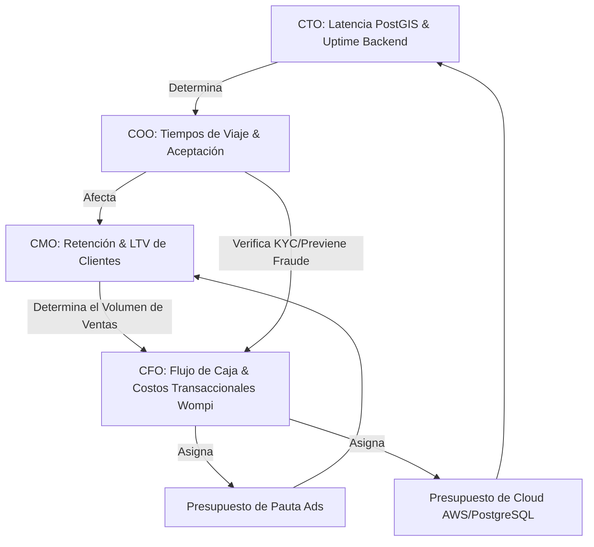

# ACTA DE ACUERDO: MATRIZ DE METRICAS Y KPIS INTERDEPARTAMENTALES (GLOWAPP)
**Fecha:** 2026-06-09  
**Sesión:** Reunión Directiva #001  
**Estado:** Aprobado por la Junta Directiva  

---

## 1. Introducción y Enfoque de Interdependencia
Para asegurar el crecimiento alineado de GlowApp, las labores de cada jefatura no se evaluarán de forma aislada, sino a través de un ecosistema de KPIs interconectados. Un fallo en las métricas técnicas del CTO impacta directamente la retención del COO, lo que a su vez incrementa el costo de adquisición del CMO y reduce la rentabilidad vigilada por el CFO.

---

## 2. KPIs por Área Directiva y sus Interdependencias

### 1. Dirección de Operaciones (COO)
*Enfoque: Calidad del servicio, seguridad, balance de oferta y cumplimiento operativo.*
* **Tasa de Aceptación de Servicios:** Porcentaje de solicitudes aceptadas por los profesionales. (Meta: >90%).
* **Tiempo de Desplazamiento Promedio:** Eficiencia logística de los proveedores a los domicilios. (Meta: <25 mins).
* **Densidad de Profesionales por Zona:** Distribución geográfica activa (Bogotá, Medellín).
* **Tasa de Retención de Providers:** Retención mensual de los estilistas activos. (Meta: >85%).
* **SLA de Resolución SOS/Pánico:** Tiempo de respuesta e intervención ante emergencias. (Meta: <2 minutos de enlace con autoridades).
* **Tasa de Conversión de Funnel KYC:** Velocidad de validación de documentos sin comprometer seguridad.

### 2. Dirección de Tecnología (CTO)
*Enfoque: Estabilidad de la plataforma, rendimiento de infraestructura, automatización y desarrollo.*
* **Uptime y Latencia de la API Backend:** Disponibilidad de los servicios Node.js/Express. (Meta: >99.9% uptime, latencia <150ms).
* **Rendimiento de Consultas Espaciales (PostGIS):** Latencia de búsqueda geográfica de prestadores. (Meta: <80ms).
* **Estabilidad del Socket de Seguridad (SOS):** Conectividad persistente de WebSocket/Socket.io durante emergencias. (Meta: 0% pérdidas de paquetes).
* **Tasa de Fallos de la App Móvil (Crash Rate):** Estabilidad de la app Flutter en producción. (Meta: <0.5%).
* **Automatización del KYC:** Eficiencia del pipeline técnico para la lectura y validación de documentos.

### 3. Dirección Financiera y Legal (CFO & Legal Lead)
*Enfoque: Viabilidad financiera, cumplimiento fiscal, control de pasarela de pagos y mitigación de riesgos.*
* **Precisión en la Conciliación del Split de Transacciones:** Garantía de que se retiene exactamente el 20% (12% comisión de plataforma y 8% de retención fiscal) y se dispersa el 80% al proveedor. (Meta: 100% libre de discrepancias).
* **Tasa de Éxito de Dispersiones (Wompi Payouts):** Pagos transferidos exitosamente a Nequi/Daviplata. (Meta: >99.5%).
* **SLA de Resolución de Disputas Financieras:** Resolución de disputas de reembolsos en un plazo máximo. (Meta: <48 horas).
* **Costo Operativo Transaccional (Gateway Fees):** Optimización del costo por transacción de Wompi.
* **Índice de Riesgo y Prevención de Fraude:** Volumen de fondos congelados por perfiles falsos o sospechosos detectados por el risk_score.

### 4. Dirección de Crecimiento y Marketing (CMO)
*Enfoque: Adquisición rentable de usuarios (B2C y B2B), fidelización y optimización de conversión.*
* **Costo de Adquisición de Clientes (CAC):** Inversión publicitaria requerida para traer un nuevo cliente o proveedor.
* **Lifetime Value (LTV):** Valor financiero neto que aporta un usuario durante su ciclo de vida.
* **Relación LTV/CAC:** Indicador clave de rentabilidad del marketing. (Meta: >3.5x).
* **Tasa de Conversión de Registro a Primer Booking:** Eficiencia del funnel inicial de la app móvil. (Meta: >18%).
* **Retención de Clientes Finales:** Retención a 7, 30 y 90 días del usuario final.
* **Retorno de Inversión Publicitaria (ROAS):** Multiplicador del gasto en pauta digital (Meta: >3.0x).
* **Coeficiente Viral (K-Factor):** Éxito del programa de referidos ("Recomienda y Gana").

---

## 3. Matriz de Interdependencia (Efecto Dominó)

1. **La Sincronía del Marketplace (CMO + COO):** 
   Si el CMO adquiere clientes en una zona de Bogotá donde el COO no tiene suficientes proveedores verificados (baja densidad), la experiencia de usuario fallará por tiempos de espera altos, destruyendo el LTV y elevando el CAC. La pauta digital del CMO debe estar geodirigida según el inventario de proveedores aprobados por el COO.
   
2. **La Seguridad de la Plataforma (CTO + COO):** 
   El protocolo SOS diseñado por el COO es inútil si la arquitectura WebSocket del CTO presenta caídas. El cumplimiento del SLA de seguridad depende 100% de la robustez del código de red.

3. **La Integridad Transaccional (CTO + CFO):** 
   El control fiscal (el split de retención del 8% de impuestos del estado y 12% comisión) y la inmutabilidad del balance de las wallets de proveedores depende del correcto registro de base de datos e integración de la API del CTO con el webhook de Wompi. Un error de código de concurrencia técnica genera de inmediato contingencias legales y fiscales para el CFO.

4. **El Funnel KYC (COO + CTO + CFO):**
   El COO busca un flujo rápido de validación para activar prestadores; el CTO debe automatizar la lectura de cédula/RUT para acelerarlo; pero el CFO & Legal exige que la revisión sea lo suficientemente rigurosa (validando cuentas bancarias y previniendo suplantación de identidad) para evitar demandas por Habeas Data o fraudes.

---

## 4. Firma de Compromiso Directivo
Las metas anuales e incentivos de las cuatro direcciones quedan ligadas al cumplimiento coordinado de esta matriz de KPIs.
